# Ivumburwa ry'urukwirikirane rwa RGB


Mwinjire mw’isi ya RGB, urukwirikirane rwagenewe gushiraho no gushitsa uburenganzira bwakuri murandasi, mu buryo bw’amasezerano n’imitungo, bishingiye ku mategeko y’uguhurizako n’uko Blockchain ya Bitcoin ikora. Kino cirwa cikwije kirakuyobora biciye mumushinge w'ubuhinga n'ibikorwa vya RGB, kuva ku vyiyumviro vya "uruhande rw'ukwemeza rw'umuguzi "(Client-side Validation) n' "Ibimenyetso bikoreshwa rimwe"(Single-use Seals), gushika ku gushirwa mu ngiro kw'amasezerano y'ubwenge(smart contracts) ateye imbere.


Viciye murutonde rutunganije, intambwe ku yindi, uzovumbra uburyo bwa Client-side Validation(Iyemezwe kuruhande rw'umuguzi), amasezerano y’ukwiyemeza kwa Bitcoin n’ingene abakoresha bakorana. Menya ingene wokoresha, wocunga n'ukurungika ama tokens ya RGB kuri Bitcoin canke Lightning Network.


Waba uri umuhinga mu bijanye n’ubuhinga bwanone, uwukunda Bitcoin, canke ukaba ufise amatsiko y'ukumenya vyinshi bijanye n'ubu buhinga, zino nyigisho zizoguha ivyabkenerwa n'ubumenyi bukenewe kugira umenye neza RGB no kwubaka inyishu nshasha kuri Bitcoin.


Kino cirwa gishingiye kunama y'ikibiriraho yatunganijwe na Fulgur’Ventures hanyuma yigishwa n’abigisha batatu bazwi cane bakaba n’abahinga mu vya RGB.


+++
# Intangamarara


<partId>c6f7a70f-d894-595f-8c0a-b54759778839</partId>


## Insiguro y'icirwa


<chapterId>cf2f087b-6c6b-5037-8f98-94fc9f1d7f46</chapterId>


Yambu mwese, kandi murahawe ikaze murino nyigisho yahariwe RGB, Ubuhinga k'uruhande rw'ukwemeza rw'umuguzi bwa Smart contract bwubakiye kuri Bitcoin na Lightning Network. Intunganyo yakino cigwa ituma umuntu ashobora gutohura vyimbitse inyigisho ziba zigoye. Nguku uko icigwa gitunganijwe:


**Agace ka 1: Imayagwa**


Agace kambere kerekeye ivyiyumviro vy’inyigisho bikenewe kugira ngo umuntu atahure ivy’ishimikiro kuruhande rw'ukwemeza rw'uguguzi (Client-side Validation) na RGB. Nk'uko uzobivunbura muri kino cigwa, RGB izana ivyiyumviro vyinshi vy'ubuhinga bitamenyerewe muri Bitcoin. Murikano gace, uzobona kandi urutonde rw'amajambo rutanga insiguro z'amajambo yose yihariye ku rukwirikirane rwa RGB.


**Igace ka 2: Imyimenyerezo**


Agace kakabiri kazokwibanda kubijanye n’ugushira mu ngiro amayagwa vy’inyigisho yabonetse mugace  ka 1. Tuzokwiga ingene twokora nuko twokoresha urukwirikirane amasezerano ya RGB. Tuzbona kandi n'ingene twokora porogarama dukoresheje bino bikoresho. Tuno duce tubiri twambere tuzobashikiriza Maxim Orlovsky.


**Agace ka 3: Ibisabwa**


Agace kanyuma kayobowe n'abandi bigisha ama Apirikasiyo akozwe kuri RGB, kugira ngo bashire ahabona ingene ikoreshwa mu buzima busanzwe.


---
Zino nyigisho zavuye rivuye mu mwiherereo(Bootcamp) yabubaka za Porogaramu kuri murandasi y'indwi zibiri i Viareggio muri Toscane, yateguwe na [Fulgur’Ventures](https://fulgur.ventures/). Indwi ya mbere, yibanze kuri Rust na SDKs, ushobora kuyisanga muri kino cirwa:


https://planb.academy/courses/9fbd8b57-f278-4304-8d88-a2d384eaff58

Muri kino cigwa, twibanda ku ndwi ya kabiri y'umwiherero(BootCamp), ishira inguvu cane kuri RGB.


**Indwi ya mbere - LNP402:**


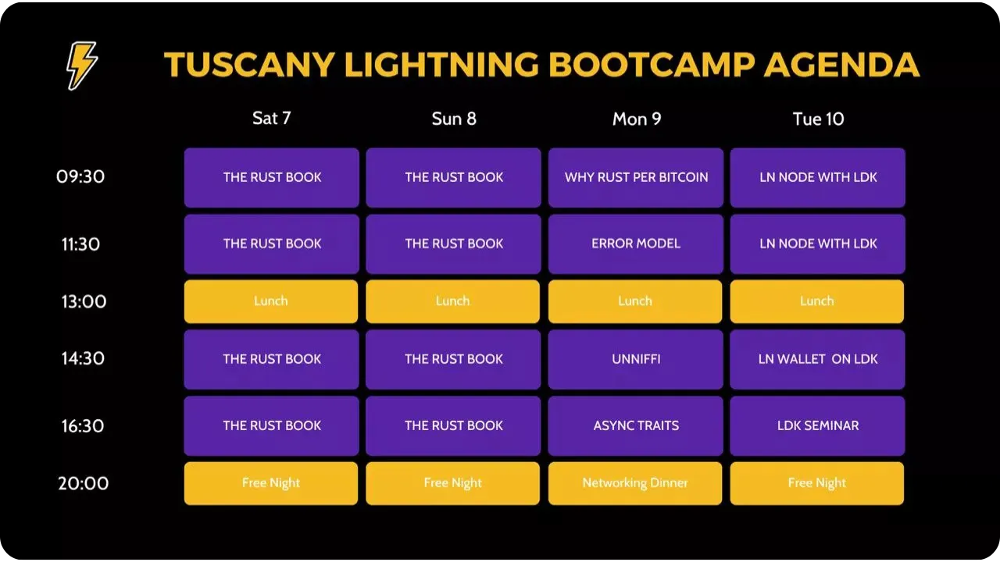


**Indwi ya 2 - Amahugurwa ariho ubu CSV402:**


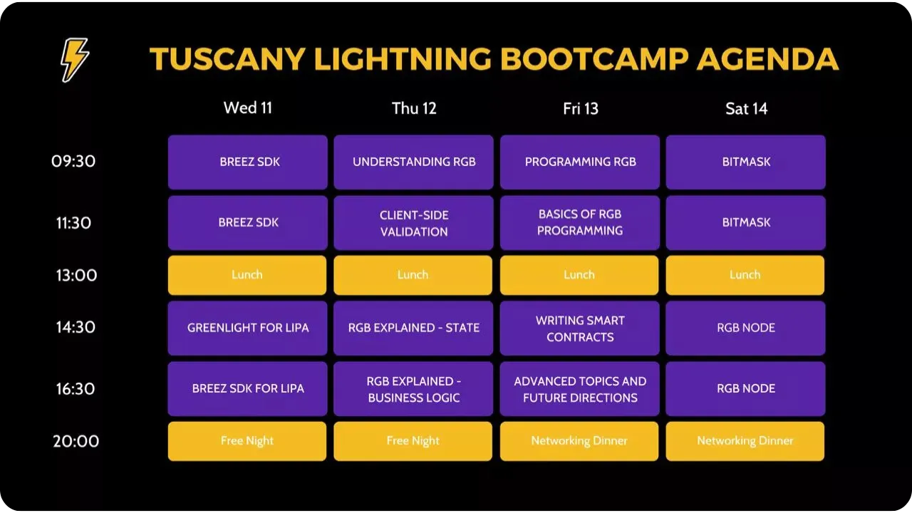


Turashimira cane abateguye zino nyigisho z'ikibiriraho hamwe n’abigisha 3 bagize uruhara:


- Maxim Orlovsky: *uwahoze ari enebrae sententia sapiens dominabitur astris. Cypher, AI,robotics , ubuhinga bwo guhindura abantu. Uwashizeho RGB, Prime, Radiant and lnp_bp, mycitadel_io & cyphernet_io*;
- Hunter Trujilo: *Umuhinguzi, Rust, Bitcoin, Umuravyo, RGB*;
- Federico Tenga:: *Ndiko ndakora ivyo nshoboye kugira ngo isi ibe igihugu c'ubuzima bw'abanyagihugu. Ubu ndiko ndakora kuri RGB muri Bitfinex*.


Inyandiko yakino cirwa yateguwe hakoreshejwe amasoko 2 nyamukuru:


- Amasanamu y’amahugurwa ya of Maxim Orlovsky, Hunter Trujilo and Frederico Tenga mumwiherero(Bootcamp) wa Lightning;
- Mubitabo bisigura ivya RGB, Ivyahinguwe vyakozwe bifashwe mumugongona na [Bitfinex](https://www.bitfinex.com/).


Uriteguye kwinjira mw’isi igoye kandi itangaje cane ya RGB? Reka tugende!


# RGB mumayagwa


<partId>80e797ee-3f33-599f-ab82-e82eeee08219</partId>


## Intangamarara kuvyiyumviro vyamudasobwa zisabikanije


<chapterId>f52f8af5-5d7c-588b-b56d-99b97176204b</chapterId>


:::id ya videwo = f27338bc-4210-4a2e-9b27-30278ed3282c::


RGB ni urukwirikirane rwashizweho kugira rukoreshwe kandi rushigikire uburenganzira bwokuri murandasi (mu buryo bw’amasezerano n’umutungo) mu buryo bushobora guhindurwa kandi bwibanga, bushingiye ku mategeko y’uguhurizako n’uko Blockchain ya Btcoin ikora. Intumbero yakino kigabane ca mbere ni ugushikiriza ivyiyumviro n’amajambo y’ishimikiro akikuje urukwirikirane rwa RGB, Gushira ahabona vy'umwihariko amategeko ngenderwako ry’ivyiyumviro vy’ishimikiro vy’ubuhinga bwa none nk'ivyuruhande rw'ukemeza rw'umuguzi (Client-side Validation) n'ibimenyetso bikoreshwa rimwe (Single-use Seals).


Muri kino kigabane, turabira hamwe ivy’ishimikiro vy’**uburyo bwo kwumvikana busabikanijwe** maze turabe ingene RGB ukwiriye kuja muryango w’ubuhinga. Turazozana kandi ingingo ngenderwako nyamukuru zidufasha gutahura igituma RGB ifise intumbero yo kwaguka no kwigenga ku buryo bwo kwumvikana bwa Bitcoin ubwayo, mu gihe yubakiye kuvyankenerwa vyayo.


### Intangamarara


Mudasobwa isabikanijwe, ni ukuvuga ishami ryihariye ry’ubuhinga bwa mudasobwa, yiga urukwirikirane rukoreshwa mugukwiragiza nogukora inkuru kurubuga rw'ama Nodes. zirihamwe zose, izo nodes n'urukwirikirane rw'amategeko bikora ikizwi nk'ubuhinga busabikanijwe. Mu bintu nyamukuru biranga mwene urwo rutonde , bimwebimwe ni ibi:


- **Ubushobozi bwo kugenzura no kwemeza bwigenga** kubiharuro bimwebimwe vya buri node;
- Ubushobozi bw’ama nodes bw'ukwubaka (bivana n'urukwirikirane) imbono y'amakururu yose canke igice. Ivyo vyiyumviro ni **ibihugu** vy’uburyo busanzwe;
- **Urutonde rutondetse uko ibihe bikwirikirana** rw'ibikorwa, kugira ngo ibiharuro bishobore gushirwako ikidodo c'igihe kandi habeho ukwiyumvikana ku rutonde rw'ibintu (urutonde rw'ibihugu).


Vy'umwihariko, iciyumviro c’**uguhurizako** mu buryo busanzwe gifise imice ibiri:


- **Kwemera ukuri kwikiringo** c'impinduka ya Leta (hakurikijwe amategeko y'amasezerano);
- **Ukwemeranya kumategeko** kurizi mpinduka za Leta, ivyo bikaba bituma bidashoboka gusubira kwandika canke gusubira guhindura ibikorwa vyemewe imbere y'igihe (ivyo navyo bizwi muri Bitcoin nk'"uburinzi bw'amahera akoreshwa kabiri").


Ikoreshwa ryambere, ritagira uruhusha atakiguzi rw’uburyo bwo kwumvikana busanzwe ryashizweho na Satoshi Nakamoto hamwe na Bitcoin, bivuye ku gukoresha ihurizwa hamwe ry'ibiharuro vya Blockchain Blockchain n’ubuhinga bwa Proof-of-Work (PoW). Muri buno buryo, ukwizera kwa kahise k'imice (Ama block) kuvana k'ubushobozi  bwo guharura buhabwa n’ama nodes (abacukuzi). Bitcoin rero ni akarorero kanini kandi k’akahise k’uburyo bwo kwumvikana busanzwe bwugururiye bose (*ata ruhusha*).


Mwisi ya Blockchain n'ubuhinga bwo gukoresha ubuhinga bwa none busabikanije, turashobora gutandukanya ingero zibiri z'ishimikiro: ***Blockchain*** mu buryo bwa kera, na ***imihora ya Leta***, akarorero keza kayo mu guhingura ni Lightning Network. Blockchain isigurwa nk’igitabu c’ibintu vyabaye bikurikiranije ibihe, bisubirwamwo n’uguhurizako mu nzira ifunguye kandi itarinda gusaba uruhusha. Ku rundi ruhande, imihora ya Leta n'imihora yubakiye kubuhinga bwa peer-to-peer ishoboza abayigize babiri (canke barenga) kuguma off-chain ya Leta irikugihe, bakoresheje Blockchain gusa igihe buguruye canke bugaye iyo mihora.


Muru bino bijanye na Bitcoin, nta gukeka ko umenyereye ingingo ngenderwako z'ugucukura (Mining), kutagira ahugutwarirwa n’ukurangiza ihanahanwa kuri, hamwe n'uko nihihora y'ukuriha ikora. Hamwe na RGB, turiko turazana akandi gace gashasha kitwa  **Client-side Validation**(Uruhande rw'ukwemeza rw'umuguzi), butandukanye na Blockchain canke Lightning, butuma indani(Muruhanda rw'umuguzi) habaho kubika no kwemeza ukwerekeza kuma Smart contract. Ivyo navyo bitandukanye n'ubundi buhinga bwa "DeFi" (_rollups_, _plasma_, _ARK_, n'ibindi), aho Client-side Validation (Uruhande rw'ukwemeza rw'umu client) rushingira kuri Blockchain kugira ngo ibuze ukurungika kabiri(Double-spending) no kugira uburyo bwo gushiramwo ikidodo c'igihe, mu gihe igumya urutonde rw'ibihugu vya off-chain n'imihindukire, gusa n'ivyo.


Mu nyuma, tuzozana kandi ijambo rikomeye cane: iciyumviro ca "**Stash**", ryerekeza ku rutonde rw'amakuru yo ku ruhande rw'uwuguze asabwa kugira ngo umuntu azigame uko amasezerano ameze, nkuko binobiharuro bidasubirwamwo kw'isi yose ku rubuga. Ubwa nyuma, turaza kurabira hamwe imvo n’imvano y’inyuma ya RGB, urukwirikirane rukoresha neza agace k'ukwemeza kw'umuguzi Client-side Validation, n’igituma yuzuza uburyo busanzweho (Blockchain n'imihora ya leta).


### Ibibazo bitatu mu gukoresha ubuhinga bwa none


Kugira ngo dutahure neza ingene uruhande rw'ukwemeza rw'umuguzi (Client-side Validation) n'aderesi ya RGB zitatorewe umuti na Blockchain na Lightning, reka turabire hamwe ibintu nyamukuru"trilemmas" 3 bikomeye mu gukoresha ubuhinga bwa none:


- **Ugutera imbere**, **Ukutagira aho ikukira**, **Ibanga**;
- **CAP** Theorem (**Consistency**:Ukugumizako, **Availability**: Ububoneka, **Partition Tolerance**: Ukwihanganira Ugucapura);
- **CIA** trilemma (**Confidentiality**:Ibanga, **Integrity**: Ubutungane, **Availability**:Ukuboneka).


## 1. Ugutera imbere, ukutagira aho ikukira n'ibanga##


- **Blockchain (Bitcoin)**


Blockchain ni igisata kitagira aho gikukira nahamwe, ariko ntitera imbere cane. Iciyongerako, nuko vyose biri mu gitabu c’isi yose, kiri kukarubanda, ibanga rirafise aho rigarukira. Turashobora kugerageza kwongereza ibanga rigenda neza atabuhinga nabumwe dukoresheje (Ihana hanwa mw'ibanga, imigambi ya mimblewimble, n’ibindi), ariko umuhora uri kukarubanda ntushobora kunyegeza ibishushanyo vy'ihanahanwa.


- **Lightning/Imihora ya Leta**


Imihora ya Leta (nk'uko biri kuri Lightning Network) irashobora gutera imbere cane kandi igafita ibanga kuruta Blockchain, nk'ihana hanwa rikoreshwa kuri off-chainuko. Ariko rero, itegeko ryogushira kukarubanda uduce tumwetumwe (ibikorwa vy’ugutanga amahera, topologie y’urubuga) no kugenzura uruja n’uruza rw’urubuga birashobora gutuma ibanga rihungabana. Ukutagira aho itwarirwa navyo biragora : ugushiramwo ubutegetsi birasaba amahera menshi, kandi ama node makuru arashobora kuba ahantu ho kwegereza ubutegetsi ubutegetsi hagati. Ivyo ni vyo nyene dutangura kubona kuri Lightning.


- **Client-side Validation (RGB)**


Ino nzira nshasha iratera imbere cane kandi ifise n'ibanga cane, kubera turetse y'uko gusa, dushobora gushiramwo ubuhinga bwo gutangaza ikimenyamenya c’ubumenyi ataco buvuze, ariko nta n’igishushanyo c’isi yose c’ibikorwa vy’ihana hanwa kiriho, kuko ata n’umwe afise igitabu cose. Ku rundi ruhande, bivuga kandi ko hariho ugusenyera ku mugozi umwe ku bijanye no kwegereza ubutegetsi abaturage: uwutanga Smart contract arashobora kugira uruhara ruhambaye (nk'uwutanga Contract muri Ethereum). Ariko rero, bitandukanye na Blockchain, na Client-side Validation, ubika gusa kandi ukemeza amasezerano ushaka, ivyo bikaba bituma habaho uguhindura neza mu kwirinda gukura no kugenzura intara zose zihari.


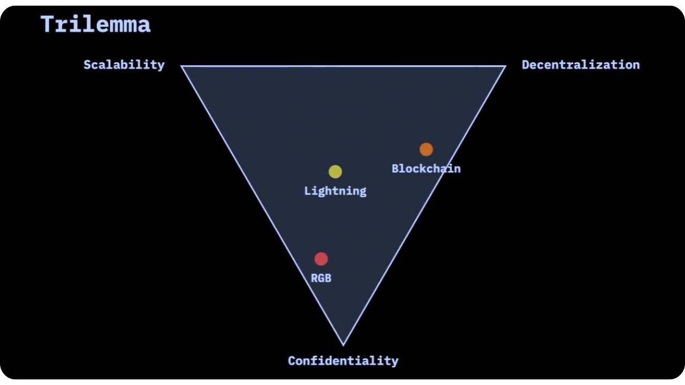


## 2.CAP Theorem (Consistency:Ukugumizako, Availability: Ububoneka, Partition Tolerance: Ukwihanganira Ugucapura);##


Iciyumviro ca CAP gishimika ko bidashoboka ko uburyo busabikanijwe bushobora gukwirizwa icarimwe *Uguhuza*,*Ukuboneka* na *Ukwihanganira ugucapura*.


- **Blockchain**


Blockchain ikunda ukugumizako n’ukuboneka, ariko ntikora neza mu kugabagura urubuga: iyo udashobora kubona igice, ntushobora gukora kandi ukagira iciyumviro kimwe n’urubuga rwose.


- **Lightning**


Uburyo bw'imihora ya Leta bufise ubushobozi bwo kuboneka no kwihanganira kugabagura (kubera ko ama nodes abiri ashobora kuguma afatanye naho urubuga rwoba rwacitsemwo uduce duce ), ariko uguhuza muri rusangi kuva ku kw'ugurura no kwugara kuri Blockchain.


- **Client-side Validation (RGB)**


Uburyo nka RGB buratanga ukugumizako (burimuntu ayikoresha wese yemeza iwiwe ibiharuro, atamakega agize) bugashira imbere ukwirengagiza (amakuru yawe aguma yigenga), kandi ntibwemeza ukuboneka kuruhande rw'isi yose ( burimuntu wese ategezwa kumenya ko afise ibice vya kahise bibereye, kandi bamwe mubitabira bashobora kudashira kumugaragaro ikintu nakimwe, hama bagahagarika gusabikanya amakuru amwamwe).


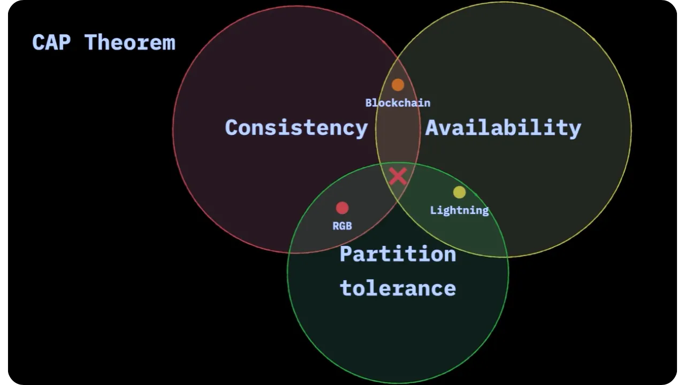


#### 3. CIA trilemma (Ibanga, Ubutungane, Ukuboneka)


Ino nyabutatu(trilemma) itwibutsa ko ibanga, ubutungane n’ukuboneka bidashobora gushirwa kurugezo rwohejuru icarimwe. Blockchain, Lightning hamwe n'uruhande rw'ukwemeza rw'umuguzi (Client-side Validation) bikorokera ugutandukanye muricruno rugezo. Iciyumviro ni uko ata rutonde narumwe rushobora gutanga vyose icarimwe; birakenewe gufatanya uburyo bwinshi butandukanye (uburyo bwa Blockchain bwo gushiramwo ikidodo, uburyo bwa Lightning bwo gushira kugihe, n’uburyo bwo kwemeza indani na RGB) kugira ngo haboneke umufungo utanga ivyemezo kuri buri rugero.


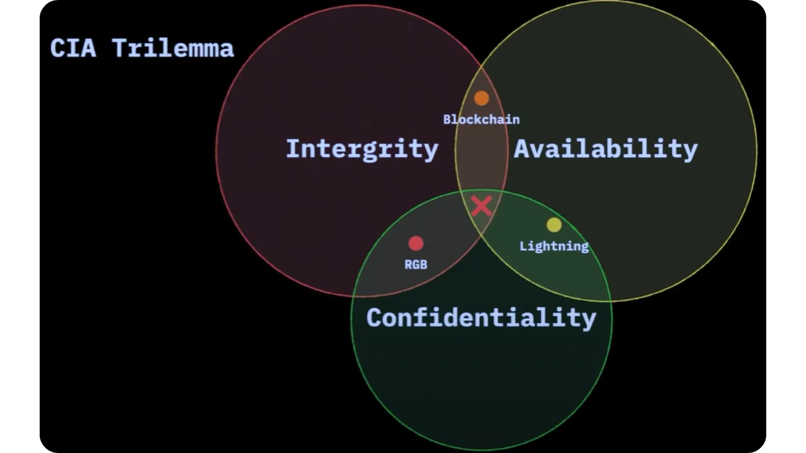


### Uruhara rwa Blockchain n'iciyumviro co gucapura


Blockchain (muri kano kanya, Bitcoin) ifasha vyibanze nk'ubuhinga bwo gushira ikidodo_ c’igihe_ n’ukurinda yuko amahera arihwa kabiri. Aho kwinjiza amakuru yuzuye ya Smart contract canke uburyo butagira aho butwarirwa (decentralized), dushiramwo gusa **ukwiyemeza vy'ubuhinga bunyegeza amakuru** kw'ihanahanwa (mu buryo bwa uruhande rw'ukwemeza rw'umuguzi(Client-side Validation), ivyo tuzokwita "impinduka za leta"). Gutyo:


- Turabohora Blockchain ku makuru menshi n’uruhererekane;
- Buri muntu wese akoresha abika kahise gakenewe gusa mugace kiwe bwite k'amasezerano ("*Shard*" yiwe), aho kubika ivyisubirije vy'imihingo yose.


Sharding ni iciyumviro cavuye mububiko bw'amakuru busabikanije (nk’akarorero MySQL ku mbuga ngurukanabumenyi nka Facebook canke Twitter). Kugira ngo umuntu atore umuti w’ingorane y’ubunini bw’amakuru n’igihe co gukorana, ububiko bw'amakuru bugabuye mukintu citwa _shards_ (USA, Uburayi, Aziya, n’ibindi). Igice kimwekimwe cose kirahuye n’aho hantu kandi gihuye n’ibindi bimwebimwe gusa.


Uburyo bwa smart contracts bwa RGB, dukora Shard twisunze amasezerano ubwayo. Buri masezerano ni shard yigenga. Nk’akarorero, iyo ufise gusa tokens za USDT, ntutegerezwa kubika kahise kose kiyindiToken nka USDC. kuri Bitcoin, Blockchain ntikora sharding: ufise umugwi w'isi yose w'ama UTXO. Na Client-side Validation, uwuyikoresha wese agumana amasezerano kumakuru ikoresha canke ifise.

Turashobora rero kwiyumvira umuryango nkuku gukwirikira:


- **Blockchain (Bitcoin)** nk'umushinge utuma habaho ugusubiramwo gushitse kw'igitabu gitoyi kandi ukora nk'igitabu gishirako ikidodo c'igihe kuri Layer;
- **Lightning Network** kukunyarutsa, ihanahanwa mwibanga, iguma yubakiye kumutekano n'ugushinga intahe kwa nyuma kwa Blockchain ya Bitcoin;
- **RGB na Client-side Validation** kwongerako ubuhinga bundi buyobeye bwa Smart contract mwihererekano, ata gutera umudugararo Blockchain canke gutakaza ibanga.


Bino bintu bitatu bikora inyabutatu ikwiye, aho kuba ikirundo c'umurongo c'"Layer 2", "Layer 3" n'ibindi. Lightning ishobra gufatanya ataho iciye Bitcoin, canke ugafatanya ihanahana rya  Bitcoin bishiramwo amakuru ya RGB. Na "BiFi" (Ingengabutunzi kuri Bitcoin) ishobora kugigwa na Blockchain, na Lightning na RGB bivanye n'iikenewe kubijanye n'ibanga, ubushobozi bw'ugutera imbere canke n'uko contrat imeze.


### Icirwa c'impiduka ya Leta


Mu buryo bwaribwo bwose busabikanijwe, intumbero yaburi buhinga bw'ukwemeza n'ugushobora  kwemeza **kumenya ukuri n’urutonde rw’ibihe vy’amahinduka ya Leta**. Intumbero ni ukugenzura ko amategeko y’amasezerano yubahirijwe, no kwemeza ko ayo mahinduka ya Leta akurikirana mu buryo butomoye, butagira aho bugarukira.


Kugira ngo utahure uko ukwemeza gukora mubijanye na **Bitcoin** kandi, muri rusangi, kugira ngo dutahure ivyiyumviro iri inyuma ya Client-side Validation, reka tumanze gusubiza amaso inyuma kuko blockchain ya Bitcoin yubatse, imbere yo kubona ingene Client-side Validation itandukanye nazo n'iyiyongera ishobora gutuma ikunda.


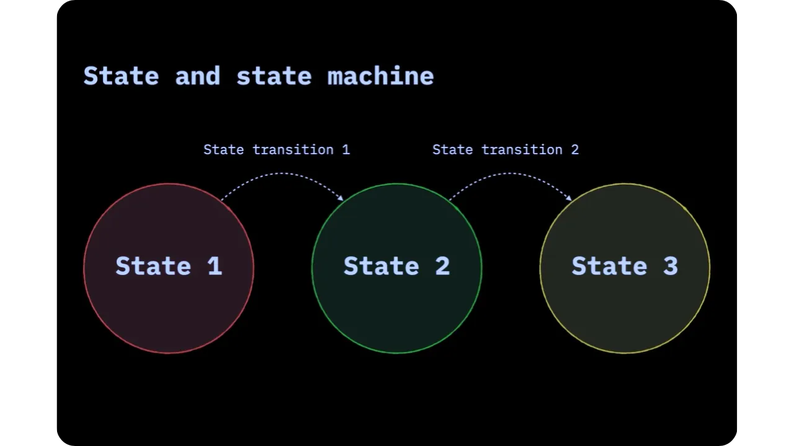


Kuvyerekeye Blockchain ya Bitcoin, iyemeza ryirungika rifatiye kw'itegeko risanzwe:


- Buri ma nodes y'urubuga yose akuraho buri bubiko n’ugucuruza;
- Bemezwa rino hanahanwa kugira basuzume iterambere nyaryo ry'umufungo w'amma UTXO (ibisohoka vyose bitakoreshejwe);
- Barabika ano makuru (mu buryo bw’ibipande) kugira ngo kahise gashobore gusubirwamwo iyo bikenewe.


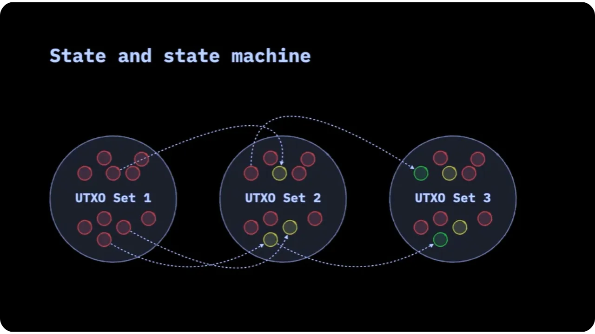


Nubwo biruko, iyo nzira irafise ingorane zibiri zikomeye:


- **Gutera imbere**: kuko buri node yose itegerezwa gukora, gusuzuma no gushingura ihanahanwa rya buriwese, hariho urugero rugaragara rw'ubushobozi bwo gukora, rufitaniye isano vy'umwihariko n'ubunini bwa burigice (1 MB ku mwanya ugereranye mu minota 10 kuri Bitcoin, hatarimwo nivyiyongerako);
- **Ibanga**: Vyose biramenyeshwa kandi bikabikwa kukarubanda( igitigiri, aho yerekeza, n'ibindi), ibituma ibanga ry'uguhindura rigabanuka.


Mu bikorwa, iki kigereranyo gikorera Bitcoin nka Layer y'ishimikiro (Layer 1), ariko gishobora kuba kidahagije ku bikorwa bikomeye cane bisaba icarimwe ubushobozi bwinshi bwo gucuruza n’urugero runaka rw’ibanga.


Client-side Validation yubakiye ku ciyumviro kinyuranye nico: aho y'uko bisa urubuga rwose rwemeza no kubika ihanahanwa ryose, burimuntu wese araho(Umuguzi) azoterako igikumu gusa igice ca kahise kimwerekeye:


- Iyo umuntu aronse umutungo (canke uwundi mutungo wose urikubuhinga bwa none), baba bakeneye gusa kumenya no gusuzuma ipfundo bikorerwako (imihindukire ya Leta) yerekeza kuruyo mutungo kandi yerekana ko weewe;
- Agace k'ibikorwa, kuva ku ***mwitanguriro*** (agafindo kambere) gushika kw'ihanahanwa riherukirwako gushika ku giciro gishasha, ugira igishushanyo c’inzira (DAG) canke Shard, ni ukuvuga igice ca kahise kose.


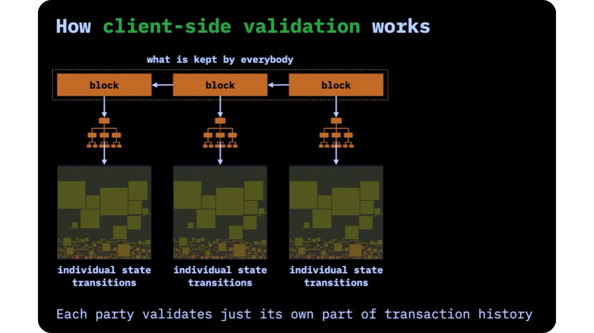


Muri ako kanya nyene, kugira ngo igice gisigaye c’urubuga (canke tukivuze neza, Layer yubakiweko, nka Bitcoin) gishobore gufunga mu rwego rwa nyuma kitabona ido n’ido ry’ayo makuru, Client-side Validation yizigira iciyumviro ca ***kwiyemeza***.


*Commitment*(Kwiyemeza) ni ukugumizako biri munyandiko zinyegejwe, mu bisanzwe _hash_ (SHA-256 nk'akarorero) yinjijwe mu hanahanwa rya Bitcoin, vyemezako amakru y'ibangayashizwemwo, atagushira kumugaragaro ayomakuru.


Kubera ivyo _vyemezo_, turashobora kwemeza:


- Kubaho kw’amakuru (kubera ko yiyemeje kuri Hash);
- Ivyantanguriye ano makuru (kuko ashizweko ikidodo kandi afise ikidodo c’isaha muri Blockchain, afise itariki n’urutonde rw’ibice).


Inyandiko z'ukuri, nubwo biruko, ntizishirwa ahabona, gutyo bikaba bizigama ibanga ryavyo.


Mu majambo nyayo, ng’uko uko  RGB State Transition (ihinduka rya Leta) ikora:


- Utegura State Transition nshasha (nk’uguhindura RGB token);
- Urakora ukwiyemeza kw'inyandiko zinyegejwe  y'ibanga kuri iyi mpinduka maze ukayishira mwirungikwa rya Bitcoin (ivyo vyemezo vyitwa "*anchors*" mu masezerano ya RGB);
- Uwundi muntu (uwuronka) araronka amateka y’uruhande rw’umukiriya ajanye n’ico kintu maze akavyemeza ko bihuye kuva ku mpera kugeza ku mpera, kuva kuri Genesis ya Smart contract gushika ku mpinduka uyirungikira.


Client-side Validation itanga inyungu zibiri zihambaye :


- Ugushobora gutera imbere:


*Ivyemezo* biri muri Blockchain ni bito (vy'urutonde rw'ama bytes amaduzeni makeyi). Ivyo vyerekana ikibanza c'ugushinguramwo ama block ko kituzuye, nkuko Hash yonyene ikeneye kujamwo. Bituma kandi umurongo wa off-chain utera imbere, nkuko uwukoresha wese ategerewa ategerezwa kubika igice ca kahise yiwe (_stash_ yiwe).


- **Ibanga:**


Ihanahanwa ryonyene (akarorero ibirimwo mu buryo buramvuye) ntibshirwa ahabona kuri On-Chain. Intoke (fingerprints) zabo gusa (*Hash*) nizo. Gutyo, igitigitri, amaderesi n’uko amasezerano ameze biguma mwibanga, Hama uwakira arashobora gusuzuma, iwe, ko ino Shard yemewe iwe mukugenzura ihanahanwa riheruka. Nta mpamvu n’imwe yotuma uwakira ashira ano makuru kukarubanda, kiretse iyo habaye impari canke iyo ivyemezo bikenewe.


Mu buryo nkubwa RGB, amahinduka menshi ya Leta avuye mu masezerano atandukanye (canke itunga ritandukanye) ashobora guhurizwa hamwe mmwihanahanwe imwe ya Bitcoin biciye mukwiyemeza gusa kumwe. Ubu buryo bushinga isano ry’igihe hagati y’ugucuruza kwa On-Chain n’amakuru ya off-chain (ihinduka ryemejwe n’uruhande rw’umukiriya), kandi rituma ibice vyinshi vyandikwa icarimwe mu ntumbero imwe ya Anchor, bikaba bigabanya igiciro ca On-Chain n’ikirenge.


Mu ngiro, iyo rino hanahanwa rya Bitcoin ryemewe, ivyagateganyo iba "ifunga" amasezerano vyubakiyeko, kuko bitakiba bishoboka guhindura Hash yari yaramaze kwandikwa muri Blockchain.


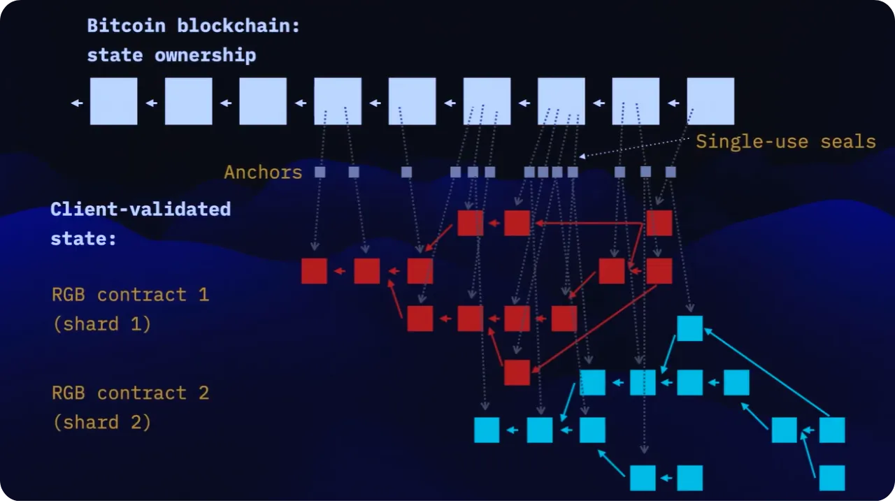


### Iciyumviro ca Stash


**Stash** ni urutonde rw'amakuru y'umuguzi rutuma umuntu ategerezwa kugumana ubutungane hamwe na kahise ka  Smart contract ya RGB. Aho bitandukaniye n'umuhora wa Lightning, aho intara zimwe zimwe zishobora gusubirwamwo mu karere zivuye ku makuru asabikanijwe, amasezerano ya Stash kuri RGB ntasubirwamwo nahamwe: iyo uyitakaje, nta n’umwe azoshobora kuyikugarukanira, kuberako uri uwufise uruhara mugusabikanya kahise kawe. Nico gituma ushaka gukoresha ubuhinga bufise  uburyo bwo gusubiza inyuma bwizewe muri RGB.


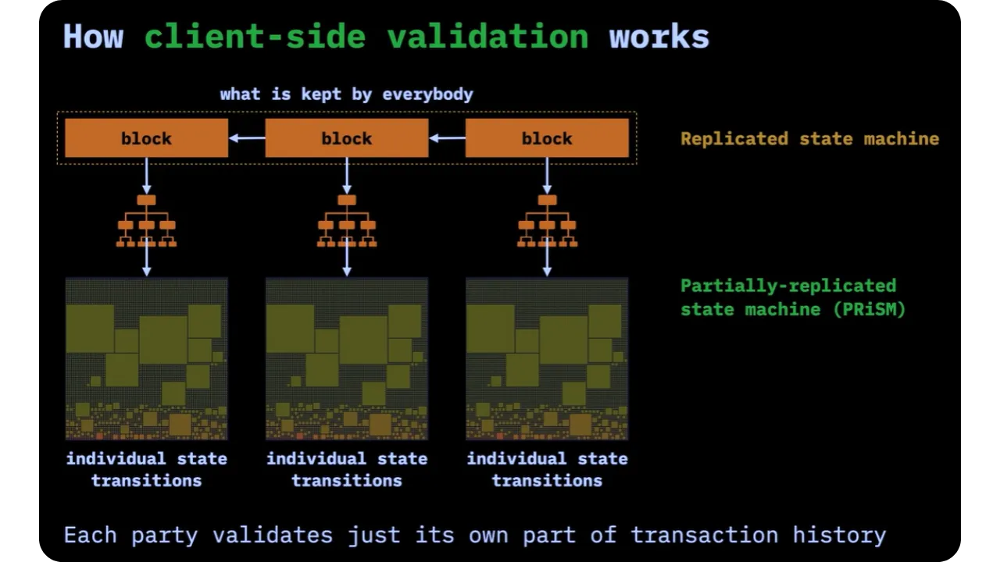


### Single-Use Seal: amamuko n'uko ikora


Mugihe wemera umutungo nk'amafaranga, hariho ivyiyemezo bibiri bikomeyecane:


- Uvyerekana ukuri kubintu vyaronkejwe;
- Ukwisa kw'ibintu vyaronkejwe, kugira twirinde ukuriha incuro zibiri.


Kumitungu ifadika, nk'impapuro z'amahera yomuri banki, ukuhaba birakwiriye kugira vyemeze ko bitasubiwemwo incuro zibiri. nubwo biri uko muri inosi y'ubuhinga bwa none aho usanga imitungo  irikubuhinga ngurukana bumenyi gusa, kuno gusuzuma kuragoye, kuko amakuru yokubuhinga bwa none ashobora kugwizwa canke gusubigwamwo vyoroshe.

Nkuko twabionye kare, ugushirwa ahabona kwa kahise n'uwurungika w'ihindagurika biradufasha kumenya ukuri kwa token za RGB. mukugira uruhusha rw'ugushika kw'ihanahanwa ryo kuva kuy'inkomoko, dushobora kwemezako token ari izukuri. rino hama rirasa narirya rya, aho kahise k'ibingorongoro gashoborwa kurabwa kose kuva kw'ihanahanwa ry'ikingorongoro c'ibanzekugira hasuzumwe ukuri kwavyo. Naho biruko, aho bitandukaniye na Bitcoin, kano kahise k'ihinduka rya Leta muri RGB ni iy’ibanga kandi igumye ku ruhande rw’umugizi.


Kugira twirinde ukuriha incuro zibiri ama token ya RGB, dukoresha ubuhinga bwitwa "**Single-Use Seal(Serire ikoreshwa rimwe)**". Buno buhinga burihweza neza ko token yariyo yose, iyo ikoreshejwe rimwe, idashobora gusubira gukoreshwa biciye mukinywabi incuro yakabiri.


Single-use Seals(Serire ikoreshwa rimwe) n'uduce tuvuye mubuhinga bw'ukunyegeza inyandiko (cryptographic), bwashikirijwe muri 2016  na Peter Todd,  bisa n’iciyumviro ca serire zikoreshwa mubuzima bisanzwe: iyo serire yugaye konteneri, ntibiba bigikunda kuyugurura canke kuyihindura kiretse iyo uhisemwo kuyikata.


Buno buryo, nibwo twisunga kw'isi ya none, bigatuma bishoboka kwemezako urukwirikirane rw'ibikorwa rwahabaye vyukuri,hanyuma bigatuma vyerekana ko bitazosubira kuba ubukwirikira. serire ikoreshwa rimwe irarengeye ukwiyumvira birenze `Hash + Timestamp`, vyongerako iciyumviro c'uko serire ishobora kwugarwa **rimwe gusa**.


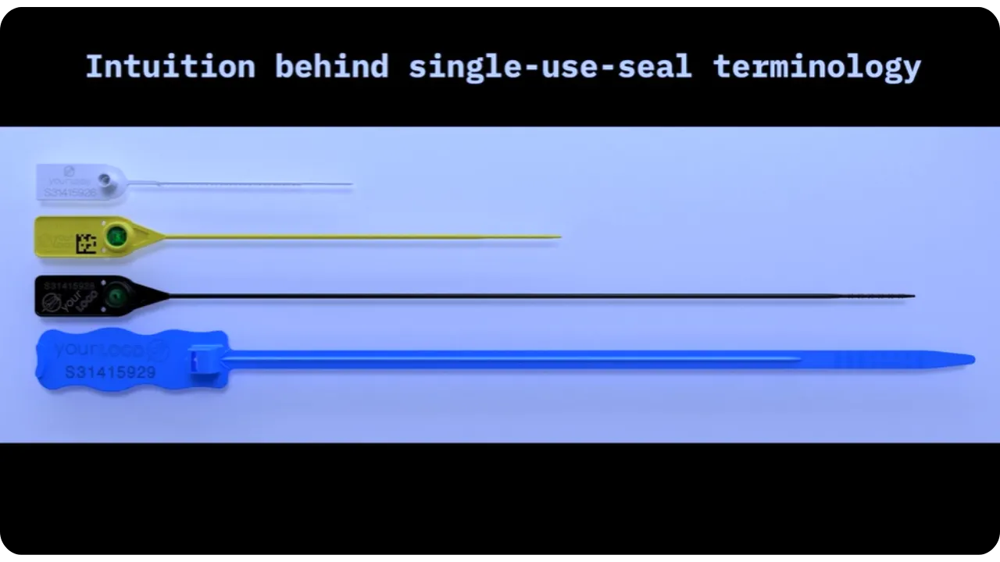


Kugira ngo serire yugarwa rimwe gusa ikore, urakenera ukwemeza kugereranye kwashizwe ahabona gushobora kwemeza ukubaho canke ukutabaho kw'ibija ahabona, hama bigoye(nimba bidashoboka) kubesha iyo amakuru amaze gukwiragizwa. **Blockchain** (nka Bitcoin) irashobora gukora kano kazi, nkakurya kw'urupapuro kumakuru yo kumpapuro abikora mugukwiragira, nk'akarorero, iciyumviro ninkibi bikwirikira:


- Turashaka kwemeza ukwiyemeza kubutumwa bumwebumwe `h(m)` buba bwashizwe ahabona butiriwe burashira ahabona ivyanditswe mubutumwa `m`;
- Turashaka kwemeza ko ata bundi butumwa buri guhiganwa `h(m')` ubutumwa bw'ukwiyemeza bwashizwe ahabona mukibanza ca `h(m)`;
- Turashaka kandi gusuzuma ubwo butumwa `m` bubaho imbere y'itariki runaka.


Blockchain irashobora gukora neza muri uwo murimo: igihe ihanahanwa yashizwe mugice, urubuga rwose ruragira ikimenyamenya kimwe kidashobora gukoreshwa mumanyanga c’ukubaho kwarwo n’ibirimwo (n’imiburiburi mu gice, kuko _ukwiyemeza_ gushobora guhisha ido n’ido mu gihe kwemeza ko ubutumwa ari ubw’ukuri).


Serire ikoreshwa rimwe (Single-Use Seal) rero ishobora kubonwa nk’isezerano ry’ugutangaza ubutumwa (butaramenyekana muri iki gihe) rimwe kandi rimwe gusa, mu buryo bushobora gusuzumwa n’ababishaka bose.


Aho bitandukaniye n'ukwiyemeza bisanzwe (Hash) canke ibimenyetso vy'igihe, vyemeza itariki y'ukubaho, Serire ikoreshwa rimwe itanga ikimenyamenya c'inyongera c'uko **atakundi kwiyemezwa kuhari** ishobora kubana: ntushobora kwugara serire imwe incuro zibiri, winjire canke uhindure ubutumwa bwugawe na serire.


igereranywa rikwirikira rifasha gutahura ingingo ngenderwako:


- **Cryptographic commitment (Hash)**: Hamwe nigikoresho ca Hash, ushobora kwiyemeza gutanga amakuru (Igiharuro) mu gushira ahabona Hash yayo. Amakuru aguma ari ibanga gushika ushize hanze isanamu y'imbere , ariko ushobora kwemeza ko wari uyizi imbere y'igihe;
- **Timestamp (Blockchain)**: Mu kwinjiza iyi Hash muri Blockchain, turemeza yuko kandi twari tuyizi mugihe runaka (ico co kuyishira mu gice);
- **Single-Use Seal**: Hamwe na serire ikora rimwe gusa, dutera intambwe imbere mugukora ukwiyemeza rimwe. Ukoresheje Hash imwe, urashobora gukora amasezerano menshi avuguruzanya mu buryo bubangabanganywe (ingorane y'umuganga amenyesha umuryango ngo "*Ni umuhungu*" kandi ari "*Ni umukobwa*" mu gitabu ciwe bwite). Single-Use Seal (Serire ikora rimwe gusa) irakuraho ivyo bishoboka mu gufatanya kwiyemeza n'ikimenyamenya c'isohorwa, nka Bitcoin Blockchain, kugira ngo gukoresha UTXO bishireko ikidodo ata gukeka Commitment. Iyo UTXO nyene imaze gukoreshwa, ntishobora gusubira gukoreshwa kugira ngo isubirire Commitment.


|                                                                                  | Ukwiyemeza bisanzwe(digest/hash) | Ikidodo | Serire ikoreshwa rimwe |
| -------------------------------------------------------------------------------- | ------------------------------- | ---------- | ---------------- |
| Gushira ahabona ukwiyemeza ntibituma vyerekana ubutumwa                          | Ego                             | Ego        | Ego             |
| Itariki yemeza kwiyemeza / Ukubaho kw'ubutumwa imbere y'itariki runaka           | Ntibishoboka                    | Birashoboka| Birashoboka         |
| Icemeza y'uko atayandi mahitamwo yukwiyemeza sashobora kubaho                    | Ntibishoboka                    | Ntibishoboka | Birashoboka         |

Serire ikoreshwa rimwe ikora kuntambwe zitatu nyamukuru:

**Indangurakintu ya serire:**


- Alice Asigura imbere y'igihe amategeko yogushira ahabona serire(Ryari, hehe hamwe n'uko ubutumwa buza gushirwa ahabona ) ;
- Bob aremera canke agashigikira zino ngingo. 


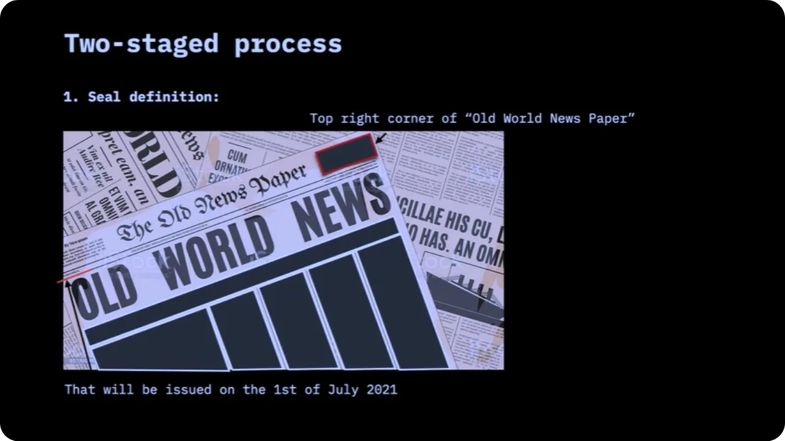


**Ukwugara serire:**


- Mu gihe irigukora, Alice afunga serire mu gutangaza ubutumwa buri kugihe (kenshi na kenshi mu buryo bw'ukwiyemeza, akarorero Hash);
- Iratanga kandi **icabona** (ikimenyamenya c’ubuhinga bw'ukunyegeza inyandiko(cryptographic)) cerekana ko serire yugawe idashobora gusubirwamwo.


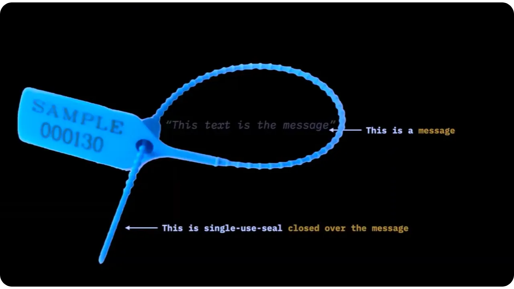


**Ugusuzuma serire:**


- Iyo serire yugawe, Bob ntashobora gusubira kuyugurura: ico ashobora gukora nikuraba ko yugawe;
- Bob ashirahamwe ama serire, **icabona** hamwe n'ubutumwa (Hamwe nukwiyemeza) kugira ngo tumenye neza yuko vyose bihuye kandi ko ata maserire ariko arahiganwa afise imbonakazoza zitandukanye.


Ivyo bishobora gusobanurwamwo muri make kuno gukwirikira:


```txt
# Defined by Alice, validated or accepted by Bob
seal <- Define()
# Seal is closed by Alice with the message
witness <- Close(seal, message)
# Verification by Bob
bool <- Verify(seal, witness, message)
```


Ariko rero, Client-side Validation(Uruhande rw'ukwemeza rw'umuguzi) ruratera intambwe imwe imbere: nimba insiguro ya serire ubwayo iguma hanze ya Blockchain, birashoboka (mumajambo) ko umuntu ashobora guhakana ukubaho canke uburenganzira bw’iyo Serire iriko irakoreshwa. Kugira ngo iyo ngorane ishobore gutorerwwa inyishu, hakoreshwa uruhererekane rw’Ibimenyetso Bikoreshwa Rimwe Bifatanya:


- Buri Serire yose irimwo insiguro y'ama Serire akwirikira;
- Turandika kuno kwugarwa (hamwe nivyo yiyemeje_) muri Blockchain (mu gucuruza Bitcoin);
- Gutyo, buri kugerageza guhindura serire yaherukiweko ishobora gutuma habaho kahise ka Bitcoin zikoreshwa muri Bitcoin.


Ibi ni vyo nyene ubuhinga bwa RGB bukora:


- Ubutumwa bwashizwe ahabona n'ukwiyemeza kw'amakuru kuruhande rw'umuguzi;
- Insiguro y'iserire ifatanywe na UTXO;
- Iserire yugarwa mugihe ino UTXO ikoreshejwe canke iyo umusaruro mushasha ushizwe kuri iyo Commitment nyene;
- Ihanahanwa ry'urukwirikirane ru=itanga ano ma UTXO rujanye n'icemezo c'isohorwa: ihinduka ryose canke ihinduka ry'ubutegetsi kuri RGB rero rishingiye kuri Bitcoin.


Mu ncamake:


- _Insiguro y'iserire ni UTXO ushaka iserire ya commitment izoza;
- _Serire yugara_ kubaho iyo ukoresheje iyi UTXO, ukarema igikorwa kirimwo Commitment;
- _Icabona_ nihanahanwa ubwayo, igaragaza yuko wugaye iserire nizi nyandiko;
- Ntushobora kwemeza yuko Serire itigeze yugarwa (ntushobora kwizera neza yuko UTXO itaramaze gukoreshwa canke itazokoreshwa mu gice utarabona), ariko ushobora kwemeza ko vy’ukuri yamaze kwugarwa.


Ukwsa birahamaye cane kuruhande rw'ukwemeza kw'umuguzi (Client-side Validation): iyo wemeje State Transition, urasuzuma ko ihuye na UTXO yihariye, itakoreshejwe mbere mu Commitment iriko irahiganwa. Ivyo ni vyo vyemeza ko ata gukoresha amahera kabiri mu masezerano y’ubwenge ya off-chain.


### Ivyemezo vyinshi n'imizi


Smart contract ya RGB irashobora kuba ikeneye gukoresha ama Serire menshi akoreshwa rimwe (UTXO nyinshi) icarimwe. Iciyongerako, ihanahanwa rya Bitcoin rimwe gusa ishobora kwerekeza kumasezerano atandukanye, umwe wese akagira ikidodo kuri State Transition yayo. Ivyo bisaba ubuhinga bw' **multi-Commitment**(Ukwiyemeza incuro ninshi) kugira bwemeze, mu buryo butegekanijwe kandi budasanzwe, ko atakwiyemeza nakumwe mibihari bushobora kubaho kabiri. Aha niho iciyumviro ca **Anchor** kija muri RGB: uburyo budasanzwe buhuza ihanahanwa rya Bitcoin hamwe nuruhande rumwe canke nyinshi z'umuguzi (ihinduka rya Leta), rumwe ryose rishobora kuba ari iry'amasezerano atandukanye. Tuzokwihweza neza ico ciyumviro mu kigabane gikwirikira.


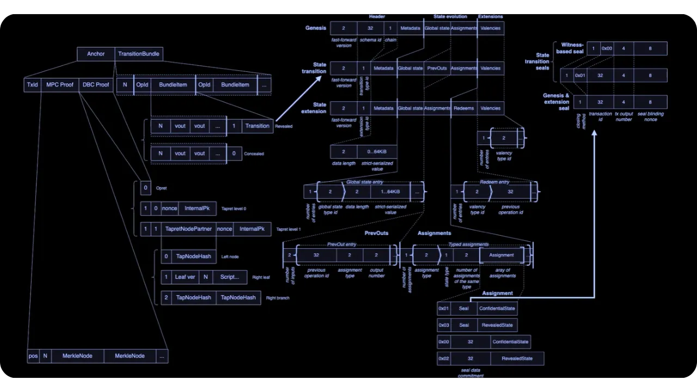


Ibiri mu migambi nyamukuru vy’ubushinguzi bwa GitHub (iri munsi y'uburongozi bw'ishrahamwe LNPBP) ihuriza  hamwe ibikorwa vy’ishimikiro vy’izo nyigisho zizwe mu kigabane ca mbere:


- **client_side_validation**(Uruhande rw'ukwemeza rw'umuguzi): Rurimwo ugucagagura gukorwa na Rust vyemerezwa indani;
- **single_use_seals**(Serire ikoreshwa rimwe): Ishira mu ngiro uburyo bwo gusigura no kwugara ano ma serire neza.


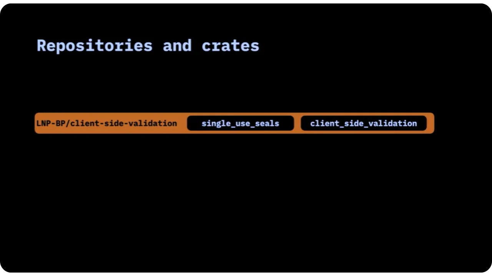


Zirikana ko ayo Software ari Bitcoin agnostic; mu vyiyumviro, zoshobora gukoreshwa ku bundi buryo bwose bwo kwemeza ko vyasohowe (ubundi buhinga bwo kwandika, ikinyamakuru, n’ibindi). Mu bikorwa, RGB yubakiye kuri Bitcoin kubera ubukomezi bwayo n’uguhurizako kwagutse.


### Ibibazo vya bose


#### Ku bijanye n'ikoreshwa ryagutse ry'amaserire akoreshwa rimwe


Peter Todd kandi yarakoze _Open Timestamps_ Protocal(Urukwirikirana rw'ugushirako ibidodo rwuguruye), kandi iciyumviro ca Single-Use Seal ni ukwaguka kw'ivyo vyiyumviro. Hejoru ya RGB, hariho n'ibindi bikoresho bishobora gukoreshwa, nk'ubwubatsi bw'imirongo y'inyuma_ ata gukoresha _gufatanya ubucukuzi_ canke ivyiyumviro bijanye n'imirongo y'imiduga nka BIP300. Uburyo bwose busaba Commitment imwe burashobora, mu ngingo ngenderwako, gukoresha iyo nzira y’ubuhinga bwa none. Ubu, RGB ni ryo rya mbere rikomeye ry’ugushirwa mu ngiro ku rugero rwose.


#### Ibibazo vyo kuboneka kw'amakuru


Kubera ko muri Client-side Validation, buru uwukoresha wese abika igice ciwe ca kahise, ukuboneka kw’amakuru ntikwemezwa kw’isi yose. Iyo uwutanga amasezerano yihishije canke akuyeho amakuru amwamwe, ushobora kutamenya iterambere rihari ry'ibihari. Mu bihe bimwebimwe (nk'igihe c'ama stablecoins), uwuyakoresha ategezwa ategerezwa kuguma afise amakuru ya bose kugira ngo yerekane igitigiri c'amafaranga ariko arakoreshwa, ariko nta n’itegeko ry’ubuhinga narimwe ribikora uko . Birashoboka rero guhingura amasezerano ataboneka n’ibigirankana afise ugutanga kutagira aho kugarukira, ivyo bikaba bivyura ibibazo vy’ukwizigirana.


#### Gucapura no n'amasezerano yo kwitandukanya


Buri masezerano igereranya _shard_ yitandukanije: USDT na USDC, nk’akarorero, ntibitegerezwa gusangira kahise kazo. Guhinduranya uduce dutoduto biracari bishoboka, ariko ivyo ntibisaba gufatanya amarejista yabo. Ivyo vyose bikorwa n’ubuhinga bwa ukwiyemeza bwa cryptograph, ata kumenyesha igicapo cose cakahise ka burimuntu.


### Ugusozera


Twarabonye aho iciyumviro ca Client-side Validation gihuriye na Blockchain na _m'imihora ya leta_, ingene yishura ku bibazo vy'ubuhinga bwa mudasobwa zisabikanijwe, n'ingene ikoresha Blockchain ya Bitcoin mu buryo budasanzwe kugira ngo yirinde Double-spending(Kuriha incuro zibiri) no kugira ngo *time-stamping (yishireko ikidodo ku gihe)*. Iciyumviro gishingiye ku nyubako za **Single-Use Seal**, zitua hashobora kubaho ukwiyemeza umwe kwihariye ukudashobora gusubira gukoresha uko ushaka. Muri ubwo buryo, uwuje mu nama wese ashirako gusa amateka akenewe cane, ivyo bikaba bituma amasezerano y’ubwenge ashobora gukoreshwa neza kandi akagira ibanga mu gihe agumana umutekano wa Bitcoin nk’inyuma.


Intambwe ikurikira izoba iyo gusigura mu buryo burambuye ingene ubu buryo bwa Single-Use Seal bukoreshwa muri Bitcoin (biciye muri UTXOs), ingene  anchors zikorwa kandi zikemerwa, hanyuma ingene smart contracts(amasezerano y’ubwenge) yuzuye yubakwa muri RGB. Ivy'umwihariko, tuzorabira ku kibazo vy'ukwiyemeza bikorwa na benshi, ingorane z'ubuhnga zemeza ko ihanahanwa rya Bitcoin akingira icarimwe amahinduka menshi ya Leta mu masezerano atandukanye, tutiriwe turashira ahabonainkomezi nke canke ukwiyemeza incuro zibiri.


Imbere yo kwinjira mu bintu vy’ubuhinga vy’igice ca kabiri, ntutinye gusubira gusoma insobanuro nyamukuru (Client-side Validation, Single-Use Seal, anchors, n'ibindi) maze uzirikane muri rusangi ivyiyumviro: turiko turarondera guhuza inkomezi za Blockchain za Bitcoin(Umutekano, kutagira aho itwarirwa, na time-stamping) hamwe nizo nyishu zirihanze yashene (off-chain)(Umuvuduko, Ibanga, ukwiyongeza), kandi ibi nivyo nyene RGB na Client-side Validation birikugerageza gushikako.


## Ukwiyemeza kw'a Layer


<chapterId>cc2fe85a-9cc7-5b8c-a00a-c0a867241061</chapterId>


:::video id = 73dea2d-c243-479d-a3dc-12d7db8eef70:::


Murikino kigabane, turaza kuraba ingene Client-side Validation n'Ibimenyetso bikoreshwa rimwe gusa bishirwa mu ngiro muri Blockchain ya Bitcoin. Tuzokwerekana ingingo ngenderwako nyamukuru za **Commitment Layer** ya RGB (Layer 1), twibanda canecane kugicapo ca **TxO2**, ico RGB ikoresha mu gusobanura no kwugara serire y'ihanahanwa rya Bitcoin. Inyuma y’aho, turaza kuganira ku ngingo zibiri zihambaye zitaravugwa mu buryo burambuye:


- Ivyo _vyemezo vya Bitcoin vyemeza_;
- Ivyemezo vy’amasezerano menshi.


Ni uguhuza ivyo vyiyumviro bituma dushobora gushiramwo ubuhinga canke amasezerano menshi hejuru ya UTXO imwe, bisigura rero Blockchain imwe.


Ni ngombwa kwibuka ko ibikorwa vy'ubuhinga bwa cryptography vyavuzwe bishobora gukoreshwa, muburyo bukwiye, kuzindi Blockcain canke ibinyamakuru vyo gushira kukarubanda, ariko ibiranga Bitcoin (mu bijanye no kutagira aho itwarirwa, kunanira gucengera nokuba yugururiwe bose) biyituma iba umushinge nyawo wo guteza imbere ubuhinga bwo gukora porogarama buteye imbere nka bumwe busabwa na **RGB**.


### Igicapo c'ukwiyemeza kwa Bitcoin n'uko bikoreshwa na na RGB


Nk’uko twabibonye mu kigabane ca mbere c’icigwa, Amaserire akoreshwa rimwe n'ivyiyumviro vya rusangi: Tubemererako tuza gushiramwo ukwiyemeza (_commitment_) mu kibanza kinaka c’uguhanahana, kandi ico kibanza gikora nka serire yugarirwa kubutumwa. Nubwo biruko, kuri Blockchain ya Bitcoin, hariho uburyo bwinshi bwo guhitamwo aho woshira ukwo _kwiyemeza_.


Kugira ngo dutahure ukobimeze, reka dusubire twifashishe ingingo ngenderwako y’ishimikiro: kugira ngo dufunge _ikidodo gikoreshwa rimwe_, dukoresha ahantu hakingijwe mu kwinjiza _ukwiyemeza_ ku butumwa bwatanzwe. Muri Bitcoin, ivyo bishobora gukorwa mu buryo butari buke:


- Koresha urufunguzo rwa bose canke **Amerekezo**


Turashobora gufata ingingo y'uko urufunguzo ruri kukarubanda canke Amerekezo ari _Serire ikoreshwa rimwe_. Igihe nyene urufunguzo canke Amerekezo rubonetse kuri shene (On-Chain) mw'ihanahanwa, bisigura yuko serire yugawe n'ubutumwa kanaka.


- Koresha ihanahanwa rya **Bitcoin** isohoka


Ivyo bisigura ko _serire ikoreshwa rimwe_ itanga insiguro nk'aho isohokera (TXID + Igitigiri c'isohoka kigaburika na kabiri). Aho iyisohoka iza gutangirwa hose, serire irugarwa.


Igihe twariko turakorera kuri RGB, twabonye nimiburiuri uburyo 4 butandukanye bwo gushitsa zino Serire kuri Bitcoin:


- Gusigura Serire binyuze ku rufunguzo rwa bose, maze ukayugarira muy' _isohoka_;
- Gusigura Serire hamwe n'_isohoka_ maze ukayugarira muy'_isohoka_;
- Gusigura Serire binyuze ku gaciro k'urufunguzo rwa bose, hanyuma urufunge muy' _injira_;
- Gusigura Serire binyuze ku _isohoka_, hanyuma uyifunge muy' _iyinjira_.


| Izina ry'igicapo | Insiguro ya serire           | Aho serire yugarirwa              | Ibisabwa vyiyongerako                                        | Apirikasiyo nyamukuru           | Ibicapo vy'ukwiyemeza bishoboka     |
| ----------- | ------------------------- | ------------------------- | -------------------------------------------------------------- | --------------------------- | -------------------------------- |
| PkO         | Agaciro k'urupfunguruzo rwo kukarubanda         | Ihanahanwa rija hanze        | P2(W)PKH                                                       | Ntanimwe murikino gihe          | Keytweak, taptweak, opret       |
| TxO2        | Ihanahanwa rija hanze        | Ihanahanwa rija hanze        | Ukwiyemeza kugena ibisabwa kuri Bitcoin                  | RGBv1 (Isi yose)           | Keytweak, tapret, opret         |
| PkI         | Agaciro k'urupfunguruzo rwo kukarubanda          | Ihanahanwa rija indani         | Taproot yonyene & ntihuriranywe nibisigi vy'ingodo              | indangakintu ishingiye kuriBitcoin    | Sigtweak, witweak               |
| TxO1        | Ihanahanwa rija hanze        | Ihanahanwa rija indani         | Taproot yonyene & ntihuriranywe nibisigi vy'ingodo             | Ntayihari muri unomwanya          | Sigtweak, witweak               |


Ntituzoja munsiguro yimbitse kuri buri nteguro, nkakurya kwo muri RGB twahisemwo gukoresha **iyerekeza hanze nk'insiguro ya Serire**, no gushiramwo _ukwiyemeza_ mu gisohoka c'ibikorwa bikoresha iyo _outpoint_. Turashobora rero gushiramwo ivyiyumviro bikurikira ku bijanye n’igice gikurikira:


- **"Insiguro ya Serire"**: _Igisohoka_ gitanzwe (kigaragazwa na txid + inomero y'isohoka);
- "Serire yugara": Ihanahanwa rikoresha iyi _isohoka_, aho _ukwiyemeza_ kwongerwa ku butumwa.


Kino gicapo cahiswemwo kubera ko gihuye n'uko RGB yubatse, ariko izindi nteguro zishobora kuba zikenewe kubindi bikorwa bitandukanye.


"O2" iri muri "TxO2" itwibutsa ko insobanuro n'ugufunga vyose bishingiye ku gukoresha (canke kurema) kw'ivyavuye mw'ihanahanwa.

### Akarorero k'ikigereranyo ca TxO2


Nk’ukwibutsa, gusigura _Serire ikoreshwa rimwe_ ntibiri ngombwako bikenera gushira kumugaragaro ihanahanwa rya On-chain. Birahagije kuri Alice, nk'akarorero, gufita UTXO itakoreshejwe. Ashobora guhitamwo: "_Iyivuye hanze_ (yari isanzwe iriho) isigaye arari iserrire yanje". Ivyo abibona mu karere (_Kuruhande rw'umuzi_), kandi gushika aho iyo UTXO ikoreshejwe, Serire iguma ifatwa nk'iyuguruye.


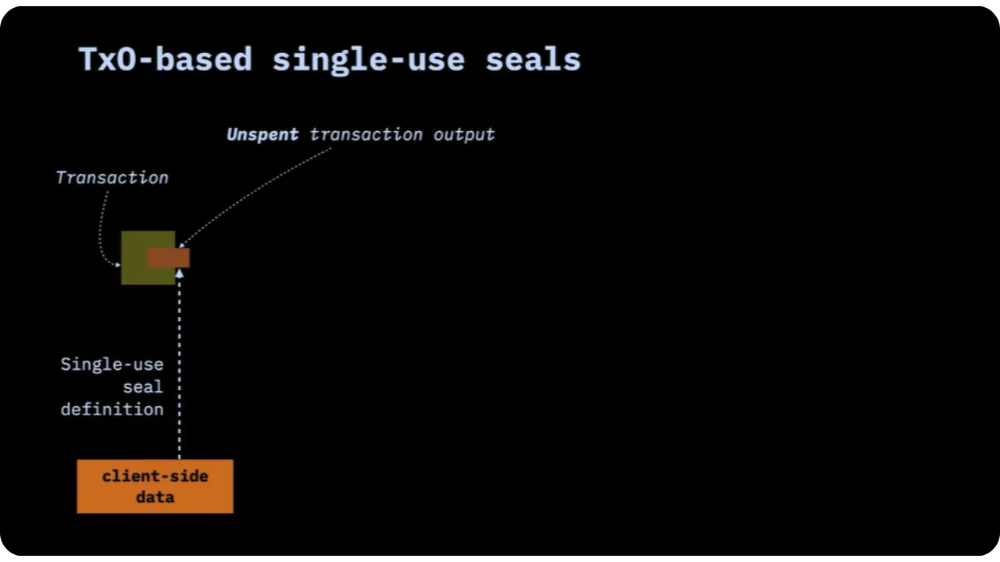


Nk'umusi ishatse kwugara Serire (kugira ngo yerekane ikintu, canke ku Anchor(Ishigikire) ubutumwa kanaka), ikoresha iyo UTXO mwihana hanwa rishasha (rino hanahanwa ryitwa kenshi "_ihanahanwa ry'icabona_" ( segwit atahoihuriye, n'izina gusa twayise) Rino hanahanwa rishasha rizojamwo ubutumwa bw'ukwiyemeza.


Icogufata muri kano karorero :


- Nta n’umwe kiretse Bob (canke abantu Alice ahisemwo guhishurira ikimenyamenya cose) azomenya ko hari ubutumwa bumwe bumwe bwihishije muriryo hanahanwa;
- Umuntu wese arashobora kubona ko _Inzira ija hanze_ yakoreshejwe, ariko Bob wenyene niwe afise ukuri ko ubutumwa bushigikiwe muri rino hanahanwa.


Kugira ngo tugaragaze iyo nzira ya TxO2, turashobora gukoresha _Serire ikoreshwa rimwe_ nk'uburyo bwo gukuraho urufunguzo rwa PGP. Aho gutangaza icete co gukuraho ku maserukira, Alice ishobora kuvuga: "Iki gisohoka ca Bitcoin, iyo gikoreshejwe, bisigura ko urufunguzo rwanje rwa PGP rwakuweho".


Alice rero ifise UTXO yihariye, iyo leta canke amakuru (azwi na we gusa) afitaniye isano n’aho hantu (ku ruhande rw’umukiriya).


Alice imenyesha Bob ko iyo iyo UTXO ikoreshejwe, ikintu kinaka kizobonwa ko cabaye. Uvuye hanze, ivyo tubona vyose ni ugucuruza kwa Bitcoin; ariko Bob arazi ko iyo nsiguro ifise insobanuro yihishije.


Uko Alice akoresha iyo UTXO, arafunga Seal ku butumwa bwerekana urufunguzo rwiwe rushasha, canke gusa gukuraho urufunguzo rwa kera. Muri ubwo buryo, umuntu wese azokurikirana On-Chain azobona ko UTXO yakoreshejwe, ariko abafise ikimenyamenya cuzuye ni bo bonyene bazomenya ko ari ukurekuraho nyavyo urufunguzo rwa PGP.


Kugira ngo Bob canke uwundi wese afise uruhara muri ivyo asuzume ubutumwa bwihishije, Alice ategerezwa kumuha amakuru ya off-chain.


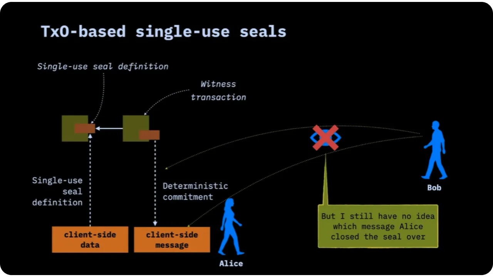


Alice rero itegerezwa guha Bob ibi bikurikira:


- Ubutumwa ubwabwo (nk’akarorero, urufunguzo rushasha rwa PGP);
- Ikimenyamenya c’ubuhinga bwa none c’uko ubutumwa bwari mu bikorwa vy’ugucuruza (bizwi nka _ikimenyamenya c’ugucuruza c’inyongera_ canke _inanga_).


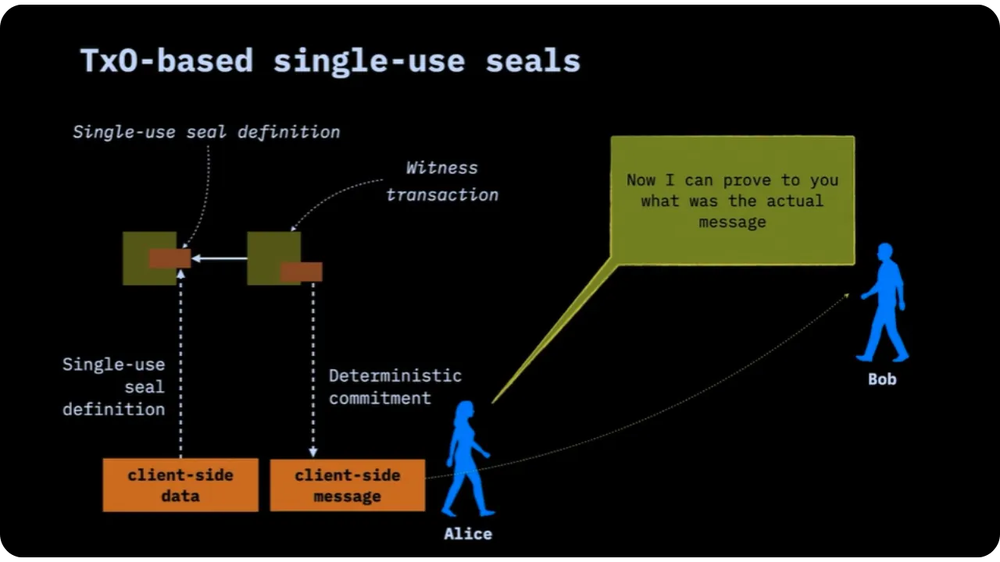


Abandi bantu nta makuru bafise. Babona gusa ko UTXO yakoreshejwe. Ibanga rero rirakengwa.


Kugira ngo dusobanukirwe imiterere, reka dufate incamake y’ingene bigenda mu bikorwa bibiri:


- **Ibikorwa 1**: Ibi birimwo _insobanuro y'ikidodo_, ni ukuvuga _isohoka_ rizokora nka Seal.


- **Ibikorwa 2**: Ikoresha iyi *isohoka*. Ivyo bifunga Seal kandi, muri iyo nzira nyene, bishiramwo *ukwiyemeza* ku butumwa.


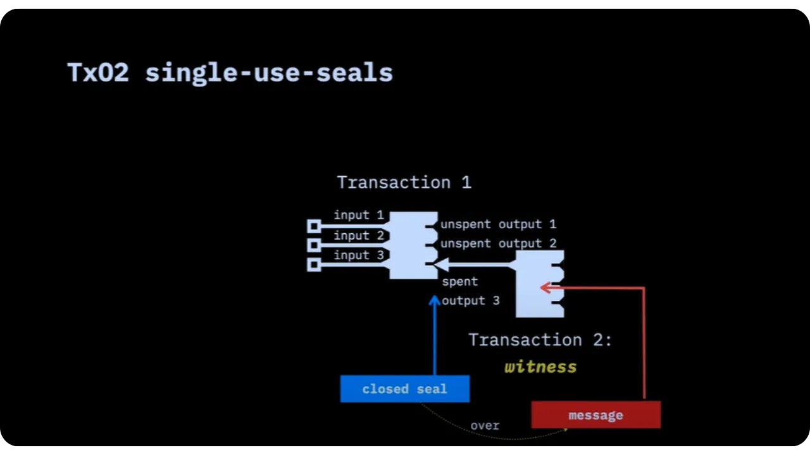


Twita rero igikorwa ca kabiri "_igikorwa c'icabona_".


Kugira ngo ivyo tubigereranye mu yindi mfuruka, turashobora guserura ibice bibiri:


- **Layer yo hejuru (Blockchain, rusangi)**: umuntu wese abona ivy'ugucuruza kandi akamenya ko *isohoka* ryakoreshejwe;
- **Layer yo hasi (client-side, private)**: Alice wenyene (canke uwubireba) ni we azi ko iyo nsiguro ihuye n'ubutumwa nk'ubwo, biciye ku kimenyamenya c'ubuhinga bw'ibanga n'ubutumwa abika mu karere.


Ariko iyo umuntu afunga Seal, ikibazo kivyuka c’aho _ukwiyemeza_ gukwiye kwinjizwa.


Mu gice ca mbere, twavuze muri make ingene urugero rwa Client-side Validation rushobora gukoreshwa kuri RGB n’izindi nzira. Aha, turakora ku gice kivuga ku **amasezerano ya Bitcoin** n’ingene yoyashirwa mu bikorwa. Iciyumviro ni ugutahura igituma turiko turagerageza kwinjiza Commitment imwe mu _gucuruza kw’abashingantahe_, kandi ikiruta vyose ingene twomenya neza ko ata yindi migambi y’uguhiganwa itamenyekanye ishobora kubaho.


### Commitment ahantu mu gucuruza


Iyo uhaye umuntu ikimenyamenya c’uko ubutumwa bumwe bumwe bushizwe mu gicuruzwa, ukeneye kuba ushoboye kwizera ko ata bundi buryo bwa Commitment (ubutumwa bwa kabiri, bwihishije) buri muri ico gicuruzwa nyene butaguhishuriwe. Kugira ngo Client-side Validation igumye ikomeye, ukeneye uburyo **bugena** bwo gushiramwo _ukwiyemeza_ kumwe mu gucuruza gufunga _ikidodo c'ikoreshwa rimwe_.


_Igurisha ry'abashingantahe_ rikoresha amahera azwi cane UTXO (canke _insobanuro y'ikidodo_) kandi ayo mahera ahuye n'ugufunga Seal. Mu buryo bw’ubuhinga, turazi ko igice cose gishobora gukoreshwa rimwe gusa. Ivyo nyene ni vyo bishigikira ubushobozi bwa Bitcoin bwo kurwanya gukoresha amahera incuro zibiri. Ariko igikorwa co gukoresha amahera gishobora kuba gifise _ibintu vyinshi vyinjizwa_, _ibintu vyinshi bisohoka_, canke kikaba gikozwe mu buryo bugoranye (coinjoins, Lightning channels, n’ibindi). Turakeneye rero gusobanura neza aho twoshira _ukwiyemeza_ muri iyo nzira, ata gukeka kandi mu buryo bumwe.


Uko uburyo bwoba buri kwose (PkO, TxO2, n'ibindi), _ukwiyemeza_ gushobora kwinjizwa:


- Mu **Inyinjizo** biciye kuri:
- **Sigtweak** (ihindura akadomo `r` ku mukono wa ECDSA, bisa n'ingingo ngenderwako y'"Gutera umukono-ku-masezerano");
- **Witweak** (amakuru y'icabona *c'ugutandukanya* hamwe n'ubutumwa).
- Mu **Igisohoka** biciye kuri:
- **Keytweak** (urufunguzo rw'uwakira ruri kukarubanda "rurahindurwa" n'ubutumwa);
- **Opret** (ubutumwa bushirwa mu gisohoka kitashobora gukoreshwa `OP_RETURN`);
- **Tapret** (canke _Taptweak_), yubakiye kuri Taproot kugira ngo ishiremwo ukwiyemeza mugace k'inyandiko k'urupfunguruzo rwa Taproot, gutyo igahindura urufunguzo rwa bose mu buryo butegekanijwe.


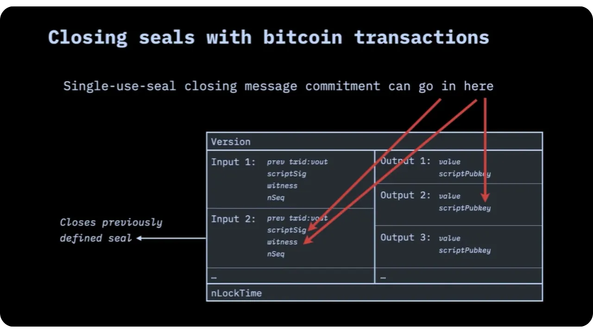


Hano niho hari insiguro yose yaburu buryo:


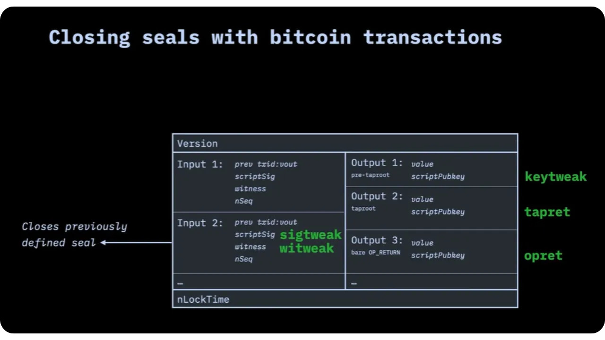


***Ikimenyetso co guhindura (gutera umukono-ku-masezerano):***


Igishoshanyo cakare cashiramwo igice c'umukono (ECDSA canke Schnorr) kugira ngo ushiremwo _ukwiyemeza_: Ibi mubuhinga bizwi nka  "**Sign-to-Contract**"(Gutera Umukono kumasezerano). Usubiriza Nonce yashizweho mu buryo butari bwo n’iyindi Hash irimwo amakuru. Muri buno buryo, uno mukono urahishura ukwiyemeza kwawe, atakandi gace kongeweko kw'ihanahanwa. Ubwo buryo burafise ivyiza bitari bike:


- Nta On-Chain irenze urugero (ukoresha ikibanza kimwe kuri Nonce y’ishimikiro);
- Mumajambo, ibi bishobora kuba vyihishije cane, kuko Nonce mu ntango ari urugero rw’ibintu bitari vyo.


Nubwo biruko, hariho ingorane 2 zikomeye zabonetse:


- Multisig imbere ya Taproot: iyo ufise abatera umkono benshi, uzokenera guhitamwo n'uwuhe mukono uzotwara _ukwiyemeza_. Imikono ishobora gushirwaho mu buryo butandukanye, Hanyuma iyo uwutera umukono yanse, uratakaza ubushobozi ku vyo _ukwiyemeza_ bizovamwo;
- MuSig hamwe Nonce isabikanijwe: na Schnorr Multisig (*MuSig*), urunganwe rwa Nonce ni algorithm bw’imigwi myinshi, hanyuma biba nk'ibidashoboka kurubuga guhindura Nonce kuri burimuntu.


Mu bikorwa, **sig tweak** nayi nyene ntuhuye neza na neza n'ubuhinga bwa none buhari (Ingodo z'ubuhinga bwa none) n’imiterere (Lightning, n’ibindi). Rero kino ciyumviro ciza cane kiragoye gushira mungiro.


***Urufunguzo rwa tweak [pay-to-contract (kwishura-ku-masezerano)]:***


**Urufunguruzo rwa tweak** rufata iciyumviro ca kahise c'_kwishura-ku-masezerano_. Dufata urufunguzo ruri kukarubanda `X` tukaruhindura mu kwongerako agaciro `H(ubutumwa)`. Mu buryo bwihariye, iyo `X = x * G` na `h = H(ubutumwa)`, rero urufunguzo rushasha ruzoba `X' = X + h * G`. Urufunguzo rwahinduwe runyegeza ukwiyemeza ku `ubutumwa`. Uwufise urufunguzo rw'ibanga rw'ukuri arashobora, mu kwongerako `h` ku rufunguzo rwiwe rw'ibanga `x`, yemeza yuko afise urupfunguruzo rwo gukoresha igisohoka. Mumajambo, ivyo ni vyiza cane, kuko:


- _Ukwiyemeza_ kwinjira ata bindi bibanza vyongeweko;
- Nta makuru y’inyongera ya On-Chain ushingura.


Mubikorwa, nubwo biruko, turahura n'ingorane zikwirikira:


- Ingodo zitakimenya urufunguruzo ruri kukarubanda rwemerwa na bose, kuva aho "ruhinduriwe", rero ntizishobora gufatanya UTXO n'urufunguzo rwawe rusanzwe;
- Ingodo z'ubuhinga bwa none ntizakozwe kugira ziterweko umukono kuzitavuye muzemerwa na bose;
- Urakeneye guhindura inyandiko zawe, ibisobanuro, n'ibindi.


Mu bijanye na RGB, iyo nzira yari itegekanijwe gushika mu 2021, ariko vyagaragaye ko igoye cane ku buryo itashobora gukorana n’ingingo mfatirwako n’ibikorwa remezo biriho ubu.


***Tweak y'icabona:***


Ikindi ciyumviro, amategeko amwe amwe nka _inscriptions Ordinals_ yashize mu ngiro, n'ugushira amakuru ataho yiriwe araca mugace k'`icabona` c'ihanahanwa (niho havuye ijambo ati " tweak y'icabona"). N'ubwo birko, buno buryo:


- Bituma ukwiyemeza biboneka aho nyene (Ucukora n'uguteruriramwo umuronngo mu cabona);
- Bishobora gucengera (abacukuzi canke ama node bashobora kwanka gutanga iyo ari nini cane canke ikindi kintu cose kiranga ububisha);
- Ifata umwanya mu mabuye, aho bitandukaniye n’intumbero ya RGB yo gukoresha ubukerebutsi no gutuma umuntu agira umuco.


Ivyiyongerako, Icabona cakozwe kugira gigenewe gufatwa mu bihe bimwebimwe, ivyo bikaba bishobora gutuma habaho ibimenyamenya bikomeye biyobeye cane.


***kwugurura-kugaruka (opret):***


Biroroshe cane mu mikorere yavyo, `OP_RETURN` iragufasha kubika Hash canke ubutumwa mu kibanza kidasanzwe mw'ihanahanwa. Ariko bica bimenyekana ubwonyene: umuntu wese abona ko hariho _ukwiyemeza_ mwihanahanwa, kandi birashobora guhanwa canke gutabwa, hamwe no kwongerako umusaruro w'inyongera. Kubera ko ivyo birongereza ubwizerwe n'ubunini, bifatwa nk'ibidashimisha cane ku bijanye n'inyishu y'ukwemeza kuruhande rw'umuguzi (Client-side Validation).


```txt
34-byte_Opret_Commitment =
OP_RETURN   OP_PUSHBYTE_32   <mpc::Commitment>
|_________| |______________| |_________________|

1-byte       1-byte         32 bytes
```


### Tapret


Ihitamwo rya nyuma ni ugukoresha **Taproot** (yashizweho na BIP341) n’umugambi wa *Tapret*. *Tapret* ni uburyo bugoranye cane bw’ubuhinga bwa Commitment, buzana iterambere mu bijanye n’ikirenge kuri Blockchain n’ibanga ry’ibikorwa vya Contract. Iciyumviro nyamukuru ni uguhisha Commitment mu gice ca `Inzira y'Inyandiko` y'[Ibikorwa vya Taproot](Taproot).


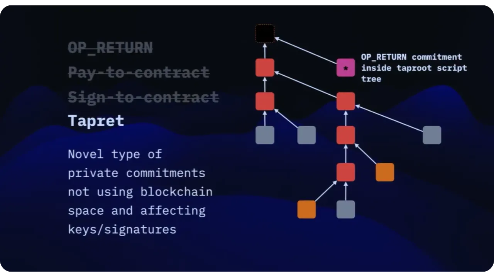


Imbere yo gusobanura ingene Commitment yinjizwa mu gikorwa ca Taproot, reka turabe **uburyo nyabwo** bwa Commitment, butegerezwa **guhuye n'urudodo rw'amabayiti 64** . [yubatswe](BP-WG/bp-core/blob/umukuru/dbc/src/tapret/mod.rs#L179-L196) nk'uko bikurikira:


```txt
64-byte_Tapret_Commitment =

OP_RESERVED ...  ... .. OP_RESERVED   OP_RETURN   OP_PUSHBYTE_33  <mpc::Commitment>  <Nonce>
|___________________________________| |_________| |______________| |_______________|  |______|
OP_RESERVED x 29 times = 29 bytes      1 byte         1 byte          32 bytes        1 byte
|________________________________________________________________| |_________________________|

TAPRET_SCRIPT_COMMITMENT_PREFIX = 31 bytes                    MPC commitment + NONCE = 33 bytes
```


-  Ama byte 29 `OP_RESERVED`, Akwirikirwa na `OP_RETURN`, hanyuma `OP_PUSHBYTE_33`, bikora igice c'intango_ c'ibice 31;
- Hanyuma haca haza _ukwiyemeza_ kw’byte 32 (kenshi Merkle Root iva kuri **MPC**), aho twongerako byte 1 ya **Nonce** (vyose hamwe ni byte 33 y’iki gice ca kabiri).


Rero uburyo bwa `Tapret` bw'byte 64 busa n'ubwa `Opret` twashizeko imbere y'igihe byte29 ya `OP_RESERVED` maze twongerako byte y'inyongera nka Nonce.


Kugira ngo umugambi wa Tapret ugumane ubushbozi bw'uguhinduka mu bijanye n’ugushirwa mu ngiro, ibanga n’ugushira mu ngiro, igicapo ca Tapret kiriyumvirwako mubikorwa bitandukanye, bivanye n’ibisabwa:


- Ukwinjiza vyihariwe k'ukwiyemeza kwa Tapret mw'ihanahanwa rya Taproot ata n’imiterere y’Inzira y’Inyandiko yarisanzwe ihari;
- Ukwinjiza Tapret Commitment mu gikorwa ca Taproot gisanzwe gifise Inzira y’Inyandiko.


Reka turabire hagufi buri kimwekimwe muri ivyo bintu bibiri.


#### Iyinjizwa rya Tapret ata nzira y'inyandiko iriho


Muri iki gihe ca mbere, dutangura n'urufunguzo rw'isohoka rwa Taproot (*Urufunguzo rw'Isohoka rwa Taproot*) `Q` rurimwo gusa urufunguzo rwo kukarubanda rw'imbere `P` *(Urufunguzo rw'Imbere*), ata nzira y'inyandiko bishizwe hamwe (*Inzira y'Inyandiko*):


- `P`: urufunguzo rwa bose rw'imbere rwa _Urufunguzo Inzira Gukoresha_.
- `G`: ikibanza gitera umugozi w'uruzitiro [secp256k1]

-`t = tH_TWEAK(P)` ni umubare w'ihindura, ubariwe biciye ku _hash_ (nk'akarorero `SHA-256(SHA-256(Ihindura) || P)`), bihuye n' [BIP86](Igihugu c'Igihugu c'Igihugu). Ivyo vyerekana ko ata nyandiko yihishije iriho.


Kugira ngo ushiremwo ukwiyemeza kwa **Tapret**, wongereko **Inzira y'Inyandiko Gukoresha** n'**Inyandiko yihariye**, nk'uko bikurikira:


- `t = tH_TWEAK(P || Umuzi_w'inyandiko)` hanyuma ihinduka ikintu gishasha co guhindura, harimwo **Script_root(Umuzi_w'inyandiko)**.
- `Imizi_inyandiko = tH_ishami(64-byte_Isezerano_ry'Inyandiko)`, ikaba ari Hash y'ubwoko `SHA-256(SHA-256(Ishami_Iry'Inyandiko) || 64-byte_Isezerano_ry'Inyandiko)`


Ikimenyamenya c'uko bijamwo vyose, hamwe n'ukwisa kw'igiti ca taproot hano kigarukira ku rufunguzo rumwe rwa bose rw'imbere `P`.


#### Ukwinjiza Tapret mu nzira y'inyandiko yariho kera


Igishushanyo ca kabiri kijanye n'igisohoka `Q` **Taproot** gikomeye cane, gisanzwe kirimwo inyandiko nyinshi. Nk'akarorero, dufise igiti c'inyandiko 3:


- `tH_LEAF(x)` yerekana igikorwa ca Hash c'inyandiko y'amababi.
- `A, B, C` zigereranya inyandiko zisanzwe ziri mu ntumbero ya Taproot.


Kugira ngo twongereko ukwiyemeza kwa Tapret, dukeneye kwinjiza *inyandiko zidakoreshwa* ku rugero rwa mbere rw'igiti, tugahindura inyandiko zisanzwe zihari urugero rumwe hasi. Mu mashusho, igiti gica kiba:


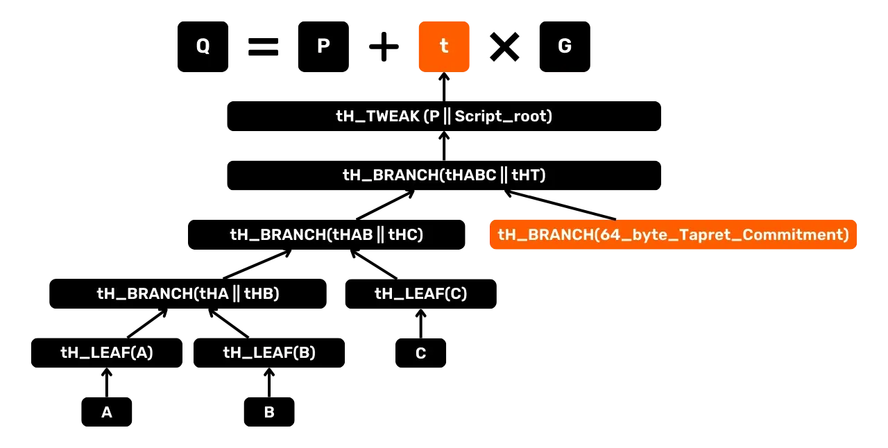


- `tHABC` isubiririra Hash yafatiweko yo hejuru y'imigwi `A, B, C`.
- `tHT` isubirira Hash y'inyandiko ihuye na 64-byte `Tapret`.


Tisunze amategeko ya zino Taproot, ishami/ibabi ryose ritegerezwa guhurizwa hamwe hakurikijwe urukwirikirane rw’inkoranyabumenyi Hash. Hariho ibintu bibiri bishoboka:


- `tHT` > `tHABC`: ukwiyemeza kwa Tapret kugenda muruhande rw'iburyo rw'igiti. Ikimenyamenya c'ubudasa gikeneye gusa `tHABC` na `P`;
- `tHT` < `tHABC`: **Ukwiyemeza kwa Tapret gushirwa ibubamfu**. Kugira ngo vyemezwe ko atakundi kwiyemeza kwa Tapret kuri iburyo, `tHAB` na `tHC` bitegerezwa guhishurirwa kugira ngo vyerekane ko ata yindi nyandiko nk'iyo iriho.


Akarorero kaboneka k'ikibazo ca mbere (`tHABC < tHT`):


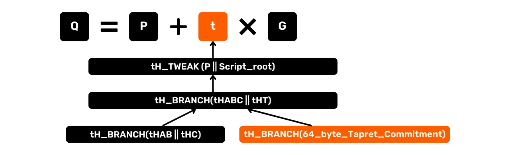


Akarorero k'ikibazo ca kabiri (`tHABC > tHT`):


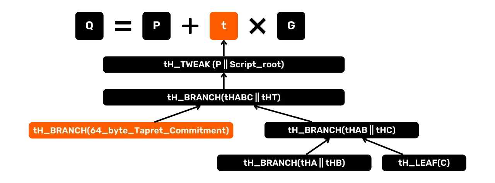


#### Gutuma ibintu bigenda neza cane na Nonce


Kugira ngo dukomeze ibanga, turashobora "gucukura" (ijambo ry'ukuri ryoba ari "ugukoresha igikenye") agaciro ka `<Nonce>` (byte ya nyuma y'i `Tapret` y'amabayiti 64) mu kugerageza kuronka Hash `tHT` ku buryo nka HT` `tHABC. Muri ivyo, ukwiyemeza gushirwa iburyo, ivyo bikaba bituma uwuyikoresha adashobora gutangaza ibirimwo vyose mu nyandiko zisanzweho kugira ngo yerekane ko Tapret ari iyo kwihariza.


Mu ncamake, `Tapret` itanga uburyo butandukanye kandi bugaragara bwo kwinjiza Commitment mu gucuruza Taproot, mu gihe yubaha igisabwa co kuba uwudasanzwe n’ukudasobanuka bihambaye ku bijanye n’ubwenge bwa RGB bwa Client-side Validation na Single-Use Seal.


#### Isohoka ryemewe


Kumahanahanwa yizewe ya RGB, igisabwa nyamukuru kukwiyemeza kwa Bicoin kwemewe gukwirikira igicapo gikwirikira: Ihanahanwa (*icabona c'ihanahanwa*) ritegerezwa kuba ririmwo ukwiyemeza kumwe. Ico gisabwa gituma bidashoboka kwubaka kahise k'amahitamwo yakabiri kumakuru y'uruhande rw'umuguzi mw'ihanahanwa rimwe. Ivyo bisigura ko ubutumwa _ikidodo c’ikoreshwa rimwe_ gikikuje ari ubwihariye.


Kugira ngo iyo ngingo ngenderwako ishikweko, tutitaye kugitigiri c'ibisohoka mw'ihanahanwa, dusaba ko **igisohoka kimwe kandi kimwe rudende** gishobora kubamwo ukwiyemeza. Kuri imwe mubicapo bikoreshwa  (*Opret* canke *Tapret*), ibisohoka vyonyene bishobora kubamwo _ukwiyemeza_ kwa RGB ni ibi bikurikira:


- Igisohoka ca mbere `OP_RETURN` (niba kiriho) c'igishushanyo wa *Opret*;
- Igisohoka ca mbere ca Taproot (niba kiriho) c'igishushanyo wa *Tapret*.


Zirikana ko bishoboka cane ko ihanaganwa rijamwo ukwiyemeza kwa `Opret` hamwe n'ukwiyemeza kwa `Tapret` imwe mubisohoka bibiri bitandukanye. Kubera kamere y’ugushinga intahe y'insiguro ya serire, ukwo kwiyemeza kubiri guhuriranye n'uduce tubiri dutandukanye kw'iyemeza kw'amakuru kuruhanderw'umuguzi.


### Umwihwezo n'amahitamwo afatiwe kubikorwa muri RGB


Igihe twatangura RGB, twasubiyemwo ubwo buryo bwose kugira ngo tumenye aho n’ingene twoshira _ukwiyemeza_ mw'ihanahanwa mu buryo bugaragara. Turashiraho ingingo zimwe zimwe:


- Guhuza n’ibintu bitandukanye (nk’akarorero multisig, Lightning, hardware wallets, n’ibindi.);
- Ingaruka kurubuga rwa On-Chain;
- Ingorane zo gushirwa mu ngiro no kubungabunga;
- Ibanga n’ukudafatwa n'ibihano.


| Uburyo                                             | inzira ya On-chain n'uko ingana | uruhande rw'umuguzi ukorungana | Ugudhiramwo ingodo | uko Hardware vyohurirana | Uko Lightning vyohurirana | uko Taproot vyohurirana |
| -------------------------------------------------- | --------------------- | ---------------- | ------------------ | ---------------------- | ---------------------- | --------------------- |
| Keytweak (deterministic P2C)                      | 🟢                     | 🟡                 | 🔴                   | 🟠                     | 🔴 BOLT, 🔴 Bifrost     | 🟠 Taproot, 🟢 MuSig  |
| Sigtweak (deterministic S2C)                      | 🟢                     | 🟢                 | 🟠                   | 🔴                     | 🔴 BOLT, 🔴 Bifrost     | 🟠 Taproot, 🔴 MuSig  |
| Opret (OP_RETURN)                                 | 🔴                     | 🟢                 | 🟢                   | 🟠                     | 🔴 BOLT, 🟠 Bifrost     | -                     |
| Tapret Algorithm: top-left node                   | 🟠                     | 🔴                 | 🟠                   | 🟢                     | 🔴 BOLT, 🟢 Bifrost     | 🟢 Taproot, 🟢 MuSig  |
| Tapret Algorithm #4: any node + proof             | 🟢                     | 🟠                 | 🟠                   | 🟢                     | 🔴 BOLT, 🟢 Bifrost     | 🟢 Taproot, 🟢 MuSig  |
| igicapo c'ukwiyemeza gushiraho                              | Standard       | Igiciro ca On-Chain                                                                                                        | ukweza uko kungana kuruhande rw'umuguzi                                                                                  |
| ------------------------------------------------------------- | -------------- | ---------------------------------------------------------------------------------------------------------------------- | ---------------------------------------------------------------------------------------------------------------- |
| Keytweak (Deterministic P2C)                                  | LNPBP-1, 2     | 0 bytes                                                                                                                | 33 bytes (non-tweaked key)                                                                                       |
| Sigtweak (Deterministic S2C)                                  | WIP (LNPBP-39) | 0 bytes                                                                                                                | 0 bytes                                                                                                          |
| Opret (OP_RETURN)                                             | -              | 36 (v)bytes (additional TxOut)                                                                                         | 0 bytes                                                                                                          |
| Tapret Algorithm: top-left node                               | LNPBP-6        | 32 bytes in the witness (8 vbytes) for any n-of-m multisig and spending through script path                           | 0 bytes on scriptless scripts taproot ~270 bytes in a single script case, ~128 bytes if multiple scripts       |
| Tapret Algorithm #4: any node + uniqueness proof              | LNPBP-6        | 32 bytes in the witness (8 vbytes) for single script cases, 0 bytes in the witness in most other cases                | 0 bytes on scriptless scripts taproot, 65 bytes until the Taptree contains a dozen scripts                      |


| Layer                          | On-Chain Cost (Bytes/vbytes) | On-Chain Cost (Bytes/vbytes) | On-Chain Cost (Bytes/vbytes) | On-Chain Cost (Bytes/vbytes) | On-Chain Cost (Bytes/vbytes) | Client-Side Cost (Bytes) | Client-Side Cost (Bytes) | Client-Side Cost (Bytes) | Client-Side Cost (Bytes) | Client-Side Cost (Bytes) |
| ------------------------------ | ---------------------------- | ---------------------------- | ---------------------------- | ---------------------------- | ---------------------------- | ------------------------ | ------------------------ | ------------------------ | ------------------------ | ------------------------ |
| **Type**                       | **Tapret**                   | **Tapret #4**                | **Keytweak**                 | **Sigtweak**                 | **Opret**                    | **Tapret**               | **Tapret #4**            | **Keytweak**             | **Sigtweak**             | **Opret**                |
| Single-sig                     | 0                            | 0                            | 0                            | 0                            | 32                           | 0                        | 0                        | 32                       | 0?                       | 0                        |
| MuSig (n-of-n)                 | 0                            | 0                            | 0                            | 0                            | 32                           | 0                        | 0                        | 32                       | ? > 0                    | 0                        |
| Multi-sig 2-of-3               | 32/8                         | 32/8 or 0                    | 0                            | n/a                          | 32                           | ~270                     | 65                       | 32                       | n/a                      | 0                        |
| Multi-sig 3-of-5               | 32/8                         | 32/8 or 0                    | 0                            | n/a                          | 32                           | ~340                     | 65                       | 32                       | n/a                      | 0                        |
| Multi-sig 2-of-3 with timeouts | 32/8                         | 0                            | 0                            | n/a                          | 32                           | 64                       | 65                       | 32                       | n/a                      | 0                        |


| Layer                            | On-Chain Cost (vbytes) | On-Chain Cost (vbytes) | On-Chain Cost (vbytes) | Client-Side Cost (bytes) | Client-Side Cost (bytes) |
| -------------------------------- | ---------------------- | ---------------------- | ---------------------- | ------------------------ | ------------------------ |
| **Type**                         | **Base**               | **Tapret #2**          | **Tapret #4**          | **Tapret #2**            | **Tapret #4**            |
| MuSig (n-of-n)                   | 16.5                   | 0                      | 0                      | 0                        | 0                        |
| FROST (n-of-m)                   | ?                      | 0                      | 0                      | 0                        | 0                        |
| Multi_a (n-of-m)                 | 1+16n+8m               | 8                      | 8                      | 33 * m                   | 65                       |
| Branch MuSig / Multi_a (n-of-m)  | 1+16n+8n+8xlog(n)      | 8                      | 0                      | 64                       | 65                       |
| With timeouts (n-of-m)           | 1+16n+8n+8xlog(n)      | 8                      | 0                      | 64                       | 65                       |
| Method                                    | Privacy & Scalability | Interoperability | Compatibility | Portability | Complexity |
| ----------------------------------------- | ---------------------- | ---------------- | ------------- | ----------- | ---------- |
| Keytweak (Deterministic P2C)              | 🟢                      | 🔴               | 🔴            | 🟡          | 🟡         |
| Sigtweak (Deterministic S2C)              | 🟢                      | 🔴               | 🔴            | 🟢          | 🔴         |
| Opret (OP_RETURN)                         | 🔴                      | 🟠               | 🔴            | 🟢          | 🟢         |
| Algo Tapret: Top-left node                | 🟠                      | 🟢               | 🟢            | 🔴          | 🟠         |
| Algo Tapret #4: Any node + proof          | 🟢                      | 🟢               | 🟢            | 🟠          | 🔴         |


Muri kino cirwa c'inyigisho, vyagaragaye ko ata n’imwe mu bicapo vy'ukwiyemeza vyahuriranye neza  n’ingingo ngenderwako ya Lightning iriho ubu (idakoresha Taproot, _muSig2_ canke infashanyo y’inyongera _y’ukwiyemeza_). Hariko harakorwa utwigoro two guhindura ubuhinga bwo kwubaka umuhora wa Lightning (*BiFrost*) kugira ngo bishobore kwinjiza amasezerano ya RGB. Iyi ni iyindi nzira dukeneye gusubiramwo imiterere y’ibikorwa, imfunguruzo n’uburyo ivy’uguhindura imihora bishirwako umukono.


Isesengura ryerekanye ko, mu vy’ukuri, ubundi buryo (uguhindura urufunguzo, uguhindura ibimenyetso, uguhindura icabona, n’ibindi) bwerekana ubundi buryo bw'ukugorana:


- Canke dufise igitabu kinini ca On-Chain;
- Canke hariho ukudahuza gukomeye namakode y'ingodo (Wallet) isanzwe ihari;
- Canke inyishu ntibaho kuri Multisig itariy amashirahamwe.


Ku RGB, uburyo bubiri vy'umwihariko buragaragara: ***Opret*** na ***Tapret***, bwose bushizwe mu rwego rw'"Ibiva mw'ihanahanwa", kandi buhuye n'uburyo bwa TxO2 bukoreshwa n'urukwirikirane.


### Ikwiyemeza kw'inshi kw'amasezerano - MPC


Muri kano gace, turaba ingene **RGB** ifata ivy’ugukoranya amasezerano menshi (canke, mu buryo bubereye, _imitekere y'ihanahanwa_) k'ukwiyemeza kumwe (*Ukwiyemeza*) yanditswe mw'ihanahanwa rya Bitcoin biciye kugicapo gishirwaho (pre`t`t canke). Kugira ngo ivyo bishikweko, urutonde rw’uguhindura amasezerano atandukanye mu buryo bwa Merkel rubera mu ntumbero yitwa **Igiti ca MPC** (_Multi Protocol Commitment Tree_). Muri kano gace, turaza kuraba ingene iki Giti ca MPC cubatswe, ingene tworonka umuzi waco, n’ingene amasezerano menshi ashobora gusangira ihanahanwa risa biciye mw'ibanga kandi ata gukeka.


Multi Protocol Commitment (MPC) yagenewe gushitsa ibintu bibiri bikenewe:


- Ubwubatsi bwa `mpc::Commitment` Hash: ivyo bizoshirwa muri Blockchain ya Bitcoin hakurikijwe igicapo ca `Opret` canke `Tapret`, kandi bitegerezwa kwerekana amahinduka yose y'uko impinduka yemezwa;
- Gubika icarimwe amasezerano menshi mu _nsezerano_ imwe, bikaba bishoboza guhindura ibintu bitandukanye ku mitungo myinshi canke amasezerano ya RGB kugira ngo ashobore ihanahanwa rimwe rya Bitcoin.


Mu majambo nyayo, buri _umutekero wa buri ihanahanwa_ ni uwa Contract yihariye. Aya makuru yose yinjizwa mu **Igiti ca MPC**, umuzi waco (`mpc::Umuzi`) ugasubira guhindurwa kugira ngo uhe `mpc::Commitment`. N'iyi Hash ya nyuma ni yo ishirwa mw'ihanahanwa rya Bitcoin (_igikorwa c’icabona_), hakurikijwe uburyo bwo guhitamwo bwatowe.


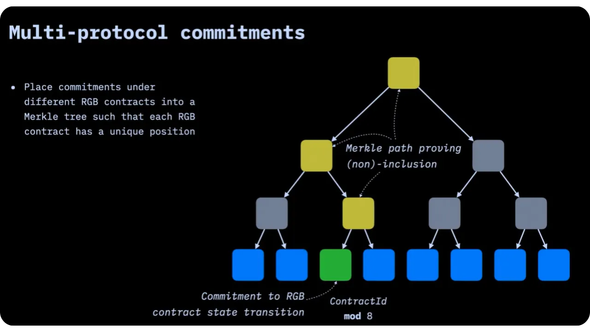


#### Umuzi wa Hash ya MPC


Agaciro kanditswe kuri On-Chain (mu rurimi rwitwa `mpc::Commitment`. Ivyo biharurwa mu buryo bwa [BIP-341], hakurikijwe ano mategeko ngederwako :


```txt
mpc::Commitment = SHA-256(SHA-256(mpc_tag) || SHA-256(mpc_tag) || depth || cofactor || mpc::Root )
```


hehe:


- `mpc_tag` ni ikimenyetso: `urn:ubideco:mpc:Commitment#2024-01-31`, yatowe hakurikijwe [amasezerano yo gushiramwo ikimenyetso ya RGB]
- `uburebure` (1 byte) yerekana uburebure bw'Igiti ca *MPC*;
- cofactor` (16 bits, mu rurimi rwa Little Endian) ni umurongo ukoreshwa mu guteza imbere ubudasa bw’ibibanza vyahawe amasezerano yose mu giti;
- `mpc::Root` ni umuzi wa *MPC Tree*, ubazwe hakurikijwe uburyo buvugwa mu gice gikurikira.


#### MPC Ubwubatsi bw'igiti


Kugira ngo twubake iki Giti ca MPC, turakeneye kumenya neza ko Contract yose ihuye n’aho amababi atumbereye. Dufateko dufise :


- `c` amasezerano azoshirwa mu rutonde na `i` muri `i` = {0,1,..,C-1};
- Ku Cmasezerano yariyo yose `c_i`, dufise ikimenyetso `Id y'Isezerano(i) = c_i`.


Turaheza tukubaka igiti c'ubwaguke `w` n'uburebure `d` ku buryo `2^d = w`, n' `w > C`, kugira ngo amasezerano yose ishobore gushirwa mu _babi_ ritandukanye. Ikibanza `pos(c_i)` kuri buri masezerano yose murico giti ashirwaho na :


```txt
pos(c_i) = c_i mod (w - cofactor)
```


aho `cofactor` ari umubare wose wongera ubushobozi bwo kuronka ibibanza bitandukanye kuri mumasezerano. Mu bikorwa, ubwubatsi bukurikira inzira isubiramwo:


- Dutangura n’uburebure bukeyi (`d=3` ku masezerano kugira ngo tunyegeze igiharuro nyaco c'amasezerano);
- Turagerageza `cofactors` zitandukanye (zishika kuri `w/2`, canke zishika 500 kubera imvo z’ubushobozi);
- Iyo tunaniwe gushiramwo amasezerano yose ata guhuza, twongera `d` tugasubira tugatangura.


Intumbero ni ukwirinda ibiti birebire birenze urugero, mu gihe nyene ingorane zo guhuza ziguma ari ntoyi. Zirikana yuko ikintu c’ugutombora gikurikira uburyo bwo gukwiragiza ataco buvuze, gifitaniye isano n’[Ikibazo c’Isabukuru](https://ru.wikipedia.org/wiki/Ingorane_y’Isabukuru_y’Ivuka).


#### Amababi abawemwo


Igihe `C` ibibanza bitandukanye `pos(c_i)` vyaronswe ku masezerano `i = {0,1,..,C-1}`, urupapuro rwose rwuzuzwa igikorwa ca Hash (*rashizweko ikimenyetso Hash*):


```txt
tH_MPC_LEAF(c_i) = SHA-256(SHA-256(merkle_tag) || SHA-256(merkle_tag) || 0x10 || c_i || BundleId(c_i))
```


hehe:


- `merkle_tag = urn:ubideco:merkle:node#2024-01-31`, yama ihitwamwo hifashishijwe amasezerano ya Merkle ya RGB;
- `0x10` igaragaza _ibabi ry'amasezerano_;
- `c_i` ni ikimenyetso c'amasezerano ya 32 bytes (kiva kuri Hash y'itanguriro);
- bundleId(c_i)` ni Hash y'ama bytes 32 idondora umugwi uko ihanahanwa rimeze` zijanye n'i `c_i` (zikoranijwe muri *Mumutekero w'ihanahanwa*).


#### Amababi atabawemwo


Amababi asigaye, atashizwe kumasezerano (ni ukuvuga amababi ya `w - C`), yuzuye agaciro "k'ikinyoma" (_ibabi ry'ubuhinga_):


```txt
tH_MPC_LEAF(j) = SHA-256(SHA-256(merkle_tag) || SHA-256(merkle_tag) || 0x11 || entropy || j )
```


hehe:


- `merkle_tag = urn:ubideco:merkle:node#2024-01-31`, yama itoranywa hakurikijwe amasezerano ya Merkle ya RGB;
- `0x11` yerekana _ibabi ry'uburemere_;
- `entropy` ni agaciro k'imburakimazi c'ama bytes 64, atorwa n'umuntu yubatse igiti;
- `j` ni ikibanza (mu bice 32 Little Endian) c'iri babi mu giti.


#### Ama nodes ya MPC


Tumaze gushiraho ibabi rya `w` (Ibawemwo canke itabawemwo), turabandanya gukora merkelization. Buri ma node y'indani araba hashed uku gukwirikira :


```txt
tH_MPC_BRANCH(tH1 || tH2) = SHA-256(SHA-256(merkle_tag) || SHA-256(merkle_tag) || b || d || w || tH1 || tH2)
```


hehe:


- `merkle_tag = urn:ubideco:merkle:node#2024-01-31`, yama ahitwamwo hisunzwe amasezerano ya Merkle ya RGB;
- b` ni _umubare w'amashami_ (ibice 8). Kenshi, `b=0x02` kuko igiti ari c'uburyo bubiri gusa kandi kigizwe n’ibintu vyose;
- d` ni uburebure bw'urudodo ruri mu giti;
- `w` ni ubwaguke bw'igiti (mu 256-bit Little Endian);
- tH1` na `tH2` ni hashes z'abana ba nodes (canke amababi), asanzwe aharuwe nk'uko vyerekanwa haruguru.


Dutera imbere muri ubwo buryo, turonka umuzi `mpc::Root`. Turashobora rero guharura `mpc::Commitment` (nk'uko bisigurwa aho hejuru) tukayishiramwo On-Chain.


Kugira ngo ivyo tubisigure, reka twiyumvire akarorero aho `C=3` (amasezerano atatu). Ivyicaro vyabo vyiyumviriwe ko ari `ahantu (c_0)=7`, `ahantu (c_1)=4`, `ahantu (c_2)=2`. Ayandi mababi (ibibanza 0, 1, 3, 5, 6) ni _amababi y’entropie_. Igishushanyo kiri musi kirerekana urutonde rw'ama hashes ku muzi n':


- `UMUGAMBI_i` ugereranya `UmugwiId(c_i)`;
- `tH_MPC_LEAF(A)` n'ibindi, bigereranya amababi (amwe ku masezerano, ayandi ku entropi);
- Ishami ryose `tH_MPC_ISAMBI(...)` rifatanya ama hashes y'abana baryo babiri.


Inyishu yanyuma ni **mpc::Umuzi**, hanyuma `mpc::Commitment`.


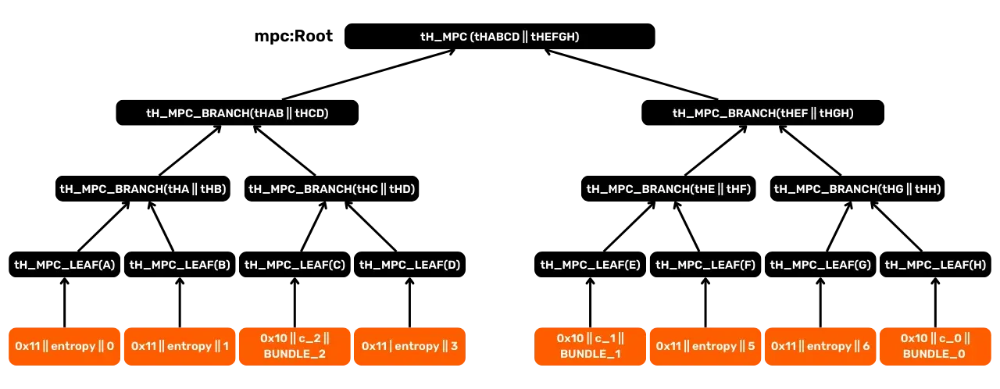


#### Isuzumwa ry'inyubako ya MPC


Iyo umugenzuzi yipfuza kumenya neza ko `c_i` amasezerano (na `BundleId` yayo) ari mu `mpc::Commitment` ya nyuma, aronka gusa ikimenyamenya ca Merkle. Iki kimenyamenya kigaragaza ko ama nodes akenewe kugira ngo amababi (muri iki gihe, `c_i`'s _contract leaf_) asubire ku muzi. Ntaco bimaze gutangaza *Igiti ca MPC* cose: ivyo birinda ibanga ry'ayandi masezerano.


Mu karorero, umugenzuzi wa `c_2` akeneye gusa Hash yo hagati (`tH_MPC_IBABI(D)`), `tH_MPC_ISHAMI(...)` ibiri, ikimenyamenya c'aho `pos(c_2)` ari n'agaciro ka `cofactor`. Ishobora rero gusubira kwubaka umuzi mu karere, hanyuma igasubira kubara `mpc::Commitment` ikayigereranya n'iyo yanditswe mwihanahanwa rya Bitcoin (mu `Opret` canke `Tapret`).


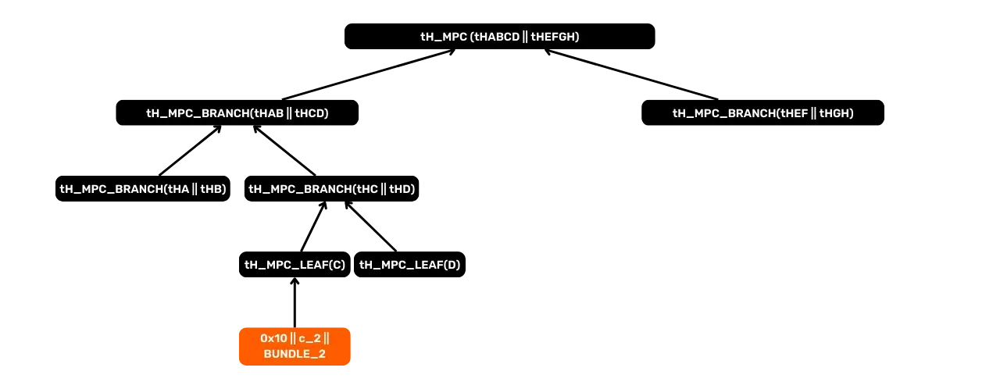


Ubu buryo buratuma:


- Igishingiye kuri `c_2` kirakenew mu vy'ukuri mu gice c'amakuru yose hamwe (uruhande rw'umuguzi);
- Nta n’umwe ashobora kwubaka kahise kandi akoresheje ihanahanwa rimwe, kuko ukwiyemeza kwa On-Chain kwerekana umuzi umwe wa MPC.


#### Incamake kw'inyubako ya MPC


Multi Protocol Commitment* (MPC) ni ingingo ngenderwako ishoboza RGB gukoranya amasezerano menshi mu gikorwa kimwe ca Bitcoin, mu gihe iguma ifise ubudasa bw’amasezerano n’ibanga ku bandi bari muri iyo nama. Kubera inyubakwa y'igiti, Contract yose ihabwa ikibanza kidasanzwe, kandi ukubaho kw'amababi "y'ibinyoma" (*Entropy Leaves*) bipfuka igice c'umubare wose w'amasezerano agize uruhara mu gucuruza.


Igiti ca Merkle (Merkle Tree) cose nticigera kibikwa mumuguzi. Turaheza gusa tukazana _inzira ya Merkle_ kuri buri masezerano yose yerekeye, kugira ngo irungikwe uwuyironka (uwushobora rero kwemeza ukwiyemeza). Mu bihe bimwe bimwe, ushobora kuba ufise imitungo myinshi ryaciye muri UTXO imwe. Ushobora rero gufatanya _inzira nyinshi za Merkle_ mu vyo bita _ibara ryinshi Commitment block_, kugira ngo wirinde gusubiramwo amakuru menshi cane.


Buri _ukwmeza kwa Merkle (Merkle proof)_ rero iraremereye cane cane kuko uburebure bw'igiti butazorenga 32 muri RGB. Hariho kandi iciyumviro ca "Merkle block", kigumya amakuru menshi (igice c'umusaraba, entropi, n'ibindi), ngirakamaro mu gufatanya canke gutandukanya amashami menshi.


Ni co gituma vyatwaye igihe kirekire cane kugira ngo RGB irangizwe. Twari dufise ishusho rusangi kuva muri 2019: gushiramwo vyose ku ruhande rw’amuguzi, gukwiragiza ibimenyetso off-chain. Ariko ku bijanye n’ibintu nk’uguca ibice ku masezerano menshi, uko igiti ca Merkle cubatse, ingene umuntu yovyifatamwo mu gutombora no gufatanya ibimenyamenya... ivyo vyose vyasaba ko umuntu asubiramwo.


### Anchors: ikoraniro ryavyose


Dukurikije ukwubaka amasezerano yacu (`Opret` canke `Tapret`) na MPC yacu (*Multi Protocol Commitment*), turakeneye kwerekana inyigisho za **Anchor** murukwirikirane rwa RGB. Anchor ni inyubako kuruhande rw'ukwemeza rw'umuguzi ushira hamwe ibintu vyose bikenewe gusuzumwa yuko ukwiyemeza kwa Bitcoin kurimwo amakuru y'amasezerano yihariwe. Mu yandi majambo, Anchor ivuga mu ncamake amakuru yose akenewe kugira ngo yemeze _amasezerano_ yavuzwe haruguru.


Anchor igizwe n’ibice bitatu vy’urutonde:


- 'txid'
- `Ikimenyamenya ca MPC`
- Ikimenyamenya c'ihanahanwa rirenze - ETP


Buri imwe murizino ngingo irafise uruhara mu nzira yo kwemeza, haba ari ikibazo co gusubira kwubaka ihanahanwa rya Bitcoin riciweko akarongo canke kwemeza ko hariho ukwiyemeza kwinyegeje ( Vy'umwihariko kuribino bijanye na `Tapret`).


#### txid


Umurima wa `txid` uhuye n'ikimenyetso c'ama byte 32 kwihanahanwa rya Bitcoin ririmwo ukwiyemeza kwa `Opret` canke `Tapret`.


Mu vyiyumviro, vyoshoboka ko umuntu aronka iyo `txid` mu gukurikirana uruhererekane rw’imihindukire yuko ihanahanwa rimweze rikerekana kuri buricabona c'ihanahana imwe imwe, hakurikijwe ubuhinga bw’Ibimenyetso vy’Ikoreshwa Rimwe. Ariko rero, kugira ngo vyorohe kandi vyihute kugenzura, iyo `txid` ishirwa gusa muri Anchor, gutyo igakiza uwuyigenzura ngo ntasubire muri kahise kose ka off-chain.


#### Ikimenyamenya ca MPC


Ikibanza ca kabiri, `Ikimenyamenya ca MPC`, kivuga ikimenyamenya c'uko ayo masezerano (nk'akarorero `c_i`) ari mu _Isezerano ry'amasezerano menshi_. Ni uruvange rwa:


- `pos_i`, ikibanza c'aya masezerano mu giti ca MPC;
- cofactor`, agaciro gasobanuwe kugira ngo utore inyishu yuko vyohura;
- `Merkle Proof`, ni ukuvuga umugwi w'ibice n'ibice bikoreshwa mu gusubira kwubaka umuzi wa MPC no kugenzura ko ikimenyetso c'amasezerano  `umutekero w'ihanahanwa` yaco vyiyemeje ku muzi.


Ubwo buryo bwavuzwe mu gice ca mbere ku bijanye no kwubaka *Igiti ca MPC*, aho burimasezerano aronka ibabi ryihariwe ivyo dukesha :


```txt
pos(c_i) = c_i mod (w - cofactor)
```


Hanyuma, umugambi w’uguhindura amababi (merkelization) ukoreshwa kugira ngo amababi yose akoranirizwe hamwe (amasezerano + entropie). Mu mpera, `Ikimenyamenya ca MPC` kiremesha umuzi gusubira kwubakwa mu karere no kugereranywa na `mpc::Commitment` harimwo On-Chain.


#### Icemeza ihanahanwa rirenze - ETP


Ico kibanza ca gatatu, **ETP**, kivana n’ubwoko bwa'ukwiyemeza bukoreshwa. Nimba kuno kwiyemeza kuri mubwoko bwa `Opret`, nta kindi kimenyamenya gikenewe. Uwugenzura asuzuma igisohoka ca mbere `OP_RETURN` c'ugucuruza maze agasanga `mpc::Commitment` ari ho nyene.


**Nimba ukwiyemeza ukw'ubwoko bwa `Tapret`**, hategerezwa gutangwa ikimenyamenya c’inyongera citwa *Icemeza ihanahanwa rirenze - ETP*. Birimwo:


- Urufunguzo rwa bose rw'indani (`P`) rw'isohoka rya Taproot aho *ukwiyemeza* Gushizwemwo;
- Ivyuma vy'abafatanyabikorwa vya `Inzira y'Inyandiko Gukoresha` (igihe Tapret *Commitment* yinjijwe mu nyandiko), kugira ngo vyemeze aho nya nyandiko iyi nyandiko iri mu giti ca Taproot:
 - Iyo `Tapret` *Ukwiyemeza* kuri kw'ishami ry'iburyo, duhishura urudodo rw'ibubamfu (nk'akarorero `tHABC`),
 - Niba `Tapret` *Ukwiyemeza* kuri ibubamfu, ukeneye gutangaza uturongo 2 (nk'akarorero `tHAB` na `tHC`) kugira ngo werekane ko ata wundi *Ukwiyemeza* kuri ku ruhande rw'iburyo.
- `Nonce` ishobora gukoreshwa mu "gucukura" imiterere myiza, igatuma *Ukwiyemeza* guhirwa iburyo bw'igiti (ugutuma ibimenyamenya bigenda neza).


Ico kimenyamenya c’inyongera ni ngombwa kuko, bitandukanye na `Opret`, n'ukwiyemeza kwa `Tapret` Ukwiyemeza kwinjijwe mu mibumbe y’inyandiko ya Taproot, ivyo bikaba bisaba guhishura igice c’igiti ca Taproot kugira ngo umuntu ashobore kwemeza neza aho *ukwiyemeza* kuri.


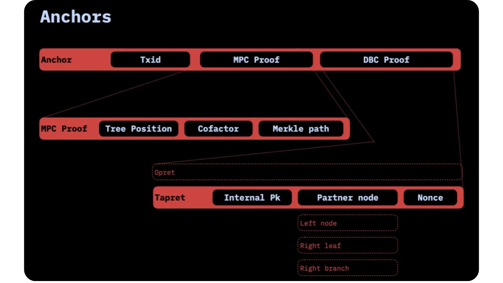


**Anchors** rero bishiramwo amakuru yose asabwa kugira ngo umuntu yemeze ukwiyemeza kwa Bitcoin mubijanye n'ivya RGB ivuga. Birerekana vyose bibiri, ihanahanwa rya nyaryo (`txid`) n'ikimenyamenya c'aho amasezerano ari (`Ikimenyamenya ca MPC`), mu gihe bicungera ikimenyamenya c'inyongera (`ETP`) ku bijanye na `Tapret`. Muri ubwo buryo, Anchor irinda ubutungane n’ubudasa bw'uko off-chain imeze mukwerekana y'uko ihanahanwa rimwe ntirishobora gusubirwamwo ku yandi makuru y’amasezerano.


### Ugusozera


Muri kino kigabane, twarihweje ibi:


- Uko woshira mu ngiro iciyumviro ca serire ikoreshwa rimwe muri muri Bitcoin (Vy'umwihariko biciye ku _isohoka_);
- Uburyo butandukanye bwo kwinjiza mu buryo butegekanijwe _ukwiyemeza_ mw'ihanahanwa (Sig tweak, Key tweak, witness tweak, op_return, Taproot/Tapret);
- Impamvu zituma RGB yibanda kukwiyemeza kwa Tapret;
- Uburongozi bw'amasezerano menshi biciye ku _ukwiyemeza gufise inzira nyinshi_, ni ngombwa nimba udashaka gushikiriza uko bimeze vyose canke ayandi masezerano masezerano igihe ushaka kwemeza ingingo yihariye;
- Twarabonye kandi uruhara rwa _Anchors_, zizana vyose hamwe (ugucuruza txid, ikimenyamenya c'igiti ca Merkle n'ikimenyamenya ca Taproot) mu gice kimwe.


Mu bikorwa, ugushirwa mu ngiro kw’ubuhinga kugabuwe muma Rust crates yabigenewe ( Kuruhande_rw'ukwemeza kw'umuguzi, _gusuzuma ukwemeza_, _bp_core_, n’ibindi). Ivyiyumviro vy’ishimikiro biri ng’aho:


Mu kigabane gikwirikira, turaza kuraba igice ca off-chain gusa ca RGB, nk'amasezerano y'urukwirikirane. Turabona ingene amasezerano ya RGB, atunganijwe nkuko imashine irangiye imeze_, ashika ku vyo guserura vyinshi kuruta inyandiko za Bitcoin, mu gihe azigama ibanga ry'amakuru yabo.


## Intangamarara kuri smart contracts niko imeze


<chapterId>04a9569f-3563-5382-bf53-0c7069343ba0</chapterId>


:::video id=db4ee09f-1352-4ad1-9f7a-c962df7ea9fa::::


Murikino kigabane hamwe n'igikwirikira, turaza kuraba inyigisho za **Smart contract** muri RGB maze tubone uburyo butandukanye ayo masezerano ashobora gusobanura no guhindura *uko ameze*. Turabona igituma unyubako ya RGB, bukoresheje urutonde rw’Ibimenyetso vy'iserire ikora rimwe gusa, butuma bishoboka gukora ubwoko butandukanye bw’**Ibikorwa vya amasezerano*** mu buryo bushobora guhindurwa kandi ata guca mu gitabu c’ivyandikano gihurikiye hamwe. Turaba kandi uruhara rw'***ishoramari rigenda*** mu gutegura iterambere ry'uko amasezerano ameze.


### Smart contracts  n'uburenganzira bw'abatwara


Intumbero ya RGB ni ugutanga ibikorwa remezo vyo gushira ama smart contracts kuri Bitcoin. Mu kuvuga "Smart contract" dushaka kuvuga amasezerano hagati y'imigwi myinshi ashirwa mu ngiro ubwayo kandi akoresheje ubuhinga bwa none, ata muntu yinjiyemwo kugira ngo ashitse ingingo. Mu yandi majambo, itegeko ry'amsezerano rishirwa mu ngiro na porogarama, atari n’uwundi muntu yizigirwa.


Ivyo bikoresho vy’ubuhinga bwa none bivyura ikibazo c'ukutagira aho riyoboka: twoshobora gute kwibohora mu gitabu c’ivyandikano kiyobowe (nk’akarorero, urubuga ruyobowe canke ubushinguzi bw'amakuru) kugira ngo dushobore gucunga ibikorwa kwitirirwa ikintu canke amasezerano agenda? Iciyumviro c'intango, cafashwe na RGB, ni ugusubira ku buryo bw'ukwitirirwa ikintu buzwi nka "ibikoresho vy'abatwara". Muri kahise, hariho ivyemezo bimwebimwe (amafagitire, ugusangira imitungo, n'ibindi) vyasohorwa mu buryo bw’umuntu afise iyo nyandiko, ivyo bikaba vyatuma umuntu wese yari afise iyo nyandiko ku mubiri ashobora gushitsa uburenganzira bwiwe.


RGB ikoresha ico ciyumviro kw’isi y’ubuhinga bwa none: uburenganzira (n’inshingano) bushirwa mu makuru akoreshwa nabi off-chain, kandi ikibanza c’ayo makuru kiremezwa n’abaje mu nama ubwabo. Ivyo bituma, a priori, habaho urugero runini cane rw’ibanga n’ukwigenga kuruta uko bitangwa n’izindi nzira zishingiye ku bitabo biri kukarubanda.


### Intangamarara kuri Smart Contract hamwe n'uko RGB imeze


Smart contract muri RGB ishobora kubonwa nk’imashini ya Leta, isigurwa na:


- A **Igihugu**, akarorero urutonde rw'amakuru rwerekana ugushirwaho kuhari kw'amasezerano;
- A **Uko ishoramari rimeze** (urutonde rw’amategeko), vyerekana n'ayahe masezerano canke biciye hehe Ukobimeze bishoborwa guhindurwa.


Ni vyiza gutahura ko ayo masezerano atagarukira kukurungika ama tokens. Bishobora gukoresha uburyo bwinshi: kuva ku mutungo wa kera ( amatokene, ibigega, amafagitire) gushika ku buhinga bukomeye cane (uburenganzira bwo gukoresha, amajambo y’ubudandaji, n’ibindi). aho bitandukaniye n'izindi blockchains, aho kode y'amasezerano ashobora kubineka kandi agakoreshwa nabose, uburyo bwa RGB buragabanya uburyo bwo gushikira no kumenya Contract ku bari muri iyo nama ("***amasezerano y'abahashika***"). Hariho uruhara rwinshi:


- **Uwutanga** canke uwukora amasezerano, ni we asigura inkomoko y'amasezerano n'ibihinduka vyayo vy'intango;
-  **Ibice vy'uburenganzira** (*Gutunga ikintu*) canke ubundi bushobozi bwo gushitsa amategeko;
- **Abarorere**, bashobora kuba bafise aho babona amakuru amwamye, ariko badashobora gutuma habaho ihinduka.


Ukwo gutandukanya uruhara biratuma habaho ukurinda ibihano, mu kumenya ko abantu bemerewe bonyene ari bo bashobora gukorana n'uko amasezerano ameze. Iha kandi RGB ubushobozi bwo gupima mu buryo buringaniye: ivyemezo vyinshi bibera hanze ya Blockchain, kandi ni vyo vyonyene bifata amabanga (*ukwiyemeza*) vyanditswe kuri Bitcoin.


### Ikibanza n'uko ishoramari rimeze muri RGB


Uvuye ku bijanye n’ibikorwa, amasezerano yuko **ishoramari rimeze** afata uburyo bw’amategeko n’inyandiko, asobanurwa mu co RGB yita **Igicapo**. Igicapo kivuga:


- Inyubako y'uko bimeze (n'ibihe bice bija kukarubanda? Nibihe bice bifiswe nizihe mpande?
- Amategeko y'ukwemerwa (ibishobora kumanza kurabwa imbere y'ukuraba ibishirwa kumwanya?);
- Ivyemezo (ni nde yoshobora gutanguza *uko bishobora guhinduka*? Ninde yoshobora kwihweza gusa?).


Muri ico gihe nyene, **Uko amasezerano ameze** akenshi igabanywamwo ibice bibiri:


- **Ayari kuri bose**: igice ca bose, gishobora kwihwezwa na bose (bivanye n’imiterere);
- **Izifashwe n'abantu**: ibice vy'abigenga, bigenewe cane cane ba nyen'ibihugu biciye ku ma UTXO yerekanwa mu nzira y'uko amasezerano ameze.


Nk'uko tuzobibona mu bigabane bizokwirikira, ivugurura ryose ry'imimerere (*ibikorwa vy'amaserano*) ritegerezwa gushirwa ku _ikwiyemeza_ kwa Bitcoin (biciye kuri `Opret` canke `Tapret`) kandi ryubahirize inyandiko za *uko ishoramari rimeze* kugira ngo ribonwe ko rifise akamaro.


### Ibikorwa vy'amasezerano: ugushiraho n'iterambere ry'uko bimeze


Mu gisata ca RGB, ***Ibikorwa vy'amasezerano*** ni ikintu cose gihindura amasezerano kuva **uko yarameze kera** gushika **uko ameze ubu**. Ivyo bikorwa vyisunga ubu buhinga bukurikira:


- Turaraba uko amasezerano ameze ubu;
- Turashira mu ngiro itegeko canke igikorwa (***Uko ahinduka***, ***Itanguriro*** nimba ari uko yatanguye ameze, canke ***ari ayongeweko*** nimba hari ikimntu kuri kukarubanda gishobora gusubira);
- Dushinga impinduka biciye mukwiyemeza kuri Blockchain, dufunga _iserire ikoreshwa rimwe incuro imwe_ tugakora iyindi;
- Abafise uburenganzira baremeza mu karere (*uruhande rw'umuguzi*) ko iyo mpinduka ihuye n' *igicapo* kandi ko iyo nzira y'ubudandaji ya Bitcoin yanditswe kuri On-Chain.


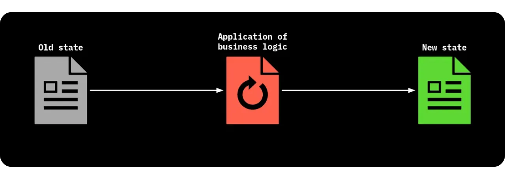


Iherezo ry’ivyo n'amasezerano yashizwe, ubu ikaba afise ukundi ameze ifise. Iryo hinduka ntirisaba ko urubuga rwose rwa Bitcoin rwitwararika ido n'ido, kuko urutoke rutoyi gusa ruri kubihinga bw'inabwoko (_ukwiyemeza_) rwanditswe muri Blockchain. Urutonde rwa Serire ikoreshwa rimwe rurabuza Ukuriha kabiri iyo ari yo yose canke gukoresha kabiri kw'uk bimeze


### Uruhererekane rw'ibikorwa: kuva kuntango gushika kw'aho biherera


Kugira ngo ivyo tubishire mu ngiro, Smart contract ya RGB itangura n’ **Intanguriro**, ubwambere. Inyuma y’aho, Ibikorwa bitandukanye vy'amasezerano birakurikirana, bikagira DAG (*Directed Acyclic Graph*) y’ibikorwa:


- Impinduka yose ishingiye uko biheruko kuba bimeze (canke nyinshi, mu gihe c’impinduka zihuye);
- Urutonde rw’ibihe ruremezwa n’ugushiramwo ihinduka ryose mu gitabu caho Bitcoin Ishingiye, gifise ikidodo c’igihe kandi kitahinduka bivuye ku kwumvikana kwa Proof-of-Work;
- Iyo ata bindi bikorwa biriko birakorwa, **Aho biherera** harashikwako: ahamaze gushikwa kandi hakwije vyose kumasezerano.


Iyi DAG yubatse (aho kuba uruzitiro rworoshe rw’umurongo) yerekana ko bishoboka ko ibice bitandukanye vy'amasezerano bishobora gutera imbere abangabanganijwe, igihe cose bitavuguruzanya. RGB rero yitwararika kwirinda ukudahuza kwose biciye mu kugenzura *ku ruhande rw'ukwemeza kumuguzi* kuri buri muntu wese abirimwo.


### Mumajambo make


Ama Smart contracts muri RGB azana uburyo bw’ibikoresho vy’ubuhinga bwa none, bitagira aho biyoboka ariko bishinze imizi muri Bitcoin kugira ngo bimenyeshe igihe no kwemeza urutonde rw’ihanahanwa. Ishirwa mu ngiro ry’ayo masezerano rishingiye kuri:


- **Uko amasezerano ameze**, yerekana uko amasezerano ateye ubu (uburenganzira, uburinganire, ibihinduka, n’ibindi);
- **Uko ishoramari rimeze** (*Igicapo*), isobanura nayahe mahinduka yemerewe nuko ategezwa kwemerwa;
- **Ibikorwa vy'amasezerano**, bishira kugihe ukobimeze intambwe ku yindi, bivuye ku masezerano ashingiye ku bikorwa vya Bitcoin.


Mukigabane gikurikira, tuzoja mu buryo burambuye ku bijanye ***uko bimeze*** n'izo ***n'uko bihinduka*** ico vyokwerekanye kurugero rwa off-chain, n'ingene zifitaniye isano n'ivyo bimenyetso vy'ubuhinga bwa none (UTXOs) n'ibimenyetso vy'ubuhinga bwa none (Serire ikoreshwa rimwe) bishizwe muri Bitcoin. Ivyo bizoba ari akaryo ko kubona ingene ubuhinga bwo mu mutima bwa RGB, bushingiye kuruhande rw'ukwemeza rw'umuguzi, bushobora kuguma buhuye n'ama  smart contracts mu gihe buzigama ibanga ry’amakuru.


## RGB Ibikorwa vy'amasezerano


<chapterId>78c44e88-50c4-5ec4-befe-456c1a9f080b</chapterId>


:::id ya videwo=1caec34d-f214-425b-a1a4-0a40ae7d3e0e:::


Muri kino kigabane, turaza kuraba ingene ibikorwa muma smart contracts no mu guhindura uko ibintu bikorwa, kandi murukwirikirane rwa RGB. Intumbero izoba kandi iyo gutahura ingene abaje mu nama benshi bafatanya mu gutanga Ibibitirirwa vy'imitungo.


### Impinduka zuko bimeze n'uko bigenda


Ingingo rusangi iracari iyo y'ukwemeza kuruhande rw'umuguzi, aho amakuru y'uko bimeze afiswe na nyen’ayo makuru, akaremezwa n’uwuyaronka. Nubwo biruko, ikintu kidasanzwe aha kuri RGB kiri mu kuba Bob, nk’uwuronka, asaba Alice kwinjiza amakuru amwamwe mu makuru y'amasezerano kugira ngo agire ububasha nyakuri ku mutungo yaronse, biciye ku nsiguro yihishije kuri imwe mu ma UTXO yiwe.


Kugira ngo tubone ingene *Uko bimeze bihinduka* ikora (ari yo imwe mu nzira z’ishimikiro ***Ibikorwa vy'amasezerano*** muri RGB), reka dufate akarorero k’intambwe ku yindi k’uguhindura umutungo hagati ya Alice na Bob:


**Ivyabaye mu ntango:**


Alice ifise ***ahashinguwe hakoresha ubuhinga bwa RGB*** y’amakuru yemejwe mu karere (*uruhande rw’umuguzi*). Ubu bushinguzi bwerekeza kuri imwe mu UTXO ziwe kuri Bitcoin. Ivyo bisigura ko _insobanuro y'ikidodo_ muri aya makuru yerekana UTXO ari iya Alice. Iciyumviro ni ukumushoboza kwimurira uburenganzira bumwe bumwe bujanye n'umutungo (nk'ibimenyetso vya RGB) wa Bob.


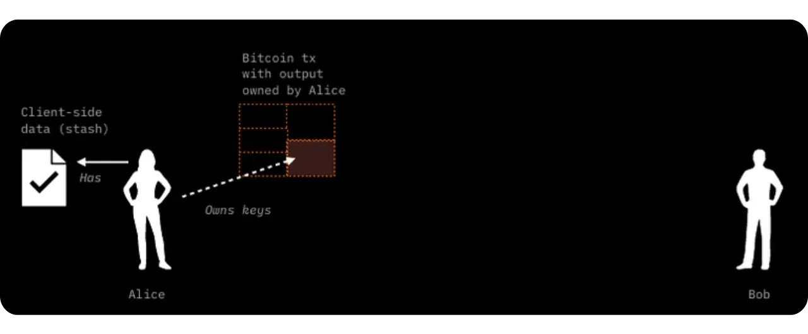


**Bob nawe arafise ama UTXO:**


Ku rundi ruhande, Bob afise n’imiburiburi UTXO imwe yiwe bwite, ata sano ry’ukuri n’iya Alice. Iyo Bob ata UTXO afise, birashoboka ko yomurungikira akoresheje *Icabona c'ihanahanwa* ubwayo: igisubizo c'iyi nzira kizobamwo ukwiyemeza (_ukwiyemeza_) kandi kizofatanya Ugutunga nyakwo kw'amasezerano mashasha na Bob.


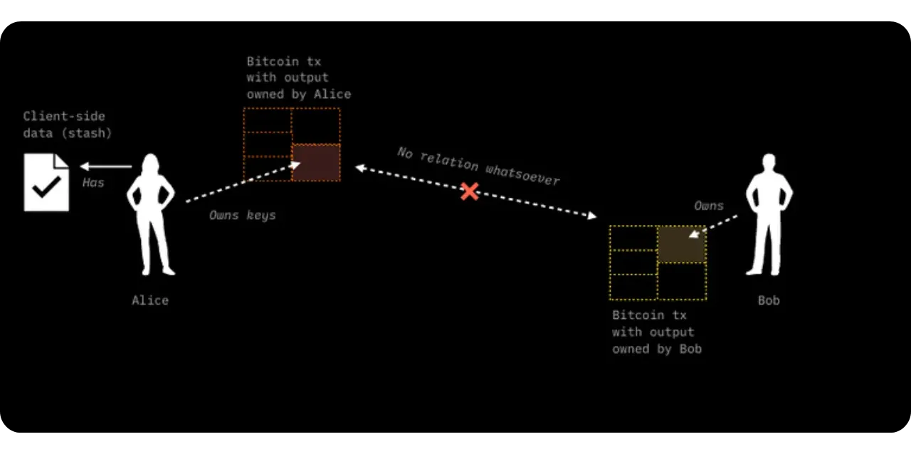


**Ubwubatsi bw'umutungi mushasha (*Uko bimeze gushasha*):**


Bob arungikira amakuru ya Alice yigizwe ibanga mu buryo bwa ***Invoice*** (tuzoja mu ndondoro ku bijanye n'ubwubatsi bwa Invoice mu bice bizokurikira), imusaba kurema igihugu gishasha gihuye n'amategeko ya Contract. Iyi leta izobamwo *Seal Definition* nshasha yerekana imwe mu UTXO za Bob. Muri ubwo buryo, Bob ihabwa Ownership y’itunga risobanuwe muri iyo leta nshasha, nk’akarorero umubare kanaka w’ibimenyetso vya RGB.


**Gutegura urugero rw'ihanahanwa:**


Alice rero arakora ihanahanwa rya Bitcoin  ikoresha UTXO yavuzwe muri Serire iheruka (iyo yamuhaye uburenganzira bwo kuba uwuyifise). Mu gisohoka c'iyi hanahanwa, *Ukwiyemeza* (biciye muri `Opret` canke `Tapret`) yinjizwa muri Mumizi y'uko RGB isigaye imeze. Ukwiyemeza kwa `Opret` canke `Tapret` akomoka ku giti ca *MPC* (nk’uko vyabonetse mubigabane biheruka), gishobora gukoranya amahinduka menshi ava mu masezerano atandukanye.


**Ugutanga *ikintu* kwa Bob:**


Imbere yo gutangaza iryo hanahanwa, Alice arungikira Bob ***ikintu*** irimwo amakuru yose akenewe *yo ku ruhande rw’umuguzi* (*Stash* yiwe) hanyuma uko amakuru mashahsa afashe na Bob. Muri iki gihe, Bob ikoresha amategeko y’uguhurizako ya RGB:


- Iremeza amakuru yose ya RGB ari muri *Ibintu*, harimwo uko bisigaye bimeze muvvyatanzwe mugutunga inomtungo;
- Ishingiye ku *Mubihubakiye* Harimwo *ibibintu*, igenzura urutonde rw'ivyabona vy'ihanahanwa (kuva mwitangiro gushika ku mpinduka iherutse) kandi ikemeza amasezerano ahuye muri Blockchain.


**Uguheza kw'ihinduka:**


Iyo Bob akwihje, arashobora gutanga ukwemeza kwiwe (nk’akarorero, mu gushira umukono mu *ibintu*). Alice arashobora rero gutangaza ivyerekanwa vy’ihanahanwa vyateguwe. Mugihe vyemewe, ivyo bica bifunga Serire yari ifiswe na Alice, bigatuma Bitingwa na Bob. Umutekano wo kurwanya Ukuriha kabiri rero ushingiye ku buryo bumwe nk’ubwo muri Bitcoin: UTXO irakoreshwa, bikaba vyerekana ko Alice atagishobora kuyikoresha.


Uko bisigaye bimeze rero vyerekana UTXO ya Bob, bigaha Bob Uburenganzira bw'ugutunga ivyaheruka kuba bifiswe na Alice. Igisohoka ca Bitcoin aho amakuru ya RGB ashizweho gica kiba ikimenyamenya kidashobora gusubirwamwo c'ukurungika.


Akarorero k’i DAG ntoyi (*Directed Acyclic Graph*) igizwe n’ibikorwa bibiri vya mumasezerano (**mw'itanguriro** hanyuma ***uko bihinduka***) karashobora kwerekana ingene igihugu ca RGB (*uruhande rw’umuguzi* Layer, mw'ibara ritukura) gifatanya na Blockchain4 G4*W-740). mu rurimi rw’umuhondo).


Birerekana ko Itanguro isobanura Iserire (*Insiguro ya Serire*), hanyuma *Uko bisigaye bimeze* igafunga iyo Serire kugira ngo ireme indi nshasha mu yindi UTXO.


Muri ivyo, ng’ibi ivyibutsa bikeyi vy’amajambo:


- ***Umwimenyerezo*** ihuriza hamwe ibi bikurikira:
    - ***Insiguro ya Serire*** (iyikora kuri UTXO);
- Ibihugu vy'ubutunzi, ni ukuvuga amakuru ahuye na **Ownership** (nk'akarorero, igitigiri c'ibimenyetso vyimuriwe).
- **Uko bimeze murirusangi** ihuriza hamwe imiterere rusangi y'amasezerano, Aboneka , kandi igatuma ivy’ubwihindurize bihuye kw’isi yose.


**Impinduka z'uko bimeze**, zavuzwe mu kigabane c'imbere, ni zo nzira nyamukuru z'ibikorwa vy'amasazerano. Bivuga intara imwe canke nyinshi za kera (kuva kw'itanguriro canke iyindi uko impinduka imeze) hanyuma zigasubiramwo intara nshasha.


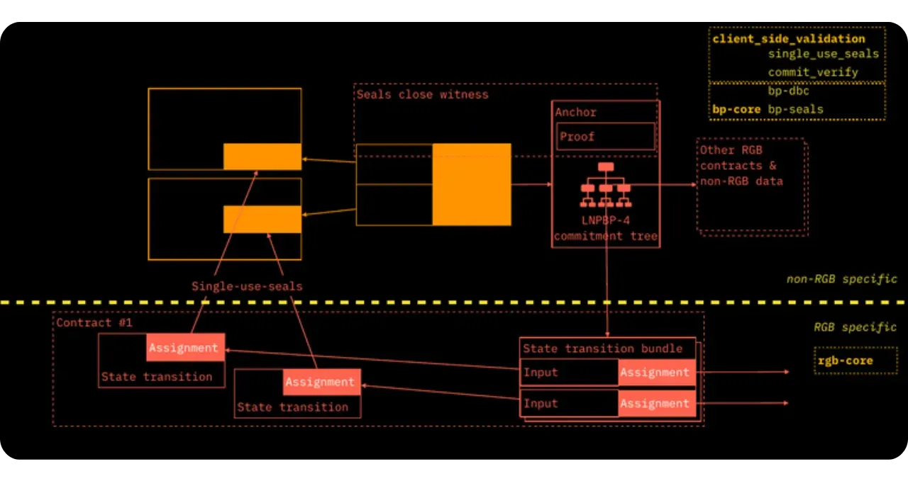


Iki kigereranyo kirerekana ingene, muri *Umutekero w'uko imoinduka zimeze*, ibimenyetso vyinshi bishobora gupfungwa mu gucuruza kw’akarorero kamwe, mu gihe nyene bifungura ibimenyetso bishasha. Nkako, ikintu gishimishije c’umurongo wa RGB ni ubushobozi bwawo bwo gupima: inzira nyinshi zishobora guteranirizwa hamwe zigacika mumutekero w'ipinduka, iyo nzira yose ikaba ifatanijwe n’ibabi ridasanzwe ry’igiti ca *MPC* (ikimenyetso kidasanzwe c’umugwi). Kubera uburyo bwa *Deterministic Bitcoin Commitment* (DBC), ubutumwa bwose bwinjizwa mu gisohoka ca `Tapret` canke `Opret`, mu gihe bufunga ibimenyetso vya kera kandi bishoboka ko busobanura ibindi bishasha. `Anchor` ikora nk’ihuriro ry’ukuri hagati y'ukwiyemeza ibitswe muri Blockchain n’imiterere y'ukwmwza kuruhande rw'umuguzi (*uruhande rw’umukiriya*).


Mu bice bikurikira, turaza kuraba ibice vyose n'ingene bigenda mu kwubaka no kwemeza Uko bihinduka. Vyinshi muri ivyobintu biri mu vyo RGB yemeranije, bishirwa mu ngiro mu **Isoko ry’Ibitabo ry’Ishingiro rya RGB**.


### Ukwemeza kw'uko bihinduka

Ku RGB, birashoboka gukoranya Impinduka za Leta zitandukanye ziri mumasezerano imwe (ni ukuvuga gusangira **Ikiranga amasezerano** imwe, ikomoka kwitanguriro **OpId**). Mu buryo bworoshe, nk’uko biri hagati ya Alice na Bob mu karorero kari hejuru, **Umutekero w'impinduka** irimwo inzira imwe gusa. Ariko gushigikira ibikorwa vy’abariha benshi (nk’ama coinjoins, ugufungura imirongo ya Lightning, n’ibindi) bisigura ko abakoresha benshi bashobora gufatanya Impinduka zabo uko bimeze mu mugwi umwe.


Iyo zimaze kwegeranywa, izo mpinduka zishirwako (n’uburyo bwa MPC + DBC) mu gikorwa kimwe ca Bitcoin:


- Uko bizaguhinduka yose irashirwako hashe maze igashirwa mu migwi ikaba Mumutekero w'impinduka;
- Umutekero w'impinduka ubwayo irahashwa maze igashirwa mu ibabi ry’igiti ca MPC rihuye mumasezerano (Ikiranga umutekero);
- Igiti ca MPC gica gikorana na `Opret` canke `Tapret` muri Ukwemeza kw'ihanahanwa, ivyo bikaba bifunga ibimenyetso vyakoreshejwe kandi bikasobanura ibimenyetso bishasha.


Mu buryo bw'ubuhinga, **Ikiranga umutekero** yinjijwe mu rupapuro rwa MPC iboneka ku Hash ikoreshwa ku gukurikirana gukomeye kw'umurima wa *InputMap* w'umugwi:


```txt
BundleId = SHA256( SHA256(bundle_tag) || SHA256(bundle_tag) || InputMap )
```


Mu `umugwi_tag = urn:lnp-bp:RGB:umugwi#2024-02-03` nk'akarorero.


*InputMap* ni urutonde rw'amakuru rutanga urutonde, kuri buri nkuru `i` y'urugero rw'ibikorwa, ivyerekeye *OpId* ya Uko ibihinduka bimeze ihuye. Nk'akarorero:


```txt
InputMap =
N               input_0    OpId(input_0)    input_1    OpId(input_1)   ...    input_N-1  OpId(input_N-1)
|____________________| |_________||______________| |_________||______________|       |__________||_______________|
16-bit Little Endian   32-bit LE   32-byte hash
|_________________________| |_________________________|  ...  |___________________________|

MapElement1                MapElement2                       MapElementN
```


- `N` ni igitigiri cose c'ibintu vyinjijwe mu gucuruza vyerekeye `OpId`;
- opId(input_j)` ni ikimenyetso c'ibikorwa ca kimwe mu bihinduka uko bimeze biri mu mugwi.


Mu gusubiramwo ikintu cose cinjijwe rimwe gusa kandi mu buryo bubereye, turabuza Serire imwe ikoreshwa incuro zibiri mu Nzira zibiri z’uko bimeze zikora icarimwe.


### Gushiraho uko bimeze hamwe n'uko bimeze bikora


Impinduka z'uko bimeze rero zirashobora gukoreshwa mu gukura ukugira ukobi y'umutungo ku muntu umwe ukayijana ku wundi. Ariko rero, si vyo vyonyene bishobora gukorwa mu masezerano ya RGB. Iryo tegeko risobanura ibikorwa bitatu vya **Amasezerano**:


- 792;
- 793;
- 794.


Muri ivyo, **Itanguriro** na **State Extension** rimwe na rimwe vyitwa "*Ibikorwa vyo Guhingura Leta*", kuko bihingura Leta nshasha ata n'imwe ihita ifunga. Iyi ni ingingo ihambaye cane: **Genesis** na **State Extension** ntibirimwo gufunga Seal. Ahubwo, basigura Seal nshasha, itegerezwa rero gukoreshwa n’iyindi **State Transition** ikurikira kugira ngo yemezwe vy’ukuri muri kahise ka Blockchain.


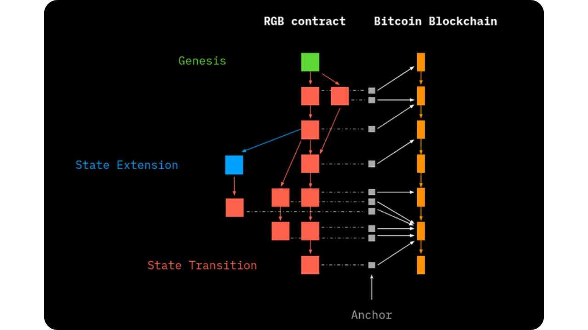


**Uko bimeze** ivy'amasezerano kenshi biba bisigurwa nk'umugwi w'ibihugu bishasha biva kuri kahise (DAG) k'ihanahanwa, gutangura kw'itanguriro bigakurikira ibishinze mumizi vyose biri muri Blockchain ya Bitcoin. Uko vyari bimeze kwose kera biba vyaravuye kugihe (i.e. zifatanye kugira zikoreshwe ama UTXO) ntizigifatwa nk’izikora, ariko ziguma ari ngirakamaro mu kugenzura ukuntu kahise ihuye.


### Itanguriro


Itanguriro ni intango y'amasezerano ya RGB. Iremwa n'uwayitanga Amasezerano kandi isobanura ibipimo vy'intango, bihuye n' **Igicapo**. Ku bijanye na token ya RGB, Itanguriro ishobora kubivuga neza, akarorero:


- Igitigiri c’ama token yakozwe vy'ukuri n'abayafise;
- Igitigiri cose c’ibibazo bishoboka;
- Amategeko yose yo gusubira gusohora, ayo abayikoresha bashobora gutora.


Kuba  ihanahanwa ryambere mumasezerano, Itanguriro ntakindi citegererezo nakimwe ifise, eka mbere ntaniyindi Serire nimwe yugara. Ariko rero, kugira ngo Itanguriro riboneke muri kahise nakamwe kandi yemerwe, itegerezwa **gukoreshwa** (ipfungwa) n'uko yarimeze imbere  (kenshi ni igikorwa co gucapura/kwikoresha ubwaco ku wuyitanga ubwiwe, canke ugutanga ubwa mbere ku bakoresha).


### Uko bimeze iyongerwako


**Uko bimeze iyongeweko** bitanga ikintu c'umwimerere kuri smart contracts. Bituma bishoboka kwitangira uburenganzira bumwe bumwe bw'ubuhinga bwa none (*Valenties*) buvugwa mu nsobanuro y'amasezerano, ata gufunga Serire ubwo nyene. Akenshi, vyerekeye:


- Ingirane za token zasabikanijwe;
- Uburyo bwo guhindura itunga;
- Gusubira gusohora bifise ivyangombwa (bishobora kubamwo no gusenyura ibindi bintu n’ibindi).


Mu buryo bw’ubuhinga, Uko bimeze iviyongeweko vyerekana *Ukwitanga* (ubwoko bumwe bw’inyungu ya RGB) buhuye na *Valency* yasobanuwe ubuheruka (nk’akarorero, mw'itanguriro canke uwundi uko bimeze ivyongeweko). Isigura Serire nshasha, iboneka ku muntu canke ku kibazo kivyungukirako. Kugira ngo iyo Serire ikore, itegerezwa gukoreshwa n’iyindi ukobimeze ivyongeweko.


Nk’akarorero: Itanguriro rirema uburenganzira bwo gutanga (*Valency*). Ivyo bishobora gukorwa n’umukinyi yemerewe, aca yubaka uko bimeze ivyongeweko:


- Rivuga igitabu ca Valency (Redeem);
- Irema *Umwimenyerezo* nshasha (amakuru mashasha ya *y'uko bimeze ibifiswe*) yerekana UTXO;
- Uko bimeze ivyongeweko bizoza, isohowe na nyen’iyi UTXO nshasha, mu vy’ukuri izokwimurira canke igatanga ivyo bimenyetso bishasha vyasohowe.


### Ibigizwe n'ibikorwa vy'amasezerano


Ubu rero ndashaka kuraba mu buryo burambuye buri kimwe muduce tugize **Ibikorwa vy'amasezerano** muri RGB. Ibikorwa vy'amasezerano ni igikorwa gihindura uko amasezerano ameze, kandi cemezwa ku ruhande rw’umuguzi, mu buryo bugenwa, n’uwuyironka mu buryo bubereye. Cane cane, turabona ingene Ibikorwa vy'amasezerano ifata mu muzirikanyi, ku ruhande rumwe, **ivya kera** vy'amasezerano, ku rundi ruhande, insobanuro ya **ivya kera** .


```txt
+---------------------------------------------------------------------------------------------------------------------+
|  Ibikorwa vy'amasezerano                                                                                                 |
|                                                                                                                     |
|  +-----+     +-----------------------+      +--------------------------------+      +---------+     +------------+  |
|  | Ffv |     | Ikoranga amasezerano | Ikiranga igicapo |      | Uko impinduka imeze | Uko ivyiyongerwako bimeze |      | Ivyo ukugerageza |     | AltLayers1 |  |
|  +-----+     +-----------------------+      +--------------------------------+      +---------+     +------------+  |
|                                                                                                                     |
|  +-----------------------------------------------+  +------------------------------------------------------------+  |
|  | Amakuru y'umwimerere                                      |  | Uko bimeze muri rusangi                                              |  |
|  |                                               |  | +----------------------------------+                       |  |
|  | +-------------------------------------+       |  | | +-------------------+ +--------+ |                       |  |
|  | |          Amakuru uko yubatse           |       |  | | | Uko bimeze muri rusangi  | |  Amakuru  | |     ...     ...       |  |
|  | +-------------------------------------+       |  | | +-------------------+ +--------+ |                       |  |
|  |                                               |  | +----------------------------------+                       |  |
|  +-----------------------------------------------+  +------------------------------------------------------------+  |         +------+
|                                                                                                                     +---------> Ikiranga igikorwa |
|  +-----------------------------------------------+  +------------------------------------------------------------+  |         +------+
|  | Ibishirwamwo                                        |  | Imyimenyererezo                                                |  |
|  |                                               |  |                                                            |  |
|  | +-------------------------------------------+ |  | +--------------------------------------------------------+ |  |
|  | | Ibishirwamwo #1                                  | |  | | Umwimenyererezo #1                                          | |  |
+------+       |  | | +----------+ +----------------+ +-------+ | |  | | +----------------+ +-------------+ +-----------------+ | |  |       +--------------+
| Ikiranga igikorwa +--------------> Ibiranga ivyemeza igikorwa | | Ubwoko bw'umwimenyerezo | | Urutonde | | |  | | | Ubwoko bw'umwimenyerezo | | Ukobimeze | | Insiguro ya Serire +--------------> UTXO ya Bitcoin |
+------+       |  | | +----------+ + ---------------+ +-------+ | |  | | +----------------+ +-------------+ +-----------------+ | |  |       +--------------+
|  | +-------------------------------------------+ |  | +--------------------------------------------------------+ |  |
|  |                                               |  |                                                            |  |
|  | +-------------------------------------------+ |  | +--------------------------------------------------------+ |  |
|  | | Ibishirwamwo #2                                  | |  | | Umwimenyerezo #2                                          | |  |
+------+       |  | | +----------+ +----------------+ +-------+ | |  | | +----------------+ +-------------+ +-----------------+ | |  |       +--------------+
| Ikiranga igikorwa +--------------> Ibiranga ivyemeza igikorwa | | Ubwoko bw'umwimenyerezon | | Urutonde | | |  | | | ikieranga umwimenyerezo | | Ukobimeze| | Insiguro ya Serire +--------------> UTXO ya Bitcoin |
+------+       |  | | +----------+ +----------------+ +-------+ | |  | | +----------------+ +-------------+ +-----------------+ | |  |       +--------------+
|  | +-------------------------------------------+ |  | +--------------------------------------------------------+ |  |
|  |                                               |  |                                                            |  |
|  |       ...           ...          ...          |  |     ...          ...             ...                       |  |
|  |                                               |  |                                                            |  |
|  +-----------------------------------------------+  +------------------------------------------------------------+  |
|                                                                                                                     |
|  +-----------------------------------------------+  +------------------------------------------------------------+  |
|  | Ubwitange                                       |  | Valencies                                                  |  |
|  |                                               |  |                                                            |  |
|  | +------------------------------+              |  |                                                            |  |
+------+       |  | | +----------+ +-------------+ |              |  |  +-------------+  +-------------+                          |  |
| Ibiranga igkorwa +--------------> Ibiranga ivyemeza igikorwa | | Ubwoko bwa Valency | |  ...   ...   |  |  | Ubwoko bwa Valency |  | Ubwoko bwa Valency |         ...              |  |
+------+       |  | | +----------+ +-------------+ |              |  |  +-------------+  +-------------+                          |  |
|  | +------------------------------+              |  |                                                            |  |
|  |                                               |  |                                                            |  |
|  +-----------------------------------------------+  +------------------------------------------------------------+  |
|                                                                                                                     |

+---------------------------------------------------------------------------------------------------------------------+
```


Turavye igishushanyo kiri hejuru, turabona ko igikorwa c'amasezerano kirimwo ibintu yerekeza ku **Ibintu bisigaye bimeze** n’izindi zivuga **uko ibintu vyari biri** vyashizwe kugihe.


Ibintu za **v'uko vyahora bimeze** ni:


- **Umwimenyerezo**, muriwo bisiguwe:
 - Ivyo **Insiguro ya Serire**;
 - Ivyo **Uko bimeze bifiswe n'abandi**.
- Ico **Uko bimeze muri rusangi**, bishobora guhindurwa canke bigatunganirizwa;
- **Valencies**, bishobora kuba bisobanuwe muri n'uko bimeze ivyongeweko canke Itanguriro.


**Uko vyaribimeze** vyerekanwa biciye kuri:


- **Ibishirwamwo**, zigaragaza *Ibikorwa* vy'imihindukire y'iko vyari bimeze (ntibiri mw'itanguriro);
- **ukwitanga**, bivugwa ku Valencies zasobanuwe mbere (mu Vy'uko bimeze ivyiyongeweko).


Ikindi, Ibikorwa vy'amasezerano birimwo ibindi bibanza rusangi vyerekeye igikorwa:


- `ffv` (*Verisiyo yihuta*): igitigiri cose c'ama byte 2 cerekana uko amasezerano ameze;
- `Ubwoko Bw'Impinduka` canke `Ubwoko bw'Ukwongerwako`: Umubare w'ibice 16 ugaragaza ubwoko bw'Impinduka canke Ukwaguka, hakurikijwe uko ishoramari rimeze;
- `Id y'amasezerano`: umubare w'amabayiti 32 yerekeye *OpId* y'amasezerano y'itanguriro. Ishizwe mu Nzira z’Impinduka n’Ivyagutse, ariko ntiziri mw'itanguriro;
- schemaId: iri mw'itanguriro gusa, iyi ni Hash y'amabayite 32 iserukira imiterere (*Schema*) y'amasezerano;
- `Testnet`: Igiharuro kigaragaza nimba uri ku rubuga rwa Testnet canke Mainnet. Itanguriro gusa;
- `altlayers1`: umuhinduzi ugaragaza ubundi buryo Layer (Sidechain canke ubundi) bukoreshwa ku makuru ya Anchor yongerako Bitcoin. Iriho gusa mw'itanguriro;
- `metadata`: umwanya ushobora kubika amakuru y'igihe gito, ngirakamaro mu kwemeza amasezerano igoye, ariko udategerezwa kwandikwa mu mateka y'imimerere ya nyuma.


Ubwa nyuma, ivyo bibanza vyose bihurizwa hamwe n'uburyo bwo gukora hashing, kugira ngo bivemwo ikimenyetso c'urutoke kidasanzwe, `OpId`. Iyi `OpId` ica ishirwa muri Umutekero w'impinduka, igatuma ishobora kwemezwa no kwemezwa murukwirikirane.


Buri *Gikorwa c'amasezerano* rero imenyekana n'igice ca Hash c'ama byte 32 citwa `OpId`. Iyi Hash ibarwa n’i SHA256 Hash y’uduce twose igize igikorwa. Mu yandi majambo, *Igikorwa c'amasezerano* yose irafise ukwiyemeza yayo y’ibanga, irimwo amakuru yose akenewe kugira ngo umuntu asuzume ukuri n’uko igikorwa gihuye.


Amasezerano ya RGB rero amenyekana na `ContractId`, ikomoka kw'itanguriro `OpId` (kubera ko ata gikorwa c’imbere y'itanguriro). Mu majambo nyayo, dufata Itanguriro `OpId`, tugahindura urutonde rwa byte maze tugakoresha ubuhinga bwa Base58. Ivyo bituma `ContractId` yoroha gukoresha no kumenya.

### Uburyo bwo kuvugurura ivyangombwa n'amabwirizwa


**Uko amasezerano ameze** igereranya amakuru yose umurongo wa RGB utegerezwa gukurikirana kumasezerano. Igizwe na:


- **Uko bimeze murirsangi** imwe: iki ni igice c'amasezerano ca bose, co kw'isi yose, kiboneka kuri bose;
- Uko bimeze kimwe canke vyinshi vy'Umutungo: **Owned State** yose ifatanye n'iyindi Serire yihariye (kandi rero UTXO kuri Bitcoin). Hariho itandukaniro hagati ya:
    - Uko bimeze **kuri bose**,
    - Uko bimeze **ivy’abikorera ku giti cabo**.


*Uko bimeze muri rusangi* ishirwa ataco ihinduye muri *Igikorwa c'amasezerano* nk'igice kimwe. *Ibihugu vy'Umutungo* bisobanurwa muri *Umwimenyerezo* wose, iruhande ya *insiguro ya Serire*.


Ikintu nyamukuru kiranga RGB ni uburyo Uko bimeze muri rusangi n’Ibihugu vy’Igihugu bihindurwa. Muri rusangi hari ubwoko bubiri bw'inyifato:


- **Ihinduka**: iyo ikintu c'uko bimeze bidondowe nk'ibihinduka, igikorwa gishasha cose gisubirira uko vyaribimeze ivya kera n'uko bimeze ivyubu. Amakuru ya kera rero abonwa ko ataco amaze;
- **Kwirundanira**: iyo ikintu c'intara gisobanuwe nk'ikirundanira, igikorwa gishasha cose congera amakuru mashasha ku ntara y'imbere, ata kwandikako. Ico bivamwo ni ubwoko bw'amateka yirundanijwe.


Iyo, muma sezerano, ikintu c'uko bimeze bidasiguwe nk'igihinduka canke gitera, ico kintu kizoguma ari ubusa ku bikorwa bikurikira (mu yandi majambo, nta verisiyo nshasha z'iki kibanza). N'igicapo c'amasezerano (i.e. Uko ishoramari ifise kode) igena nimba Leta (Isi yose canke Iy’Umuntu) ihinduka, ishobora kwirundanira canke idahinduka. Igihe itanguriro imaze gusobanurwamwo, ivyo bishobora guhindurwa gusa iyo Amasezerano ubwayo abirekuriye, nk'akarorero biciye kukw'iyongerako ukobimeze yihariye.


Imbonerahamwe iri musi yerekana ingene ubwoko bumwebumwe bwa Contract Operation bushobora gukoresha (canke kutakoresha) Global State na Owned State:


|                                           | Itanguriro | Uko bimeze ivyongeweko | Uko bimeze ivyongeweko |
| ---------------------------- |:-----:     |:---------: |:--------------: |
| **Ivyongegwako kuko bimeze muri rusangi** |    +       |        -        |        +         |
| **Ivyinguruza kuko bimeze muri rusangi**  |   n/a      |        -        |        +         |
| **Ivyongerwako ukobimeze ibifiswe**       |    +       |        -        |        +         |
| **Ivyiguruza ukobimeze ibifiswe**         |   n/a      |       No        |        +         |
| **Ivyiyongerako kuri  Valencies**         |    +       |        +        |        +         |


**`+`**: igikorwa gishoboka iyo Igicapo c'amasezerano kibirekuriye.


**`-`**: igikorwa kigomba kwemezwa na Ibihinduka uko bimeze ikurikira (Ivyongerwako kukobimeze vyonyene ntivyugara Serire ikoreshwa rimwe).


Ikindi, urugero rw’igihe n’uburenganzira bwo guhindura ubwoko bumwebumwe bw’amakuru birashobora gutandukanywa mu mbonerahamwe ikurikira:


|                        | Amakuruy'imitererere                               | Uko bimeze murirusangi                                     | Ibifiswe uko bimeze                                                                                              |
| ---------------------- | --------------------------------------- | ------------------------------------------------ | -------------------------------------------------------------------------------------------------------- |
| **Ahobikorerwa**              | Bisigura kubikorwa vy'isezerano | Bisugura murirusangi amasezerano                | Bisigura kuri buri Serire  (*Umwimenyerezo*)                                                                     |
| **Ninde ashobora kubishira kugihe?** | Ntishobora gushirwa kugihe (Aamakuru afise ahoaherera)          | Igikorwa catanzwe n'abakozi  (Uwutanga, n'ibindi.)        | Bivanye nabemerewe kubitunga bafise Serire (Umwe ashobora kubitanga mwihanahanwa rikurikira) |
| **Aho bikorerwa vy'infatakibanza**     | Gusa kugikorwa kiriko kiraba          | Uko bimeze bishirwa kumpera y'igikorwa | Ukobimeze bisigurwa imbere y'igikorwa (Imbere *y'insiguro ya Serire* Y'ibikorwa biheruka)               |


### Uko bimeze murirusangi


Uko bimeze muri rusangi akenshi idondorwa ngo "nta n'umwe ayifise, bose barabizi". Irimwo amakuru rusangi yerekeye Aamasezerano, ikaba iboneka ku mugaragaro. Nk’akarorero, mumasezerano atanga token, birashoboka ko irimwo:


- Igiharuro (indome ngufi y’ikigereranyo ya token): `igiharuro`;
- Izina ryose rya token: `izina`;
- Ugushikama (Igitigiri c'ibibanza vy'icumi): `ugushikama`;
- Ivyo gutanga vya mbere (na/canke umupaka w’agaciro kanini wa token): `Itangazwa`;
- Itariki y'isohoka: `yaremwe`;
- Amakuru y'amategeko canke ayandi makuru ya bose: `amakuru`.


Uko bimee murirusangi bishobora gushirwa ku bikoresho vya bose (imbuga ngurukanabumenyi, IPFS, Nostr, Torrent, n’ibindi) igashikirizwa abantu bose. Kandi, inguvu z’ubutunzi (ugukenera gufata no gutanga ivyo bimenyetso, n’ibindi) ni vyo bituma abakoresha Amasezerano bo ubwabo babungabunga no gukwiragiza ayo makuru.


### Ibikorwa


*Umwimenyerezo* ni umubumbe w'ishimikiro wo gusigura:


- Igikoresho ca Serire (*Igikoresho c'insiguro ya Serire*), kigaragaza igikoresho ca UTXO kidasanzwe;
- *Uko bimeze*, ni ukuvuga umutungo canke amakuru ajanye n'iyi Serire.


*Umwimenyerezo* ushobora kubonwa nk’ikigereranyo c’igisohoka c’ugucuruza ca Bitcoin, ariko ikaba ifise ubushobozi bwo guhinduranya. Aha niho hari uburyo bwo kwimurira umutungo: *Umwimenyerezo* Ufatanya ubwoko bumwe bw'umutungo canke uburenganzira (`Ubwoko bw'Igikorwa`) na Serire. Uwufise urufunguzo rw’ibanga rwa UTXO rufatanye n’iyi Serire (canke uwushobora gukoresha iyi UTXO) afatwa ko ari nyen’iyi *Owned State*.


Kimwe mu bintu bikomeye bikomeye vya RGB ni ubushobozi bwo *guhishura* canke guhisha (*guhisha*) imirima ya *Insiguroya Serire* na *Uko bimeze birimuminwe y'abantu* uko ushaka. Ivyo bitanga uruvange rukomeye rw’ibanga n’uguhitamwo. Nk’akarorero, urashobora kwemeza ko ihinduka rifise akamaro ata makuru yose utangaje, mu gutanga verisiyo yahishuriwe ku muntu ategerezwa kuyishingira intahe, mu gihe abandi bantu babona gusa verisiyo yihishije (Hash). Mu bikorwa, `OpId` y'ihinduka yama ibarwa ivuye ku makuru *hishijwe*.


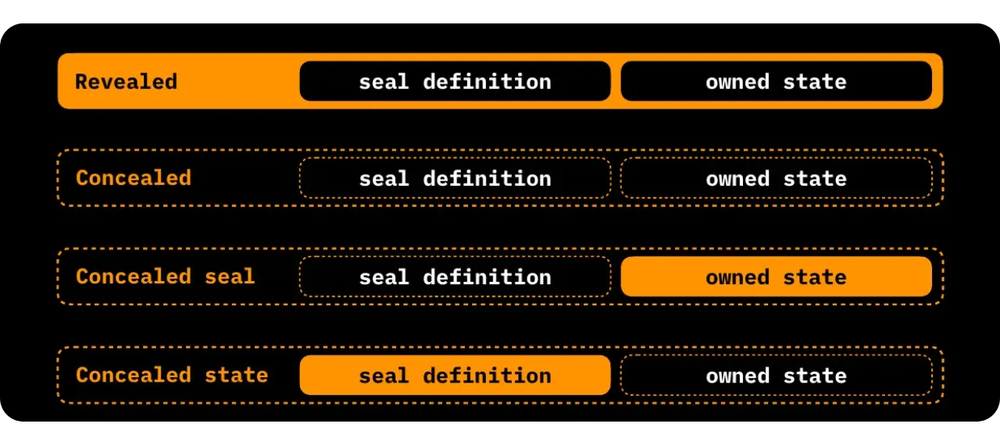


#### Insiguro ya Serire


*Insiguro ya Serire*, mu buryo bwayo bwahishuriwe, ifise ivyicaro bine vy'ishimikiro: `txptr`, `vout`, `uguhuma` na `uburyo`:


- **txptr**: ibi ni ivyerekeye UTXO kuri Bitcoin:
    - Ku bijanye n’indege **Itanguriro rya Serire**, yerekana ata guca ku ruhande UTXO iriho (iyo ifatanye n’iyo Tanguriro);
    - Mu gihe c'**Igishushanyo c'iserire**, dushobora kugira:
        - `txid` yoroshe, iyo yerekana UTXO yihariye,
        - Canke `WitnessTx`, yerekana ikintu umuntu yishingirako: Serire yerekana igikorwa ubwaco. Ivyo birakenewe cane cane iyo ata UTXO yo hanze iriho, nk'akarorero mu gufungura umurongo wa Lightning, canke iyo uwuronka ata UTXO afise.
- **vout**: umubare w'isohoka ry'ibikorwa vyerekanywe na `txptr`. Itangazwa gusa ku gishushanyo gisanzwe Serire (si ku `IcabonaTx`);
- **blinding**: umubare w'ibintu 8 vy'ibanga, kugira ngo hakomezwe ibanga no kubuza gukoresha inguvu z'agahomerabunwa ku bijanye n'akaranga ka UTXO;
- **uburyo**: yerekana uburyo bwo gushingira intahe bukoreshwa (`Tapret` canke `Opret`).


Igishushanyo *cahishijwe* c'insiguro ya Serire ni SHA256 Hash (gifise ikimenyetso) c'uguhuza ivyo bibanza 4, gifise ikimenyetso kidasanzwe kuri RGB.


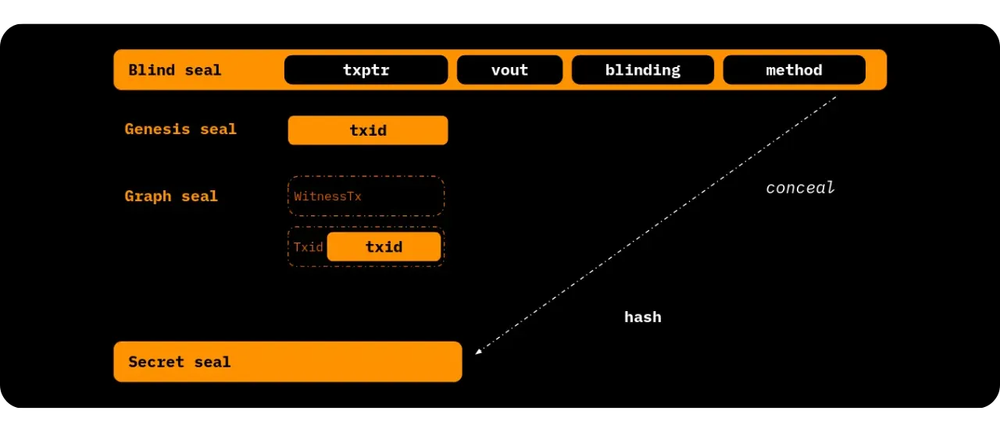


#### Uko bimeze bifashwe muminwe


Igice ca kabiri ca *Umwimenyerezo* n'uko bimeze biri muminwe y'uwundi. Udakunze Ukobimeze muri rusangi, ishobora kubaho mu buryo bwa bose canke bw’abantu ku giti cabo:


- **Uko bimeze bifashwe muminwe ya bose**: umuntu wese arazi amakuru ajanye na Serire. Nk'akarorero, ishusho y'abantu bose;
- **Ukobimeze bifashwe muminwe vy'abigenga**: amakuru aranyegezwa, amenyekana gusa na nyen'ayo makuru (kandi bishoboka ko ari uwuyashingira intahe iyo bikenewe). Nk'akarorero, igitigiri c'ibimenyetso bifise.


RGB isobanura ubwoko bune bw'intara bushoboka (*UbwokoBw'intara*) bw'uk bimeze bifashwe muminwe:


- **Itangazo**: nta makuru y'ibiharuro arimwo, uburenganzira bwo gutangaza gusa (nk'uburenganzira bwo gutora). Ivyo bihishijwe n'ivyo bihishuwe birasa;
- **Iyishibotra gusubirirwa**: igereranya igitigiri gshobora guhinduka (nk'ibimenyetso). Mu buryo bwahishuriwe, dufise `igiaruro` n'`uguhuma`. Mu buryo bwihishije, dufise *ukwiyemeza kwa Perdersen* imwe ihisha igitigiri n'uguhuma amaso;
- **Itunganijwe**: ibika amakuru atunganijwe (gushika kuri 64 kB). Mu buryo bwahishuriwe, mu biharuro blob. Mu buryo bwihishije, ni Hash y'iki gice:


```txt
SHA-256(SHA-256(tag_data) || SHA-256(tag_data) || blob)
```


Na, nk'akarorero:


```txt
tag_data = urn:lnp-bp:rgb:state-data#2024-02-12
```


- **Ivyashizweko**: bihuza dosiye (amajwi, ishusho, bibiri, n'ibindi) na Ibifiswe muminwe, bikabika dosiye Hash `file_hash`, ubwoko bwa MIME `ubwoko bw'amakuru` n'umunyu w'ibanga `umunyu`. Dosiye ubwayo iracumbikirwa ahandi. Mu buryo bwihishije, ni Hash ifise ikimenyetso c'ibintu bitatu bibanza:


```txt
SHA-256(SHA-256(tag_attachment) || SHA-256(tag_attachment) || file_hash || media_type || salt)
```


Na, nk'akarorero:


```txt
tag_attachment = urn:rgb:state-attach#2024-02-12
```


Mu ncamake, ng’ubu ubwoko 4 bushoboka bwa Leta mu buryo bwa bose no mu buryo bwihishije:


```txt
Uko bimeze                      Aho kwuzuza hanyegejwe                              Aho kwuzuza haboneka

+---------------------------------------------------------------------------------------------------------

+--------------------------------------------------------------------------------+
|                                                                                |
Ukwemanga        |                              < Ugugahakana >                                          |
|                                                                                |
+--------------------------------------------------------------------------------+

+---------------------------------------------------------------------------------------------------------

+--------------------------+             +---------------------------------------+
| +----------------------+ |             |         +--------+ +----------+       |
Ishobora guhinduka           | | Ukwiyemeza kwa Pedersen | | <========== |         | Igitigiri | | Umuvuduko |       |
| +----------------------+ |             |         +--------+ +----------+       |
+--------------------------+             +---------------------------------------+

+---------------------------------------------------------------------------------------------------------

+--------------------------+             +---------------------------------------+
| +----------------------+ |             |         +--------------------+        |
Inyubako         | |     Hash yahiswemwo     | | <========== |         |     amakuru ya Blob      |        |
| +----------------------+ |             |         +--------------------+        |
+--------------------------+             +---------------------------------------+

+---------------------------------------------------------------------------------------------------------

+--------------------------+             +---------------------------------------+
| +----------------------+ |             | +-----------+ +------------+ +------+ |
Ibifadikanije        | |     Hash yahiswemwo      | | <========== | | dokima ya Hash | | Uboko bw'ikinyamakuru | | Akabirya | |
| +----------------------+ |             | +-----------+ +------------+ +------+ |

+--------------------------+             +---------------------------------------+

```


| **Ikintu**     | **Ukwemanga** | **Ishobora guhinduka**                      | **Inyubako**       | **Iyifadikanijwe**        |
| --------------- | --------------- | --------------------------------- | -------------------- | ---------------------- |
| **Ibiharuro**        | ntanimwe            | Iyateweko umukono or Iyitateweko umukono 64-bit integer | Ubwoko bw'ibiharuro ivyarivyo vyose | Dokima yariyo yose              |
| **Ubwoko bw'amakuru**   | Oya           | Bwateweko umukono canke butateweko umukono                | Ubwoko bumeze uko         | MIME Type              |
| **Ibanga**     | Ntikenewe    | Pedersen commitment               | Hash with blinding   | Hashed file identifier |
| **Urugero rw;'uko ingana** | N/A             | Ama bytes 256                         | Gushika kuri 64 KB          | Gushika kuri ~500 GB          |


### Injiza


Ibija mu *Bikorwa vy'amasezerano* vyerekeye *Ibikorwa* biriko birakoreshwa muri iki gikorwa gishasha. Injiza yerekana:


- `prevOpId`: ikimenyetso (`OpId`) c'igikorwa c'imbere aho *Umwimenyerezo* yari;
- `UbwokoBw'Igikorwa`: ubwoko bwa *Umwimenyerezpo* (nk'akarorero, `Nyitungo` ku token);
- `Index`: urutonde rw' *Umwimenyerezo* ruri ku rutonde rujanye n'i `OpId` y'imbere, rugenwa inyuma y'ugutoranya kw'inkoranyabumenyi kw'ibimenyetso vyihishijwe.


Ivyinjira ntivyigera biboneka mw'itanguriro, kuko ata Mirimo y’imbere iriho. Eka mbere ntiziboneka mu Vyagutse vy'uko bimeze (kuko Ivyagutse vy'uko bimeze bitafunga ibimenyetso; ahubwo, bisubira gusobanura ibimenyetso bishasha bishingiye ku Valencies).


Iyo dufise Uko bimeze bifashwe muminwe  z’ubwoko `Bushobora guhinduka`, ubuhinga bwo kwemeza (biciye mu nyandiko ya AluVM itangwa mugicapo) burasuzuma ukuntu imibare ihuye: umubare w’ibimenyetso vyinjira (*Ivyinjizwa*) utegerezwa kuba ungana n’umubare w’ibimenyetso bisohoka (mu *As* nshasha).


### Amakuru


**Ubwoko bw'amakuru y'biharuro** Murubuga ishobora gushika kuri 64 KiB kandi ikoreshwa mu gushiramwo amakuru y'igihe gito ngirakamaro mu kwemeza, ariko ntashizwe mu gihe c'ubudasiba c'amasezerano Nk'akarorero, ibihinduka vy'imibare yo hagati y'inyandiko zikomeye birashobora kubikwa hano. Ico kibanza ntikigenewe kubikwa mu mateka y'isi yose, ni co gituma kiri hanze y'ububasha bw'Ibihugu vy'Igihugu canke Uko bimeze muri rusangi.


### Ivyiza


**Ivyiyumviro** ni uburyo bw'umwimerere bw'amasezerano ya RGB. Bishobora gusangwa mw'itanguriro, Impinduka z'iko bimeze canke Impinduka z'iko biri. Bigereranya uburenganzira bw’imibare bushobora gukoreshwa na Iyongengwa ry'uko imeze (biciye muri *Redeems*), hanyuma bikarangizwa n’Impinduka ikurikira. Buri Valency imenyekana n'`UbwokoBw'Uburemere` (ibice 16). Insobanuro yayo (uburenganzira bwo gusubira gusohora, guhindura token, uburenganzira bwo guturira, n'ibindi) zisobanurwa murico gicapo.


Mu majambo nyayo, twoshobora kwiyumvira Itanguriro isobanura "uburenganzira bwo gusubira gusohora" Valency. Ukwongerako ukobimeze izoyirya (*Redeem*) iyo hari ibintu bimwe bimwe bishitse, kugira ngo haboneke umubare mushasha w’ibimenyetso. Hanyuma, Uko bimeze vyongerwako iva ku wufise Serire yaremwe gutyo irashobora kwimurira ivyo bimenyetso bishasha.


### Gucungura


Ivyo gucungura ni Valency bingana n’Ivyinjira mu bikorwa. Biboneka gusa mu Vyagutse vy'uko bimeze, kuko ni ho Valency yari yarasobanuwe mbere ikoreshwa. Redeem igizwe n’ibice bibiri:


- `PrevOpId`: `OpId` y'igikorwa aho Valency yari yaravuzwe;
- `UbwokoBw'Ubushobozi`: ubwoko bwa Valency wipfuza gukoresha (buri `UbwokoBw'Ubushobozi` bushobora gukoreshwa rimwe gusa na Uko bimeze ivyongerwako).


Akarorero: Redeem ishobora guhura n'ugushirwa mu ngiro kwa CoinSwap, bivanye n'ivyo vyari vyashizwe muri Valency.


### Ibiranga ikibanza ca RGB


Ubu tugiye kuraba ibiranga Uko bimeze vyinshi vy'ishimikiro muri RGB. Cane cane, turaza kuraba:


- **Uburyo bw’ubwoko bukomeye**, butegeka gutunganya amakuru mu buryo bubereye kandi bufise ubwoko;
- Akamaro ko gutandukanya **kwemeza** na **Ukuvyitirirwa**;
- Uburyo bwa **ugutera imbere kw'uguhurizako** muri RGB, burimwo ivyiyumviro vy'*ugutera imbere vyihuta* n'*ugusubira inyuma*.


Nk’uko bisanzwe, uzirikane ko ikintu cose gifitaniye isano n’ivy’uburenganzira bw'amasezerano cemezwa ku ruhande rw’umuguzi hakurikijwe amategeko y’uguhurizako ashizweho mu masezerano, kandi ko ishingiro ryayo ry’iherezo ry’ubuhinga bwa none rishingiye ku bikorwa vya Bitcoin.


#### Ubwoko bukomeye


RGB ikoresha *Ubwoko bukomeye* n'uburyo bwo gukurikirana (*Ugushiramwo amakode bikomeye*). Iryo shirahamwe ryagenewe gutuma amakuru y'amasezerano ashobora gusubirwamwo neza kandi akagira ukuri mu gusigura, agafita kandiakemeza amasezerano ashingiye kubiharuro.


Mu bice vyinshi v'ama porogaramu (JSON, YAML...), imiterere y’amakuru irashobora guhinduka, mbere n’ugushobora kwemera cane. Ku rundi ruhande, muri RGB, Imiterere y'uko urubuga bisigurwaamwo ibintu bigaragara. Nk'akarorero:


- Ihinduka ryose rifise ubwoko bwihariye (nk'akarorero, igiharuro c'ibice 8 udafise ikimenyetso `u8`, canke igiharuro c'ibice 16 gifise ikimenyetso, n'ibindi);
- Ubwoko burashobora kugirwa (ubwoko bushizwemwo). Ibi bisigura ko ushobora gusobanura ubwoko bushingiye ku bundi bwoko (nk'ubwoko bw'umugwi burimwo umwanya `u8`, umwanya `bool`, n'ibindi);
- Amakoraniro arashobora kandi gusigurwa atandukaniye: kurutonde (*urutonde*), kumirwi (*kumirwi*) canke kuri zikazinduzi (*indanga merekero*), n'urutonde rw'iterambere ry'ibintu;
- Buri rubuga urafise urubibi (*urubibi rwo hasi* / *urubibi rwo hejuru*). Turashiraho kandi imipaka ku mubare w’ibintu mu makoraniro (ugukingira);
- Amakuru ni byte ashizwe kumurongo kandi urutonde rurasobanuwe neza kandi atakwihenda kurimwo.


Bivuye kuri porotokole y'ugushiramwo ama kode:


- Urutonde rw’ibibanza rwama ari rumwe, tutitayeho ugushirwa mungiro canke ubuhinga bwa porogaramation bwakoreshejwe;
- Hash yaharuwe ku rutonde rumwe rero birashobora gusubirwamwo kandi birasa (*imihigo* y’ugushingira intahe);
- Imipaka ibuza iterambere ritagenzuwe mu bunini bw’amakuru (nk’akarorero, imbuga nyishi cane);
- Ubwo buryo bwo gushiramwo ama kode butuma hashoboka gusuzuma bikoresheje inyandiko zinyegeje, kuko umwe wese mu bari muri iyo nyigisho azi neza ingene yoshiramwo amakuru mu rutonde no gukora Hash.


Mu bikorwa, inyubako (*Igicapo*) n’ikode rivamwo (*Uruhande tubona twese* n’urukwirikirane bijanye) birashirwa hamwe. Ururimi rudondora rukoreshwa mu gusigira ano masezerano (ubwoko, urubuga, amategeko) rukazana kandi uburyo bukomeye bw’ibice bibiri. Iyo bishizwe hamwe, inyishu ni:


- *Ikibanza ca nyabwonko* kuri buri rubuga;
- Ivyerekana insiguro (vyerekana nimba guhindura izina ry’igihinduka bifise ingaruka ku nsiguro, naho nyene inyubako ya nyabwonko iguma iri kwakundi).


Uburyo bw’ubwoko bukomeye kandi burashoboza gukurikirana neza amahinduka: uguhindura kwose kw’uko imeze (naho iba impinduka kugice c'izina ) kuramenyekana kandi gushobora gutuma haba uguhinduka kw’ikirenge cose.


Ubwa nyuma, ihuriro ryose ritanga ikimenyetso c’urutoke, ikimenyetso c’ibanga gishingira intahe kuburyo nyabwo y’iyo kode (amakuru, amategeko, ukwemeza). Akarorero, ikimenyetso c'aho kwuzuza:


```txt
BEiLYE-am9WhTW1-oK8cpvw4-FEMtzMrf-mKocuGZn-qWK6YF#ginger-parking-nirvana
```


Ivyo bituma bishoboka gucunga ivyagezwe vy’uguhurizako canke ivy’ugushirwa mu ngiro, mu gihe bishoboka ko umuntu ashobora gukurikirana mu buryo burambuye amaverisiyo akoreshwa mu rubuga.


Mukwirindako amasezerano ya RGB kugirango  ntagore cane ku ruhande rw’umuguzi, amategeko y'ibihano aratanga urugero ntarengwako mukuja musi ari `2^16` bytes (64 Kio) ku makuru yose ari mu biharuro vy’ukwemeza. Bino bikoreshwa kuri buri biharuro canke inyubako: ntibirenze ama bytes 65536, canke ivyo bingana mubiharuro (32768 16-bit integers, n’ibindi). Ivyo birakoreshwa kandi kwishirwa hamwe (urutonde, imigwi, indanga merekero), bidashobora kurenga imice `2^16`.


Iyi nzira iremeza:


- Igenzura ubunini butarengwako ubw’amakuru azokoreshwa mu gihe c'uko ihinduka rimeze;
- Uguhuza n'imashini y'ikorera kuri ngurkana bumenyi (*AluVM*) ikoreshwa mu gukoresha inyandiko zo kwemeza.


#### Ivyemezo != Ingendo ngenderwako z'ugutunga ibintu


Kimwe mu bintu bikomeye RGB yakoze ni ugutandukanya cane ivyiyumviro bibiri:


- **Kwemeza**: gusuzuma uko impinduka imeze bikwirikiza mategeko y;amasezerano (Uko ishoramari rimeze, kahise, n'ibindi);
- **Ukwitirirwa ibintu** (Ukwitirirwa ibintu, canke ubugenzuzi): ukuri ko umuntu afise Bitcoin UTXO ishobora gutuma Uwukoresa Serire ikoreshwa rimwe ikoreshwa (canke igafungwa), gutyo uko ihinduka rimeze rigafata ikibanza.


**Ukwemeza** bibera ku rugero rw'ikirundo ca nyabwonko zirikuri RGB (Ububiko bw'inyandiko, *amasezerano*, n'ibindi). Uruhara rwayo ni ugutuma amategeko y'indani mu masezerano (Igitigiri, uruhusha n’ibindi) yubahirizwa. Abarorerezi canke abandi bari muri iyo nama na bo nyene barashobora kwemeza kahise k'inyandiko.


**Ukwitirirwa ikintu**, ku rundi ruhande, yizigiye gusa umutekano wa Bitcoin. Kugira urufunguzo rw’ibanga rwa UTXO bisigura kugenzura ubushobozi bwo gutanguza ihinduka rishasha (kwugara Serire ikoreshwa rimwe). Rero, naho umuntu yoshobora kubona canke kwemeza amakuru, ntashobora guhindura Leta iyo atagira UTXO ireba.


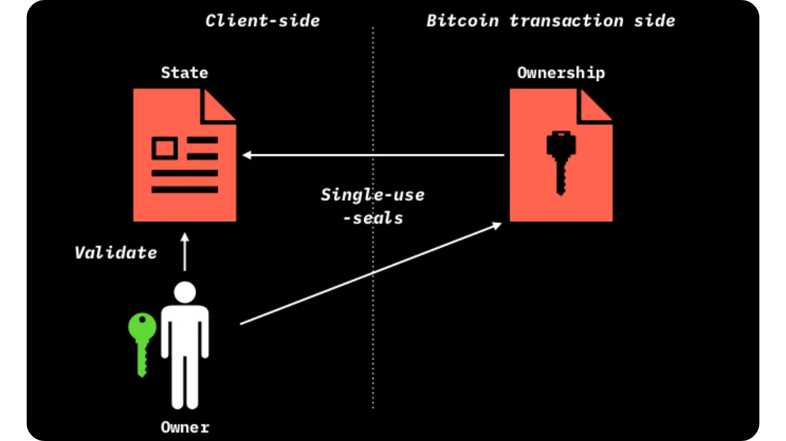


buno buryo buragabanya ubukomezi buke buhura muri Blockchain zigoye (aho amakode yose ya Smart contract ari kukarunda kandi agashobora guhindurwa na burimuntu, ibitumwa rimwe narimwe vyerekeza kukwibwa). Ku RGB, uwutera ntashobora gusa gukorana nuko On-chain imeze, kuko uburenganzira bwo gukora kuri Leta (*Ukwitirirwa ikintu*) burindwa na Layer ya Bitcoin.


Iciyongerako ni, uku gutandukanya bituma RGB ishobora kwifatanya na Lightning Network. Imirongo y’umuravyo ishobora gukoreshwa mu gukorana no kwimurira ivy’ubutunzi vya RGB ata gukorana n’*imihigo* ya On-Chain igihe cose. Tuzokwihweza neza uku gushiramwo RGB ku Muravyo mubigabane bizokurikira vy’icigwa.


#### Iterambere ry'uko bigenda muri RGB


Uretse guhindura kode y’insiguro, RGB irimwo uburyo bwo guhindura canke guhindura amategeko y’uguhurizako ya Contract uko igihe kigenda kirarenga. Hari uburyo bubiri nyamukuru bw'iterambere:


- **Gutera imbere**
- **Gusubira inyuma**


Ugutera imbere bituma iyo itegeko ryari ritagira akamaro mbere rigira akamaro. Nk'akarorero, iyo rino Sezerano rihinduka kugira ngo yemere ubwoko bushasha bw' `Ubwoko bw'imyimenyerezo` canke umwanya mushasha:


- Ivyo ntibishobora kugereranywa n’ivyuma bikomeye vya kera vya Blockchain, kuko RGB ikora kuruhande rw'ukwemeza rw'umuguzi kandi ntigira ico ikoze ku bijanye n’uguhuza muri rusangi kwa Blockchain;
- Mubikorwa, ubwo bwoko bw’ihinduka bugaragazwa n’umwanya `Ffv` (*verisiyo y’imbere yihuta*) kurubuga rw'ibikorwa vy'amasezerano;
- Abafise ubu ntibagirirwa nabi: ikibanza cabo kiguma cemewe;
- Abaronse vuba(Canke abasigaye bakoresha), mukindi gice, bakeneye gushira kugihe inyabwonko zabo(Ingodo zabo) kugirango bamenye amategeko mashasha.


Gusubira inyuma bisigura ko itegeko ryari rifise akamaro mbere rihinduka ubusa. Ni rero "ugukomantaza" amategeko, ariko si mu kuvuga ataco twishimikije:


- Abafise ivy’ubutunzi bariho bashobora gushikirwa n’ingorane (boshobora kwisanga bafise ivy’ubutunzi vyahinduwe bitagira akamaro canke bitagira akamaro muri verisiyo nshasha);
- Turashobora kubona ko mu vy’ukuri turiko turarema umurongo mushasha: uwuzokwemera itegeko rishasha aca ava ku rya kera;
- Uwutanga ashobora gufata ingingo yo gusubira gutanga itunga muri iyo porotokole nshasha, agahatira abakoresha kuguma bafise ingodo abiri atandukanye (imwe y’iporotokole ya kera, iyindi y’iyindi nshasha), nimba bashaka gucunga ubwo bwoko bwose.


Muri iki gice kivuga ku bikorwa vy'amasezerano ya RGB, twasuzumye ingingo ngenderwako z’ishimikiro zishingiye kuri iyi porotokole. Nk’uko muzoba mwabibonye, ​​ukuntu umurongo wa RGB ugoranye cane bisaba ko hakoreshwa amajambo menshi y’ubuhinga. Rero, mu kigabane gikurikira, nzobaha urutonde rw'amajambo ruzoca irya n'ino ivyiyumviro vyose bivugwa muri iki gice ca mbere c'inyigisho, n'insobanuro z'amajambo yose y'ubuhinga yerekeye RGB. Hanyuma, mu gice gikurikira, tuzokwihweza mu buryo ngirakamaro insobanuro n’ugushirwa mu ngiro kw’amasezerano ya RGB.


## RGB Insobanuro y'amajambo


<chapterId>545e16a4-3cca-44a3-9fd5-dbc5868abf97</chapterId>


Nimba ukeneye kugaruka muri uru rutonde rugufi rw’amajambo y’ubuhinga ahambaye akoreshwa mw’isi ya RGB (yashizwe ku rutonde rw’indome), uzosanga ari ngirakamaro. Iki gice si ngombwa nimba umaze gutahura ivyo twavuze vyose mu gice ca mbere.


#### AluVM


Indome ngufi AluVM ihagarariye "_Imashini y'ubuhinga bwa none_", imashini y'ubuhinga bwa none ishingiye ku nzira y'ubuhinga bwa none yagenewe kwemeza Smart contract no gukoresha ubuhinga bwa none. Ikoreshwa (ariko ntiyihariye gusa) mu kwemeza amasezerano ya RGB. Ivyanditswe canke ibikorwa biri mu masezerano ya RGB birashobora rero gukorwa mu bidukikije vya AluVM.


Ushaka kumenya vyinshi: [Urubuga rwemewe rwa AluVM]


#### Aho bishingiye


Aho bishingiye hagereranya urutonde rw'amakuru y'uruhande rw'umuguzi akoreshwa mu kwemeza ko hariho _ukwiyemeza_ kwihariye mu gucuruza. Mu masezerano ya RGB, Aho bishingiye hagizwe nibi bikwirikira:


- Igiharuro c’ibikorwa vy’ubudandaji (txid) c’i **Ihanahanwa ry'icabona**;
- Ivyo **Multi Protocol Commitment (MPC)**;
- Ivyo **Igitabu-1058 (DBC)**;
- **Extra Transaction Proof  (ETP)** iyo uburyo bwa **Tapret** Ubuhinga bw'ukwiyemeza burakoreshwa (raba igice kigenewe iki kigereranyo).


Aho bishingiye rero hakoreshwa mu gushinga isano rishobora kugenzurwa hagati y’ugucuruza kwihariye kwa Bitcoin n’amakuru y’ibanga yemejwe n’amasezerano ya RGB. Biremeza ko ayo makuru ari muri Blockchain vy’ukuri, ata vyo arimwo vy’ukuri bimenyeshwa abantu bose.


#### Umwimenyerezo


Mu nzira ya RGB, Umwimenyerezo ni nk'inyishu y'ibikorwa bihindura, bihindura canke bikora ibintu bimwe bimwe mu gihe c'amasezerano. Igikoresho c'umwimenyerezo gifise ama ibintu bibiri :


- **Insiguro ya serire** (ivyerekeye UTXO yihariye);
- **Uko bimeze ibiri muminwe y'umuntu** (amakuru asigura uko bimeze arikumwe n'umuntu ayifise).


Umwimenyerezo rero werekana uko igice kimeze (nk’akarorero, umutungo) aha ushirwa kuwundi muntuubu gihabwa uwufise, kimenyekana biciye kuri serire ikoreshwa rimwe na UTXO.


#### Uko ishoramari rimeze


Ishora mari uko rimeze rihuriza hamwe amategeko yose n’imikorere yo mu mutima y'amasezerano, idondorwa n' **Ibicapo** yayo (ni ukuvuga uko amasezerano ameze ). Irategeka ingene igihugu c'amasezerano gishobora guhinduka, kandi mu bihe ibihe.


#### Uruhande rw'ukemeza rw'umuguzi


Uruhande rw'ukwemeza rw'umuguzi rwerekana uburyo buri ruhande (umukiriya) asuzuma urutonde rw’amakuru ahindurwa mu bwiherero, hakurikijwe amategeko y’amasezerano. Ku bijanye na RGB, ayo makuru yahinduwe ashirwa hamwe mu vyo bita **ibirungikwa**. Udakunze umurongo wa Bitcoin, usaba ko amafaranga yose akoreshwa atangazwa kuri On-Chain, RGB yemera gusa _imigambi_ (ishingiye kuri Bitcoin) kubikwa mu ruhame, mu gihe amakuru y'ingenzi y'amasezerano asigaye hagati ya On-Chain, ibimenyamenya gusa) ivyerekeye.


#### Ukwiyemeza


Ukwiyemeza (mu buryo bw'ibanga) ni ikintu c'ibiharuro, kigaragazwa na `C`, kiva ku gikorwa ku makuru atunganijwe `m` (ubutumwa) n'agaciro k'imburakimazi `r`. Twandika:


$$
C = \text{commit}(m, r)
$$


Ubu buryo bugizwe n'ibikorwa bibiri nyamukuru:


- **kwemeza**: igikorwa c'ibanga gikoreshwa ku butumwa `m` n'umubare w'imburakimazi `r` kugira ngo uvemwo `C`;
- **Gusuzuma**: dukoresha `C`, ubutumwa `m` n'agaciro ka `r` kugira ngo tugenzure ko iyi Ukwiyemeza ari ukuri. Igikorwa kigarura `Ukuri` canke `Ikinyoma`.


Ukwiyemeza gutegerezwa itegerezwa kwubahiriza ibintu bibiri:


- **Binding**: bitegerezwa kuba bidashoboka kuronka ubutumwa bubiri butandukanye butanga `C` imwe:


$$
m': \, | \,: m' \neq m \quad \text{and} \quad r': \, | \,: r' \neq r \quad
$$


Nka nka:


$$
\text{verify}(m, r, C) = \text{verify}(m', r', C) \rightarrow \text{True}
$$


- **Hiding**: ubumenyi bwa `C` ntibutegerezwa guhishura ibirimwo muri `m`.


Mu masezerano ya RGB, Ukwiyemeza ishirwa mu gikorwa ca Bitcoin kugira ngo yerekane ko hari amakuru kanaka ariho mu gihe kinaka, ata makuru ubwayo ahishuriwe.


#### Consignment


A **Consignment** ihuriza hamwe amakuru yashikirijwe hagati y'ababuranyi, hakurikijwe Ukwemeza kuruhande rw'umuguzi muri RGB. Hariho ivyiciro bibiri nyamukuru vya Consignment:


- **Amasezerano ya Consignment**: itangwa n'uwutanga (uwatanga Amasezerano), irimwo amakuru y'intango nka Igicapo, Itanguriro, Ahabneka hamwe n'ahaboneka hashirwa mungiro.
- **Kwimurira Consignment**: bitangwa n'uwuriha (*uwuriha*). Irimwo amateka yose y'impinduka za Leta zishikana aho Consignmentiherera (ni ukuvuga Uko bimeze ubwanyuma yaronse n'uwuyitanga).


Ivyo bintu birungitswe ntivyandikwa ku mugaragaro ku rupapuro rwa Blockchain; birahanahana ata guca ku ruhande hagati y’ababijejwe biciye ku nzira y’itumanaho bahisemwo.


#### Amasezerano


Amasezerano ni urutonde rw’uburenganzira bushirwa mu ngiro mu buryo bwa digitale hagati y’abakozi benshi biciye ku masezerano ya RGB. Ifise igihugu gikora na Uko ishoramario rimeze, isobanurwa y'igicapo, igaragaza ibikorwa vyemewe (uguhindura, kwongera, n’ibindi). Ivy'amasezerano imeze, hamwe n'amategeko agenga ukuri kwayo, bivugwa mugicapo. Igihe cose, Amasezerano iratera imbere gusa bivanye n’ivyo vyemewe n’ico gicapo be n’inyandiko zo kwemeza (Ukwiruka, nk’akarorero, muri AluVM).


#### Ibikorwa vy'amasezerano


Ibikorwa vy'amasezerano ni uguhindura uko amasezerano ameze gukorwa hakurikijwe amategeko y'igicapo. Ibikorwa bikurikira biri muri RGB:


- 1117;
- 1118;
- 1119.


Igikorwa kimwekimwe cose gihindura igihugu mu kwongerako canke gusubirira amakuru amwamwe (Uko bimeze muri rusangi, Uko bimeze bifiswe n'abantu...).


#### Amasezerano y'abahari


Amasezerano y'abatonze ni umukinyi agira uruhara mu bikorwa bijanye n'amasezerano. Muri RGB, hariho itandukaniro hagati ya:


- Uwutanga amasezerano, ari we arema Itanguriro (inkomoko y'Amasezerano);
- Abagize Amasezerano, ni ukuvuga abafise uburenganzira uko amasezerano ameze;
- Uko imice imeze, ashobora kwubaka Ivyumba vy'uko amasezerano ameze itanga Ivyumba vy’Igihugu bishobora gushikirwa na bose.


#### Uburenganzira bw'amsezerano


Uburenganzira bw'amasezerano yerekeza ku burenganzira butandukanye bushobora gukoreshwa n’abafise uruhara muma sezerano ya RGB. Bica mu mice myinshi:


- Uburenganzira bw'**Ukwitirirwa ibintu**, bujanye n'uburenganzira bw'ukwitirirwa ibintu bwa UTXO kanaka (biciye mu _Nsobanuro y'Ikidodo_);
- Uburenganzira bw'ubutegetsi, ni ukuvuga ubushobozi bwo kwubaka inzira imwe canke nyinshi (Uko inzira zimeze) hakurikijwe Igicapo;
- **Uburenganzira bwa bose**, iyo Igicapo cemera gukoresha ibintu bimwe bimwe vya bose, nk'akarorero kurema uvyongerwa kuko bimeze biciye mu gucungura Valency.


#### Uko amasezerano ameze


Uko amasezerano amaze ihuye n’ingene amasezerano ari ubu mu gihe kanaka. Ishobora kuba igizwe n'amakuru ya bose n'ay'abikorera ku giti cabo, yerekana uko Amasezerano ameze. RGB itandukanya:


- **Uko bimeze murirusangi**, irimwo ivy’abantu bose vy'amasezerano (vyashizweho mw'itanguriro canke vyongeweko biciye mu guhindura vyemewe);
- Uko bimeze bifise uburenganzira, ari vyo vy'abafise uburenganzira bwihariye, bimenyekana n'ama UTXO yabo.


#### Deterministic Bitcoin Commitment - DBC


Deterministic Bitcoin Commitment (DBC) ni urutonde rw'amategeko akoreshwa mu kwandika mu buryo bugaragara kandi budasanzwe _ukwiyemeza_ mu gucuruza Bitcoin. Mu masezerano ya RGB, hari uburyo bubiri nyamukuru bwa DBC:


- **Opret**
- **Tapret**


Ubu buryo burasobanura neza ingene _ukwiyemeza_ gushirwa mu gisohoka canke mu mibumbe y'isoko rya Bitcoin, kugira ngo bimenyekane ko uko kwiyemeza gushobora gukurikiranywa no kugenzurwa.


#### Directed Acyclic Graph - DAG


DAG (canke *Acyclic Guided Graph*) ni igishushanyo kitagira umuzingi, gishoboza gutegura urutonde rw'ibintu. Ivyuma vy’amabara, nk’ibice _vy’amasezerano ya RGB, bishobora guserukirwa n’ama DAG.


Mushaka amakuru yimbitse : [Directed Acyclic Graph](Igishushanyo_c'Igishushanyo_C'Igishushanyo_C'Igishushanyo)


#### Gucapura


Gucapura ni urudodo rw’amakuru rwo guhitamwo abafise Amasezerano bakurikirana bashobora kwinjira muri kahise k'amasezerano. Ico kintu kiriho, nk’akarorero, muri **RGB21** Ahaboneka kandi kiratuma amakuru y’icibutso canke y’insobanuro yongerwa kuri kahise k'amasezerano.


#### Ikimenyamenya c'ibikorwa vy'inyongera - ETP


ETP (*Extra Transaction Proof*) ni igice c'aho bashimikira harimwo amakuru y'inyongera asabwa kugira ngo umuntu yemeze **Tapret** *ukwiyemeza* (mu bijanye na _taproot_). Harimwo, mu bindi, urufunguzo rwa bose rw'imbere rw'inyandiko ya Taproot (_internal PubKey_) n'amakuru yihariye ku _Inzira y'inyandiko zarungitswe_.


#### Itanguriro


Itanguriro ryerekana ku rutonde rw'amakuru, ayoborwa n'igicapo, igize igihugu c'intango c'amasezerano iyo ari yo yose muri RGB. Bishobora kugereranywa n’iciyumviro ca Bitcoin ca _Genesis Block_, canke n’iciyumviro c'ihanahanwa rya Coinbase, ariko hano ku rugero rwa _uruhande rw’umugzi_ n’urwa Token rya RGB.


#### Uko bimeze muri rusangi


Uko buimeze muri rusangi ni urutonde rw'ibintu vya bose biri mu masezerano y'uko bimeze. Isobanurwa kw'itanguriro kandi, bivanye n’amategeko y'amasezerano, ishobora guhindurwa n’ihinduka ryemewe. Mu buryo butandukanye n’Ibihugu Bifise Ububasha, Ukobimeze muri rusangi ntabwo ari iy’ikigo kinaka; ni hafi cane y’inyandiko ya bose iri mumasezerano.


#### Ahakorerwa


Ahakorerwa ni urutonde rw'amabwirizwa akoreshwa mu gusobanura amakuru abiri akoranijwe mugicapo canke mu bikorwa vy'amasezerano n'imibereho yayo, kugira ngo ashobore gusomwa n'uwukoresha canke ingodo yiwe. Ikora nk'insobanuro Layer.


#### Aho gukorera mugushira mungiro


Aho gukorera mugushira mungiro ni umugwi w'amatangazo ahuza **Ahakorerwa** n' **Igicapo**. Bishoboza ubuhinduzi bw’insobanuro bukorwa n'ahakorerwa ubwayo, kugira ngo amakuru atagiramwo ivyatsi yo mumasezerano ashobore gutahurwa n’uwukoresha canke porogarama irimwo (amasakoshi).


#### Fagitire


Fagitire ifata uburyo bwa URL ishizwe muri [base58](https://ru.wikipedia.org/wiki/Binary-to-text encoding#Base58), ikaba ishiramwo amakuru akenewe kugira ngo umuntu yubake **Uko yahindutse** (n’uwuyitanga). Mu yandi majambo, ni Invoice ishoboza uwundi (*uwuriha*) gukora ihinduka rihuye n'iryo kugira ngo yimure umutungo canke avugurure uko amasezerano ameze.


#### Lightning Network


Lightning Network ni urubuga rwigenga rw’imihora yo kuriha  (canke _imihora y'uko bimeze_) kuri Bitcoin, rugizwe n’ibipapuro 2/2 vy’imikono myinshi. Bishoboza gukora amafaranga yihuta, ataco atwara _inyuma y’uruzitiro_, mu gihe yizigira Layer 1 ya Bitcoin ku bijanye n’ubukemurampaka (canke gufunga) iyo bikenewe.


Kugira ngo umenye vyinshi ku buryo Lightning ikora, ndagusavye ukwirikirane kino cigwa:


https://planb.academy/courses/34bd43ef-6683-4a5c-b239-7cb1e40a4aeb

#### Multi Protocol Commitment - MPC


Multi Protocol Commitment (MPC) yerekeza uko igiti ca Merkle kimeze uko gikoreshwa muri RGB kugira ngo ishiremwo, mu gikorwa kimwe ca Bitcoin, **Imigwi y’Impinduka** myinshi iva mu masezerano atandukanye. Iciyumviro ni ugushira hamwe amasezerano menshi (ashobora guhura n’amasezerano atandukanye canke itunga ritandukanye) mu ntumbero imwe y'aho bishingiye kugira ngo umuntu ashobore gukoresha neza ikibanza c’amabuye.


#### Ibifashwe mumaboko


Ibifashwe mumaboko ni igice c'Uko amasezerano ameze gipfutse mumyimenyerezo kandi gifitaniye isano n’umuntu yihariye afise (biciye kuri Serire ikoreshwa rimwe yerekana UTXO). Ivyo bigereranya nk’akarorero umutungo wo kuri interineti canke uburenganzira bumwe bumwe bw’amasezerano uwo muntu yahawe.


#### Ukwitirirwa ikintu


Ukwitirirwa ikintu cerekana ku bushobozi bwo kugenzura no gukoresha UTXO yerekanwa n'Insiguro ya serire. Iyo Ibifashwe muminwe gufatanye na UTXO, nyen'iyo UTXO arafise uburenganzira, bishoboka, bwo kwimurira canke guhindura igihugu gifatanye, hakurikijwe amategeko y'amasezerano.


#### Partially Signed Bitcoin Transaction - PSBT


PSBT (_Igice ca Bitcoin gishizweko umukono_) ni igitabu ca Bitcoin kitarashirwako umukono ku buryo bwemewe. Ishobora gusangizwa hagati y’ibigo vyinshi, kimwe cose kikaba gishobora kwongerako canke kugenzura Ibintu zimwe zimwe (imikono, inyandiko...), gushika iyo nzira y’ugucuruza ibonwa ko yiteguriye gukwiragizwa On-Chain.


Ku bindi bisobanuro: [BIP-0174](BIP-0174.mediawiki)


#### Ukwiyeza kwa Pedersen


Ukwiyemeza kwa Pedersen ni ubwoko bw'ibara ry'ibanga ry'Ukwiyemeza rifise akamaro ko kuba **homomorphic** ku bijanye n'igikorwa co kwongerako. Ivyo bisigura ko bishoboka kwemeza igitigri w’imihigo ibiri ata guhishura agaciro k’umuntu ku giti ciwe.


Mu buryo busanzwe, nimba:


$$
C1=\text{commit}(m1,r1) \quad C2=\text{commit}(m2,r2)
$$


none:


$$
C3=C1⋅C2=\text{commit}(m1+m2, r1+r2)
$$


Iyi nzira ni ngirakamaro, nk'akarorero, mu guhisha amafaranga y'ibimenyetso vyahinduwe, mu gihe ushobora kugenzura igitigiri cose.


Ibindi bisobanuro: [Pedersen commitment](igice ca 10.1007/3-540-46766-1_9)


#### Uguhindura


Muvyongeweko, Uguhindura yerekeza ku gikorwa co gusubira gusaba (canke gukoresha nabi) **Valency** yari yatangajwe mbere. Kubera ko Valency ari uburenganzira bwa bose, Muvyongeweko iremeza uwufise uburenganzira bwo gusaba amasezerano y'ukwongerwako  yihariye.


#### Igicapo


Igicapo muri RGB ni igice c'itangazo ry'itegeko ridondora urutonde rw'ibihinduka, amategeko n'uko ishoramari rimeze (*Uko ishoramari rimeze*) bigenzura ibikorwa vy'amasezerano. Igicapo isoba gisigura uko bimeze, ubwoko bw’ihinduka ryemewe n’ivyo kwemeza.


#### Insiguro ya Serire


Insiguro ya Serire ni igice c'amasezerano gifatanya _ukwiyemeza_ na UTXO y'uwuyifise mushasha. Mu yandi majambo, yerekana aho ivyangombwa biri (aho UTXO iri), kandi igashinga n'ibifiswe n'abantu y’umutungo canke uburenganzira.


#### Shard


Shard igereranya ishami muri DAG y'amateka y'Impinduka z'uko amasezerano ya RGB ameze. Mu yandi majambo, ni igice gihuye cakahise yose kumasezerano, gihuye, nk'akarorero, n'urutonde rw'ibintu bisabwa kugira ngo umuntu yerekane ko umutungo kanaka ufise ukuri kuva mu _Itanguriro_.


#### Serire ikoreshwa rimwe


Serire ikoreshwa rimwe ni ubuhinga bw’ibanga bw'ukwiyemeza ku butumwa butaramenyekana, buzoshirirwa ahabona rimwe gusa muri kazoza kandi butegerezwa kumenyekana n’abagize umuryango w’abantu bose. Intumbero ni ukubuza gushinga amasezerano menshi y'uguhiganwa kuri Serire imwe.


#### Stash


Stash ni urutonde rw’amakuru y’uruhande rw’umuguzi, umukoresha abika ku masezerano imwe canke menshi ya RGB, kugira ngo yemezwe (*Kuruhande rw'ukwemeza rw'umuguzi*). Ivyo birimwo amateka y’ihinduka, ivy’ugurungika, ibimenyamenya vy’ukuri, n’ibindi.Umuntu wese afise aguma afise gusa ibice vyakahise akeneye (*shards*).


#### Uko ivyiyongerako bimeze


Uko vyongerwako bimeze n'ibikorwa vy'amasezerano akoreshwa mu gusubira gutera ivyagezwe vy'uko gucungura bimeze **Ivy'agaciro** vyamenyeshejwe mbere. Kugira ngo uko ivyongerwako bimeze, itegerezwa rero gupfungwa na ivyiyongerako bimeze (ihindura uko amasezerano ameze ).


#### Uko impinduka imeze


Uko impinduka imeze ni igikorwa gihindura ikibanza c'amasezerano ya RGB kikaja mu kibanza gishasha. Ishobora guhindura amakuru ya Uko imeze muri rusangi na/canke ibifashwemuminwe. Mu bikorwa, uguhinduka kwose kugenzurwa n'amategeko y'igicapo kandi gushirwa muri Blockchain ya Bitcoin biciye ku _ukwiyemeza_.


#### Taproot


Ivuga ku buryo bwo gukoresha Bitcoin bwa SegWit v1, bwashizweho na [BIP341] [BIP342](Ubuhinga bwo gusoma amakuru). Taproot itera imbere ibanga n’uguhinduranya inyandiko, cane cane mu gutuma amafaranga akoreshwa akora neza kandi akagora gutandukanya n’ayandi.


#### Icerekana aho bigarukira - Aho bigarukira vyose


Aho bigarukira vyose (canke _Iherezo ry’Ibirungikwa_) ni *Aho bigarukira vyose* irimwo ivy’iherezo vy'amasezerano, harimwo n'uko bihinduka yaremwe ivuye kuri Fagitire y’uwuyironka (*uwuhembwa*). Ni co rero gisozera ukwimurirwa, harimwo amakuru akenewe kugira ngo yerekane Ukwitirirwa ibintu canke uko bimeze yimuriwe.


#### Umutekero w'impinduka


Umutekerao w'imoinduka ni umugwi w'Impinduka za Leta (ziri muri mumasezerano amwe) zose zikora ***Ivyabna y'ihanahanwa*** Bitcoin imwe. Ivyo bituma bishoboka gukoranya ibintu vyinshi bishasha canke kwimurirwa muri On-Chain Anchor imwe.


#### UTXO


Bitcoin UTXO (*Igisubizo c’Ibikorwa Bitakoreshejwe*) isobanurwa na Hash y’ibikorwa n’urutonde rw’ibikorwa (*vout*). Rimwe na rimwe ryitwa kandi _isonga_. Mu masezerano ya RGB, kwerekeza kuri UTXO (biciye kuri **Insiguro ya Serire**) bishoboza aho **Uko bimeze ibifashwe muminwe** iri, ni ukuvuga umutungo ufise kuri Blockchain.


#### Valency


Valency ni uburenganzira bwa bose budasaba ububiko bw'uko bimeze nk'uko buri, ariko bushobora gucungurwa biciye k' **Ukwiyongera uko bimeze**. Ni uburyo rero bw’ubushobozi bufunguriye bose (canke abakinyi bamwebamwe), bumenyeshwa mu nzira y’ubwenge y'amasezerano, kugira ngo hakorwe ukwongerekana kw’igihe kinaka mu nyuma.


#### Icemeza c'ihanahanwa


Icemeza c'ihanahanwa ni igikorwa ca Bitcoin cugara Serire ikoreshwa rimwe gikikuje ubutumwa burimwo Multi Protocol Commitment (MPC). Ivyo bicuruzwa bikoresha UTXO canke bikabirema, kugira ngo Ukwiyemeza kwa Serire ihuye n’umurongo wa RGB. Ikora nk’ikimenyamenya ca On-Chain c’uko bimeze yashizweho mu gihe kinaka.


# Porogaramu kuri RGB


<partId>148a7436-d079-56d9-be08-aaa4c14c6b3a</partId>


## Gushira mu ngiro amasezerano ya RGB


<chapterId>8333ea5f-51c7-5dd5-b1d7-47d491e58e51</chapterId>


:::id ya videwo=97d81b85-5a82-40a5-b111-7d96be5afd0f:::


Muri iki gice, turaza kuraba neza ingene amasezerano ya RGB asigurwa kandi igashirwa mu ngiro. Turabona ibice bigize amasezerano ya RGB ni ibiki, uruhara rwavyo n’ingene vyubatswe.


### Ibice bigize amasezerano ya RGB


Kugeza ubu, twamaze kuvuga ku **Ntangamarara**, igereranya intango y'amasezerano, kandi twabonye ingene ihuye n'ubwenge bwa *Ibikorwa vy'amasezerano* n'ingene porotokore imeze. Insobanuro yuzuye y'amasezerano ya RGB, ariko, ntigarukira kw'itanguriro yonyene: irimwo ibice bitatu vyuzuzanya, vyose hamwe, bikaba bigize umutima w’ugushirwa mu ngiro.


Igice ca mbere citwa **Igicapo**. Iyi ni dosiye idondora uko ivyibanze vy'uko ishoramari rimeze (*Uko ishoramari rimeze*) kuma Sezerano. Irasobanura ubwoko bw’amakuru akoreshwa, amategeko yo kwemeza, ibikorwa vyemewe (nk’ugutanga token mu ntango, ukwimurira, ivyangombwa bidasanzwe, n’ibindi) - muri make, inzego rusangi zitegeka ingene Amasezerano ameze.


Igice ca kabiri ni **Uko hameze**. Bishimikiye cane ku kuntu abakoresha (kandi mu kwagura, porogaramu y'ibikorwa) bazokorana n'iy' amasezerano. Iradondora insiguro, ni ukuvuga uguserukira gusomwa kw’ibice bitandukanye n’ibikorwa. Rero, mu gihe c'igicapo isobanura ingene Amasezerano akora mu buryo bw’ubuhinga, Ahakorerwa isobanura ingene yoshikiriza no gushikiriza ivyo bikoresho: amazina y’uburyo, kwerekana amakuru, n’ibindi.


Igice ca gatatu ni **Ugushira mungiro uko bikora**, kikaba kizuza ibindi bibiri vyabanje mu gukora nk'ikiraro hagati y'igicapo n'ahakorerwa ibintu. Mu yandi majambo, rifatanya insobanuro yerekanwa n'ahakorerwa ibintu n’amategeko ashingiyeko asobanuwe kugicapo. Iryo shirwa mu ngiro ni ryo rizocungera, nk’akarorero, uguhindura hagati y’umurongo winjijwe mungodo n’imiterere y’ibice bibiri itegekanijwe n’umurongo, canke gukoranya amategeko y’ukwemeza mu rurimi rw’imashini.


Ubwo buhinga ni ikintu gishimishije muri RGB, kuko butuma imigwi itandukanye y’abahinguzi bakora ukwabo kuri ivyo bintu (*Igicapo*, *Ahakorerwa ibintu*, *Ishirwa mu ngiro*), igihe cose bakurikije amategeko y’uguhurizako y’amasezerano.


Mu guca irya n’ino, Amasezerano yose agizwe na:


- **Intanguriro**, ​​ari ryo ry'intango ry'amasezerano (kandi rishobora kugereranywa n'ugucuruza kudasanzwe gusobanura Ukwitirirwa ibintu ya mbere y'umutungo, uburenganzira, canke ayandi makuru yose ashobora guhindurwa);
- **Igicapo**, idondora uko amasezerano y'ishoramari ameze (ubwoko bw'amakuru, amategeko yo kwemeza, n'ibindi);
- **Ahakorerwa ibintu**, itanga insiguro ya Layer ku bikoresho vyose n'abakoresha abantu, isobanura ugusoma n'ugushirwa mu ngiro kw'ibikorwa;
- Ishirwa mu ngiro **ry'ahakorera ibintu**, igabanya ikinogo kiri hagati y'uko ishoramari rimeze n'ugushikiriza, kugira ngo isoiure amasezerno ihure n'ubumenyi bw'ukoresha.


Ni ngombwa kumenya ko kugira ngo Ingodo ishobore gucunga umutungo wa RGB (yaba token ishobora guhindurwa canke uburenganzira bw’ubwoko bwose), itegerezwa kuba ifise izo Ibintu zikoresha zose zikoranijwe: *Igicapo*, *Ahakorerwa ibintu*, *GW-134*35. Ivyo birungikwa biciye ku ***hakorerwa amasezerano***, ni ukuvuga amakuru arimwo vyose bikenewe kugira ngo wemeze Amasezerano y'umukiriya.


Kugira ngo dufashe gusobanura ivyo vyiyumviro, ng’iyi imbonerahamwe y’incamake igereranya ibice vy'amasezerano ya RGB n’ivyiyumviro bimaze kumenyekana haba mu gukora porogarama zishingiye ku bintu (OOP) canke mu bidukikije vya Ethereum:


| Ibigize amasezerano ya RGB       | Insiguro                        | OOP Bingana                                    | Icobingana muri Ethereum               |
| ----------------------------     | ------------------------------  | ---------------------------------------------  | ---------------------------------- |
| **Itanguriro**                   | Uko amasezerano yarameze muntango  | Iyubako ry'amasomo                          | Inyubako y'amasezeranpo               |
| **Igicapo**                   | Uko amasezerano y'ishoramari ameze | Ishure                                         | Amsezerano                           |
| **Ahakorerwa ibintu**           | Uko amasezerano ameze      | Ahakorerwa ibintu (Java) / Akarongo (Rust) / Porotokore (Swift) | ERC Ihurizwako nabose          |
| **Aho ibintu bishirirwa mungiro** | Igicapo c'ukoinyandiko zimeze n'ukobigenda | Impl (Rust) / Gushirwa mungiro (Java)                    | Apirikasiyo ifise ahakorerwa habiri (ABI) |


Inkingi y’ibubamfu yerekana Ibice yihariye ku bijanye n’umurongo wa RGB. Inkingi yo hagati yerekana igikorwa nyaco c’igice kimwekimwe cose. Hanyuma, mu nkingi ya "OOP Bingana", dusanga ijambo ringana muri porogarama zishingiye ku kintu:


- **Itanguriro** ifise uruhara rusa n'urw'umuhinguzi w'Ikigo: niho igihugu c'amasezerano gitangura;
- **Igicapo** ni insobanuro y’umugwi, ni ukuvuga insobanuro y’uko umeze, uburyo bwawo n’intumbero yawo;
- **Ahakorerwa ibintu** ihuye n' *ibimenyetso* (Java), *ibiranga* (Rust) canke *amasezerano* (Swift): ivyo ni vyo bisobanuro vya bose vy'ibikorwa, ibintu, imirima...;
- **Aho ibintu bushirirwa mungiro** ihuye na *Impl* muri Rust canke *Ugushira mungiro* muri Java, aho dusobanura ingene kode izokora uburyo bwamenyeshejwe muhakorerwa ibintu.


Mu bijanye n'ivy'ubuhinga bwa Ethereum, Itanguriro iri hafi cane y'umwubatsi w' **Amasezerano**, Igicapo Kiri hafi y'insobanuro y'amasezerano, Ahakorerwa ibintu iri hafi y'urugero nka ERC-20 canke ERC-721, na Ahakorerwa ibintu hari hafi y'insobanuro ya **ABI**, uburyo bwo gukorana kw'Amasezerano.


Inyungu y’uko RGB ishobora gukoreshwa mu buryo bw’ibice (ukobimeze) na yo iri mu kuba abafatanyabikorwa batandukanye bashobora kwandika, nk’akarorero, Aho ibintu bishirwa mungiro yabo, igihe cose bubaha ubusobanuro bw' *Igicapo* n’insobanuro ya *Ahkorerwa ibintu*. Gutyo, uwutanga amakuru yoshobora gutegura imbere nshasha, ikoreshwa neza cane (Ahakorerwa ibintu), ataco ahinduye ku nsiguro y'amasezerano, canke ibihushanye n’ivyo, umuntu yoshobora kwagura Igicapo kugira ngo yongereko ibikorwa, maze agatanga verisiyo nshasha y’ibikorwa vy’ishimikiro vya Ahakorerwa ibintu vyahinduwe, mu gihe ibikorwa vya kera vy’ishimikiro vyogumaho.


Iyo dukoranye n'amasezerano mashasha, dukora Itanguriro  (intambwe ya mbere yo gutanga canke gutanga umutungo), hamwe n’ibigize (Igicapo, Ahakorerwa ibintu, Aho ibintu bishirwa mungiro). Inyuma y’ivyo, Amasezerano arakora neza kandi arashobora gukwiragizwa kungodo no ku bakoresha. Ubu buryo, aho Itanguriro ifatanijwe n’ivyo bice bitatu, butanga icemezo c’urugero rwo hejuru rw’uguhindura (buri Mumasezerano ishobora kugira ivyiyumviro vyayo), kwegereza ubutegetsi (umuntu wese ashobora gutanga umusanzu ku gice kinaka), n’umutekano (ugushingira intahe biguma bisobanuwe cane n’umurongo w’amategeko, ata gushingira ku arbitry onG on8- izindi nzira z’amabuye).


Ubu rero ndashaka kwihweza neza kimwe cose muri ivyo bice: **Igicapo**, **Aho bakorera** na **Interface Implementation**.


### Igicapo


Mu gice ca mbere, twabonye ko mu bidukikije vya RGB, Amasezerano agizwe n’ibidukikije vyinshi: Itanguriro, bishinga intahe ivy’intango, n’ibindi bihimba vyinshi vy’inyongera. Intumbero yiGicapo ni ugusobanura neza uko ishoramari rimeze ry'amasezerano, ni ukuvuga uko amakuru ameze, ubwoko bukoreshwa, ibikorwa vyemewe n’ingene bimeze. Ni ikintu gihambaye cane rero mu gutuma Amasezerano akora ku ruhande rw’umuguzi, kuko uwuriko arayigiramwo wese (Ingodo, nk’akarorero) ategerezwa kugenzura ko amahinduka y'uko bimeze aronka ahuye n’ubwenge busobanuwe murikino gicapo.


Igicapo gishobora kugereranywa n'"umugwi" mu gukora porogarama zishingiye ku bintu (OOP). Muri rusangi, ikora nk’akarorero gasigura ibice bigize Amasezerano, nk’akarorero:


- Ubwoko butandukanye bw’Ibihugu vy’Igihugu n’Ibikorwa;
- Valencies, ni ukuvuga uburenganzira budasanzwe bushobora guterwa (*gucungurwa*) ku bikorwa bimwebimwe;
- Uko bimeze murirusangi, zidondora ivy’isi yose, ivy’abantu bose n’ivy’abantu bose vy'amasezerano;
- Igishushanyo c'itanguriro (igikorwa ca mbere nyene gikora Amasezerano);
- Uburyo bwemewe bw’Impinduka z'uko bimeze n’Ivyaguwe vy'uko bimeze, n’ingene ivyo bikorwa bishobora guhindura;
- Amakuru ajana n’igikorwa cose, kugira ngo ubike amakuru y’igihe gito canke y’inyongera;
- Amategeko agena ingene amakuru yo mu mutima y'amasezerano ashobora gutera imbere (nk’akarorero, nimba umurima ushobora guhinduka canke ushobora kwirundanira);
- Urutonde rw’ibikorwa bibonwa ko bifise akamaro: nk’akarorero, urutonde rw’ihinduka ry’ibintu ryubahirizwa canke urutonde rw’ibintu bihuye n’ubwenge bikwiye gushitswako.


Iyo *uwutanga* umutungo uri kuri RGB asohoye Amasezererano, atanga Itanguriro na Igicapo Bijana nawo. Abakoresha canke ama ingodo bipfuza gukorana n’itunga bararonka iyi Igicapo kugira ngo batahure ivyiyumviro biri inyuma y'amasezerano, no kugira ngo bashobore kugenzura mu nyuma ko amahinduka bazogiramwo uruhara ari ay’ukuri.


Intambwe ya mbere, ku muntu wese aronka amakuru yerekeye umutungo wa RGB (nk'akarorero, ukwimurira token), ni ukwemeza ayo makuru kugicapo. Ivyo birimwo gukoresha igitabu Igicapo kugira ngo:


- Suzuma ko Ibihugu vy’Umutungo, Ibikorwa n’ibindi Bintu bisobanuwe neza kandi ko vyubahiriza ubwoko bwategetswe (ivyo bita *strict type system*);
- Suzuma ko amategeko y’uguhindura (inyandiko zo kwemeza) yuzuye. Izo nyandiko zishobora gukoreshwa biciye ku AluVM, iri ku ruhande rw’umukiriya kandi ishinzwe kwemeza ukoishoramari rimeze ihuye (amahera yoherezwa, ivyangombwa bidasanzwe, n’ibindi).


Mu bikorwa, Igicapo si kode ishobora gukorwa, nk’uko bishobora kubonwa mu ma blockchain abika kuri kode ya On-chain (EVM kuri Ethereum). Ahubwo, RGB itandukanya n'uko ishoramari rimeze (itangazo) na kode ishobora gushirwa mu ngiro kuri Blockchain (iyigarukira ku nzitizi z’ubuhinga). Gutyo, Igicapo ni yo igena amategeko, ariko ugushira mu ngiro ayo mategeko bibera hanze ya Blockchain, ku kibanza c’uwuje mu nama wese, hakurikijwe ingingo ngenderwako y'ukwemeza kuruhande rw'umuguzi.


Igicapo gitegerezwa gukoranirizwa imbere y’uko ikoreshwa n’ibikorwa vya RGB. Iyi nkuru itanga dosiye y'ibice bibiri (nk'akarorero `.RGB`) canke dosiye y'ibice bibiri (`.rgba`). Iyo Wallet yinjije iyi dosiye, iramenya:


- Ivyo ubwoko bumwe bumwe bw’amakuru (igitigiri cose, Uko kimeze, imirongo...) busa kubera uburyo bw’ubwoko bukomeye;
- Uko Itanguriro rikwiye gutunganirizwa (kugira ngo umuntu atahure intango y’itunga);
- Ubwoko butandukanye bw’ibikorwa (Impinduka z'uko bimeze, Ukwagura Ukobimeze) n’ingene bishobora guhindura Ukobimeze;
- Amategeko y’inyandiko (yashizwe mugicapo) moteri ya AluVM izokoresha kugira ngo isuzume ko ibikorwa bifise ukuri.


Nk’uko vyasiguwe mu bice vyatanguye, *uburyo bw’ubwoko bukomeye* buraduha uburyo bwo gushiramwo amakuru buhamye, bushingiye ku vyo umuntu abona: ibihinduka vyose, vyaba Ibihugu vy’Umutungo, Ibihugu vy’Isi yose canke Ivy’Uburemere, biradondaguwe neza (ubunini, imbibe zo hasi n’izo hejuru nimba bikenewe, ubwoko bufise umukono canke butashizweko umukono, n’ibindi). Birashoboka kandi gusigura imiterere y'ivyatsi, nk'akarorero gushigikira ibibazo vy'ikoreshwa bikomeye.


Mu buryo bw'ubushake, Igicapo gishobora gukoresha umuzi `Ikiranga igicapo`, bifasha gusubira gukoresha imiterere y'ishimikiro iriho (ikigereranyo). Muri ubu buryo, ushobora guhindura Amasezerano canke guhingura ibintu bihinduka (nk'ubwoko bushasha bwa token) uhereye ku citegererezo camaze kwemezwa. Ukwo guhinduranya amasezerano kurarinda gusubira gukora amasezerano yose, kandi kuraremesha uguhuza ingendo nziza.


Ikindi kintu gihambaye ni uko ubuhinga bwo gutera imbere y'uko bimeze (uguhindura, guhindura, n’ibindi) budondora mugicapo mu buryo bw’inyandiko, amategeko n’ivyangombwa. Rero, nimba umuhinguzi w'amasezerano yipfuza kwemerera gusubira gusohoka canke gushinga uburyo bwo guturira (ugusambura ibimenyetso), arashobora gusobanura inyandiko zihuye na AluVM mu gice co kwemeza Igicapo.


#### Itandukaniro n'ibindi bishobora gukorwa On-Chain


Udakunze ubuhinga nka Ethereum, aho kode ya Smart contract (ishobora gukorwa) yandikwa muri Blockchain ubwayo, RGB ibika Amasezerano (ubwenge bwayo) off-chain, mu buryo bw’inyandiko y’imenyekanisha ikoranijwe. Ivyo bisigura ko:


- Nta VM yuzuye ya Turing ikora mu nzira yose y’urubuga rwa Bitcoin. Amategeko y'amasezerano ya RGB ntashirwa mu ngiro kuri Blockchain, ariko mu mukoresha wese yipfuza kwemeza ukobikora;
- Amakuru y'amasezerano ntahumanya Blockchain: ibimenyamenya vy’ubuhinga bwo gukingira amakuru (*ivyemezo*) vyonyene ni vyo bishirwa mu bikorwa vya Bitcoin (biciye muri `Tapret` canke `Opret`);
- Igicapo kirashobora guhindurwa canke kigakurwako (*kwihuta-imbere*, *gusunika-inyuma*, n'ibindi), ataco bisaba ivyuma vyokuri Blockchain ya Bitcoin  . Ingodo zirakenera akeneye gusa kwinjiza mukoigicapo kimeze nshasha no kumenyera amahinduka y’ubumwe.


#### Ikoreshwa n'uwutanga n'abakoresha


Iyo *umutanga* aremye umutungo (nk’akarorero, token idashobora guhinduka), ategura:


- Igitabo c'ibicapo bisigura amategeko agenga ivy’ugusohora, uguhindura n’ibindi;
- Itanguriro rihuye n’ivy'igicapo (irimwo umubare wose w’ibimenyetso vyasohowe, akaranga ka nyen’ivyo bimenyetso vya mbere, Valencies zidasanzwe zo gusubira gusohoka, n’ibindi).


Ica ituma Igicapo (dosiye `.RGB`) yashizwe hamwe iboneka ku bakoresha, kugira ngo umuntu wese yaronse ubutumwa bwo muri iyo token ashobore kugenzura ukuntu igikorwa gihuye mu karere. Iyo atagicapo, uwuyikoresha ntiyoshobora gusigura amakuru y’ivy’imimerere canke ngo asuzume ko yubahiriza amategeko y'amasezerano.


Rero iyo ingodo nshasha ishaka gushigikira umutungo, ikeneye gusa gushiramwo igicapo kiberete ibereye. Ubu buryo buratuma bishoboka kwongerako uguhuza ku bwoko bushasha bw’itunga rya RGB, ata guhindura mu buryo buteye ubwoba urufatiro rwa porogarama y'Ingodo: ibisabwa vyose ni ukuzana mu gihugu igicapo kigizwe n'imice ibiri no gutahura imiterere yayo.


Igicapo gisigura uko ishoramari rimeze muri RGB. Iratanga urutonde rw’amategeko y’iterambere ry’igikoresho c'amasezerano, uko amakuru ameze yaco (Ibihugu vy’ubutunzi, Uko imeze muri rusangi, Ivyiyumviro vy’agaciro) n’inyandiko z’ukwemeza zijana (zishobora gukorwa na AluVM). Kubera iyi nyandiko y’itangazo, isigura amasezerano (dosiye ikoranijwe) itandukanye neza n’ugushirwa mu ngiro nyakuri kw’amategeko (uruhande rw’umukiriya). Ivyo bituma RGB ishobora guhindura cane, bikaba bishoboza gukoresha ibintu vyinshi (ibimenyetso bishobora guhinduka, NFT, amasezerano ateye igomwe) mu gihe yirinda ugusobanuka n’amakosa asanzwe mu bikoresho vya On-Chain bishobora gutegurwa.


#### Akarorero k'Igicapo


Reka turabe akarorero nyako k'Igicapo c'amasezerano ya RGB. Iyi ni igice kiri muri Rust muri dosiye `nia.rs` (indome z'intango za "*Itunga Ridashobora Gukura*"), risobanura akarorero k'ibimenyetso bishobora guhinduka bidashobora gusubira gusohoka birenze ibikoreshwa yabo ya mbere (itunga ridashobora gutera). Ubwo bwoko bwa token bushobora kubonwa nk’ubungana, mu gisata ca RGB, bwa ERC20 kuri Ethereum, ni ukuvuga ibimenyetso bishobora guhinduka vyubahiriza amategeko amwe amwe y’ishimikiro (nk’akarorero ku kwimurira, gutangura Ibikoreshwa, n’ibindi).


Imbere yo kwisuka muri kode, birabereye kwibuka uko murirusangi igicapo ca RGB kimeze. Hari urutonde rw'amatangazo ashinzwe:


- `Umwidondoro w'igicapo` ishoboka yerekana ikoreshwa ry'ikindi gicapo c'ishimikiro nk'akarorero;
- **Ibihugu vy’Isi yose** na **Ibihugu vy’Igihugu** (n’ubwoko bwavyo bukomeye);
- **Ivyiza** (niba biriho);
- Ivyo **Ibikorwa** (Itanguriro, Uko impinduka zimeze, Ukwaguka kw’Igihugu) bishobora kwerekeza kuri ivyo bihugu n’ivyo bihugu;
- **Ubwoko bukomeye** bukoreshwa mu kudondora no kwemeza amakuru;
- **Ivyanditswe vyemeza** (bikoreshwa biciye kuri AluVM).


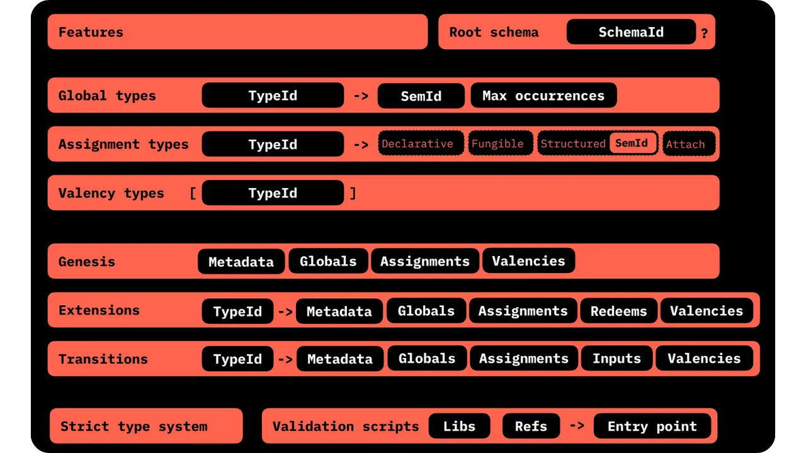


Kode iri musi yerekana insoiguro yuzuye y'igicapo ca Rust. Tuzobivuga igice ku kindi, dukurikije insiguro (1) gushika kuri (9) biri aha hepfo:


```rust
// ===== PART 1: Function Header and SubSchema =====
fn nia_schema() -> SubSchema {

// definitions of libraries and variables

// ===== PART 2: General Properties (ffv, subset_of, type_system) =====
Schema {
ffv: zero!(),
subset_of: None,
type_system: types.type_system(),

// ===== PART 3: Global States =====
global_types: tiny_bmap! {
GS_NOMINAL => GlobalStateSchema::once(types.get("RGBContract.DivisibleAssetSpec")),
GS_DATA => GlobalStateSchema::once(types.get("RGBContract.ContractData")),
GS_TIMESTAMP => GlobalStateSchema::once(types.get("RGBContract.Timestamp")),
GS_ISSUED_SUPPLY => GlobalStateSchema::once(types.get("RGBContract.Amount")),
},

// ===== PART 4: Owned Types =====
owned_types: tiny_bmap! {
OS_ASSET => StateSchema::Fungible(FungibleType::Unsigned64Bit),
},

// ===== PART 5: Valencies =====
valency_types: none!(),

// ===== PART 6: Genesis: Initial Operations =====
genesis: GenesisSchema {
metadata: Ty::<SemId>::UNIT.id(None),
globals: tiny_bmap! {
GS_NOMINAL => Occurrences::Once,
GS_DATA => Occurrences::Once,
GS_TIMESTAMP => Occurrences::Once,
GS_ISSUED_SUPPLY => Occurrences::Once,
},
assignments: tiny_bmap! {
OS_ASSET => Occurrences::OnceOrMore,
},
valencies: none!(),
},

// ===== PART 7: Extensions =====
extensions: none!(),

// ===== PART 8: Transitions: TS_TRANSFER =====
transitions: tiny_bmap! {
TS_TRANSFER => TransitionSchema {
metadata: Ty::<SemId>::UNIT.id(None),
globals: none!(),
inputs: tiny_bmap! {
OS_ASSET => Occurrences::OnceOrMore,
},
assignments: tiny_bmap! {
OS_ASSET => Occurrences::OnceOrMore,
},
valencies: none!(),
}
},

// ===== PART 9: Script AluVM and Entry Points =====
script: Script::AluVM(AluScript {
libs: confined_bmap! { alu_id => alu_lib },
entry_points: confined_bmap! {
EntryPoint::ValidateGenesis => LibSite::with(FN_GENESIS_OFFSET, alu_id),
EntryPoint::ValidateTransition(TS_TRANSFER) => LibSite::with(FN_TRANSFER_OFFSET, alu_id),
},
}),
}
}
```


- (1) - **Uko hejuru hameze hamwe nomusi y'igicapo**


`nia_schema()` igikorwa kigarura `Igishushanyo gito`, kigaragaza ko icogicapo gishobore kuragwa igice c'igicapo rusangi. Mu bidukikije vya RGB, ukwo guhinduranya gutuma bishoboka gusubira gukoresha Ibintu bimwe bimwe y’umukuru W'igicapo, hanyuma ugasobanura amategeko yihariye kumasezerano iriko iravugwa. Aha, duhitamwo kudashoboza iragi, kuko `subset_of` izoba `Nta`.


- (2) - Ibirango rusangi: ffv, igice_c', **ubwoko_bw'uburyo**


Igikoresho ca `ffv` gihuye n'ivyo *vyihuta* vya Amasezerano. Agaciro ka `ubusa!()` hano kerekana ko turi kuri verisiyo 0 canke verisiyo ya mbere y'iyi Igicapo. Niba mu nyuma wipfuza kwongerako ibikorwa bishasha (ubwoko bushasha bw'ibikorwa, n'ibindi), ushobora kwongera iyi verisiyo kugira ngo werekane ihinduka ry'ukwemeranya.


I `subset_of: Nta` umutungo wemeza ko ata n'iragi. `ubwoko_uburyo` umwanya werekeye ubwoko bukomeye bwa sisitemu busanzwe busobanuwe mu `ubwoko` ububiko bw'ibitabo. Uyu murongo werekana ko amakuru yose akoreshwa n'Amasezerano akoresha ugushirwa mu ngiro kw’urutonde gukomeye gutangwa n’ububiko bw’ibitabu buvugwa.


- (3) - Ibihugu vyo kw'isi yose


Mu `ubwoko_bw'isi yose`, dutangaza Ibintu bine. Dukoresha urufunguzo, nka `GS_IZINA` canke `GS_ISOHOKA_ITANGA`, kugira ngo tubikoreshe mu nyuma:


- `GS_NOMINAL` yerekeza ku bwoko bwa `DivisibleAssetSpec`, budondora ivyicaro bitandukanye vya token yaremwe (izina ryose, ikimenyetso, ukuri...);
- `GS_DATA` igereranya amakuru rusangi, nk'ukwiyamiriza, amakuru y'imbere, canke uwundi munyandiko;
- `GS_TIMESTAMP` yerekana itariki y'isohoka;
- `GS_ISSUED_SUPPLY` ishiraho igitigiri cose c'ibitangwa, ni ukuvuga igitigiri kinini c'ibimenyetso bishobora gukorwa.


Ijambo ry'ingenzi `rimwe(...)` risigurako ko buri kimwe muri ivyo bibanza gishobora kugaragara rimwe gusa.


- (4) - Ubwoko bw'ibintu


Mu `ubwoko_bufise`, dutangaza `OS_ASSET`, idondora uko bimeze gishobora guhinduka. Dukoresha `Ukoigicapo Kimeze::Ukundahindurwa(Ubwoko::Unsigned64Bit)`, vyerekana ko igitigiri c'itunga (ibimenyetso) ubitswe nk'igitigiri cose kidashizweko umukono w'ibice 64. Gutyo, igikorwa cose kizorungika umubare kanaka w’ibice vy’iyi token, ivyo bikaba bizokwemezwa hakurikijwe ivyobitigiri vyanditswe neza.


- (5) - **Ivyiza**


Twerekana `valency_types: none!()`, bisigura ko ata Valencies ziri muri icogicapo, mu yandi majambo nta burenganzira budasanzwe canke bwongerekanye (nk'ugusubira gusohora, guturira bitegekanijwe, n'ibindi). Ico gicapo kirimwo ivyo, vyomenyeshwa muri iki gice.


- (6) - Itanguriro: ibikorwa vya mbere


Aha twinjira mu gice kimenyesha Ibikorwa vy'amasezerano. Itanguriro idondorwa na:


- Kubura `amakuru y'imbere` (umurima `amakuru y'imbere: Ty::<SemId>::UNIT.id(Nta)`);
- Ibihugu vyo kw’isi yose bitegerezwa kubaho rimwe kuri kimwe cose (`Rimwe`);
- Urutonde rw'ibikorwa aho `OS_ASSET` itegerezwa kugaragara `RimweCanke N'ibindi`. Ivyo bisigura ko Itangurire isaba nibura `OS_ASSET` imwe Umwimenyerezo (uwuyifise mu ntango);
- Oya Valency: `ubushobozi: nta n'umwe!()`.


Uko ni ko duca ku rugero rw'insobanuro y'ikibazo ca mbere ca token: dutegerezwa kumenyesha Ibisabwa yasohowe (`GS_ISSUED_SUPPLY`), twongereko n'imiburiburi uwuyifise (ibifashwe muminwe y'ubwoko `OS_ASSET`).


- (7) - Ukwagura


`Ivyagutse: nta!()` vyerekana ko ata vyiyongeyeko itegekanijwe muri iyiri mumasezerano. Ivyo bisigura ko ata gikorwa co gukora Redeem uburenganzira bwakurinyabwonko (Valency) canke gukora Iciyongerwako imbere y’Impinduka. Ivyo vyose bikorwa biciye kwitanguriro canke ku nzira y'uko bimeze.


- (8) - Impinduka: TS_GUHINDURA


Mu `mihindukire`, dusobanura `TS_TRANSFER` ubwoko bw'igikorwa. Turasigura ko:


- Nta nkuru y’imbere ifise;
- Ntihindura Iba murirusangi (ivyo bikaba vyaramaze gusobanurwa mw;itanguriro);
- Bifata `OS_ASSETs` imwe canke nyinshi nk'ivyo kwinjiza. Ivyo bisigura ko itegerezwa gukoresha Uko bimeze Zifise Ubutunzi zisanzweho;
- Irema (`ibikorwa`) nibura `OS_ASSET` imwe nshasha (mu yandi majambo, uwuronka canke abaronka baronka ibimenyetso);
- Nta Valency nshasha itanga.


Ivyo bigereranya inyifato y’ukwimurira kw’ishimikiro, gufungura ibimenyetso kuri UTXO, hanyuma bikarema ukobemeze nshasha zifise ububasha ku neza y’abaronka, gutyo bikazigama uburinganire bw’amahera yose hagati y’ivyo yinjiza n’ivyo isohoka.


- (9) - **Inyandiko ya AluVM n'Ivyiyumviro vy'Injira** (mu gifaransa)


Ubwa nyuma, dutangaza inyandiko ya AluVM (`Inyandiko::AluVM(Inyandiko ya Alu { ... })`). Iyi nyandiko irimwo:


- Isoko rimwe canke menshi ry'inyuma (`libs`) rizokoreshwa mu gihe co kwemeza;
- Ivyinjira vyerekana ibikorwa bihinduka muri kode ya AluVM, bihuye n'ukwemeza kw'itanguriro (`Kwemeza Itanguriro`) na buri mpinduka yatangajwe (`KwemezaImpinduka(TS_TRANSFER)`).


Iyi kode y'ukwemeza ni yo ishinzwe gukoresha Uko ishoramari rimeze. Nk'akarorero, izosuzuma:


- Ko `GS_ISOHOKA_IBIMENYETSO` itarenze mu gihe c'itanguriro;
- Ko umubare w'ibintu vyinjijwe` (ibimenyetso vyakoreshejwe) ungana n'umubare w'ibikorwa` (ibimenyetso vyakiriwe) ku `TS_TRANSFER`.


Iyo ayo mategeko atubahirijwe, iyo mpinduka izobonwa ko ata co imaze.


Aka karorero k'"*Itunga Ridashobora Gufutwa*" Ibicapo biduha ugutahura neza imiterere y'Itunga ryoroshe kumasezerano ya yoken ya RGB. Turashobora kubona neza itandukaniro riri hagati y’insobanuro y’amakuru (Ibihugu vy’Isi yose n’Ibihugu vy’Igihugu), itangazo ry’ibikorwa (Itangiriro, Impinduka, Ukwagura) n’ugushirwa mu ngiro kw’ivyemezo (inyandiko za AluVM). Kubera iki kigereranyo, token yitwararika nk’iyitwa token, ariko iguma yemejwe ku ruhande rw’umuguzi kandi ntiyivana n’ibikorwa remezo vya On-Chain kugira ngo ikore kode yayo. Ivyemezo vy'ubuhinga bwo gukingira amakuru ni vyo vyonyene bishingiye kuri Blockchain na Bitcoin .


### Ahakorerwa ibintu


Ahakorerwa ibintu ni Layer yagenewe gutuma amasezerano anosmwa kandi ikoreshwa, n’abayikoresha (ugusoma kw’abantu) be n’ibitabo (ugusoma kwa porogarama). Ahakorerwa ibintu rero hafise uruhara rugereranywa n’urw’ahakorerwa ibintu mu rurimi rw’iporogarama rushingiye ku bintu (Java, akaranga ka Rust, n’ibindi), kuko igaragaza kandi igasobanura neza nuko amasezerano ameze, ataco isobanura ku bijanye n’ivyo Amasezerano ikora.


Udakunze Igicapo, ivuga gusa kandi ikoranijwe muri dosiye y’ibice bibiri igoye gukoresha uko iri, Ahakorerwa ibintu hatanga imfunguruzo zo gusoma zikenewe kugira ngo:


- Gutanga urutonde no gusigirura ukobimeze vyo kw’Isi yose n’Ibihugu vy’Igihugu biri mu masezerano;
- Ushobora gushika ku mazina n’agaciro k’umwanya wose, kugira ngo bishobore kwerekanwa (nk’akarorero ku token, umenye igiharuro cawo, igitigiri kinini, n’ibindi);
- Gisigura no kwubaka Ibikorwa vy'amasezerano (Itanguriro, Ukobiinduka, canke Ivyiyongerako) mu gufatanya amakuru n'amazina atahurwa (nk'akarorero, gukora ukwimurira mu gusobanura neza "Igitigiri" aho gukoresha ikimenyetso c'ibice bibiri).


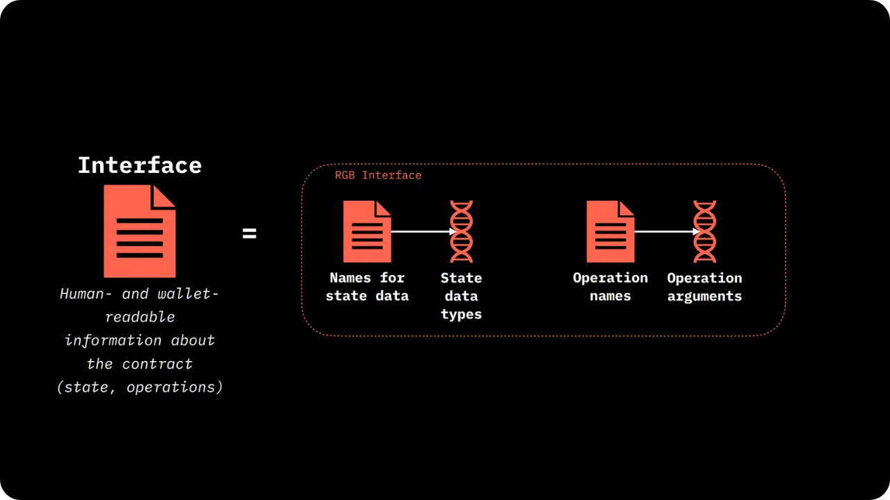


Ushimira Aho kubikorera, urashobora, nk'akarorero, kwandika kode mungodo iyo, aho gukoresha ivyatsi, ikoresha ataco ihinduye ibimenyetso nk'"umubare w'ibimenyetso", "izina ry'umutungo", n'ibindi. Muri ubwo buryo, uburongozi bw'amasezerano burarushiriza kuba ubw’agaciro.


#### Ibikorwa rusangi


Ubwo buryo burafise ivyiza vyinshi:


- Gushinga urugero:


Ubwo bwoko bumwe bw'amasezerano burashobora gushigikirwa n'ahakorerwa isanzwe, isangiwe hagati y'ibikorwa vyinshi vy'ingodo. Ivyo bituma vyoroha guhuza no gusubira gukoresha kode.


- **Gutandukanya neza hagati y'igicappo na Interface:**


Mu guhingura RGB, Igicapo (Uko ishramari rimeze) n'Ahakorerwa ibintu (ugushikiriza no gukoresha) ni ibigo bibiri vyigenga. Abahinguzi bandika ubuhinga bw'Amasezerano barashobora kwibanda kugicapo, batababazwa n’ubuhinga bwo gukora canke guserukira amakuru, mu gihe uwundi mugwi (canke uwo mugwi umwe, ariko ku rutonde rw’igihe rutandukanye) ushobora gukora ahakorerwa ibintu.


- **Uguhinduka guhinduka:**


Ahakorerwa ibintu harashobora guhindurwa canke kwongerwako inyuma y’aho umutungo usohokeye, ataco ukeneye guhindura Amasezerano ubwayo. Ivyo ni itandukaniro rikomeye n'ibindi bikoresho vya ama Smart contract ya On-Chain, ahokorerwa ibintu (kenshi ivangwa n'itegeko ry'ugushitsa) ikonjeshwa muri Blockchain.


- Ubushobozi bw'ahakorerwa ibintu bwinshi


Iryo Amasezerano nyene ryoshobora gushirwa ahabona biciye ku nzira zitandukanye zihuye n’ivyo umuntu akeneye: Aakorerwa ibintu horoshe ku muntu akoresha, iyindi iteye imbere cane ku muntu atanga akeneye gucunga ibikorwa vy’Ukobimeze. Ingodo irashobora rero guhitamwo Ahakorerwa ibintu ahitamwo, bivanye n’ingene ikoreshwa.


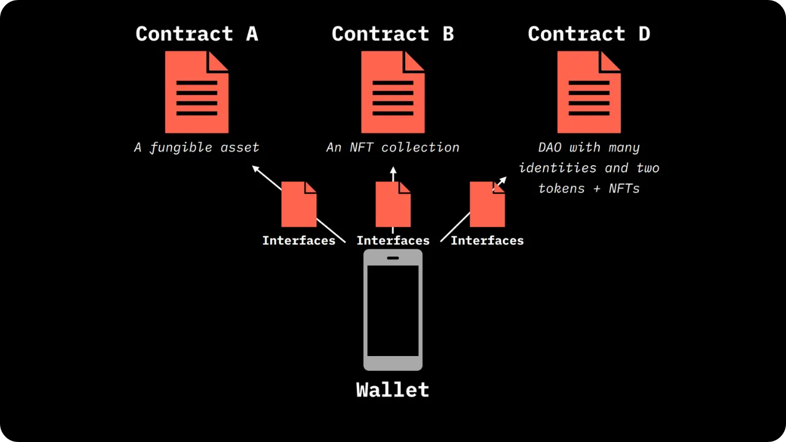


Mu bikorwa, iyo Ingodo ironse amasezerano ya RGB (biciye muri dosiye `.RGB` canke `.rgba`), irazana kandi Aho bkorerwa hajana, na yo nyene irakoranywa. Mu gihe co gukora, Ingodo ishobora, nk'akarorero:


- Suzuma urutonde rw’ibihugu maze usome amazina yavyo, kugira ngo ugaragaze Ticker, Amahera wahereyeko, Itariki y’Isohoka, n’ibindi ku mukoresha ahakorerwa ibintu, aho kugaragaza ikimenyetso c’igitigiri kitasomwa;
- Kubaka igikorwa (nk'uguhindura) ukoresheje amazina y'ibipimo asobanutse: aho kwandika `ibikorwa { OS_ASSET => 1 }`, bishobora guha umukoresha umwanya "Umubare" mu rupapuro, maze ugahindura aya makuru mu bibanza vyanditswe neza vyitezwe na GW-156.


#### Itandukaniro na Ethereum n'izindi sisitemu


Ku Ethereum, Ahakorerwa ibintu (idondora biciye ku ABI, *Ikoreshwa ry’Ibikoresho Bibiri Vy'ahorerwa ibintu*) muri rusangi ikomoka kuri kode yabitswe ya On-Chain (Smart contract). Bishobora gutwara amahera menshi canke bikaba bigoye guhindura igice kinaka c'ahakorerwa ibintu utakoze kumasezerano ubwayo. Ariko rero, RGB ishingiye ku nsiguro yose ya off-chain, n'amakuru ashingiye ku *masezerano* kuri Bitcoin. Iyi nzira ituma bishoboka guhindura Ahakorerwa ibintu (canke ugushirwa mu ngiro kwayo) ataco bihinduye ku mutekano w’ishimikiro w'amasezerano, kuko kwemeza amategeko y’ubudandaji kuguma mugicapo n’itegeko rya AluVM ryerekanwa.


#### Ahakorerwa ibintu gukoranya


Nk'uko biri kugucipo, Ahakorerwa ibintu isobanurwa muri kode y'inkomoko (kenshi muri Rust) kandi igakoranywa muri dosiye `.RGB` canke `.rgba`. Iyi dosiye ibiri irimwo amakuru yose asabwa n'ingodo kugira ngo:


- Kumenya imirima mu mazina;
- Huza umwanya wose (n’agaciro kawo) n’ubwoko bw’urutonde rukomeye rwasobanuwe mumumasezerano;
- Menya ibikorwa bitandukanye vyemewe n’ingene wovyubaka.


Igihe Ahakorerwa ibintu hamaze kwinjizwa, Ingodo irashobora kwerekana ne'amasezeramo no gusaba imigenderanire ku wuyikoresha.


### Ibikoresho vyashizweho n'ishirahamwe LNP/BP


Mu bidukikije vya RGB, Ahaokorerwa ibintu hakoreshwa mu gutanga insiguro kandi ikoreshwa ku makuru n'imikorere y'aasezerano. Ahakorerwa ibintu rero yuzuza igicapo, idondora Uko ishoramari rimeza imbere (ubwoko bukomeye, inyandiko zo kwemeza, n’ibindi). Muri iki gice, turaza kuraba ahakorerwa ibintu zisanzwe zateguwe n’ishirahamwe LNP/BP ku bwoko rusangi bwa amasezerano (ibimenyetso bishobora guhinduka, NFT, n’ibindi).


Nk’ukwibutsa, iciyumviro ni uko ahakporera ibintu hose isigura ingene yogaragaza no gukoresha Amasezerano ku ruhande rw'ingodo, ikavuga neza amazina y’ibibanza (nk’i `spec`, `ticker`, `issuedSupply`...) kandi igasobanura ibikorwa bishoboka (nk’i, `T `Guhindura izina`...). Ahakorerwa ibintu henshi nyinshi zirasanzwe zikora, ariko hazoba izindi muri kazoza.


#### Ibikoresho bimwe bimwe vyiteguye gukoreshwa


**RGB20** n'ahakorerwa ibintu ku mitungo ishobora guhinduka, ishobora kugereranywa n’itegeko rya Ethereum ERC20. Ariko rero, iratera intambwe imbere, itanga ibikorwa vyinshi:


- Nk’akarorero, ubushobozi bwo guhindura izina ry’umutungo (guhindura *ticker* canke izina ryose) umaze gusohoka, canke guhindura ukuri kwawo (*stock splits*);
- Ishobora kandi gusobanura uburyo bwo gusubira gusohora ubwa kabiri (bifise aho bigarukira canke bitagira aho bigarukira) no guturira hanyuma bikasubirizwa, kugira ngo bihe uburenganzira uwubitanga bwo gusenya no gusubira kurema ivy’ubutunzi mu gihe hari ibintu bimwebimwe;


Nk’akarorero, RGB20 Ahakorerwa ibintu hashobora guhuzwa n’umugambi wa **Itunga Ridashobora Gufutwa (NIA)**, utegeka Ugusaba ibintu y’intango idashobora gufutwa, canke n’iyindi migambi iteye imbere cane nk’uko bisabwa.


**RGB21** yerekeye amasezerano y’ubwoko bwa NFT, canke mu buryo bwagutse, ibirimwo vyose vy’ubuhinga bwa none, nk’uguserukira ibinyamakuru vy’ubuhinga bwa none (amashusho, umuziki, n’ibindi). Uretse gusobanura ikibazo no kwimurira umutungo umwe, harimwo n’ibintu nk’ibi:


- Infashanyo yunze ubumwe yo gushiramwo dosiye (ishika kuri 16 MB) mumasezerano (kugira ngo umuntu ayironke ku ruhande rw’umukiriya);
- Ubushobozi bwa nyen'itongo bwo kwinjira "*igicapo*" muri kahise kugira ngo yerekane Koyitirirwa ikintu ca kera ya NFT.


**RGB25** ni urugero rw'ivy'ubuhinga buhurikiyemwo ibintu bishobora guhinduka n'ibidashobora guhinduka. Igenewe imitungo ishobora guhinduka igice, nk'uguhindura ikimenyetso c'amazu, aho ushaka gucapura umutungo mu gihe uguma ufise uruja n'uruza rw'umutungo w'umuzi umwe (mu yandi majambo, ufise ibice vy'inzu bishobora guhinduka, bihuye n'inzu idashobora guhinduka). Mu buryo bw'ubuhinga, ahakorerwa ibintu ishobora guhuzwa n'**Itunga Rishobora Gukusanywa (CFA) Igicapo**, ifata mu muzirikanyi iciyumviro co gucapura mu gihe ikurikirana itunga ry'intango.


#### Ibikoresho biriko birategurwa


Ibindi bikoresho biteguwe gukoreshwa mu buryo bwihariye, ariko ntibiraboneka:


- **RGB22**, yihariye ku bijanye n'ibimenyetso vy'ubuhinga bwa none, kugira ngo icunge ibimenyetso n'imirongo ya On-Chain mu bidukikije vya RGB;
- **RGB23**, ku gutera ikidodo c'igihe giteye imbere, ukoresheje bimwe mu vyiyumviro vya *Opentimestamps*, ariko n'ibiranga gukurikirana;
- **RGB24**, igamije gukorana n'uburyo bw'amazina y'itongo (DNS) busa n'ubwa *Serivisi y'izina rya Ethereum*;
- **RGB26**, igenewe gucunga ama DAO (**Ishirahamwe ryigenga ryegerejwe**) mu buryo bugoranye cane (ubutegetsi, amatora, n'ibindi);
- **RGB30**, isa cane na RGB20 ariko ifise ubudasa bwo kwitwararika ugusohoka kw'intango kwegerejwe no gukoresha Ivyagutse vy'uko bimeze. Ivyo vyokoreshwa ku mitungo iyo gusubira gusohoka kwayo icungiwe n'inzego nyinshi, canke ikaba ishingiye ku bintu vyiza kuruta.


Ego ni ko, bivanye n’itariki ubona kuri iri shure, izo nzira zishobora kuba zisanzwe zikora kandi zishobora gukoreshwa.


#### Akarorero k'ahakorerwa ibintu


Iyi kode ya Rust yerekana [RGB20](umutungo ushobora guhinduka). Iyi kode yakuwe muri dosiye `rgb20.rs` iri mu bubiko bw'ibitabu bwa RGB. Reka tuvyihweze kugira ngo dutahure imiterere ya Interface n’ingene itanga ikiraro hagati, ku ruhande rumwe, Business Logic (isobanuwe muri Schema) n’ibikorwa vyerekanwa n’amasakoshi n’abakoresha.


```rust
// ...
fn rgb20() -> Iface {
let types = StandardTypes::with(rgb20_stl());

Iface {
version: VerNo::V1,
name: tn!("RGB20"),
global_state: tiny_bmap! {
fname!("spec") => GlobalIface::required(types.get("RGBContract.DivisibleAssetSpec")),
fname!("data") => GlobalIface::required(types.get("RGBContract.ContractData")),
fname!("created") => GlobalIface::required(types.get("RGBContract.Timestamp")),
fname!("issuedSupply") => GlobalIface::one_or_many(types.get("RGBContract.Amount")),
fname!("burnedSupply") => GlobalIface::none_or_many(types.get("RGBContract.Amount")),
fname!("replacedSupply") => GlobalIface::none_or_many(types.get("RGBContract.Amount")),
},
assignments: tiny_bmap! {
fname!("inflationAllowance") => AssignIface::public(OwnedIface::Amount, Req::NoneOrMore),
fname!("updateRight") => AssignIface::public(OwnedIface::Rights, Req::Optional),
fname!("burnEpoch") => AssignIface::public(OwnedIface::Rights, Req::Optional),
fname!("burnRight") => AssignIface::public(OwnedIface::Rights, Req::NoneOrMore),
fname!("assetOwner") => AssignIface::private(OwnedIface::Amount, Req::NoneOrMore),
},
valencies: none!(),
genesis: GenesisIface {
metadata: Some(types.get("RGBContract.IssueMeta")),
global: tiny_bmap! {
fname!("spec") => ArgSpec::required(),
fname!("data") => ArgSpec::required(),
fname!("created") => ArgSpec::required(),
fname!("issuedSupply") => ArgSpec::required(),
},
assignments: tiny_bmap! {
fname!("assetOwner") => ArgSpec::many(),
fname!("inflationAllowance") => ArgSpec::many(),
fname!("updateRight") => ArgSpec::optional(),
fname!("burnEpoch") => ArgSpec::optional(),
},
valencies: none!(),
errors: tiny_bset! {
SUPPLY_MISMATCH,
INVALID_PROOF,
INSUFFICIENT_RESERVES
},
},
transitions: tiny_bmap! {
tn!("Transfer") => TransitionIface {
optional: false,
metadata: None,
globals: none!(),
inputs: tiny_bmap! {
fname!("previous") => ArgSpec::from_non_empty("assetOwner"),
},
assignments: tiny_bmap! {
fname!("beneficiary") => ArgSpec::from_non_empty("assetOwner"),
},
valencies: none!(),
errors: tiny_bset! {
NON_EQUAL_AMOUNTS
},
default_assignment: Some(fname!("beneficiary")),
},
tn!("Issue") => TransitionIface {
optional: true,
metadata: Some(types.get("RGBContract.IssueMeta")),
globals: tiny_bmap! {
fname!("issuedSupply") => ArgSpec::required(),
},
inputs: tiny_bmap! {
fname!("used") => ArgSpec::from_non_empty("inflationAllowance"),
},
assignments: tiny_bmap! {
fname!("beneficiary") => ArgSpec::from_many("assetOwner"),
fname!("future") => ArgSpec::from_many("inflationAllowance"),
},
valencies: none!(),
errors: tiny_bset! {
SUPPLY_MISMATCH,
INVALID_PROOF,
ISSUE_EXCEEDS_ALLOWANCE,
INSUFFICIENT_RESERVES
},
default_assignment: Some(fname!("beneficiary")),
},
tn!("OpenEpoch") => TransitionIface {
optional: true,
metadata: None,
globals: none!(),
inputs: tiny_bmap! {
fname!("used") => ArgSpec::from_required("burnEpoch"),
},
assignments: tiny_bmap! {
fname!("next") => ArgSpec::from_optional("burnEpoch"),
fname!("burnRight") => ArgSpec::required()
},
valencies: none!(),
errors: none!(),
default_assignment: Some(fname!("burnRight")),
},
tn!("Burn") => TransitionIface {
optional: true,
metadata: Some(types.get("RGBContract.BurnMeta")),
globals: tiny_bmap! {
fname!("burnedSupply") => ArgSpec::required(),
},
inputs: tiny_bmap! {
fname!("used") => ArgSpec::from_required("burnRight"),
},
assignments: tiny_bmap! {
fname!("future") => ArgSpec::from_optional("burnRight"),
},
valencies: none!(),
errors: tiny_bset! {
SUPPLY_MISMATCH,
INVALID_PROOF,
INSUFFICIENT_COVERAGE
},
default_assignment: None,
},
tn!("Replace") => TransitionIface {
optional: true,
metadata: Some(types.get("RGBContract.BurnMeta")),
globals: tiny_bmap! {
fname!("replacedSupply") => ArgSpec::required(),
},
inputs: tiny_bmap! {
fname!("used") => ArgSpec::from_required("burnRight"),
},
assignments: tiny_bmap! {
fname!("beneficiary") => ArgSpec::from_many("assetOwner"),
fname!("future") => ArgSpec::from_optional("burnRight"),
},
valencies: none!(),
errors: tiny_bset! {
NON_EQUAL_AMOUNTS,
SUPPLY_MISMATCH,
INVALID_PROOF,
INSUFFICIENT_COVERAGE
},
default_assignment: Some(fname!("beneficiary")),
},
tn!("Rename") => TransitionIface {
optional: true,
metadata: None,
globals: tiny_bmap! {
fname!("new") => ArgSpec::from_required("spec"),
},
inputs: tiny_bmap! {
fname!("used") => ArgSpec::from_required("updateRight"),
},
assignments: tiny_bmap! {
fname!("future") => ArgSpec::from_optional("updateRight"),
},
valencies: none!(),
errors: none!(),
default_assignment: Some(fname!("future")),
},
},
extensions: none!(),
error_type: types.get("RGB20.Error"),
default_operation: Some(tn!("Transfer")),
type_system: types.type_system(),
}
}
```


Ahakorerwa ibintu, turabona ibisa n’imiterere y'Igicapo: turasanga itangazo ry'uko bimeze muri rusangi, Ibihugu vy’Umutungo, Ibikorwa vy'amasezerano (Itanguriro n’Impinduka), hamwe n’ugutorera umuti amakosa. Ariko Ahakorerwa ibintu yibanda ku kwerekana no gukoresha iz'ibintu vy'ingodo canke ikindi gikorwa ico ari co cose.


Itandukaniro riri hagati y'igicapo n’ubwoko bwavyo. Igicapo gikoresha ubwoko bukomeye (nk'ubwoko `Ubwoko::Unsigned64Bit`) n'ibindi bimenyetso vy'ubuhinga. Ahakoresha amazina y'ibibanza, ama macro (`izina ry'f!()`, `tn!()`), n'ibisobanuro vy'imigwi y'imvo (`ArgSpec`, `Igishushanyo::Uburenganzira`...). Intumbero aha ni ugufasha gutahura no gutunganya ibikorwa mungodo.


Ikindi, Ahakorerwa ibintu ishobora gushiramwo ibindi bikorwa y'igicapo y'ishimikiro (nk'ugucungera uburenganzira bwa `burnEpoch`), igihe cose ivyo biguma bihuye n'ubwenge bwa nyuma bwemejwe ku ruhande rw'umukiriya. Igice ca AluVM "inyandiko" mugicapo kizotuma habaho ukuri kw'inyandiko, ahakorerwa ibintu isigura ingene umukoresha (canke Ingodo) akorana n'izo ntara n'ihinduka.


#### Ukobimeze murirusangi n’Ibikorwa


Mu gice ca `ukobimeze murirusangi`, dusanga ivyicaro nka `spec` (insobanuro y'umutungo), `amakuru`, `yaremwe`, `Itanga`, `Itanga yaturiwe`, `Itanga yasubirijwe`. Ivyo ni ibibanza vy'ingodo ishobora gusoma no gushikiriza. Nk'akarorero:


- `spec` izokwerekana imiterere ya token;
- `issuedSupply` canke `burnedSupply` biduha umubare wose w'ibimenyetso vyasohowe canke vyaturiwe, n'ibindi.


Mu gice ca `ibikorwa`, turasobanura uruhara canke uburenganzira butandukanye. Nk'akarorero:


- `assetOwner` ihuye n'ugufata ibimenyetso (ni *Owned State* ishobora guhinduka);
- `burnRight` ihuye n'ubushobozi bwo guturira ibimenyetso;
- updateRight` ihuye n'uburenganzira bwo guhindura izina ry'umutungo.


Ijambo ry'ingenzi `ry'abantu bose' canke 'ry'ibanga` (nk'akarorero `AssignIface::iry'abantu bose(...)`) ryerekana nimba izo ntara ziboneka (`abantu bose`) canke ibanga (`ibanga`). Naho `Req::NtaCankeIbindi`, `Req::Ihitamwo`, vyerekana ivyitezwe.


#### Itanguriro n'uko bihinduka


Igice c' `itanguriro` kidondora ingene umutungo utangura:


- Ivyo `ibisobanuro`, `amakuru`, `vyaremwe`, `vyasohowe` ni ngombwa (`ArgSpec::bisabwa()`);
- Ibikorwa nka `assetOwner` bishobora kuba biri mu makopi menshi (`ArgSpec::many()`), bikaba vyemerera ibimenyetso gukwiragizwa ku bafise benshi b'intango;
- Ivyimburwa nka `Igihe c'Iterambere` canke `Igihe c'Igihe` bishobora (canke ntibishobora) gushirwa muri Genesis.


Hanyuma, ku Nzira yose (`Kwimurira`, `Ikibazo`, `Guturira`...), Ahakorerwa ibintu isigura ivyicaro igikorwa citeze nk'inyungu, ivyicaro igikorwa kizotanga nk'isohoka, n'amakosa yose yoshobora kubaho. Nk'akarorero:


**Guhinduka:**


- Ivyinjijwe: `ibiheruka` → bitegerezwa kuba `Uwufise umutungo`;
- Umwimenyerezo: `uwubikoresha` → utegezwa kuba `Uwufise umutungo` mushasha;
- Ikosa: `AMAHERA_BITANGANA_` (ingodo izoshobora rero gukorana n'ibibazo aho igitigiri cinjira kidahuye n'igitigiri gisohoka).


**Ikibazo `Impinduka`:**


- Ntibitegerezwa (`Uguhitamwo: ukuri`), nk'uko ivyimburwa vy'inyongera bitakoreshwa vy'ukuri;
- Ivyinjijwe: `vyakoreshejwe` → `Ugukingira itakaza ry'agaciro`, ni ukuvuga uruhusha rwo kwongerako ibindi bimenyetso;
- Ivyutegerezwa : `uwuronka inyungu` (ibimenyetso bishasha vyaronswe) n' `akazoza` (ibisigaye `Ugukingira yitakaza ry'agaciro`);
- Amakosa ashoboka: `GUTANGA_NTIBIHUYE`, `IKIBAZO_KIRENZE_IBIMENYETSO`, n'ibindi.


**Ihinduka ry'uguturira:**


- Ivyinjijwe: `vyakoreshejwe` → a `Ivyogukuramwo iburyo`;
- Ivyo murirusangi: `Ivyo Gutanga` vyaturitse` birakenewe;
- Inshingano: `kazoza` → ugukomeza gushoboka kwa `Ivyogukuramwo iburyo` nimba tutaturiye vyose;
- Amakosa: `GUTANGA_BITAHURA`, `IKIMENYETSO_KIDAKORA`, `IBIMENYETSO_BITAHAGIJE`.


Burigikorwa cose rero kiradondaguwe mu buryo bushobora gusomwa kungodo. Ivyo bituma bishoboka kugaragaza igishushanyo Ahakorerwa ibitu aho umukoresha ashobora kubona neza: "Ufise uburenganzira bwo gukuraha. Woba wipfuza gukuramwo igitogiri kanaka? Kode irazi kwuzuza umwanya wa `Gukuramwo ibisabwa` maze ikagenzura ko `  Gukuramwo iburyo` ari ukuri."


Mu ncamake, birahambaye kwibuka ahakorerwa ibintu, naho yoba yuzuye gute, ubwayo itasobanura ivyiyumviro vy'imbere vy'amasezerano. Umutima w’igikorwa ukorwa n' **igicapo**, uimwo ubwoko bukomeye, imiterere y'itanguriro, inzira z’uguhinduka n’ibindi. Ahakorerwa ibintu gusa igaragaza z'ivyobintu mu buryo busanzwe kandi bufise izina, kugira ngo zikoreshwe mu gikorwa.


Kubera ubuhinga bwa RGB, Ahakorerwa ibintu harashobora gusubirwamwo (nk'akarorero, mu kwongerako `Guhindura izina`, gukosora iyerekanwa ry'umurima, n'ibindi) ataco ukeneye kwandika Amasezerano yose. Abakoresha ahakorerwa ibintu harashobora rero kwungukira kuri ivyo bintu vyiza, bakimara guhindura dosiye `.RGB` canke `.rgba`.


Ariko umaze gutangaza Ahakorerwa ibintu, ukeneye kuyihuza n;igicapo bihuye. Ibi bikorwa biciye kuri ***Ahakorerwa ibintu***, igaragaza ingene woshiramwo ikarita y'umwanya wose ufise izina (nk'izina ry'f!("Nyitungo")`) ku ikaranga ibintu ikomeye (nk'iyi `OS_ASSET`) isobanuwe murikinogicapo . Ivyo bituma, nk'akarorero, iyo Ingodo ikoresheje ibintu wa `burnRight`, iyo ni yo nzira, mugicapo, Isigura ubuhobozi bwo guturira ibimenyetso.


### Ahakorerwa ibintu


Mu nyubakwa ya RGB, twabonye ko igice cose (Igicapo, Ahakorerwa ibintu, n’ibindi) gishobora gutegurwa no gukoranirizwa ku giti caco. Ariko rero, haracariho ikintu kimwe gihambaye gihuza ivyo bice vy'inyubako bitandukanye: ***Ahakorerwa ibintu***. Ivyo ni vyo bigaragaza neza ibimenyetso canke ivyicaro vyasiguwe muri mugicapo (ku ruhande rwa Uko ishoramari rimeze) ku mazina yamenyeshejwe Ahakorerwa ibintu (ku ruhande rw’ugushikiriza n’ugukorana n’abakoresha). Rero iyongodo ishize Amasezerano, irashobora gutahura neza neza ikibanza gihuye n'iki, n'ingene igikorwa citwa Ahakorerwa ibintu gifitaniye isano n'ubwenge bw'igicapo.


Iciyumviro gihambaye ni uko Interface Ahakorerwa ibintu atari ngombwa ko igaragaza ibikorwa vyose vy'igicapo, canke ivyicaro vyose vy'ahakorerwa ibintu: ishobora kugarukira ku gice gitoyi. Mu bikorwa, ivyo bituma bishoboka kubuza canke gucungera imice imwimwe y'igicapo. Nk'akarorero, woshobora kugira Igicapo ifise ubwoko bune bw'ibikorwa, ariko Ahakorerwa ibintu igaragaza bibiri gusa muri vyo mu gihe kinaka. Ku rundi ruhande, iyo ahakorerwa ibintu hatanga izindi ntumbero z’iherezo, turashobora guhitamwo kutazishira mu ngiro hano.


Aha ni akarorero ka kera k'ahakorerwa ibintu, aho dufatanya *Itunga Ridashobora Gufutwa* (NIA) Igicapo na RGB20 IAhakorerwa ibintu:


```rust
fn nia_rgb20() -> IfaceImpl {
let schema = nia_schema();
let iface = Rgb20::iface();

IfaceImpl {
version: VerNo::V1,
schema_id: schema.schema_id(),
iface_id: iface.iface_id(),
script: none!(),
global_state: tiny_bset! {
NamedField::with(GS_NOMINAL, fname!("spec")),
NamedField::with(GS_DATA, fname!("data")),
NamedField::with(GS_TIMESTAMP, fname!("created")),
NamedField::with(GS_ISSUED_SUPPLY, fname!("issuedSupply")),
},
assignments: tiny_bset! {
NamedField::with(OS_ASSET, fname!("assetOwner")),
},
valencies: none!(),
transitions: tiny_bset! {
NamedType::with(TS_TRANSFER, tn!("Transfer")),
},
extensions: none!(),
}
}
```


Muri iyi Nshirwa mu ngiro ry'ahakorerwa ibintu:


- Turavuga neza Igicapo, biciye ku `nia_schema()`, n'ahakorerwa ibintu, biciye ku `Rgb20::iface()`. Ivyo bimenyetso bikoreshwa kugira ngo ahakorerwa ibintu  ku ruhande rwo gukoranya (ivyo bifatanya ibimenyetso vy'ibanga vy'ivyo bice bibiri);
- Ikarata ishirwaho hagati ya y'ibntuvy'igicapo n'ahakorerwa ibintu. Nk'akarorero, `GS_NOMINAL` umwanya mugicappo uhuye n'ikidodo `"spec"` ku ruhande rw'ahakorerwa ibintu (`UmwanyaWizina::na(GS_IZINA, fizina!("spec"))`). Turakora ukwo nyene ku bikorwa, nka `TS_TRANSFER`, ivyo duhuza na `"Kwimurira"` ahakorerwa ibintu...;
- Turashobora kubona ko ata n’imwe ifise ubushobozi (`ubushobozi: nta n’umwe!()`) canke ivyungura (`ivyungura: nta n’imwe!()`), bikaba vyerekana ko iy'amasezerano ya NIA idakoresha ivyo bimenyetso.


Igisubizo inyuma yo gukoranya n'idosiye itandukanye `.RGB` canke `.rgba`, izokwinjizwa mungodo yongerako Igicapo n'ahakorerwa ibintu. Gutyo, iyo porogarama irazi ingene yohuza neza iyiamsezerano ya NIA (iyo ivyiyumviro vyayo bidondora n'igicapo yayo) na "RGB20" Ahakorerwa ibintu (itanga amazina y'abantu n'uburyo bwo gukorana n'ibimenyetso bishobora guhinduka), ikoresha iyi GW-166 nk'inzira ibiri hagati y'ivyo bibiri.


#### Ni kuki twotandukanya Ahakorerwa ibintu?


Gutandukana biratuma umuntu ashobora guhindura uko abona ibintu. Igicapo kimwe coshobora kugira Ibikorwa vyinshi bitandukanye vy'ahakorerwa ibintu, kimwe cose kikaba kigaragaza ibikorwa bitandukanye. Ikindi, Ahakorerwa ibintu ubwayo birashobora guhinduka canke gusubira kwandikwa ataco bisaba guhindura haba mugicapo canke Ahakorerwa ibintu. Ivyo bigumya ingingo ngenderwako ya RGB y’uguhinduranya: igice cose (Igicapo, Ahakorerwa ibintu,Ahakorerwa ibintu ija mungiro) gishobora guhindurwa no guhindurwa kidasanzwe, igihe cose amategeko y’uguhuza yashizweho n’amasezerano yubahirijwe (ibimenyetso bimwe, uguhuza ubwoko, n’ibindi).


Mu gukoresha beton, iy'ngodo itwara Amasezerano, itegerezwa:


- Ishiremwo ry'**Igicapo** yashizwe hamwe (kugira ngo umenye uko ishoramari rimeze);
- Ugushiramwo **Ahakorerwa ibintu** (kugira ngo utahure amazina n'ibikorwa vyo ku ruhande rw'ukoresha);
- Umuzigo washizwe hamwe **Ahakorerwa ibintubishirwa mungiro** (kugira ngo uhuze ubuhinga bw'Igicapo n'amazina y'ahakorerwa ibintu, igikorwa ku gikorwa, Ahantukuhantu).


Ubu buhinga bwo kwubaka buratuma bishoboka gukoresha ibintu nk'ibi:


- Guhagarika ibikorwa bimwebimwe ku bakoresha bamwebamwe: gutanga igice c’Ishirwa mu ngiro c'ahakorerwa ibintu gitanga gusa uburenganzira bwo gukoresha amafaranga y’ishimikiro, ata gutanga ibikorwa vyo guturira canke guhindura, nk’akarorero;
- Guhindura ukuntu ivyerekanywe: guhingura Ahakorerwa ibintu ihindura izina ry’umurima uri muhakorerwa ibintu canke ukayishushanya mu buryo butandukanye, ata guhindura ishingiro ry'amasezerano;
- Gushigikira imigambi myinshi: Ingodo ishobora gushiramwo Ibikorwa vyinshi vy'ahakorerwa ibintu ku bwoko bumwe bw'ahakorerwa ibintu, kugira ngo ikoreshe imigambi itandukanye (imirongo itandukanye ya token), igihe cose imiterere yayo ihuye.


Mu gice gikurikira, turaza kuraba ingene uguhererekanya amafaranga y'Amasezerano gukora, n’ingene amafagitire ya RGB akora.


## Amaseerano kwimurira


<chapterId>f043a307-d420-5752-b0d7-ebfd845802c0</chapterId>


:::id ya videwo=75eb5a8d-1910-4155-b5e3-81204c9a8901:::


Muri iki gice, turaza gusuzuma ingene Amasezerano agenda mubihabera vya RGB. Kugira ngo ivyo tubigereranye, turaza kuraba Alice na Bob, abakinyi bacu basanzwe, bipfuza ko Ihanahanwa iba umutungo wa RGB. Tuzokwereka kandi ibice bimwe bimwe vy'amabwirizwa bivuye mu gikoresho c'umurongo w'amabwirizwa `RGB`, kugira ngo turabe ingene bikora mu bikorwa.


### Gutahura amasezerano ya RGB kwimurira


Reka dufate akarorero k'uguhindura hagati ya Alice na Bob. Muri aka karorero, twiyumvira ko Bob ariko aratangura gukoresha RGB, mu gihe Alice asanzwe afise itunga rya RGB mungodo yiwe. Turabona ingene Bob ashiraho ibikotresho vyiwe, akazana Amasezerano bibereye, hanyuma agasaba kwimurirwa kuri Alice, n'ingene Alice akora igikorwa nyaco kuri Blockchain ya Bitcoin.


#### 1) Gushiramwo Ingo ya RGB


Mbere na mbere, Bob akeneye gushiramwo Ingodo ya RGB, ni ukuvuga porogarama ihuye n’itegeko. Ivyo nta masezerano arimwo mu ntango. Bob nawe nyene azokenera:


- Igikoresho c'ingodo ya Bitcoin co gucunga ama UTXO yawe;
- Ihuzwa n’ikidodo ca Bitcoin (canke n’umurongo wa Electrum), kugira ngo ushobore kumenya UTXO zawe no gukwiragiza amafaranga yawe ku rubuga.


Nk’ukwibutsa, **Ibihugu vy’Igihugu** muri RGB vyerekeye UTXO za Bitcoin. Tubwirizwa rero kwama dushobora gucunga no gukoresha UTXOs mu bikorwa vya Bitcoin birimwo amasezerano y’ubuhinga bwa none (`Tapret` canke `Opret`) yerekana amakuru ya RGB.


#### 2) Amasezerano kuronka amakuru


Bob rero arakeneye kugarura amakuru y'amasezerano akunda. Aya makuru ashobora gukwiragira biciye ku nzira iyo ari yo yose: urubuga, e-mail, ubutumwa... Mu bikorwa, ashirwa hamwe muri ***Gushiramwo ibintu***, ni ukuvuga agapaki gatoyi k'amakuru karimwo:


- **Intanguriro**, isigura uko Amasezerano yari ameze muntango;
- **Igicapo**, Gisobanura uko ishoramari rimeze (ubwoko bukomeye, inyandiko zo kwemeza, n’ibindi);
- **Ahakorerwa ibintu**, isobanura ikiganiro Layer (amazina y'ibibanza, ibikorwa bishobora gushikwako);
- **Ahakorerwa ibintu bishirwa mungiro**, ihuza neza Igicapo na ahakorerwa ibintu.


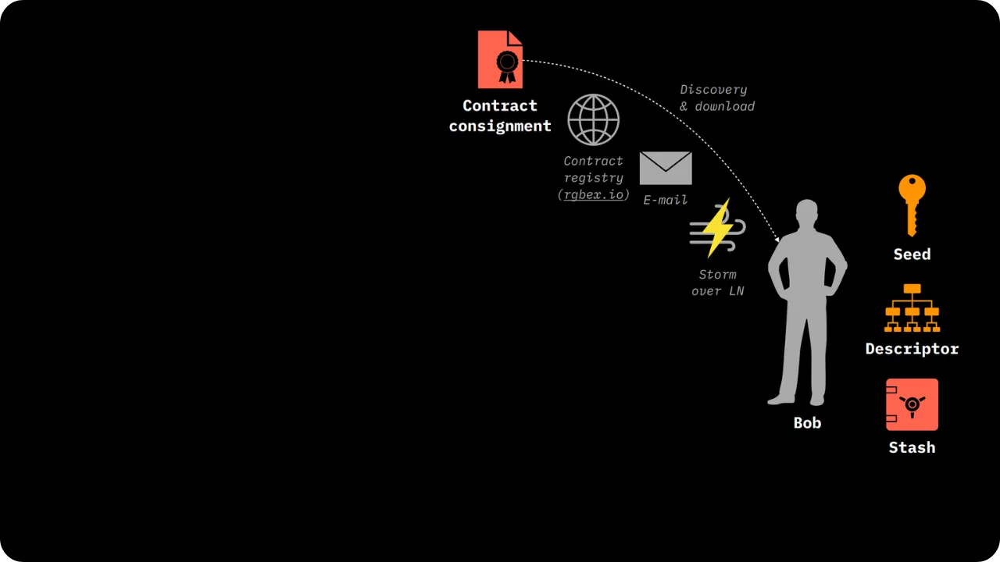


Ingano yose hamwe akenshi iba ingana n’amakilobyte makeyi, kuko igice kimwekimwe cose muri rusangi gipima amabayite makeyi. Bishobora kandi gushoboka gutangaza iyi Consignment muri Base58, biciye ku nzira zidashobora gucengera (nka Nostr canke biciye ku Lightning Network, nk’akarorero), canke nk’akarorero ka kode ya QR .


#### 3) Kwinjiza no kwemeza amasserano


Igihe Bob amaze kwakira Ishirwamwo, arayishira mungodo ya RGB yiwe. Ivyo bizoheza:


- Suzuma ko Utanguriro n'Igicapo gifise akamaro;
- Umuzigo w'ahakorerwa ibintu na ahakorerwa ibintu;
- Kuvugurura amakuru y'umuguzi wawe Stash.


Bob ubu arashobora kubona umutungo uri mungodo yiwe (naho yoba atarawugira) agatahura ibibanza bihari, ibikorwa bishoboka... Aca akenera guhamagara umuntu afise vy’ukuri uwo mutungo azokwimurirwa. Mu karorero kacu, uyo ni Alice.


Inzira yo kumenya uwufise umutungo kanaka wa RGB isa n’ukurondera uwuyitanga Bitcoin. Ivyerekeye iyo nzira y’uguhuza bivana n’ikoreshwa (amasoko, imihora y’ubutumwa bwigenga, gutanga fagitire, ugurisha ibintu n’ibikorwa, umushahara...).


#### 4) Gutanga urupapuro rwa Fagitire


Kugira ngo utangure kwimurira umutungo wa RGB, Bob ategerezwa kubanza gutanga Fagitire. Iyi Fagitire ikoreshwa mu:


- Bwira Alice ubwoko bw'igikorwa kizokorwa (nk'akarorero, `Ukwimurira` kuva kuri RGB20 Ahakorerwa ibintu);
- Gutanga Alice *Insiguro ya Serire* ya Bob (ni ukuvuga UTXO aho yipfuza kwakira umutungo);
- Sigura igitigiri w’ibintu bikora bisabwa (nk’akarorero, ibice 100).


Bob akoresha igikoresho `RGB` ku murongo w'amabwirizwa. Twibaze ko ashaka ibice 100 vya token `ikiranga ikintuc'amasezerano` caco kizwi, ashaka kwizigira `Tapret`, kandi agasobanura UTXO yayo (`456e3..dfe1:0`):


```bash
bob$ rgb invoice RGB20 100 <ContractId> tapret1st:456e3..dfe1:0
```


Turaza kuraba nezauko amafagitireameze ya RGB mu mpera y’iki kigabane.


#### 5) Ugutanga Fagitire


Fagitire yashizweho (nk'akarorero nk'URL: `RGB:2WBcas9.../RGB20/100+utxob:...`) irimwo amakuru yose Alice akeneye gutunga ngo ategure ukwimurira. Nk'uko biri mubitangwa, ishobora gushirwa mu buryo bubereye (Base58 canke ubundi buryo) maze ikarungikwa biciye ku butumwa, e-mail, Nostr...


#### 6) Gutegura ibikorwa ku ruhande rwa Alice


Alice yakira fagitire ya Bob. Mu gitabu ciwe c'ingodo ya RGB, afise igitabu ca Stash kirimwo umutungo azokwimurirwa. Kugira ngo akoreshe UTXO irimwo umutungo, ategerezwa kubanza gutanga PSBT (*Partially Signed Bitcoin Transaction*), ni ukuvuga Bitcoin idatunganye, akoresheje UTXO afise:


```bash
alice$ wallet construct tx.psbt
```


Iyi nzira y'ishimikiro (itashizweko umukono muri iki gihe) izokoreshwa kuri Ukwiyemeza kwimbitse kw'ibanga ihuye n'uguhindura kuri Bob. Alice azokoreshwa, kandi mu gisohoka, tuzoshiramwo `Tapret` canke `Opret` Ukwiyemeza kwa Bob.


#### 7) Uruvyaro rw'uguhindura ibishirwamwo


Inyuma y'aho, Alice yubaka ***Ibishirwamwo vyanyuma*** (rimwe na rimwe yitwa "kwimurira Ibishirwamwo") biciye kwitegeko:


```bash
alice$ rgb transfer tx.psbt <invoice> consignment.rgb
```


Iyi dosiye nshasha irimwo:


- Amateka yose y’Impinduka za Leta zasabwa kugira ngo umutungo wemezwe gushika n’ubu (kuva kw'Itanguriro);
- Itegeko rishasha ry'Ukobihinduka ryimura ivy’ubutunzi kuva kuri Alice rikaja muri Bob, hakurikijwe fagiture ya Bob ryasohoye;
- Igikorwa kidatunganye ca Bitcoin (*Ihanahanwa ry'icabona*) (`tx.PSBT`), gikoresha Alice ca Alice, cahinduwe kugira ngo kigiremwo Ukwiyemeza kwa Bob.


Muri iki gihe, iyo nzira y’ugucuruza ntiyigeze itangazwa ku rubuga rwa Bitcoin. Ibitagwa ni nini kuruta Ibitangwa vy’ishimikiro, kuko irimwo kahise kose (*uruzitiro rw’ibimenyamenya*) kugira ngo yerekane ko umutungo ubereye.


#### 8) Bob aragenura kandi yemera Ibitangwa


Alice arungika **Ahanyuma bishikira** kwa Bob. Bob azoca:


- Gusuzuma ko igitabu c'uko bihinduka gifise ukuri (kumenya ko kahise gahuye, ko amategeko y'amasezerano yubahirizwa, n’ibindi);
- Wongereko Stash yo mu karere iwanyu;
- Birashoboka ko gutanga umukono (`sig:...`) kubitangwa, kugira ngo yerekane ko yasuzumwe kandi yemejwe (rimwe na rimwe yitwa "*igitabu c'umushahara*").


```bash
bob$ rgb accept consignment.rgb
sig:DbwzvSu4BZU81jEpE9FVZ3xjcyuTKWWy2gmdnaxtACrS
```


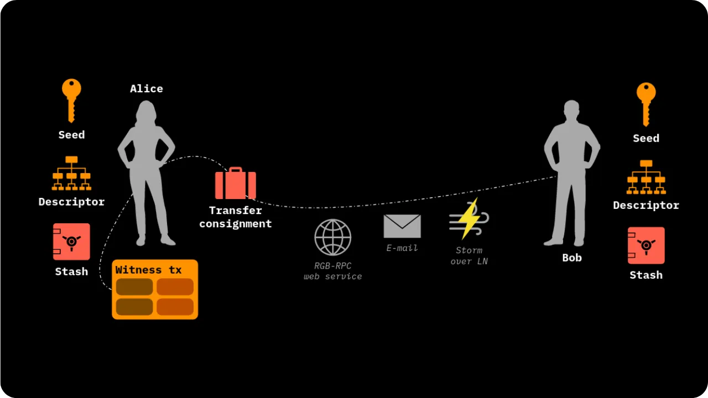


#### 9) Uburyo: Bob arungika ivyemeza kwa Alice (*igitabu c'amahera*)


Nimba Bob abishaka, arashobora gusubiza icogikumu kwa Alice. Ivyo vyerekana:


- Ko yemera ko iyo mpinduka ari ngirakamaro;
- Ko yemera ko igikorwa ca Bitcoin gishirwa ahabona.


Ivyo si ngombwa, ariko birashobora gutuma Alice yizera ko ata ntambara zizokurikira ku bijanye n’uguhindurwa.


#### 10) Alice ishira umukono kandi atangaza ivy’ugucuruza


Alice ashobora rero:


- Gusuzuma ikidodo ca Bob (`RGB suzuma <sig>`);
- Gusinya kw' *Ihanahanwa ry'icabona* ikiri ikimenyetso ca PSBT (`Ikimenyetso c'ingodo`);
- GusohoraIhanahanwa ry'icabona ku rubuga rwa Bitcoin (`-sohora`).


```bash
alice$ rgb check <sig>
alice$ wallet sign —publish tx.psbt
```


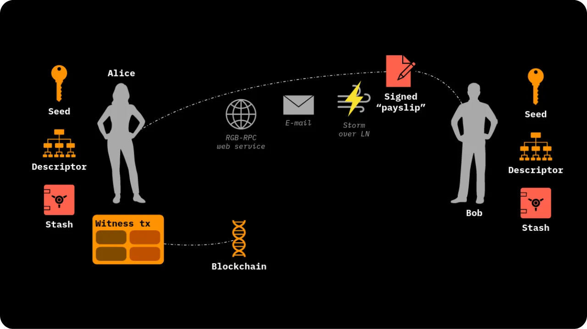


Iyo yemejwe, iyo nzira y’ugucuruza ikimenyetso c’iherezo ry’ugutanga. Bob aba ari we nyen’umutungo mushasha: ubu afise Ikintu gifashwe munzira yerekana UTXO igenzura, ivyo bikaba vyemezwa n’ukubaho kw'ukwiyemeza mu gucuruza.


Mu ncamake, ng’iyi inzira yose yo kwimurira:


### Akamaro kokurungika na RGB


- **Ibanga**:


Alice na Bob nibo bonyene bashobora kuronka amakuru yose y'ihinduka. Bahanahanira ano makuru hanze ya Blockchain, biciye mukurugikwa. Ivyemezo vy’ubuhinga bwa none bw'ukunyegeza inkuru, mwihanahanwa rya Bitcoin ntibishira ahabona ubwoko b'imitungo canke igitigiri c'amahera, ivyo bikaba bitanga ibanga rikingiwe cane kuruta ibindi izindi sisitemu y'ama token yokuri On-Chain.


- **Kwemeza uruhande rw'umuguzi**:


Bob arashobora kugenzura ukuntu ivyo kurungika abigereranije n' **Ibirungikwa** n'ibishinga imizi muri Blockchain ya Bitcoin. Ntakeneye kobirinda biremezwa n'umuntu n'uwundi. Alice ntibikenewe ko yirigwa arashira kukarubandaa kahise kose kuri Blockchain, ivyo bigabanya umuzigo ku bijanye nuko n'umurongo w'ishimikiro kandi bikongerereza ibanga.


- **Ugucagagura muduce vyoroshe**:


Ihanahanwa rigoye (ihanahanwa ry'uduce dutoyi hagati ya BTC n'umutungo wa  RGB, nk’akarorero) rishobora gukorwa mw'ihanahanwa rimwe, bikirind gukenera inyandiko za HTLC canke PTLC. Iyo amasezerano adashizwe ahabona, umuntu wese arashobora gusubira gukoresha ama UTXO yiwe mu bundi buryo.


### Igishushanyo c'incamake c'ukurungika


Imbere yo kuraba amafagitire mu buryo bwimbitse, ng’iki igishushanyo c’incamake c’urugendo rwose rw’uguhanahana ama RGB:


- Bob arashiramwo ingodo ya RGB maze akakoronka amasezerano y'ibanze y'ukurungika;
- Bob aratanga fagitire ashiramwo UTXO aho yakirira umutungo;
- Alice arakira fagitire, akubaka PSBT maze hagatanga ahogushiriramwo hanyuma;
- Bob aravyemera, agasuzuma, akongerako amakuru kuri Stash yiwe, agashirako umukono (*payslip*) iyo bikenewe;
- Alice arashira kukarubanda ihanahanwa kurubuga rwa Bitcoin;
- Ukwemeza ihanahanwa  bituma ukurungika bija mumatgeko.


Irungikwa ryerekana ububasha bwose n’ugudhonora guhinduka kw’amasezerano ya RGB: Ihanahanwa ryigenga, ryrmrjwe kuruhande rw'umukiriya, ishizweho mu buryo buke kandi bw'ibanga ryinshi kuri Blockchain ya Bitcoin, kandi igumya umutekano mwiza w’amasezerano (nta woba bw'uko umuntu ashobora kuriha kabiri). Ivyo bituma RGB iba ikibanza ciza co gutanga agaciro k’ibintu bifise ibanga kandi bishobora guhindurwa kuruta blockchain za  On-Chain  zishobora gukoreshwa.


### Fagitire ya RGB


Muri kano gace, tuzosigura mu buryo bwimbitse ingene **amafagitire** akora mumuryango wa RGB n'ingene ashoboza ibikorwa (Vy'umwihariko) bikorwa vy'amasezerano. Ubwa mbere, turaza kuraba ibimenyetso bibiranga bikoreshwa, hanyuma turabe ingene bishirwa muma kode, hanyuma turabe uko fagitire imeze ishirwa ahabona nk’URL (uburyo bubereye gukoreshwa mungodo).


#### Ibiranga n'ugushira muma kode


Ikimenyetso kidasanzwe kirasigurwa kuri kimwe muribimwe mubikwirikira :


- Amasezerano ya RGB;
- N'igicapo (uko ishoramari rimeze);
- Ahakorerwa ibintu n'aho bishirirwa hanze;
- N'imitungo (token, NFT, n’ibindi),


Ukukwisa n'ikintu gihambaye cane, kuko burigace ka sisitemu gategezwa kwisa. Nk’akarorero, Amasezerano X ntategerezwa gusa n'amasezerano Y, kandi ahakorerwa ibintu bibiri bitandukanye (RGB20 vs. RGB21, nk’akarorero) birategerezwa kuba bifise ibimenyetso bitandukanye.


Kugira ngo ivyo bimenyetso bibe vyiza (vy'igipimo gito) kandi bishobore gusomwa, dukoresha:


- Ishingiro 58 rya kode, irinda gukoresha indome zitera zikora makenga (nk'akarorero `0` n'urudome `O`) kandi itanga imirongo miremire;
- Inyitangizo yerekana kamere y’ikimenyetso, akenshi mu buryo bwa `RGB:` canke URN isa n’iyo.


Nk'akarorero, `Inyidondoro y'amasezerano` yoshobora guserukirwa n'ikintu nk'iki:


```txt
rgb:2WBcas9-yjzEvGufY-9GEgnyMj7-beMNMWA8r-sPHtV1nPU-TMsGMQX
```


Inyitangizo ya `RGB:` yemeza ko iki ari ikimenyetso ca RGB, kandi atari ihuriro rya HTTP canke uwundi murongo. Kubera iyo nyitangizo, ingodo zirashobora gusigura neza urukwirikirane rw'indome.


#### Uduce tw'ivyerekana ibintu


Ivyerekana RGB akenshi aba aribirebire cane, kuko ibiciweko akarongo (ubuhinga bwo) umutekano ushobora gusaba ikibanza vy'uduce dutoyi cana 256 canke turenga. Kugira ngo umuntu ashobore gusoma no kugenzura, *duca* iyo mirongo mu bice vyinshi bitandukanijwe n'akarongo (`-`). Rero, aho kugira uruzitiro rurerure rw’ibimenyetso rudacitse, turarugabanyamwo ibice bigufi. Ico gikorwa kirasanzwe ku bijanye n’ikarata y’inguzanyo canke inomero za telefone, kandi kirakora no ngaha kugira ngo umuntu ashobore kugenzura neza. Rero, nk'akarorero, umukoresha canke umufatanyabikorwa arashobora kubwirwa ati: "*Ndagusavye usuzume ko igice ca gatatu ari `9GEgnyMj7`*", aho kugereranya vyose icarimwe. Igipande ca nyuma gikoreshwa kenshi nk'**iteranywa ry'ugusuzuma**, kugira ngo hagire uburyo bwo kumenya amakosa canke amakosa yo kwandika.


Nk'akarorero, `idanakintu y'amasezerano` mwitanguriro rya 58 rishobora kuba :


```txt
2WBcas9-yjzEvGufY-9GEgnyMj7-beMNMWA8r-sPHtV1nPU-TMsGMQX
```


Imwe muri izo nzira imenagura urukwirikirane rw'indome muduce tumwetumwe. Ivyo ntibigira ico bikoze ku nsobanuro y’itegeko, ahubwo bigira ico bikoze ku kuntu ryerekanwa gusa.


#### Gukoresha ama URLs ku mafagitire


Fagitire ya RGB itangwa nka URL. Ivyo bisigura ko umuntu ashobora kuyifyondako canke kuyisikana (nk’uko ari kode ya QR), hanyuma ingodo ishobora kuyitahura ata guca ku ruhande kugira ngo umuntu akore ihanahanwa. Ukwo gukorana kworoshe gutandukanye n’izindi nzira zimwe zimwe aho utegerezwa gukopa no gushiramwo amakuru atandukanye mu bice bitandukanye vyo muri porogarama.


Fagitire ku token ishobora guhinduka (nk'akarorero token ya RGB20 ) ishobora gusa n'iyi:


```txt
rgb:2WBcas9-yjzEvGufY-9GEgnyMj7-beMNMWA8r-sPHtV1nPU-TMsGMQX/RGB20/100+utxob:egXsFnw-5Eud7WKYn-7DVQvcPbc-rR69YmgmG-veacwmUFo-uMFKFb
```


Reka twihweze neza ino URL:


- `RGB:`** (inyitangizo): yerekana ihuriro rikoresha umurongo wa RGB (bisa n'ivyo `http:` canke `Bitcoin:` mu bindibintu);
- **igereranya**: igereranya `indangurakintuy'amasezerano` ya token ushaka gukoresha;
- `/RGB20/100`: yerekana ko `RGB20` Ahakorerwa ibintu hakoreshwa kandi ko ibice 100 vy'umutungo bisabwa. Inndime  ni: `/Ahakorerwa ibintu/Igitigiri`;
- `+utxob:`**: insiguro yuko amakuru yerekeye uwuronka UTXO (canke, mu buryo bubereye, insobanuro ya Serire ikoreshwa rimwe) yongeweko;
- **Serire**: iyi ni *blinded* UTXO (canke SInsiguro ya Serire). Mu yandi majambo, Bob yarapfutse UTXO yiwe nyayo, rero uwuyirungitse (Alice) ntazi ico Aderesi nyayo ari co. Azi gusa ko hariho Serire ikora yerekeza kuri UTXO igenzurwa na Bob.


Kuba vyose bikwira muri URL imwe bituma ubuzima bworoha ku muntu abikoresha: gufyonda canke gucapura ingodo, igikorwa kikaba giteguwe gukorwa.


Umuntu yoshobora kwiyumvira uburyo aho igiharuro coroshe (nk'akarorero `USDT`) gikoreshwa aho gukoresha `Indangamuntu y'amasezerano`. Ariko ivyo vyotuma haba ingorane zikomeye z’ukwizigirana n’umutekano: igiharuro si ikintu kidasanzwe (amasezerano menshi yoshobora kuvuga ko yitwa `USDT`). Na RGB, turashaka ikimenyetso kidasanzwe, kitagiramwo amakenga. Ni co gituma kwemera urukwirikirane rw'indome rw’ibice 256, rwashizwe muri base58 kandi rwaciwemwo ibice. Uwukoresha arazi ko ariko arakoresha neza na neza Indangakintu y'amasezerano yayo ari `2WBcas9-yjz...` atari uwundi.


#### Ibindi bipimo vya URL


Ushobora kandi kwongerako ibindi bipimo kuri URL, mu buryo bumwe na HTTP, kurya kwa :


```txt
rgb:2WBcas9-yjzEvGufY-9GEgnyMj7-beMNMWA8r-sPHtV1nPU-TMsGMQX/RGB20/100+utxob:egXsFnw-5Eud7WKYn-7DVQvcPbc-rR69YmgmG-veacwmUFo-uMFKFb?sig=6kzbKKffP6xftkxn9UP8gWqiC41W16wYKE5CYaVhmEve
```


- `?sig=...`: igereranya, nk'akarorero, umukono ufitaniye isano na Invoice, uwo amasakoshi amwe amwe ashobora kugenzura;
- Iyo Wallet idacungera iyo sinyatire, yirengagiza gusa iyo parametere.


Reka dufate urugero rwa NFT biciye ahantu hakrerwa ha RGB21. Nk’akarorero, twoshobora kuba dufise:


```txt
rgb:7BKsac8-beMNMWA8r-3GEprtFh7-bjzEvGufY-aNLuU4nSN-MRsLOIK/RGB21/DbwzvSu-4BZU81jEp-E9FVZ3xj-cyuTKWWy-2gmdnaxt-ACrS+utxob:egXsFnw-5Eud7WKYn-7DVQvcPbc-rR69YmgmG-veacwmUFo-uMFKFb
```


Aha turabona:


- `RGB:`**: Inyitangizo ya URL;
- 7BKsac8-beMNMWA8r-3GEprtFh7-bjzEvGufY-aNLuU4nSN-MRsLOIK: Ikiranga amasezerano (NFT);;
- **rGB21**: Ahakorerwa ibintu humutungo udasubirizwa  (NFT);
- **`DbwzvSu-4BZU81jEp-...`**: ivyerekeye igice kidasanzwe ca NFT, nk'akarorero Hash y'amakuru (ikimenyeshamakuru, ahabikwa amakuru...);
- `+utxob:egXsFnw-...: insiguro ya Serire.


Iciyumviro ni kimwe: kurungika linki Ingodo ishobora gutahura, rugaragaza neza umutungo udasanzwe uzorungikwa.


#### Ibindi bikorwa biciye kuri URL


URLs za RGB ntizikoreshwa gusa mu gusaba kurungika. Bashobora kandi gushiramwo ibikorwa biteye imbere cane, nk’ugutanga ama token mashasha (*issuance*). Nk'akarorero:


```txt
rgb:2WBcas9-yjzEvGufY-9GEgnyMj7-beMNMWA8r-sPHtV1nPU-TMsGMQX/RGB20/issue/100000+utxob:egXsFnw-5Eud7WKYn-7DVQvcPbc-rR69YmgmG-veacwmUFo-uMFKFb
```


Aha niho dusanga:


- `RGB:`: urukwirikirane;
- `2Ibibazo9-...`: Ikiranga amasezerano;
- `/RGB20/ikibazo/100000`: yerekana ko ushaka guhamagara "*Ikibazo*" kugira ngo ukore ayandi ma token 100.000;
- `+Igisubizo:`: Insiguro ya Serire.


Nk'akarorero, Ingodo ishobora gusoma ngo: "Nasabwe gukora igikorwa co gukuraho ikibazo kuva ahakorerwa ibintu `RGB20`, kumasezerano nk'iyo, ku bice 100.000, ku nyungu y'amasezerano nk'iyo".


None ko twabonye Ibintu nyamukuru ya porogarama ya RGB, nzobajana mu kigabane gikurikira ku buryo bwo gukora amasezerano ya RGB.


## Kwandika amasezerano ya smart contracts


<chapterId>0e0a645c-0049-588d-8965-b8c536590cc9</chapterId>


:::id ya videwo=a3ad6dcd-90b8-4272-9dfc-76c85c859167::


Muri iki gice, tuzofata intambwe ku yindi uburyo bwo kwandika Amasezerano, dukoresheje igikoresho c'umurongo w'amabwirizwa `RGB`. Intumbero ni ukwerekana ingene woshiramwo no gukoresha CLI, ugakoranya **Igicapo**, ​​ugashiramwo **Ahakorerwa ibintu** na **Aho ibintu bishirirwamungiro**, hanyuma ugatanga (*ugutanga*) umutungo. Turaza kuraba kandi ivyiyumviro bishingiyeko, harimwo n’ugukoranya n’ugushingira intahe. Mu mpera z’iki gice, ukwiye kuba ushoboye gusigura iyo nzira no kwikorera amasezerano yawe bwite ya RGB.


Nk’ukwibutsa, ubuhinga bwo mu mutima bwa RGB bushingiye ku masomero ya Rust mwebwe nk’abahinguzi, mushobora kwinjiza mu migambi yanyu kugira ngo mucunge igice c'Ukwemeza kuruhande rw'umukiriya. Ikindi, umugwi w’ishirahamwe LNP/BP uriko urakora ibijanye n’ugufatanya ibitabu vy’izindi ndimi, ariko ivyo ntibiraheza. Ikindi, izindi nzego nka Bitfinex ziriko zirategura ibirundo vyazo vy’ubufatanye (ivyo tuzobivuga mubigabane 2 vya nyuma vy’icirwa). Kugeza rero, `RGB` CLI ni co gikoreshwa mu buryo butegekanijwe, naho coba kiguma kidasukuye cane.


### Gushiramwo no gushikiriza igikoresho ca RGB


Itegeko nyamukuru ryitwa gusa `RGB`. Igenewe kwibutsa `git`, ifise amategeko mato mato yo gukoresha amasezerano, kuyahamagara, gutanga itunga n'ibindi. Ingodo ya Bitcoin ubu ntabwo iri muri iyo nkuru, ariko izoba iri mu nsiguro iri hafi (0.11). Iyi verisiyo ikurikira izotuma abakoresha bashobora gukora no gucunga ingodo yabo (biciye mu bisobanuro) kuva kuri `RGB`, harimwo n'ivya PSBT, guhuza n'ibikoresho vyo hanze (nk'akarorero Hardware Wallet) vyo gutera umukono, no gukorana na porogaramu nka Sparrow. Ivyo bizotuma igikorwa cose co gutanga no kwimurira umutungo coroha.


#### Gushiramwo biciye ku mizigo


Turashiramwo igikoresho muri Rust na:


```bash
cargo install rgb-contracts --all-features
```


(Zirikana: iyo sandugu yitwa `RGB-contracts`, kandi itegeko ryashizweho rizokwitwa `RGB`. Nimba iyo sandugu yitwa `RGB` iba yaramaze kubaho, hariho ugutombora, ni co gituma iryo zina)


Iryo shirwaho rikoranya igitigiri kinini w'ibintu bifise ico biyoboka (nk'ugusesangura amabwirizwa, gushiramwo Electrum, gucunga ibimenyamenya bitagira ubumenyi, n'ibindi).


Igihe gushiramwo birangiye,:


```bash
rgb
```


Gukoresha `RGB` (ata mpamvu) yerekana urutonde rw'amabwirizwa mato ariho, nka `imirongo`, `Igicapo`, `kwinjiza`, `gusohora`, `ikibazo`, `Fagitire`, `kwimurira ububiko`, n'ibindi. ibitabo, ibishushanyo n'ibishirwa mu ngiro), uhitemwo urubuga (Testnet, Mainnet) canke utunganye umukozi wawe wa Electrum.


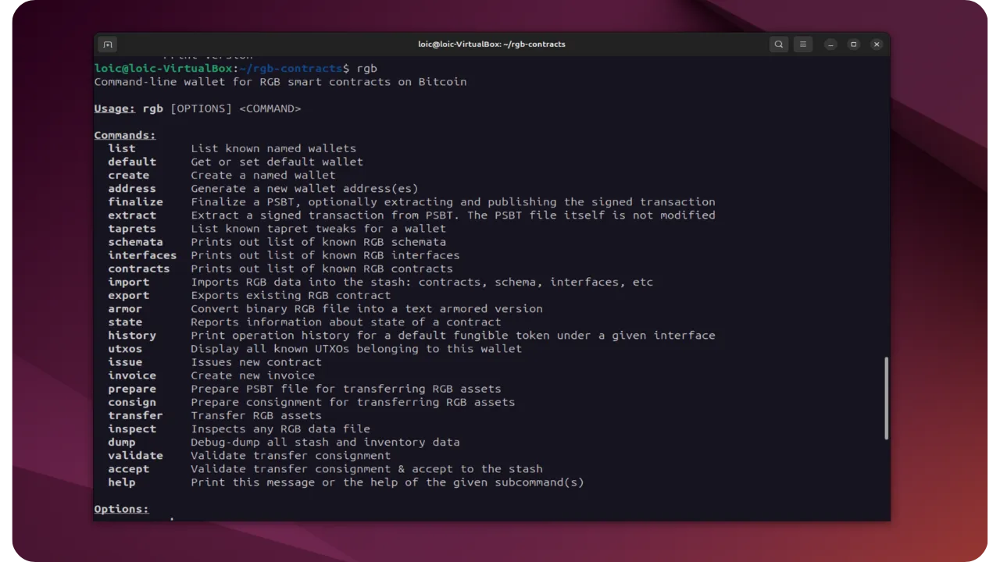


#### Incamake ya mbere y'ibigenzura


Iyo ukoresheje itegeko rikurikira, uzobona ko `RGB20` Ahakorerwa ibintu hasanzwe hinjijwe:


```bash
rgb interfaces
```


Niba aha hakorerwa ibintu hadashizwemwo, idashizwemwo, kora clone ya:


```bash
git clone https://github.com/RGB-WG/rgb-interfaces
```


Bishire hamwe:


```bash
cargo run
```


Hanyuma ushiremwo ahakorerwa ibintu wishakiye:


```bash
rgb import interfaces/RGB20.rgb
```


Ku rundi ruhande, tubwirwa ko atagicapo kirasirwa muri iyo porogarama. Eka mbere ntana masezerano ari mu Stash. Kugira ngo uyibone, koresha itegeko:


```bash
rgb schemata
```


Ushobora rero gukora clone y'ububiko kugira ngo ubone ibishushanyo bimwe bimwe:


```bash
git clone https://github.com/RGB-WG/rgb-schemata
```


Ubu bubiko burimwo, mu bubiko bwayo bwa `src/`, amadosiye menshi ya Rust (nk'akarorero `nia.rs`) asobanura imirongo (NIA ku "*Itunga Ridashobora Gufutwa*", UDA ku "*Itunga ry'Igihugu*", n'ibindi). Kugira ngo ukoreshe, ushobora gukoresha:


```bash
cd rgb-schemata
cargo run
```


Ivyo bituma habaho amadosiye menshi `.RGB` na `.rgba` ahuye n'imirongo yashizwe hamwe. Nk'akarorero, uzosanga `Itunga ridashobora gutera.RGB`.


#### Kuzana ibicuruzwa vy'igicapo n'ahakorerwa ibintu


Ubu ushobora kwinjiza igishushanyo muri `RGB`:


```bash
rgb import schemata/NonInflatableAssets.rgb
```


Ivyo bica biyongera kuri Stash yo mu karere. Nitwakoresha itegeko rikurikira, turabona ko Igicapo ubu kibonetse:


```bash
rgb schemata
```


### Gukora amasezerano (kuyatanga)


Hari uburyo bubiri bwo gukora umutungo mushasha:


- Canke dukoreshe inyandiko canke kode muri Rust yubaka Amasezerano mu gushiramwo ivyicaro vy'Ibicapo (Uko bimeze muri rusangi, Ibifashwe muminwe, n'ibindi) maze igatanga dosiye `.RGB` canke `.rgba`;
- Canke ukoreshe itegeko rito `issue` ataco rihinduye, n'idosiye ya YAML (canke TOML) idondora imiterere ya token.


Ushobora gusanga uburorero muri Rust muri dosiye `ingero`, zigaragaza ingene wubaka `Uwukora Amasezerano`, wuzuze `Uko bimeze murirusangi` (izina ry'umutungo, ikimenyetso, ugutanga, itariki, n'ibindi), usobanure Ibifiswe muminwe (ivyo bifiswe muminwe ari comp it muri vyose-1). *Amasezerano yogushinga uwundi* ushobora kurungika hanze, kwemeza no kwinjiza mu Stash.


Ubundi buryo ni uguhindura n'amaboko dosiye ya YAML kugira ngo uhindure `amakode`, `izina`, `Ako biva`, n'ibindi. Twibaze ko dosiye yitwa `RGB20-demo.yaml`. Ushobora gusobanura:


- `spec`: amakode, izina, gutumbereza;
- `amajambo`: ikibanza c'amatangazo y'amategeko;
- `Ivyasohowe`: igitigiri c'ama token yasohowe;
- `ibikorwa`: vyerekana Serire ikoreshwa rimwe (*Insiguro ya Serire*) n'ingero zifunguwe.


Aha ni akarorero ka dosiye ya YAML yo gukora:


```yaml
interface: RGB20Fixed

globals:
spec:
ticker: Plan ₿ Academy
name: Plan ₿ Academy
details: "Pay attention: the asset has no value"
precision: 2
terms:
text: >
SUBJECT TO, AND WITHOUT IN ANY WAY LIMITING, THE REPRESENTATIONS AND WARRANTIES OF ANY SELLER. PROPERTY IS BEING SOLD “AS IS”...
media: ~
issuedSupply: 100000000

assignments:
assetOwner:
seal: tapret1st:b449f7eaa3f98c145b27ad0eeb7b5679ceb567faef7a52479bc995792b65f804:1
amount: 100000000 # this is 1 million (we have two digits for cents)
```


Hanyuma ukoreshe itegeko:


```bash
rgb issue '<SchemaID>' ssi:<Issuer> rgb20-demo.yaml
```


Ku bijanye nanje, ikimenyetso kidasanzwe c'igicapo (kizoshirwa mu bimenyetso bimwe bimwe) ni `RDYhMTR! Rero itegeko ryanje ni:


```txt
rgb issue 'RDYhMTR!9gv8Y2GLv9UNBEK1hcrCmdLDFk9Qd5fnO8k' ssi:anonymous rgb20-demo.yaml
```


Niba utazi ikiranga Igicapo, koresha itegeko:


```bash
rgb schemata
```


CLI yishura ko hariho Amasezerano mashasha yasohowe kandi yongerwa ku Stash. Nitwandika iri tegeko rikurikira, turabona ko ubu hariho Amasezerano y’inyongera, ihuye n’iyiherutse gusohoka:


```bash
rgb contracts
```


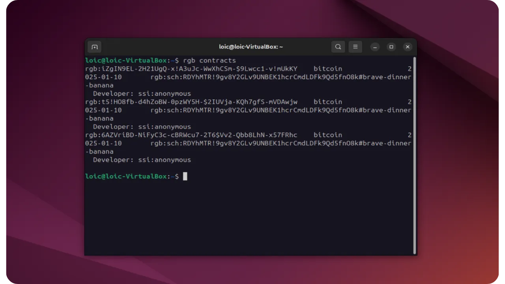


Hanyuma, itegeko rikurikira ryerekana ibihugu vyo kw’isi yose (izina, ikimenyetso, Ahatangirwa ikintu...) n’urutonde rw’ibihugu vy’ubutunzi, ni ukuvuga ivy’ugutanga (nk’akarorero, ibimenyetso vy’imiliyoni 1 `Plan ₿ Academy` vyasobanuwe muri UTXO `b449f7eaa3f98c145b27ad0eeb7b5679ceb567faef7a52479bc995792b65f804:1`).


```bash
rgb state '<ContractId>'
```


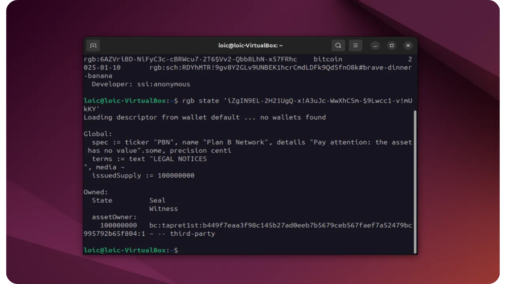


### Gusohora hanze, kwinjiza mu gihugu no kwemeza


Kugira ngo usangire Ayomasezerano n'abandi bakoresha, ushobora kuyirungika hanze kuva kuri Stash ikaja kuri:


```bash
rgb export '<ContractId>' myContractPBN.rgb
```


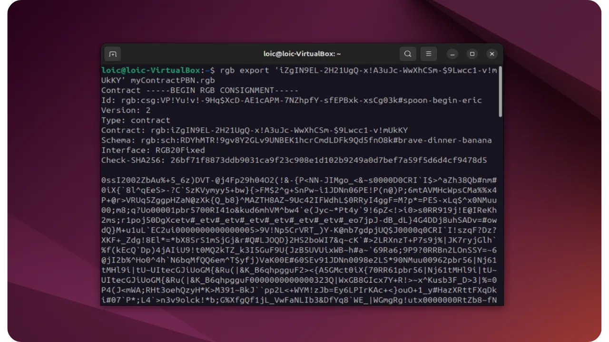


Dosiye `myContractPBN.RGB` ishobora gushikirizwa uwundi mukozi, ashobora kuyishira kuri Stash yiwe n'itegeko:


```bash
rgb import myContractPBN.rgb
```


Ku bijanye no kwinjiza, nimba ari *Amasezerano yogushinga uwundi* yoroshe, tuzoronka ubutumwa "`Kuzana Gushinga uwundi RGB`". Niba ari * Uko gushinga uwundi bihinduka* nini, itegeko rizoba ritandukanye (`RGB yemera`).


Kugira ngo umenye neza ko ari ukuri, ushobora kandi gukoresha igikorwa co kwemeza co mu karere. Nk'akarorero, woshobora kwiruka:


```bash
rgb validate myContract.rgb
```


#### Stash ikoreshwa, kugenzura no kugaragaza


Nk’ukwibutsa, Stash ni urutonde rw’ibintu vyo mu karere vy’imirongo, imirongo, ishyirwa mu ngiro n’amasezerano (Itanguriro + imihindukire). Igihe cose ukoresheje "ukuzana", wongerako ikintu kuri Stash. Iyi Stash ishobora kurabwa mu buryo burambuye n’itegeko:


```bash
rgb dump
```


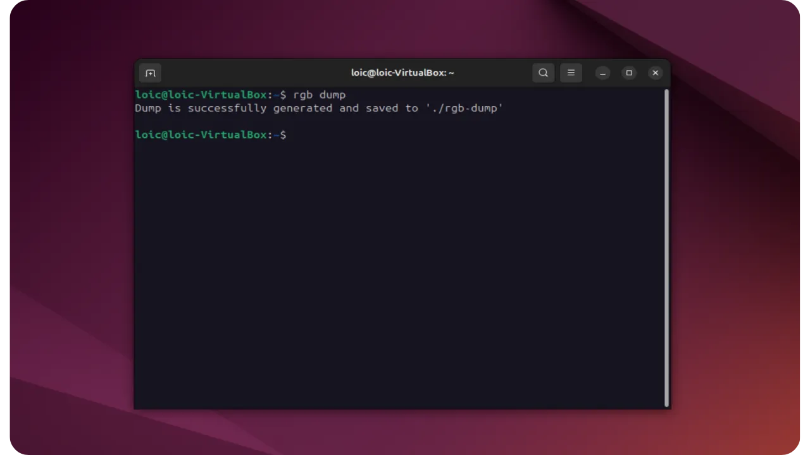


Ivyo bizotuma hashirwaho igira dosiye irimwo amakuru yose ya Stash.


### Kwimurira na PSBT


Kugira ngo ukore ukwimurira, uzokenera gukoresha Ingodo ya Bitcoin yo mu karere kugira ngo ucungere amasezerano ya `Tapret` canke `Opret`.


#### 2013 na 2014


Akenshi, ugukorana hagati y’abaje mu nama y’ubuhinga bwa none (nk’akarorero, Alice na Bob) bibera biciye mu guhingura Ifagitirre. Iyo Alice ashaka ko Bob akora ikintu (kwimurira token, gusubira gusohora, igikorwa muri DAO, n'ibindi), Alice akora fagitire idondora amabwirizwa yiwe kuri Bob. Rero dufise:


- **Igitabu-2021** (uwatanze igitabu-2020);
- **Bob** (ni we yakira kandi agashitsa Fagitire).


Mu buryo butandukanye n’ibindi bidukikije, Fagitire ya RGB ntigarukira ku ciyumviro co kwishura gusa. Ishobora gushiramwo igisabwa cose gifitaniye isano n'amasezerano : gukuraho urufunguzo, gutora, gukora igicapo (*igicapo*) kuri NFT, n'ibindi. Ivyo bishobora gusobanurwa muri kuruhande hakorerwa amasezerano.


Itegeko rikurikira ritanga fagitire ya RGB:


```bash
$ rgb invoice $CONTRACT -i $INTERFACE $ACTION $STATE $SEAL
```


Hamwe:


- `$Contract`: Ikimenyetso c'amasezerano (*Ikiranga amasezerano*);
- `$Interface`: Aj=hakorerwaibintu hashaka gukoreshwa (nk'akarorero `RGB20`);
- `$ACTION`: izina ry'igikorwa kigaragazwa ahakorerwa ibintu (ku bijanye n'uguhindura token, ivyo bishobora kuba "Ukwimurira"). Niba Ahakorerwa ibintu hasanzwe hatanga igikorwa, ntukeneye kugisubiramwo hano;
- `$STATE`: amakuru y'imimerere azokwimurirwa (nk'akarorero, igitigiri c'ibimenyetso iyo token ishobora guhinduka irungitswe);
- `$Seal`: Serireikoreshwa e=rimwe y'uwuronka inyungu (Alice), ni ukuvuga ivyerekeye UTXO. Bob azokoresha aya makuru kugira ngo yubake ihanahanwa ry'icabona, kandi inyishu ihuye izoba iya Alice (mu *blinded UTXO* canke mu buryo butagiramwo amakuru).


Nk’akarorero, n’amabwirizwa akurikira .


```bash
alice$ CONTRACT='iZgIN9EL-2H21UgQ-x!A3uJc-WwXhCSm-$9Lwcc1-v!mUkKY'
alice$ MY_UTXO=4960acc21c175c551af84114541eace09c14d3a1bb184809f7b80916f57f9ef8:1
alice$ rgb invoice $CONTRACT -i RGB20 --amount 100 $MY_UTXO
```


Igikoresho ca CLI kizoba igikoresho ca gutanga ama fagitire nk'iki:


```bash
rgb:iZgIN9EL-2H21UgQ-x!A3uJc-WwXhCSm-$9Lwcc1-v!mUkKY/RGB20/100+utxob:zlVS28Rb-...
```


Ishobora gushikirizwa Bob biciye ku nzira iyo ariyo yose (inyandiko, kode ya QR, n’ibindi).


#### Kwimurira


Kugira ngo ushiremwo iyi fagitire:


- Bob (afise amatokeni mu stash yiwe) afise wallet ya Bitcoin. Ategerejwe gutegura transaction ya Bitcoin (mu buryo bwa PSBT, nk’akarorero `tx.psbt`) ikoresha UTXO zirimo amatokeni ya RGB akenewe, hakiyongerako UTXO imwe y’ivunjisha (change);
- Bob ikora itegeko rikurikira:


```bash
bob$ rgb transfer tx.psbt $INVOICE consignment.rgb
```


- Ibi bitanga dosiye `Consignment.RGB` irimwo:
 - Amateka y’ihinduka yerekana Alice ko ivyo bimenyetso ari ivy’ukuri;
 - Ihinduka rishasha ryimurira ibimenyetso kuri Serire ikoreshwa rimwe rya Alice;
 - Igitabo c'icabona c'amasezerano (kitashizweko umukono).
- Bob yohereza iyi dosiye `Ukubishingisha umuntu.RGB` kuri Alice (biciye kuri e-mail, kuri server yo gusangira canke kuri porotokole ya RGB-RPC, Igihuhusi, n'ibindi);
- Alice yakira `Ukubishingisha umuntu.RGB` kandi ikayemera muri Stash yayo bwite:


```bash
alice$ rgb yemera gushingisha umuntu.rgb
```


- CLI isuzuma ukuri kw'ihinduka maze ikayongera kuri Stash ya Alice. Iyo ataco bimaze, itegeko rirananirwa n'ubutumwa bw'ikosa burambuye. Ahandi ho, biraroranirwa, kandi bikavuga ko iyo nzira y’ugucuruza y’akarorero itaratangazwa ku rubuga rwa Bitcoin (Bob ararindiriye uguhabwa uruhusha kwa Alice);
- Mu buryo bwo kwemeza, itegeko `kwemera` rigarura umukono (*payslip*) Alice ashobora kohereza Bob kugira ngo amwereke ko yemeje *Ugshingisha umuntu*;
- Bob ashobora rero gutera umukono no gutangaza (`--tangaza`) ibikorwa vyiwe vya Bitcoin:


```bash
bob$ rgb check <sig> && wallet sign --publish tx.psbt
```


- Igihe iyo nzira yemejwe On-Chain, Ukwitirirwa umutungo gufatwa nk'ukurungika kwa Alice. Ingodo ya Alice, igenzura ihanahanwa ry'ugucukura, ibona Ibifashwe muminwe bishasha iboneka kuri Stash yayo.


Mu kigabane gikwirikira, tuzokwihweza neza ingene RGB yoshirwa muri Lightning Network.


## RGB kuri Lightning Network


<chapterId>0962980a-8f94-5d0f-9cd0-43d7f884a01d</chapterId>


:::id ya videwo=be25a165-6e23-488c-91d8-3dcfccc6eca1:::


Muri kino kigabane, ndasaba gusuzuma ingene RGB ishobora gukoreshwa muri Lightning Network, mu gushiramwo no kwimurira ivy’ubutunzi bwa RGB (ibimenyetso, NFT, n’ibindi) biciye mu nzira zo kwishura za off-chain.


Iciyumviro nyamukuru ni uko RGB Ihinduka rigenda (*Uko ihinduka rigenda*) ishobora kwiyemeza gukora ihanahanwa rya Bitcoin, naryonyene, rigashibora kuguma ari off-chain gushika umug=hira wa Lightning wugaye. Rero, igihe cose umurongo uvuguruwe, uko RGB ihinduka  nshasha irashobora kwinjizwa mu gikorwa gishasha co gukora, ivyo bikaba bica bihindura ubusa iyo mpinduka ya kera. Muri ubwo buryo, imirongo ya Lightning irashobora gukoreshwa mu gutanga itunga rya RGB, kandi ishobora gukoreshwa mu buryo bumwe n’ubw’amahera asanzwe ya Lightning.


### Ugukora umuhora n'ukwemeza


Kugira ngo dukore umuhora wa Lightning utwara umutungo wa RGB, turakeneye Ibintu bibiri:


- Infashanyo ya Bitcoin yogukora umhora wa 2/2 Multisig y’umurongo (UTXO y’ishimikiro y’umurongo);
- Infashanyo ya RGB, Irungika itunga kuri Multisig nyene.


Mu majambo ya Bitcoin, igikorwa co gutanga amahera kigomba kubaho kugira ngo gisigure igipimo ca UTXO, naho coba kirimwo gusa igitigiri gitoyi ca Sats (ni ikibazo gusa c’umusaruro wose mu bikorwa vy'ukwiyemeza vyo muri kazoza bisigaye hejuru y’umupaka wa Dust wose same). Nk’akarorero, Alice ashobora gufata ingingo yo gutanga ama Sats 10k n'ama USDT 500 (itangazwa nk’umutungo wa RGB). Ku bijanye n'ugutanga amahera, twongerako Ukwiyemeza (`Opret` canke `Tapret`) ishingira intahe uko RGB ihinduka.


Igihe igikorwa co gutanga amahera kimaze gutegurwa (ariko kitaratangazwa), igikorwa c'ukwiyemeza kirakorwa kugira ngo umwe wese mu bagize uruhande ashobore gufunga umuhora ku ruhande rumwe igihe cose. Ivyo bikorwa bisa n'ivyo Ukwiyemeza vya kera vya Lightning, kiretse ko twongerako ikindi gisohoka kirimwo RGB Anchor (OP_RETURN canke Taproot) gihuye n'uko bimeze uguhinduka.


RGB Uguhinduka rero bijanye n'umutungo kuva kuri 2/2 Multisig y'infashanyo ikaja ku biva mukwiyemezakw'ihanahanwa. Ivyiza vy’iyi nzira ni uko umutekano w’ukobimeze ca RGB uhuye neza n’ubuhinga bwo guhana bwa Lightning: iyo Bob atangaje ukobimeze c’umurongo wa kera, Alice arashobora kumuhana no gukoresha igisohoka, kugira ngo asuire ku Sats n’ivyo vyose. Ico kintu gitera intege rero kirakomeye kuruta mbere n’ico mu muhora wa Lightning udafise itunga rya RGB, kuko umusuma ashobora gutakaza atari Sats gusa, ariko kandi n’itunga rya RGB ry’uwo muhora.


Ihanahanwa ry'ukwiyemeza yashizweko umukono na Alice ikarungikwa kwa Bob rero yoba imeze gutya:


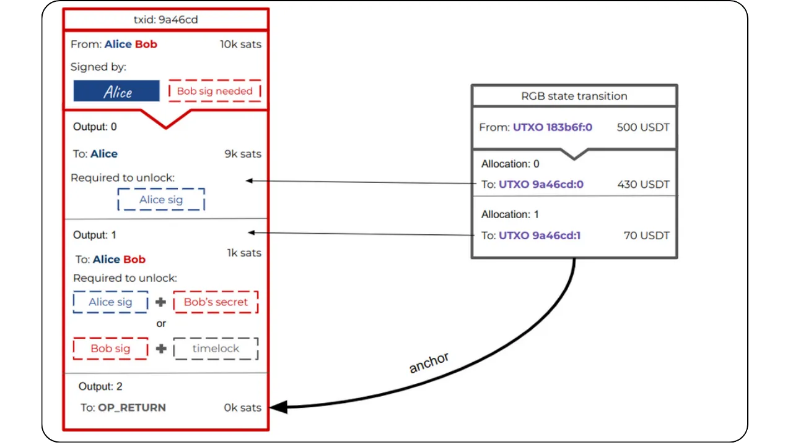


Kandi Ihanahanwa ry'ukwiyemeza , yashizweko umukono na Bob ikarungikwa kwa Alice, izomera uku gukwirikira:


### Ibishasha vy'umuhora


Iyo habayeho ukwishyura hagati y’abafatanyabikorwa bokumuhora babiri (canke bipfuza guhindura ugutanga umutungo), barema umugwi mushasha w’ibikorwa vy'ukwiyemeza. Amafaranga ari muri Sats ku giciro cose ashobora canke ntahinduke, bivanye n’ugushirwa mu ngiro, kuko uruhara rwayo nyamukuru ari ugutuma habaho kwubaka UTXO zifise akamaro. Ku rundi ruhande, igisohoka ca OP_RETURN (canke Taproot) kigomba guhindurwa kugira ngo kibemwo ugushinga imizi kwa RGB gushasha, igereranya ugusangira gushasha kw’itunga mumuhora.


Nk’akarorero, iyo Alice arungitse amadolari 30 kwa Bob mumuhora, Ukobihinduka gushasha hazokwerekana amadolari 400 ku Alice n’amadolari 100 ku Bob. Igikorwa kijanye n'ugusezerana congerwa kuri (canke gihindurwa na) OP_RETURN/Taproot Anchor kugira ngo kigiremwo iyo mpinduka. Mufate yuko, uhereye ku mbonerahamwe ya RGB, ivyo winjiza mu guhindura biguma ari Multisig ya mbere (aho itunga rya On-Chain rihabwa mu vy’ukuri gushika umuhora wi=ugaye). Ivyo RGB isohora (ivy’ugutanga) vyonyene ni vyo bihinduka, bivanye n’ugusubira gusangira vyafashwe ingingo.


Igitabo c'ukwiyemeza kw'uguhanahana cashizweko umukono na Alice, giteguwe gukwiragizwa na Bob:


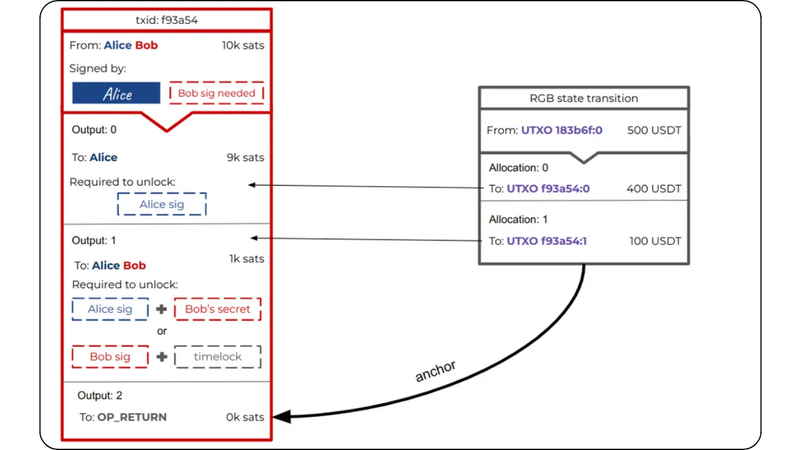


Igitabo c'uguhanahana c'ukwiyemeza cashizweko umukono na Bob, giteguwe gukwiragizwa na Alice:


### Ubuyobozi bwa HTLC


Mu vy’ukuri, Lightning Network iratuma amahera yishurwa ashobora guca mu nzira nyinshi, hakoreshejwe HTLCs (*Amasezerano Apfungiwe n’Igihe*). Ni ko biri no kuri RGB: ku kwishura kwose guca mu muhora, umusaruro wa HTLC wongerwa ku gucuruza, n'ugutanga RGB guhuye n'iyi HTLC. Gutyo, uwuzokoresha umusaruro wa HTLC (bivuye ku banga canke inyuma y’aho igihe co gufunga kirangiriye) arasubirana Sats n’itunga ry’i RGB rijana na ryo. Ku rundi ruhande, biragaragara ko ukeneye kugira amahera ahagije ku nzira mu bijanye n’itunga ryompi Sats na RGB.


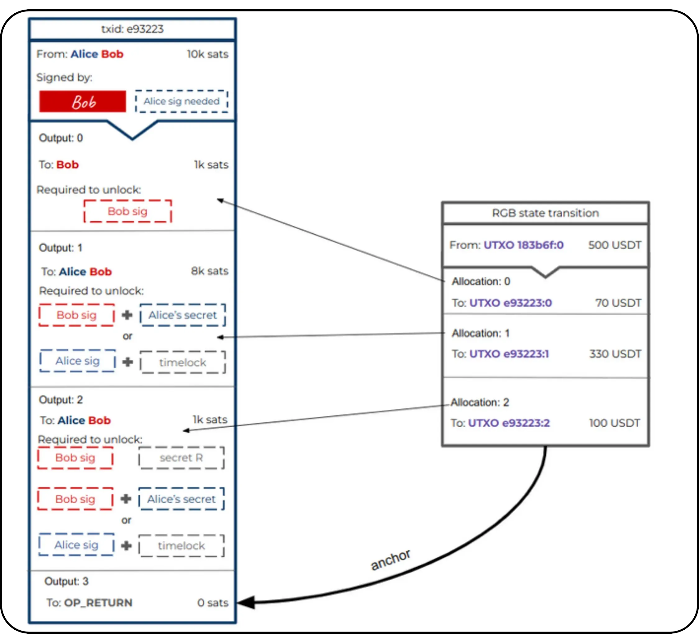


Ivyo RGB ikora kuri Lightning rero bitegerezwa gufatwa nk’uko bihuye n’ivyo Lightning Network ubwayo ikora. Niba wifuza kwihweza cane muri iki cigwa, ndagusavye cane ko uraba iyindi nyigisho yuzuye:


https://planb.academy/courses/34bd43ef-6683-4a5c-b239-7cb1e40a4aeb

### Ikirangamerekero ca kode ya RGB


Ubwa nyuma, imbere yo kuja mu gice gikurikira, ndashaka kubaha icegeranyo c'itegeko rikoreshwa muri RGB. Iryo tegeko rishingiye ku masomero ya Rust n’insiguro y’inkomoko yuguruye. Aha niho hari insiguro y'ububiko nyamukuru n'amasandugu:


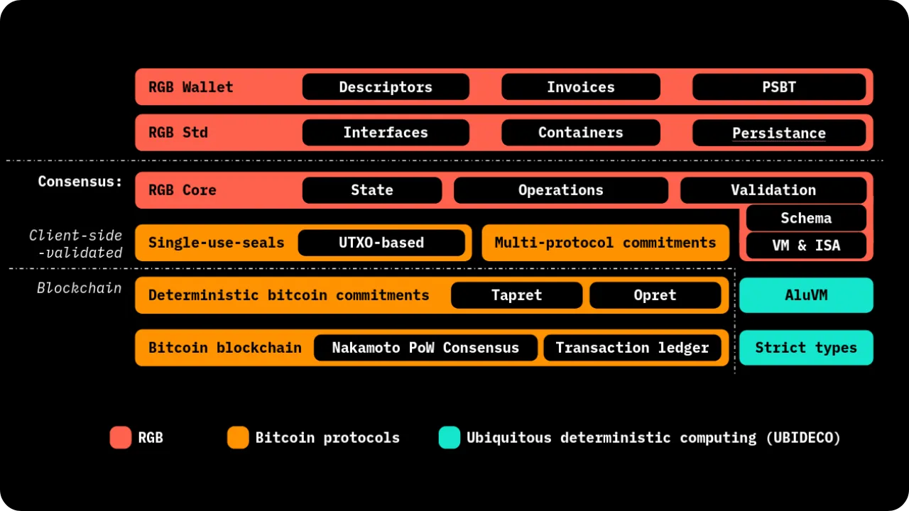


#### Ukwemeza kuruande rw'umukiriya


- **Ububiko**: [kwemeza_uruhande rw'umukiriya](https://github.com/LNP-BP/kwemeza_uruhande_rw'umukiriya)
- **Amasandugu**: [kwemeza_uruhande_rw'umukiriya](https://amasandugu.io/amasandugu/kwemeza_uruhande rw'umukiriya), [ibimenyetso_bikoreshwa_rimwe](https://amasandugu.io/amasandugu/ibimenyetso_bikoreshwa_rimwe)


Uburongozi bw’ukwemeza off-chain n’ubuhinga bwo gukoresha rimwe Seals.


#### Deterministic Bitcoin Commitments (DBC)


- **Ububiko**: [Ishingiro rya bp](Ishingiro ry'Igihugu)
- **Isandugu**: [bp-dbc](https://isanduku.io/isanduku/bp-dbc)


Uburongozi bw’ugushinga intahe mu bikorwa vya Bitcoin (Tapret, OP_RETURN, n’ibindi).


#### Multi Protocol Commitment (MPC)


- **Ububiko**: [kwemeza_uruhande rw'umukiriya](https://github.com/LNP-BP/kwemeza_uruhande_rw'umukiriya)
- **Isandugu**: [gusuzuma_gukora](https://ibisandugu.io/ibisanduka/ugusuzuma_gukora)


Ivyiyumviro vyinshi vy’ugukorana n’ugushiramwo n’amategeko atandukanye.


#### Ubwoko bukomeye n'ugushiramwo amakuru


- **Insiguro**: [urubuga ubwoko-bukomeye.org](https://www.ubwoko-bukomeye.org/)
- **Ububiko**: [ubwoko-bukomeye](https://github.com/ubwoko-bukomeye/ubwoko-bukomeye), [gushiramwo-bukomeye](https://github.com/ubwoko-bukomeye/gushiramwo-bukomeye)
- **Amasandugu**: [ubwoko_bukomeye](https://amasandugu.io/amasandugu/ubwoko_bukomeye), [gushiramwo_amakode](https://amasandugu.io/amasandugu/gushiramwo_amakode)


Uburyo bwo kwandika bukomeye n'urutonde rw'ibintu bikoreshwa kuruhande rw'ukwemeza rw'umukiriya.


#### RGB Ishingiro


- **Ububiko**: [RGB-ishingiro](RGB-Ishingiro)
- **Isanduku**: [RGB-umutima](https://isanduku.io/isanduku/RGB-umutima)


Ishingiro ry’iyo porotokole, rigizwe n’intumbero nyamukuru y’ukwemeza RGB.


#### RGB Ububiko bw'ibitabu busanzwe & Wallet


- **Ububiko**: [Ububiko-2178-ububiko](Ububiko).
- **Isandugu**: [RGB-std](igisandugu.io/isanduku/RGB-igisandugu)


Ivyiyumviro vy’ugushirwa mu ngiro, uburongozi bwa Stash na Wallet.


#### RGB CLI


- **Ububiko**: [Ububiko-2184](Ububiko).
- **Amasandugu**: [RGB-CLI](Isanduku.io/Isandugu/RGB-CLI), [Isandugu-2187-2185]


Ivyo bikoresho bikoreshwa mu gukoresha amasezerano.


#### RGB Schema


- **Ububiko**: [Imirongo ya RGB](Imirongo ya RGB/Imirongo ya RGB/)


Irimwo ingero z’imirongo (NIA, UDA, n’ibindi) n’ingene zishirwa mu ngiro.


#### AluVM


- **Amakuru**: [AluVM.org](urubuga rwacu-2195.org/)
- **Ububiko**: [Ibisobanuro vya AluVM](Ibisobanuro vya AluVM), [Ivyiyumviro](Ivyiyumviro)
- **Amasandugu**: [AluVM](amasandugu.io/amasandugu/AluVM), [amasandugu](amasandugu.io/amasandugu/amasandugu)


Igikoresho gishingiye ku kwandika gikoreshwa mu gukoresha inyandiko zo kwemeza.


#### Urukwirikirane rwa Bitcoin - BP


- **Ububiko**: [bp-core](bp-core), [bp-std](bp-std), [bp-gW-2199](bp-gw-2199)


Ivyongeyeko vyo gushigikira urukwirikirane rwa Bitcoin (ibikorwa, ivy’uguca mu nzira, n’ibindi).


#### Ubiquitous Deterministic Computing  - UBIDECO


- **Ububiko**: [UBIDECO](UBIDECO)


Ibidukikije bifitaniye isano n’iterambere ry’ivy’ubuhinga ry’inkomoko yuguruye.


# Kwubakira kuri RGB


<partId>3b4b0d66-0c1b-505a-b5ca-4b2e57dd73c2</partId>


## DIBA n'umugambi wa Bitmask


<chapterId>dc92a5e8-ed93-5a3f-bcd0-d433932842f4</chapterId>


:::id ya videwo=2ec9a181-a8b0-4da2-b7b5-9dfaaeb10ba:::


kano gace kanyuma k’amashure gishingiye ku nsiguro zashikirijwe n’abatanga insiguro batandukanye mu nama y’ivyigwa ya RGB. Harimwo intahe n’ivyiyumviro ku RGB n’ibidukikije vyayo, hamwe n’ugushikiriza ibikoresho n’imigambi ishingiye kuri urwo rukwirikirane. Iki gice ca mbere kirongowe na Hunter Beast, ibindi bibiri bikurikira na Frederico Tenga.


### Kuva ku nyandiko ya Java gushika kuri Rust, no mubiri muri Bitcoin


Mu ntango, Hunter Beast yakora cane cane mu rurimi rw’igifaransa. Hanyuma abona **Rust**, insiguro y’amajambo yayo yasa n’iyidashimishije kandi ibabaza mu ntango. Ariko rero, yaraje gutahura ububasha bw’ururimi, ukugenzura ubwonko (*heap* na *stack*), n’umutekano n’ubushobozi bijana na vyo. Ashimika ku vy’uko Rust ari ikibanza ciza cane co kwimenyerezamwo kugira ngo umuntu atahure bimwe bigera kure ingene orodinateri ikora.


Hunter Beast avuga ivy’amateka yiwe mu migambi itandukanye mubiri muma *Altcoin*, nka Ethereum (ifise ubukomezi, TypeScript, n’ibindi), hanyuma Filecoin. Asigura ko mu ntango yatangajwe n’amasezerano amwe amwe, ariko amaherezo yumva ko menshi muri yo yamuhemukiye, atari kubera ubuhinga bwayo bwo gukoresha ibimenyetso. Aragaya inkurikizi z’amahera ziteye amakenga, uguhingura ibimenyetso vy’ugutera imbere bitera ubwoba abashoramari, n’umuce ushobora gutuma iyo migambi ikoreshwa nabi. Yaciye rero aheza afata ingingo y' **Ukuba uwemera Bitcoin gusa**, atari ukubera ko hari abantu bamwebamwe bamufunguriye amaso ku buryo bwiza bw’ubutunzi bwa Bitcoin, no ku gukomera kw’iyi nzira.


### Ugusaba kwa RGB no kwubaka ku bipande


Ico camujijuye ata gukeka ko Bitcoin ifise akamaro, mu majambo yiwe, ni ukuvumbura RGB be n’iciyumviro c’ibice. Yemera ko ibikorwa biriho ku bindi bice vy’umubiri bishobora gusubirwamwo ku bice vy’imbere, hejuru ya Bitcoin, ata guhindura umurongo w’ishimikiro.


Muri Ruhuhuma 2022, yinjiye muri **DIBA** kugira ngo akore cane cane kuri RGB, na cane cane kungodo yitwa **Bitmask**. Iciyo gihe, Bitmask yari ikiri kuri verisiyo 0.01 kandi yariko ikoresha RGB kuri verisiyo 0.4, gusa ku bijanye no gucunga ibimenyetso bimwe bimwe. Avuga ko ivyo vyari bishingiye cane ku kwizigama nk’uko biri muri iki gihe, kuko ivyiyumviro vyari bishingiye ku serveri(Ahabikwa ibintu). Kuva ico gihe, ubwubatsi bwarateye imbere buja kuri iyo nzira, ishimwa cane n’abakoresha Bitcoin.


### Inshimikiro ry'amasezerano ya RGB


Itegeko rya **RGB** ni ryo rishasha kandi riteye imbere cane ry'iciyumviro c'ibiceri vy'amabara, ryaramaze gusuzumwa nko mu 2012-2013. Iciyo gihe, amashirahamwe menshi yariko ararondera gufatanya agaciro gatandukanye ka Bitcoin ku UTXO, ivyo vyatumye habaho ugushirwa mu ngiro kwinshi gutandukanijwe. Ukwo kutagira urugero n’ugusaba guke ico gihe vyatumye ivyo bisubizo bitaronka ikibanza kiramvye.


Ubu, RGB irahagaze kubera ubukomezi bwayo bw’ivyiyumviro n’insiguro vy’ubumwe biciye ku shirahamwe rya LNP/BP. Iryo hame rishingiye kukwemeza kuruhande rw'umu kiriya. Blockchain ya Bitcoin ibika gusa amasezerano y’ubuhinga bwa none (_amasezerano_, biciye kuri Taproot canke OP_RETURN), mu gihe amakuru menshi (Insiguro y'amasezerano, kahise yo kwimurira, n’ibindi) abikwa n’abakoresha biraba. Muri ubwo buryo, umuzigo wo kubika uragabanywa kandi ibanga ry’uguhanahana rirakomezwa, ata kuremerera Blockchain. Ubu buryo burashoboza kurema ibintu bishobora guhinduka (**RGB20** standard) canke ibintu bidasanzwe (**RGB21**), mu rwego rw’ibice kandi bishobora guhindurwa.


### Ibikorwa vya token (RGB20) n'ibintu bidasanzwe (RGB21)


Na **RGB20**, dusobanura token ishobora guhinduka kuri Bitcoin. Uwutanga amafaranga ahitamwo _ugutanga_, _ugutanga_, agaca akora _amasezerano_ ashobora guca akoramwo amafaranga. Igihe cose umuntu yimuriwe, akoresheje Bitcoin UTXO, ikora nk’igitabu ca *Serire ikoreshwa rimwe*. Ivyo bituma uwukoresha atazoshobora gukoresha umutungo umwe incuro zibiri, kuko umuntu wenyene ashobora gukoresha UTXO ari we afise urufunguzo rwo guhindura uko Amasezerano ameze ku ruhande rw'umukiriya.


**RGB21** igamije ivy'ubutunzi bidasanzwe (canke "NFT"). Ico kintu gifise Ugushiraho ya 1, kandi gishobora gufatanywa n’amakuru (dosiye y’amashusho, amajwi, n’ibindi) adondora biciye mu kibanza kinaka. Udakunze NFTs ku blockchains za bose, amakuru n’ibimenyetso vyayo vya MIME birashobora kuguma ari ivy’ibanga, bigakwiragizwa n’abandi ku bushake bwa nyen’ivyo bikoresho.


### Umuti w'ibipfukisho: Ingodo  ya RGB


Kugira ngo ubushobozi bwa RGB bukoreshwe mu bikorwa, umugambi wa **DIBA** warateguye Ingodo yitwa [Bitmask](https://bitmask.app/). Iciyumviro ni ugutanga igikoresho kitagira ububiko, gishingiye kuri Taproot, gishobora kuboneka kurubuga ngurukana bumenyi canke nk’igikoresho co kwagura murandasi. Bitmask icungera ivy'ubutunzi vya RGB20 na RGB21, kandi igashiramwo uburyo butandukanye bwo gucungera umutekano:


- Itegeko ry’ishimikiro ryanditswe muri Rust, hanyuma rikakoranywa muri ahahurira za Murandasi kugira ngo rikore mu bidukikije vya JavaScript (React);
- Imfunguruzo zikorerwa indani, hanyuma hakanyegezwa inyandikomukarere;
- Amakuru y'uko bimeze (Stash) abikwa mububiko bwa murandasi, akurikiranwa kandi ashirwa mu mfuruka biciye mu bubiko bw'ibitabu bwa **Carbonado**, bukora igikorwa co gufatanya, gukosora amakosa, inyandiko zinyegejwe, hama zikarabwa zigasuzumirwa kuri  Blake3.


Kubera iyo nyubakwa, ihanahanwary'imitungo ryose ribera kuruhande rw'umukiriya. Uvuye hanze, ihanahanwa rya Bitcoin nta kindi ariko n'ihanahanwa rya kera ryogukoresha gukoresha amahera ya Taproot, ata n’umwe yokwikeka ko naryo nyene rifise uguhindura ibimenyetso canke NFTs. Kuba ata On-Chain irengeje urugero (ntabushinguzi bw'amakuru bubikwa ku mugaragaro) biremeza urugero runaka rw’ubukerebutsi kandi bituma vyoroha kunanira ukugerageza gucengera gushoboka.


### Umutekano n'ubwubatsi busabikanijwe


Kubera ko urukwirikirane rwa RGB rusaba ko uwuriko arakora wese aguma afise kahise k'ibikorwa vyiwe vyiwe (kugira ngo yerekane ko amafaranga yarungitswe ari ayukuri), ikibazo co kubika kiravyuka. Bitmask isaba gushiramwo iyi Stash Indani, hanyuma ikayirungika kubushinguzi bwinshi canke ku bicu (ntibikenewe). Amakuru aguma apfutse n'uwukoresha biciye kuri **Carbonado**, rero umukozi ntashobora kuyasoma. Iyo habayeho ugusenyuka kw’igice, ugukosora amakosa Layer kurashobora gusubiramwo inyandiko zirimwo.


Ikoreshwa rya CRDT (_Ubwoko bw'amakuru asubiyemwo ata ngorane nimwe_) rituma verisiyo zitandukanye za Stash zishobora guhurizwa hamwe, iyo zishobora gutandukana. Umuntu wese arafise umwidegemvyo wo kwakira ayo makuru aho yipfuza hose, kuko ata node yose afise n’imwe itwara amakuru yose afitaniye isano n’ico kintu. Ivyo vyerekana neza na neza filozofiya ya *y'ukwemeza kuruhande rw'umukiriya*, aho nyen’umutungo wese afise inshingano yo kubika ibimenyamenya vy’ukuri kw’umutungo wiwe wa RGB.


### Ku bijanye n'ibirihafi y'urwo ruganda: akaguriro, ugukorana n'abandi n'ibikorwa bishasha


Ishirahamwe riri inyuma ya Bitmask ntirigarukira kugukora gusa Ingodo. DIBA ifise umugambi wo guteza imbere:


- **Akaguriro** ko guhanahana ama token, cane cane mu buryo bwa **RGB21**;
- Guhuza n’izindi ngodo (nk' *ingodo yitwa Iris*);
- Ubuhinga bwo gushiramwo irungika rikwirikirana rya RGB mw'ihanahana rimwe.


Muri ico gihe nyene, turiko turakora ku **WebBTC** canke **WebLN** (ingingo ngenderwako zishoboza imbuga gusaba Ingodo guterako ikidodo ku masezerano ya Bitcoin canke Lightning), hamwe n'ubushobozi bwo "gukoresha teleburn" ivyinjijwe vya Bitcoin (niba dushaka gusubiza mu gihugu ca Wallet).


### Gusozera


Ivyo vyose vyerekana ingene ubuhinga bwa RGB bushobora gukoreshwa no gushikira abakoresha biciye mu gutorera umuti ibibazo bikomeye. Ihinduka kuva kumbono ya Altcoin gushika kumbono ishingiye kuri Bitcoin, hamwe n’ukuvumbura *Ukwemeza kuruhande rw'umukiriya*, vyerekana inzira yumvikana neza: turatahura ko bishoboka gushirwa mu ngiro ibikorwa bitandukanye (ibimenyetso bishobora guhinduka, NFT, amasezerano y’ubwenge ya GW by-5...) ata2. y'imihigo y'ibanga ku bikorwa vya Taproot canke OP_RETURNs.


**Bitmask** Ingodo ni kimwe muri iyo nzira: ku ruhande rwa Blockchain, ivyo ubona vyose ni ugucuruza kwa Bitcoin gusanzwe; ku ruhande rw'ukoresha, ukoresha urubuga rwahakorerwa ibintu aho urema, Ihanahanwa kandi ukabika ubwoko bwose bw'itunga rya off-chain. Ico kigereranyo gitandukanya neza uko amahera ateye (Bitcoin) n’ubuhinga bwo gutanga no gutanga (RGB), mu gihe kigaragaza urugero rwo hejuru rw’ibanga n’ugushobora gutera imbere neza.


## Ibikorwa vya Bitfinex kuri RGB


<chapterId>d4d80e07-5eac-5b29-a93a-123180e97047</chapterId>


:::id ya videwo=04555813-516f-4eea-9767-7082c2ea6f01:::


Muri iki gice, twisunze ikiganiro ca Frederico Tenga, turaba urutonde rw’ibikoresho n’imigambi yashizweho n’umugwi wa Bitfinex wiyeguriye RGB, n’intumbero yo guteza imbere uguseruka kw’ibidukikije vy’ubutunzi kandi bitandukanye bikikuje iyo porotokole. Intumbero y’intango y’iryo tsinda si ugusohora igicuruzwa c’ubudandaji kanaka, ahubwo ni ugutanga ibice vy’inyubako vya porogarama, gutanga intererano ku masezerano ya RGB ubwayo, no gutanga ibimenyetso vy’ukuri vyo gushirwa mu ngiro nk’igikoresho gikora neza (*ingodo yitwa Iris *) canke igikoresho gishobora gukoreshwa na RGB-com.


### Inyuma n'intumbero


Kuva nko mu mwaka w’2022, ikigo ca Bitfinex RGB caramaze kwibanda ku gutegura urutonde rw’ubuhinga bufasha RGB gukoreshwa no kugeragezwa neza. Hariho intererano nyinshi zatanzwe:


- Ukwifatanya mu gutanga kode y’inkomoko n’insiguro y’amasezerano, harimwo kwandika ivyiyumviro vyo kwongereza ubushobozi, gukosora ibibazo, n’ibindi;
- Ibikoresho vy’abahinguzi kugira ngo borohereze gushiramwo RGB mu bikorwa vyabo;
- Guhingura igikoresho gikora neza citwa [Iris](https://iriswallet.com/) kugira ngo kigerageze kandi kigaragaze uburyo bwiza bwo gukoresha igikoresho citwa RGB;
- Guhingura node ya Lightning isanzwe, ishobora gucungera neza umuhora w'umutungo wa RGB;
- Gushigikira iyindi migwi yubaka inyishu kuri RGB, kugira ngo baremeshe ubudasa hamwe n'umura=yango ukomeye.


Ubu buryo bufise intumbero yo gupfuka uruhererekane rwose rw’ivyo bikenewe: kuva ku bubiko bw’ibitabu bwo ku rugero ruto (*[RGBlib]*), bikaba bishoboza gushirwa mu ngiro Ingodo, Ingodo, G6W node2 n’ibindi).


### Ububiko bw'ibitabu bwa RGBlib: kworohereza iterambere ry'ibikorwa vya RGB


Iciyumviro gihambaye mu gutuma habaho ukwigenga mugukora ingodo ya RGB n’ibikorwa ni ugutuma habaho ukwibanda kubikenewe gusa yoroshe bihagije kugira ngo abahinguzi ntibabwirizwe kwiga vyose ku bijanye n’ubuhinga bwo mu mutima bw’iyo porotokole. Iyi ni yo ntumbero ya **RGBlib**, yanditswe muri Rust.


RGBlib ikora nk’ikiraro hagati y’ibisabwa bishobora guhinduka cane (ariko rimwe na rimwe bikomeye) vya RGB twashoboye kwiga mu bice vya kera, n’ivyo umuhinguzi w’ibikorwa akeneye vy’ukuri. Mu yandi majambo, Ingodo (canke igikorwa) yipfuza gucunga token yoherezwa, gutanga umutungo, kugenzura, n’ibindi, irashobora kwizigira RGBlib itazi ido n’ido ryose ry’ibanga canke ubuhinga bwose bwa RGB bushobora guhindurwa.


Iduka ry’ibitabu ritanga:


- Ibikorwa vy’ugutanga (_issuance_) ivy’ubutunzi (bishobora guhinduka canke bitahinduka);
- Ubushobozi bwo kurungika (kohereza/kwakira) itunga hakoreshejwe ibintu vyoroshe (amaderesi, amafaranga, UTXOs, n’ibindi);
- Uburyo bwo kubika no gushiramwo amakuru y'uko bimeze (*ibirungikwa*) bisabwa kuri Ukwemezwa kuruhande rw'umuguzi.


RGBlib rero yizigira ivyiyumviro bikomeye vyihariye kuri RGB (Ukweza kuruhande rw'umukiriya, guhinga imizi kwa Tapret/Opret), ariko ikabishiramwo kugira ngo igikorwa ca nyuma ntikibwirizwe gusubira gutegura vyose canke gufata ingingo zishobora gutera ingorane. Ikindi, RGBlib irasanzwe iboshe mu ndimi nyinshi (Kotlin na Python), ukwi=ugurura imiryango kw’ikoreshwa rirenze isi yoroshe ya Rust.


### Ingodo yitwa Iris: akarorero k'ingodo ya RGB kuri Android


Kugira ngo RGBlib yerekane ko ikora neza, ikigo ca Bitfinex carateguye **Ingodo yitwa Iris**, kikaba ari kuri Android gusa muri iki gihe. Ni Wallet igendagenda yerekana ubumenyi bw’ukoresha busa n’ubw’ingodo ya  Bitcoin isanzwe: urashobora gutanga umutungo, ukawurungika, ukawakira, no kuraba amateka yawo, mu gihe uguma ku citegererezo co kwizigama.


Iris ifise ibintu bitari bike bishimishije:


**Gukoresha ubushinguzi bwa Electrum:**


Cokimwe n'Ingodo iyo ari yo yose, Iris arakeneye kumenya ivyerekeye ivyemezo vy'amafaranga kuri Blockchain. Aho gushiramwo node ikwiye, Iris ikoresha ubushinguzi bwa Electrum abungabungwa n’umugwi wa Bitfinex. Ariko rero, abakoresha barashobora gutunganya uushingzi bwabo canke bukoresheje ubw'uwundi muntu. Muri ubwo buryo, amafaranga y’ibikorwa vya Bitcoin arashobora kwemezwa kandi amakuru akaronswa (indexing) mu buryo bw’ibice.


**Umukozi wa RGB:**


Udakunze Bitcoin, RGB isaba Ihanahanwa ry'amakuru  y’ivya off-chain (*ibirungikwa*) hagati y’uwurungika n’uwuyakira. Kugira ngo iyo nzira yorohe, Iris itanga umuti aho uguhanahana amakuru bibera biciye ku murongo w’ivy’ubuhinga. Wallet yakira itanga *Fagitire* ivuga aho uwurungitse akwiye kohereza amakuru *y'uruhande rw'umukiriya*. Ku mburabuzi, URL yerekana proxy yakiriwe n'umugwi wa Bitfinex, ariko ushobora guhindura iyo proxy (canke kwakira iyawe). Iciyumviro ni ugusubira ku bumenyi bumenyerewe bw’abakoresha aho uwuronka iyo kode yerekana kode ya QR, uwuyirungitse na we agaca asuzuma iyo kode kugira ngo abone ivyo akora, ata bindi bikoresho bikomeye vy’inyongera.


**Ukubandanya ugusubiza inyuma:**


Mu gihe c'ivya Bitcoin, gushigikira imbuto yawe muri rusangi birahagije (naho muri iyi misi dusaba gushigikira imbuto n'ibisobanuro aho kubigira). Na RGB, ivyo ntibihagije: ukeneye kandi kuguma ufise kahise k'aho hantu (ivyo *birungikwa*) vyerekana ko vy'ukuri ufise umutungo wa RGB. Igihe cose ubonye ikimenyetso c’uko uronse amahera, ico gikoresho kirabika amakuru mashasha, ivyo bikaba ari ngirakamaro kugira ngo ukoreshe amahera mu nyuma. Iris ihita icungera ububiko bwashizwemwo mu Google Drive y'ukoresha. Ivyo ntibisaba kwizigira Google cane, kuko ububiko bushizwe mu nzira, kandi uburyo bukomeye kuruta (nk’umukozi w’umuntu ku giti ciwe) burateguwe muri kazoza kugira ngo ntihagire ingorane zo gucengera canke gukurwaho n’uwundi muntu.


**Ibindi bimenyetso:**


- Gukora Faucet kugira ngo unyarutse kugerageza canke gutanga ibimenyetso vyo kugerageza canke guteza imbere;
- Uburyo bwo gutanga impamyabumenyi (bufise aho butwarirwa) bwo gutandukanya token yemewe n’iy’ikinyoma yacaouwe ahandi kugicapo kizwi cane. Mu gihe kizoza, ico cete coshobora gukoreshwa cane (biciye kuri DNS canke ubundi buryo).


Muri vyose, Iris itanga ubumenyi bw’abakoresha buri hafi y’ubw’iyo ngodo ya Bitcoin ya kera, igapfuka ibindi bigoranye (uburongozi bwa Stash, *amateka y'ukubishinga umuntu*, n’ibindi) bivuye kuri RGBlib n’ugukoresha umukozi wa proxy.


### Ubushinguzi bwa Proxy hamwe n'uko abakoresha bameze


Ubushinguzi bwa proxy bwashizweho haruguru burakwiye gusobanurwamwo ido n’ido, kuko ari yo nzira y’ugukoresha neza. Aho ko uwurungitse ategerezwa gutanga *ivyoherezwa* ku wubirungika, igikorwa ca RGB kibera inyuma biciye ku:


- Uwuronka iyo mpapuro atanga *Fagitire* (irimwo, mu bindi, igitabu c’uburenganzira Address);
- Uwurungitse arungika (biciye ku busabe bwa HTTP) umugambi wo guhindura (*Ugushingisha umuntu*) ku wuwuserukira;
- Uwuronka uwo mugambi aragarura uwo mugambi, agashitsa *uruhande rw'umukiriya* kwemeza mu karere;
- Uwuronka iyo mpapuro aca atangaza, biciye ku muntu amusubiriza, ko yemeye (canke bishoboka ko yanse) iyo mpapuro Ukobihinduka bimeze;
- Uwurungitse arashobora kubona uko ivyemezo vyemewe kandi, iyo yemewe, agatangaza ivy’ugucuruza Bitcoin biheza ukwimurira.


Muri ubwo buryo, Igodo yitwararika nk’iyindi ngodo isanzwe. Uwukoresha ntazi intambwe zose ziri hagati. Ni ivy’ukuri ko iyo proxy iriho ubu idafise amakuru canke ngo yemezwe (ivyo bikaba bisiga amaganya ku bijanye n’ibanga n’ubunyankamugayo), ariko ivyo bintu vyiza birashoboka mu bindi bihe vya nyuma. Iciyumviro ca proxy kiguma ari ngirakamaro cane mu gusubira kurema ubumenyi bwo "kurungika kode ya QR, uracapura kugira ngo urihe".


### RGB gushiramwo kuri Lightning Network


Ikindi kintu nyamukuru igikorwa c’umugwi wa Bitfinex ni ugutuma Lightning Network ihuye n’itunga rya RGB. Intumbero ni ugutuma imirongo ya Lightning ikoreshwa muri USDT (canke iyindi token iyo ari yo yose), no kwungukira ku nyungu nk’iza Bitcoin kuri Lightning (ugucuruza hafi y’aho nyene, inzira, n’ibindi). Mu majambo nyayo, ivyo birimwo gukora node ya Lightning irahindurwa ngo ibe:


- Gufungura umurongo mu gushiramwo atari satoshis gusa, ariko n’umutungo umwe canke myinshi ya RGB mu nkunga UTXO Multisig;
- Gutanga ihanahanwa ry'ukwiyemeza rya Lightning (kuruhande rwa Bitcoin) biherekejwe n’i ry’intara rihuye RGB. Igihe cose umurongo uvuguruwe, ihinduka rya RGB risubira gusobanura ugusangira umutungo mu bisohoka vya Lightning;
- Gushoboza ugufunga kw’uruhande rumwe, aho umutungo ugarurwa mu UTXO yihariye, hakurikijwe amategeko ya Lightning Network (HTLC, igihe co gufunga, igihano, n’ibindi).


Iyo nyishu, yitwa "**RGB Lightning Node**", ukoresha LDK (*Lightning Dev Kit*) nk'ishimikiro, kandi wongerako uburyo bukenewe bwo gutera ibimenyetso vya RGB mu mihora. Ivyemezo vy’Lightning bigumya biguma uko vyari bimeze kera (ibisohoka bishobora gutoborwa, igihe...), kandi n’ibindi Anchor na RGB uko vyaribimeze bihinduka (biciye muri `Opret` canke `Tapret`). Ku mukoresha, ivyo bifungura inzira y'umuhora wa Lightning  mu bice vy'amahera canke mu kindi kintu cose gisohoka biciye kuri RGB.


### DEX ubushobozi n'ingaruka kuri Bitcoin


Igihe ibintu vyinshi bicungiwe biciye kuri Lightning, birashoboka kwiyumvira **Ihanahanawa** ku nzira imwe y’inzira ya Lighning, hakoreshejwe ubuhinga bumwe bw’amabanga n’igihe. Nk’akarorero, umukoresha A afise Bitcoin ku murongo umwe wa Lightning, uwukoresha B na we afise USDT RGB ku wundi murongo wa Lightning. Bashobora kwubaka inzira ihuza imirongo yabo ibiri kandi icarimwe Ihanahanwa ririhagati ya BTC na USDT, ataco bakeneye kwizigira. Ivyo nta kindi ariko ni **uguhinduranya uduce dutoduto** kuba mu bice vyinshi, bituma abaje hanze hafi bakibagira ko bariko barakora ubudandaji, atari uguhindura inzira gusa. Ubu buryo buratanga:


- Igihe co guhagarara kiri hasi cane, kuko vyose biguma ari off-chain kuri Lightnig.
-  **Ibanga** riteye imbere: nta n’umwe azi ko ari ubudandaji, kandi si inzira isanzwe;
- Kwirinda gutera imbere, ingorane isubira inyuma kuri On-Chain DEX;
- Ibiciro bigabanutse (ntiwishura blockspace, amafaranga y’urugendo rwa Lightning gusa).


Turashobora rero kwiyumvira ibirimwo vyose aho ama nodes ya Lightning atanga ibiciro vy’uguhindura (mu gutanga amafaranga). Buri node, iyo ishaka, irashobora gukora uruhara rwa _umuhinguzi w'isoko_, kugura no kugurisha ibintu bitandukanye kuri Lightning. Ivyo vyizigiro vy’i _layer-2_ DEX bikomeza iciyumviro c’uko bidakenewe Fork canke gukoresha blockchains z’abandi kugira ngo umuntu aronke ubuhinga bwo guhindura itunga ry’abantu bose.


Ingaruka kuri Bitcoin yoshobora kuba nziza: Ibikorwa bikorwa na Lightning (ama node, imirongo n’ibikorwa) vyokoreshwa neza cane kubera ibiharuro biva kuri izo *stablecoins*, ibivako n’ibindi bimenyetso. Abacuruzi bashaka kwishura USDT kuri Lightning boshobora kumenya mu buryo bw’ubuhinga kwishura BTC kuri Lightning (bicungiwe n’ico kirundo nyene). Ugucungera no gutanga amafaranga y’ibikorwa remezo vya Lightning Network na vyo nyene vyoshobora kwungukira ku kugwiza izo nzira zitari za BTC, ivyo bikaba vyoshobora kugirira akamaro mu buryo butaziguye abakoresha Bitcoin.


### Ukurangiza n'ahava ibikoresho


Ishirahamwe rya Bitfinex ryiyemeje RGB ryerekana, biciye mu gikorwa caryo, ubudasa bw’ibishobora gukorwa hejuru y’amasezerano. Ku ruhande rumwe, hariho RGBlib, ububiko bw’ibitabu bworohereza uguhingura Ingodo n’ibikoresho. Ku rundi ruhande, dufise Ingodo ya Iris, iyerekanwa ry'ibikorwa kuri Android ry'umukoresha w'iherezo y'ahakorerwa ibintu. Ubwa nyuma, ugushiramwo RGB muri Lightning vyerekana ko imihora ya stablecoin ishoboka, kandi yugurura inzira y’ubushobozi bwa DEX yegerejwe ku Lightning.


Ubu buryo buraguma ahanini ari ubw’igerageza kandi burabandanya gutera imbere: ububiko bw’ibitabu bwa RGBlib buriko buratunganirizwa uko tugenda, Ingodo yitwa Iris iriko iraronka ivyiza bihoraho, kandi urudodo rwihariye rwa Lightning ntiruraba umukiriya wa Lightning.


Ku bipfuza kumenya vyinshi canke gutanga, hariho uburyo bwinshi bwo kubifasha, harimwo:


- [Ibikoresho vy'ububiko bwa GitHub RGB](Ibikoresho vya RGB);
- [Urubuga rw’amakuru rwerekeye Iris Wallet](https://iriswallet.com/) kugira ngo ugerageze Ingodo kuri Android.


Mu gice gikurikira, tuzokwihweza neza ingene twotanguza node ya Lightning ya RGB.


## RLN - Node ya Lightning ya RGB


<chapterId>ecaabe32-20ba-5f8c-8ca1-a3f095792958</chapterId>


:::id=d1e9753e-6093-4a47-bcdc-da1aebaefffc:::.


Muri iki gice ca nyuma, Frederico Tenga aragutwara intambwe ku yindi mu gushinga node ya Lightning ya RGB ku bidukikije vya Regtest, kandi akakwereka ingene worema ibimenyetso vya RGB kuri rwo. Mu gutanguza ama node abiri atandukanye, uzobona kandi ingene wokwugurura umurongo w’umuco hagati yayo n’itunga ry'uguhanahana rya RGB.


Iyi video ikora nk’inyigisho, isa n’ivyo twavuze mu kigabane c’imbere, ariko cane cane yihweze kuri Lightning kuri iyi ncuro!


Igikoresho nyamukuru c’iryo reresi ni ububiko bwa Github [Igikoresho c’Umuravyo](Ibikoresho/Igikoresho/Igikoresho c’Umuravyo), ivyo bikaba bigufasha gutanguza iyo ntunganyo muri Regtest.


### Gukoresha node ya Lightning ihuye na RGB


Ivyo bifata kandi bikashira mu ngiro ivyiyumviro vyose vyavuzwe mu bice vyatanguye :


- Iciyumviro c’uko **UTXO** ibujijwe kuri 2/2 Multisig y’umuhora wa Lightning idashobora kwakira amafaranga y’ibice gusa, ariko kandi ishobora kuba Serire ikooreshwa rimwe y’itunga rya RGB (rishobora guhinduka canke ridashobora guhinduka);
- Kwongerwako, muri buri bikorwa binywanisha ama Lightning, ivy’isohoka (`Tapret` canke `Opret`) vyerekeye gushingira intahe Ukobihinduka ivya RGB;
- Ivyubatswe bifitaniye isano (bitcoind/indexer/proxy) kugira ngo vyemeze amafaranga y’ibikorwa vya Bitcoin n’amakuru y'ihanahanwa *yo ku ruhande rw’umukiriya*.


### Kwerekana node ya Lightning ya RGB


Umugambi **`Node ya Lightning ya RGB`** ni umugambi wa Rust daemon ushingiye ku `Rust-Lightning` (LDK) Fork yahinduwe kugira ngo witwararike ukubaho kw’itunga ry'Umuhora wa RGB. Iyo umurongo ufunguwe, ukubaho kw’itunga kurashobora gusobanurwa, kandi igihe cose igihugu c’umurongo gihinduwe, ihinduka rya RGB riraremwa, ryerekana ugusangira kw’itunga mu bisohoka vya Lightning. Ibi bishoboza:


- kwugurura umuhora wa Lightning kuri USDT, nk'akarorero;
- Gucira izira ibimenyetso kurubuga, itegeko nuko izonzira zifise amafaranga akwiye;
- Gukoresha igihano ca Lightning n'ubuhinga bwo gufunga igihe ataco uhinduye: gusa gushinga imizi mwihinduka rya RGB mu gisohoka c'inyongera mwihanahanwa ry'ukwiyemeza.


Kode iracari ku rwego rw'itanguriro: turahimiriza kuyikoresha muri **regtest** canke kuri **Testnet** gusa.


### Gushiramwo node


Kugira ngo dushirehamwe kandi dushiremwo `RGB-lightning-node`, dutangura dukoresheje ububiko n'ibice vyabwo, hanyuma tukarungika:


```bash
git clone https://github.com/RGB-Tools/rgb-lightning-node --recurse-submodules --shallow-submodules
```


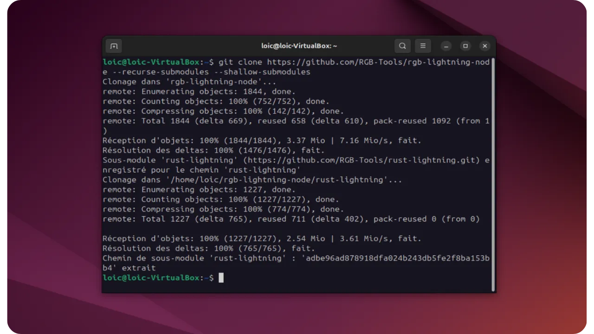


- Ihitamwo rya `--recurse-submodules` na ryo nyene rikora ibikoresho bikenewe (harimwo verisiyo ya `Rust-lightning` yahinduwe);
- Ihitamwo rya `--shallow-submodules` rigabanya uburebure bw'iyi clone kugira ngo ryihute gukuraho, mu gihe riguma ritanga uburyo bwo gushika ku bikorwa vy'ingenzi.


Kuva ku muzi w'umugambi, ukoreshe itegeko rikurikira kugira ngo ushirehamwe kandi ushiremwo ibice bibiri:


```bash
cargo install --locked --debug --path .
```


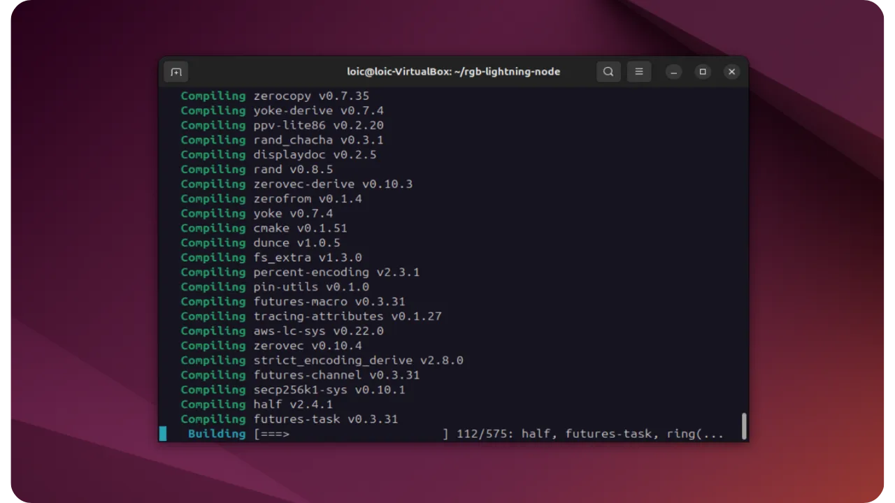


- `--locked` urabe neza yuko verisiyo ifise aho iyoboka yakwirikijwe neza;
- `--debug` ntibitegerezwa, ariko bishobora kugufasha gushira inguvu ahantu hamwe (ushobora gukoresha `--release` niba ushaka);
- `---path .` ibwira `cargo install` gushiramwo kuva mu bubiko buriho.


Ku mpera y'iri tegeko, `rgb-lightning-node` ishirwa mungiro izoja ahabina muri `$CARGO_HOME/bin/` yawe. Utegezwa kumenyako muri runoruhandeariho hari `$PATH` yawe kugira ngo ushobore guhamagara itegeko rivuye mu bubiko ubwaribwi bwose.


### Iterambere risabwa


Kugira ngo bije mungiro, `node ya Lightning ya RGB` daemon bisaba ukuhaba hamwe n'ugutunganywa:


- Node ya bitcoind


Buri kwugurugwa kwa RLN kwose kuzokenerwa kuganira na `bitcoind` kugira ngo gutangaze kandi ikurikirane amahanahanwa yayo yokuri On-Chain. Ivyemezo (kwinjira/ikajambo banga) hama URL (umushitsi/icuma) izokenera gutangwa kuri daemon.


- **Igiharuro** (Electrum canke Esplora)


daemon itegerezwa kuba ishoboye gutanga urutonde no gutohoza amahanahanwa ya On-Chain, vy'umwihariko kugira ngo ironke UTXO umutungo washizweko. Uzokenera kwerekana neza URL y'ubushinguzi bwa Electrum canke Esplora.


- Uwuserukira **RGB**


Nk'uko vyabonetse mu bice vyatanguye, **ubushinguzi bwa proxy** ni igice (kitaringombwa, ariko kirahimirizwa gukoreshwa cane) kugirango hacagagurww ama hanahanwa y'ibirungikwa hagati y'abagenzi ba Lightning. Na none, URL itegerezwa gusobanurwa.


IDs(Ibiranga umuntu) hamwe na URLs zishirwamwo iyo daemon _yuguruwew_ biciye kuri API. Ibindi kuri ivyo mu nyuma.


### Kurungika igerageza


Kugira ngo ukoreshe neza, hariho inyandiko `regtest.sh` itangura ubwo nyene, biciye kuri Docker, urutonde rw'ibikorwa: `bitcoind`, `amashanyarazi` (indexer), `RGB-umukozi-w'ubutumwa`.


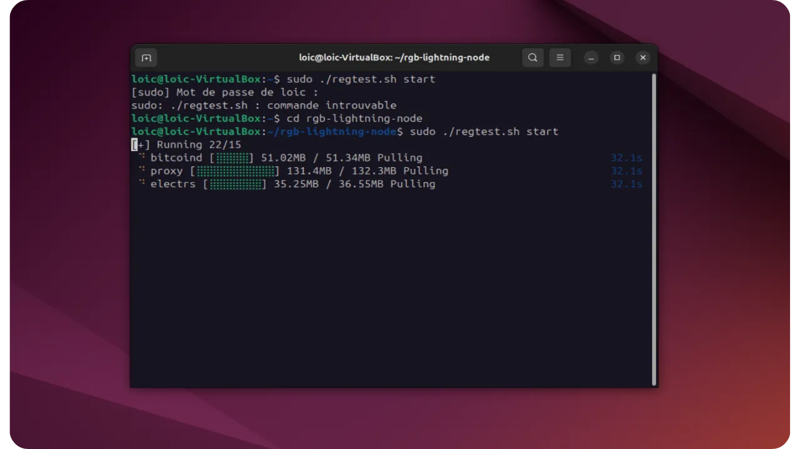


Ivyo bigufasha kurungika uri indani, aho kubitunganiriza, vyatunganijwe imbere y’igihe. Irema kandi igasenyura ibikoresho n’ububiko bw’amakuru ku gusubira gutangura kwose. Tuzotangura n'ugutanguza:


```bash
./regtest.sh start
```


Iyi nyandiko izo:


- kora `docker/` ububiko bw'ugushingura;
- Gukoresha `bitcoind` mu regtest, hamwe n'urutonde `amashanyarazi` na `RGB-umukozi-w'ubutumwa`;
- Rindira gushika vyose bitanguye gukoreshwa.


Igikwirikira, tuzotanguza ama node menshi ya RLN. Muduce dutandukanye, genda, nk'akarorero (kugira ngo utangure node zitatu za 3):


```bash
# 1st shell
rgb-lightning-node dataldk0/ --daemon-listening-port 3001 \
--ldk-peer-listening-port 9735 --network regtest
# 2nd shell
rgb-lightning-node dataldk1/ --daemon-listening-port 3002 \
--ldk-peer-listening-port 9736 --network regtest
# 3rd shell
rgb-lightning-node dataldk2/ --daemon-listening-port 3003 \
--ldk-peer-listening-port 9737 --network regtest
```


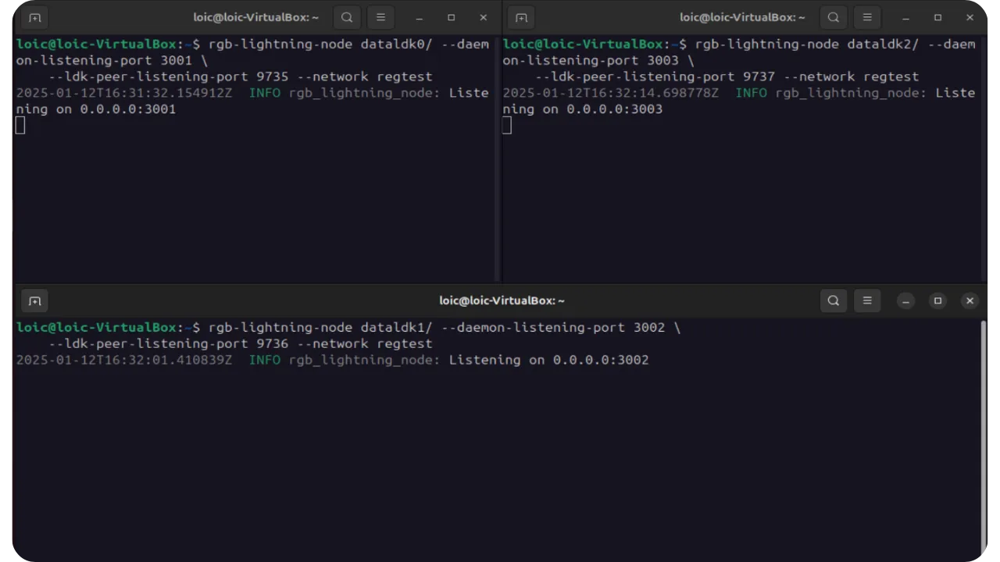


- Igikoresho `--network regtest` kigaragaza ikoreshwa ry'imiterere ya regtest;
- `--daemon-kwumviriza-icuma` yerekana ku cyuho ca REST urudodo rw'umuravyo ruzokwumviriza amahamagara ya API (JSON);
- `--ldk-urunganwe-rutega yompi` igaragaza icuma c'umuravyo P2P co kwumvirizako;
- `dataldk0/`, `dataldk1/` ni inzira zija mu bubiko (buri nzira ibika amakuru yayo ukwayo).


Ushobora kandi gukoresha amabwirizwa ku nzira zawe za RLN ukoresheje umucukumbuzi wawe:


```url
https://rgb-tools.github.io/rgb-lightning-node/
```


Kugira ngo node yugurure umuhora, itegerezwa kubanza kugira ama bitcoin kuri Aderesi yakozwe hakwirikijwe amategeko akwirikira (ku node n°1, nk’akarorero):


```bash
curl -X POST http://localhost:3001/address
```


Inyishu izoguha izoba ifise na Aderesi.


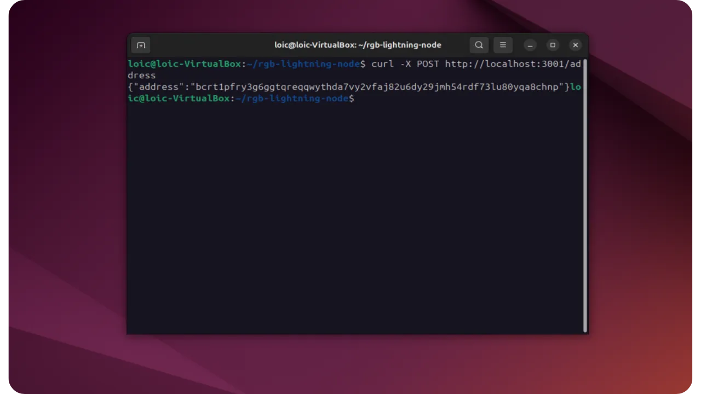


Ku kigeragezo ca `bitcoind`, tuzocukura ama bitcoin makeyi. Hakoreshwa:


```bash
./regtest.sh mine 101
```


Mukurungika amahera kuri aderesi ya node yakozwe aho hejuru:


```bash
./regtest.sh sendtoaddress <address> <amount>
```


Hanyuma ugucukura ibikuta mukwemeza amahanahanwa:


```bash
./regtest.sh mine 1
```


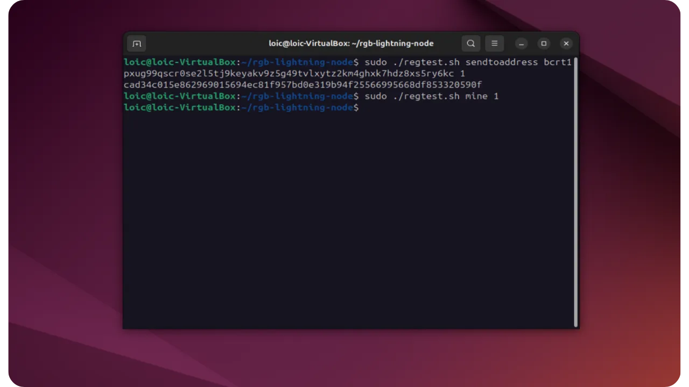


### Testnet gutangura (Hadakoreshejwe Docker)


Niba ushaka kugerageza ikintu gishobora kuja mungiro, ushobora gutanguza node 3 za RLN kuri Testnet aho gutanguza muri Regtest, yerekana ibikorwa bikorerwa kukarubanda bimeze:


```bash
rgb-lightning-node dataldk0/ --daemon-listening-port 3001 \
--ldk-peer-listening-port 9735 --network testnet
rgb-lightning-node dataldk1/ --daemon-listening-port 3002 \
--ldk-peer-listening-port 9736 --network testnet
rgb-lightning-node dataldk2/ --daemon-listening-port 3003 \
--ldk-peer-listening-port 9737 --network testnet
```


Ataciriwe kirakorwa, iyo ata ntunganyo ibonetse, daemon izogerageza gukoresha:


- `ibikoni_rpc_umushitsi`: `umuyagankuba.isakofe.com`
- `Ikivuko_cy'amafaranga_rpc`: `18332`
- urutonde_url`: `ssl://umuyagankuba.isakoshi.com:50013`
- `iherezo_ry'umuserukira`: `rpcs: umuserukira.


Hakoreshejwe ukwinjira:


- `izina_ry'ukoresha_rpc`: 'ukoresha`
- `izina_ry'ukoresha_rpc`: 'akajambo banga'


Ushobora kandi guhindura uko ushaka binobinu uciye kurino API `init`/`gufungura`.


### Gutanga token ya RGB


Kugira ngo dutange token, tuzotangura kurema ama UTXO "afise amabara":


```bash
curl -X POST -H "Content-Type: application/json" \
-d '{
"up_to": false,
"num": 4,
"size": 2000000,
"fee_rate": 4.2,
"skip_sync": false
}' \
http://localhost:3001/createutxos
```


Birumvikana ko ushobora guhindura urutonde rw’ibintu. Kugira twemeze amaanahanwa, ducukura ama:


```bash
./regtest.sh mine 1
```


Ubu turashobora kurema umutungo wa RGB. Amategeko azotegerezwa kuvana n'ubwoko bw'umutung wipfuza kurema hamwe n'imirongo yayo. Aha ndiko ndakora NIA (*Non Inflatable Asset*) token yitwa "Plan ₿ Academy" rifise Supply y'ibice 1000. `Ugushikama` bigufasha gusobanura ukuntu ibice bishobora kugabanywa.


```bash
curl -X POST -H "Content-Type: application/json" \
-d '{
"amounts": [
1000
],
"ticker": "Plan ₿ Academy",
"name": "Plan ₿ Academy",
"precision": 0
}' \
http://localhost:3001/issueassetnia
```


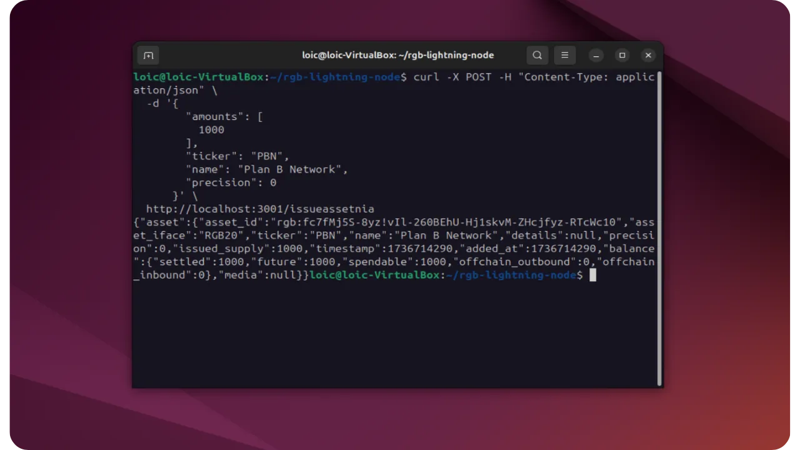


Inyishu irimwo Inndangakintu y'umutungo y’umutungo mushasha waremwe. Ibuka kwandika iki kimenyetso. Kuvyombona, ni:


```txt
rgb:fc7fMj5S-8yz!vIl-260BEhU-Hj1skvM-ZHcjfyz-RTcWc10
```


Ushobora rero kuyirungika kuri On-Chain, canke ukayitanga kumuora wa Lightning. Ivyo nyene ni vyo tuzokora mu gice gikurikira.


### Kwugurura umuhora wa Lightning hamwe nokurungika umutungo kuri RGB


Utegerezwa kubanza gufatanya node ryawe n'umugenzi kuri Lightning Network ukoresheje itegeko `/connectpeer`. Mu karorero kanje, ndasuzuma node zose. Rero nzogarura urufunguzo rwa bose rw'umuhora wanje wa kabiri w'umuravyo n'iri tegeko:


```bash
curl -X 'GET' \
'http://localhost:3002/nodeinfo' \
-H 'accept: application/json'
```


Itegeko rigarura urufunguzo rwa bose rw'uruzitiro rwanje n°2:


```txt
031e81e4c5c6b6a50cbf5d85b15dad720fec92c62e84bafb34088f0488e00a8e94
```


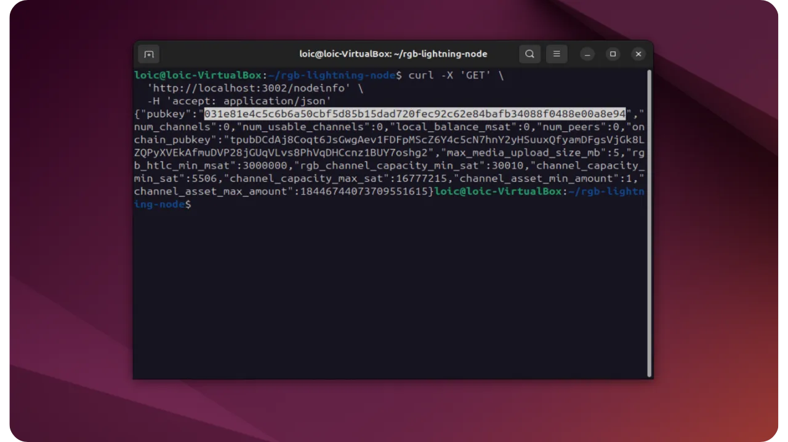


Ibikurikira, tuzofungura umurongo mu kugaragaza umutungo ubereye (`Plan ₿ Academy`). Itegeko `/openchannel` rigufasha gusobanura ubunini bw'umurongo mu satoshis no guhitamwo gushiramwo umutungo wa RGB. Bivana n’ico ushaka kurema, ariko muri jewe, itegeko ni:


```bash
curl -X POST -H "Content-Type: application/json" \
-d '{
"peer_pubkey_and_opt_addr": "031e81e4c5c6b6a50cbf5d85b15dad720fec92c62e84bafb34088f0488e00a8e94@localhost:9736",
"capacity_sat": 1000000,
"push_msat": 10000000,
"asset_amount": 500,
"asset_id": "rgb:fc7fMj5S-8yz!vIl-260BEhU-Hj1skvM-ZHcjfyz-RTcWc10",
"public": true,
"with_anchors": true,
"fee_base_msat": 1000,
"fee_proportional_millionths": 0,
"temporary_channel_id": "a8b60c8ce3067b5fc881d4831323e24751daec3b64353c8df3205ec5d838f1c5"
}' \
http://localhost:3001/openchannel
```


Ibindi ubimenye hano:


- `peer_pubkey_and_opt_addr`: Ikimenyetso c'umugenzi twipfuza gufatanya (urufunguzo rwa bose twabonye mbere);
- `ubushobozi_sat`: Imihoya yose hamwe yomuri satoshis;
- `push_msat`: Amahera mu millisatoshis mu ntango yimuriwe ku mugenzi iyo umurongo ufunguwe (aha nca nshira ama Sats 10.000  kugira ngo ashobore gukora RGB yimurirwa mu nyuma);
- `asset_amount`: Igitigiri c'itunga rya RGB rizoshikirizwa umurongo;
- `asset_id`: Ikimenyetso kidasanzwe c'umutungo wa RGB ukora mu muhora;
- `public`: Yerekana nimba umuhora ukwiye gushikirizwa abantu bose kugira ngo ukoreshe umurongo ku rubuga.


Kugira ngo bemeze ihanahanwa, amabuye 6 aracukurwa:


```bash
./regtest.sh mine 6
```


Umuhora wa Lighning ubu waraguruwe kandi urimwo n'ibimenyetso 500 vya `Plan ₿ Academy` ku ruhande rwa node n°1. Nimba node n°2 rushaka kwakira ibimenyetso vya `Plan ₿ Academy`, rutegerezwa kuba rwakoze facitire. Ehe ingene wobikora:


```bash
curl -X POST -H "Content-Type: application/json" \
-d '{
"amt_msat": 3000000,
"expiry_sec": 420,
"asset_id": "rgb:fc7fMj5S-8yz!vIl-260BEhU-Hj1skvM-ZHcjfyz-RTcWc10",
"asset_amount": 100
}' \
http://localhost:3002/lninvoice
```


Hamwe:


- `amt_msat`: Amafaranga y’ama Satoshi (amasatoshi 3000);
- `expiry_sec`: Umwanya fagitire ihererako mumasegonda;
- `asset_id`: Ikimenyetso c'umutungo wa RGB ufitaniye isano n'umutungo wa fagitire;
- `asset_amount`: Igitigiri c'umutungo wa RGB uzorungikwa hakoreshejwe ino fagitire.


Nkinyishu, uzoronka fagitire ya RGB (nk’uko vyavuzwe mubigabane duherukirako):


```txt
lnbcrt30u1pncgd4rdqud3jxktt5w46x7unfv9kz6mn0v3jsnp4qv0grex9c6m22r9ltkzmzhddwg87eykx96zt47e5pz8sfz8qp28fgpp5jksvqtleryhvwr299qdz96qxzm24augy5agkdhltudk463lt9dassp5d6n0sqgl0c4gx52fdmutrdtqamt0y4xuz2rcgel4hpjwne08gmls9qyysgqcqpcxqzdylz5wfnkywnxvvmkvnt2x4fj6wre0gshvjtv95ervvzzg4592t2gdgchx6mkf5k45jrrdfn8j73d2f2xx4mrxycq7qzry4v4jan6uxhhacyqa4gn6plggwpq9j74tu74f2zsamtz6ymt600p8su4c4ap9g9d8ku2x3wdh6fuc8fd8pff2yzpjrf24ys3cltca9fgqut6gzj
```


Ubu tuzoriha iyi Fagitire kuva ku nzira ya mbere, ifise amahera akenewe n'iyi `Plan ₿ Academy` token:


```bash
curl -X POST -H "Content-Type: application/json" \
-d '{
"invoice": "lnbcrt30u1pncgd4rdqud3jxktt5w46x7unfv9kz6mn0v3jsnp4qv0grex9c6m22r9ltkzmzhddwg87eykx96zt47e5pz8sfz8qp28fgpp5jksvqtleryhvwr299qdz96qxzm24augy5agkdhltudk463lt9dassp5d6n0sqgl0c4gx52fdmutrdtqamt0y4xuz2rcgel4hpjwne08gmls9qyysgqcqpcxqzdylz5wfnkywnxvvmkvnt2x4fj6wre0gshvjtv95ervvzzg4592t2gdgchx6mkf5k45jrrdfn8j73d2f2xx4mrxycq7qzry4v4jan6uxhhacyqa4gn6plggwpq9j74tu74f2zsamtz6ymt600p8su4c4ap9g9d8ku2x3wdh6fuc8fd8pff2yzpjrf24ys3cltca9fgqut6gzj"
}' \
http://localhost:3001/sendpayment
```


Ukwishurwa kwarakozwe. Ivyo bishobora kugenzurwa mu gushitsa itegeko:


```bash
curl -X 'GET' \
'http://localhost:3001/listpayments' \
-H 'accept: application/json'
```


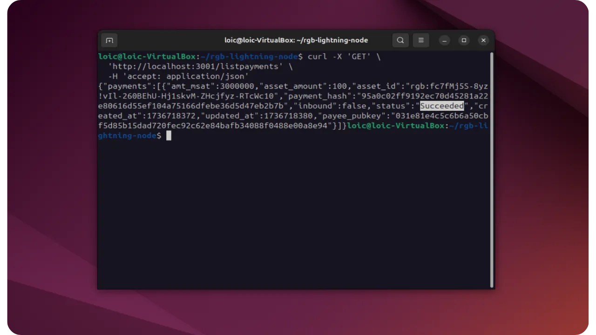


Ehe ingene wokoresha node ya Lightning yahinduwe kugira ngoitware itunga rya RGB. Iryo yerekanwa rishingiye kuri:


- Ivyokugerageza (biciye muri `./igerageza.sh`) canke Testnet;
- Igikoresho c'umuravyo (`RGB-igikoresho-c'umuravyo`) gishingiye kuri `bitcoind`, urutonde n'umurongo w'umuravyo`;
- Urutonde rwa JSON REST APIs zo gufungura/gufunga imirongo, gutanga ibimenyetso, gutanga umutungo biciye kuri Lightning, n'ibindi.


Urakoze kuri iyi nzira:


- Ivy’ugukorana n’umuravyo birimwo igisohoka c’inyongera (OP_RETURN canke Taproot) n’ugushinga intahe kw’ihinduka rya RGB;
- Ivyo kwimurira amahera bikorwa mu buryo bumwe nyene n’ubw’amahera ya kera ya Lightning, ariko hakaba hakongerwako RGB token;
- Ivyiyumviro vyinshi vya RLN birashobora guhuzwa n’inzira no kugerageza kwishura mu vyiyumviro vyinshi, igihe cose hariho amahera ahagije mu bitcoins no mu mutungo RGB ku nzira.


Umugambi uguma mu rwego rwa alpha. Ni vyiza rero cane ko wigarukira ku bidukikije vyo kugerageza (regtest, Testnet).


Amahirwe yuguruwe n’iyi nzira y’uguhuza LN-RGB ni menshi cane: stablecoins kuri Lightning, DEX Layer-2, gutanga ibimenyetso bishobora guhinduka canke NFTs ku giciro gito cane... Ibice vyatanguye birerekana ubuhinga bwo kwubaka ivyiyumviro n’ubuhinga bwo kwemeza. Ubu ufise iciyumviro ngirakamaro c’ingene wotuma mwene iyo node ikora, ku bijanye n’iterambere canke ibipimo vyawe vyo muri kazoza.


# Agace kanyuma


<partId>b0baebfc-d146-5938-849a-f835fafb386f</partId>


## Gusubiramwo & n'ugusuzuma


<chapterId>0217e8b0-942a-5fee-bd91-9a866551eff3</chapterId>


<isCourseReview>true</isCourseReview>

## Guheraheza


<chapterId>0309536d-c336-56a0-869e-a8395ed8d9ae</chapterId>


<isCourseConclusion>true</isCourseConclusion>
