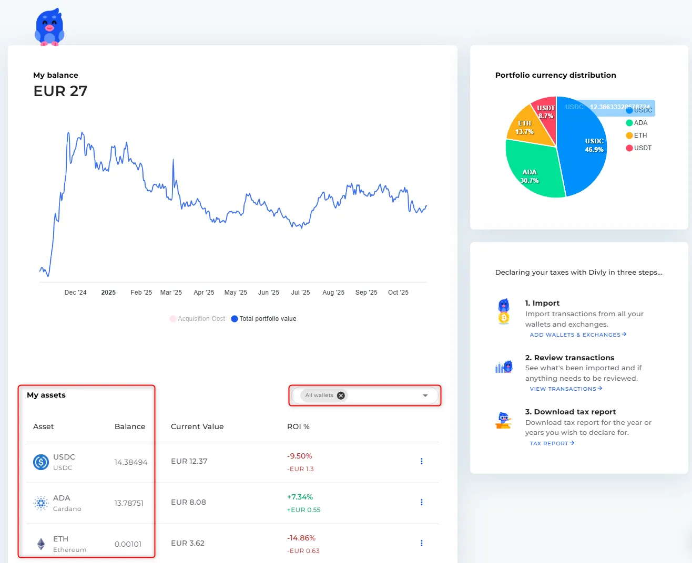
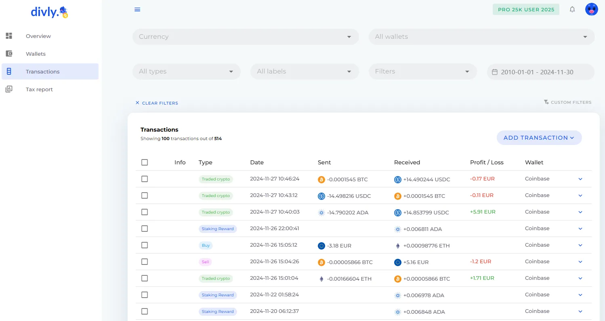
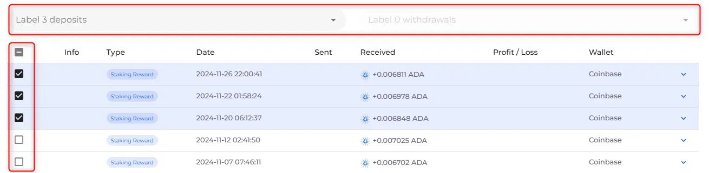

## Introduzione

Questa esercitazione spiega come utilizzare [Divly](https://divly.com/) per preparare un rapporto fiscale Bitcoin (BTC). La preparazione di un rapporto fiscale comporta la raccolta di tutte le transazioni BTC rilevanti in un anno finanziario, il calcolo dei guadagni o dei redditi imponibili e l'esportazione di un rapporto da presentare all'autorità fiscale locale.

Nelle giurisdizioni in cui la Bitcoin è soggetta a regole fiscali, è necessario segnalare i profitti o le perdite derivanti dalle cessioni della BTC e i redditi percepiti nella BTC. L'utilizzo di un software di rendicontazione fiscale vi aiuta a organizzare queste informazioni e a generare una relazione fiscale in modo efficiente.

## Come iniziare

Per iniziare:

- Creare un account Divly.
- Impostare il **paese di residenza fiscale** e la **valuta locale**.
- Confermare che queste impostazioni riflettono la giurisdizione in cui si registrano le imposte.

Divly utilizza questa configurazione per applicare le regole fiscali e le conversioni di valuta appropriate durante la generazione del report.

## Fase 1 - Importazione di tutte le transazioni Bitcoin dai wallet e dagli scambi

Tutte le transazioni Bitcoin per l'anno fiscale devono essere importate prima di effettuare qualsiasi calcolo delle imposte.

Divly supporta diversi metodi di importazione:

- Connessioni API o OAuth** per gli scambi o i servizi che le supportano
- Caricamento di file CSV** da wallet o scambi
- Inserimento manuale** per tutte le transazioni non coperte da metodi automatizzati

Assicurarsi di importare **tutti i flussi in entrata e in uscita di BTC** relativi al periodo fiscale che si sta dichiarando.

## Passo 2 - Esaminare le transazioni importate

**Confermare il proprio saldo in cripto:**

Il punto di partenza migliore è verificare che il totale delle criptovalute possedute corrisponda al numero visualizzato in Divly. Divly calcola le vostre partecipazioni sommando tutte le transazioni che avete importato.

A tal fine, si deve iniziare a navigare nella pagina Panoramica. Verificate che ogni singola criptovaluta elencata sia effettivamente quella che possedete. Divly non mostra le vostre valute fiat nella Panoramica, quindi ignoratele in questo esercizio.

È possibile filtrare per wallet se si riscontrano problemi. Questo aiuta a capire quali wallet possono essere fuori sincrono.

Dopo l'importazione:

- Andare alla sezione **Transazioni**.
- Controllare che ogni transazione appaia con date e importi corretti.
- Risolvere gli avvisi di prezzo o di base di costo mancanti, se necessario.

**Importante: ** Assicuratevi di importare **TUTTE** le vostre transazioni di criptovalute in Divly prima di procedere alla fase successiva. Compresi i wallet freddi! Altrimenti c'è il rischio che le tasse non siano corrette.

## Fase 3 - Categorizzare i depositi e i prelievi pertinenti

Diversi tipi di transazioni in criptovaluta possono avere implicazioni fiscali diverse. Queste includono attività come il dono di criptovalute, beni perduti, ricompense mining, fork, lanci aerei ed eventi simili. È importante che tutte le transazioni siano classificate in modo accurato.

Nella maggior parte dei casi, Divly assegna automaticamente le etichette corrette. Tuttavia, quando i dati delle transazioni disponibili sono insufficienti, la classificazione automatica potrebbe non essere possibile. In queste situazioni, è responsabilità dell'utente assegnare manualmente l'etichetta appropriata. Per comprendere il significato e il trattamento fiscale di ciascuna etichetta, consultare il relativo articolo della Guida.

Per etichettare le transazioni, accedere alla pagina Transazioni. Selezionare una o più transazioni e scegliere l'etichetta corretta dal menu a discesa nella parte superiore della pagina.

## Fase 4 - Generazione del rapporto fiscale

Una volta che le transazioni sono state importate e classificate:

- Andare alla sezione **Rapporto fiscale**.
- Selezionare il relativo **anno fiscale**.
- Esaminare il riepilogo dei guadagni, delle perdite e delle categorie di reddito calcolate.

Il riepilogo aggrega gli eventi imponibili in base ai dati e alle classificazioni importate.

L'interfaccia dei rapporti fiscali di Divly consente di confermare che tutte le transazioni sono state acquisite prima dell'esportazione.

## Passo 5 - Esportazione del rapporto

Dopo la revisione:

- Esportare il rapporto fiscale BTC finalizzato nel formato disponibile per il proprio Paese.
- Salvare il file esportato o stamparlo per presentarlo alle autorità fiscali.

A seconda della giurisdizione, potrebbe essere necessario seguire istruzioni specifiche per l'invio o utilizzare moduli specifici per il Paese con i dati esportati. se necessario, le [guide specifiche per paese di Divly] (https://divly.com/en/guides) possono aiutarvi con le fasi di presentazione.