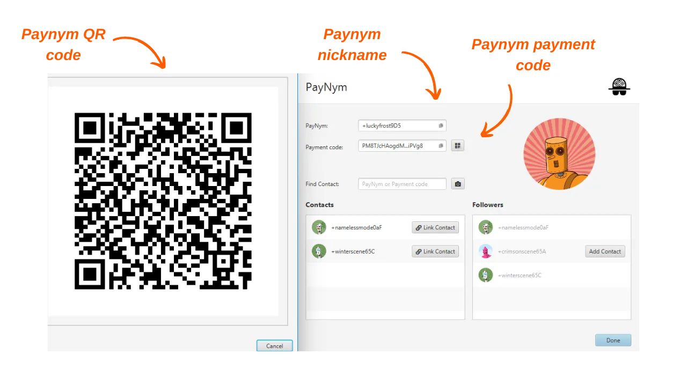
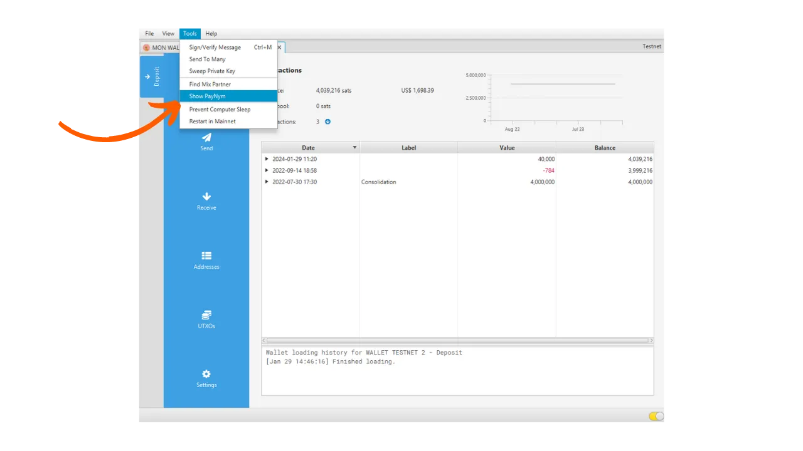
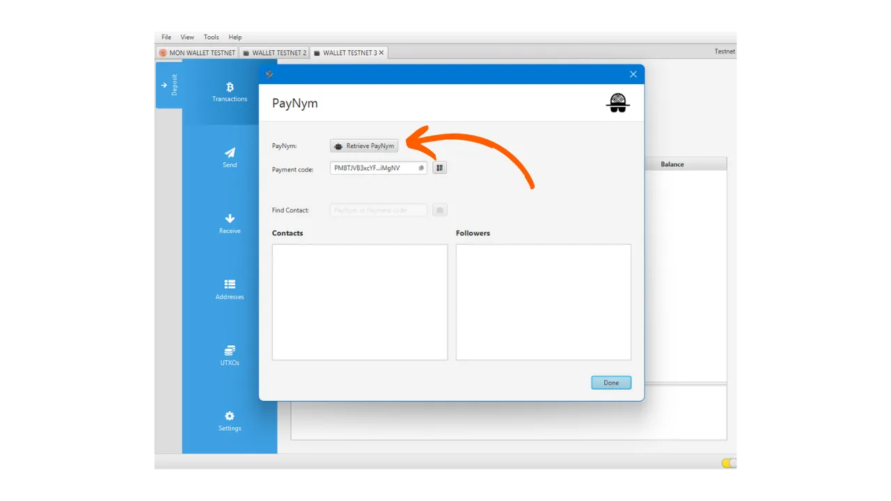
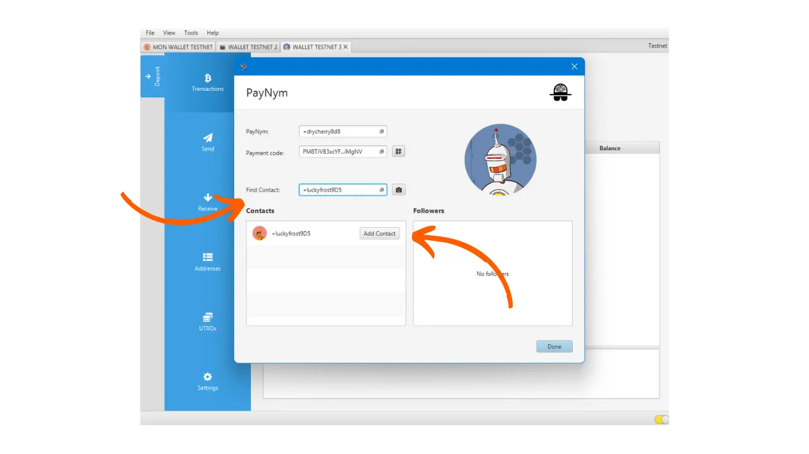

_**ONYO:** Kufuatia kukamatwa kwa waanzilishi wa Samourai Wallet na kukamatwa kwa seva zao tarehe 24 Aprili, Payjoins Stowaway kwenye Samourai Wallet sasa hufanya kazi tu kwa kubadilishana PSBTs kwa mikono kati ya pande zilizohusika, mradi watumiaji wote wawili wakiwa wameunganishwa kwenye Dojo zao. Kuhusu Sparrow, Payjoins kupitia BIP78 bado zinafanya kazi. Hata hivyo, zana hizi zinaweza kuzinduliwa tena katika wiki zijazo. Kwa sasa, unaweza kila wakati kusoma makala hii kuelewa utendakazi wa kinadharia wa Payjoins._

_Tunafuatilia kwa karibu kasi ya maendeleo ya kesi hii pamoja na maendeleo yanayohusiana na zana husika. Hakikisha tutasasisha mafunzo haya kadiri taarifa mpya zitakavyopatikana._

_Mafunzo haya yametolewa kwa madhumuni ya kielimu na taarifa pekee. Hatuzapendekezi wala kuhimiza matumizi ya zana hizi kwa madhumuni ya uhalifu. Ni jukumu la mtumiaji kutii sheria za eneo lao._

---

> *Lazimisha wachambuzi wa blockchain kufikiria upya kila kitu wanachodhani wanakijua.*

Payjoin ni muundo maalum wa muamala wa Bitcoin unaoongeza faragha kwa kushirikiana na mpokeaji malipo. Kuna utekelezaji kadhaa unaorahisisha usanidi na utekelezaji wa Payjoin. Miongoni mwa utekelezaji hizi, maarufu zaidi ni Stowaway, iliyotengenezwa na timu ya Samourai Wallet. Mafunzo haya yanakusudia kukuongoza kupitia muamala wa Stowaway Payjoin ukitumia programu ya Sparrow Wallet.

## Jinsi Stowaway inavyofanya kazi?

Kama ilivyotajwa awali, Samourai Wallet inatoa zana ya Payjoin iitwayo "Stowaway." Inaweza kupatikana kupitia programu ya Sparrow Wallet kwenye PC au programu ya Samourai Wallet kwenye Android. Ili kutekeleza Payjoin, mpokeaji, ambaye pia anafanya kazi kama mshirika, lazima atumie programu inayounganishwa na Stowaway, yaani Sparrow au Samourai Wallet. Programu hizi mbili zinaweza kushirikiana, kuruhusu muamala wa Stowaway kati ya Sparrow Wallet na Samourai Wallet, na kinyume chake.

Stowaway inategemea aina ya miamala ambayo Samourai inawaita "Cahoots." Cahoot ni miamala shirikishi kati ya watumiaji wengi unaohitaji exchange ya habari off-chain. Hivi sasa, Samourai inatoa zana mbili za Cahoots: Stowaway (Payjoins) na StonewallX2 (ambazo tutachunguza katika makala ijayo).

Miamala ya Cahoots yanahusisha kubadilishana PSBTs zilizotiwa saini kati ya watumiaji. Mchakato huu unaweza kuwa mrefu na mgumu, hasa unapofanywa kwa mbali. Hata hivyo, bado unaweza kufanywa kwa mikono na mtumiaji mwingine, jambo linaloweza kuwa rahisi ikiwa mshirika wako yuko karibu. Kivitendo, hii inahusisha kubadilishana QR codes tano ili kuchanganuliwa mfululizo.

Unapotekeleza kwa mbali, mchakato huu unakuwa tata mno. Kutatua hili, Samourai imeunda protocol ya mawasiliano iliyosimbwa kwenye Tor, iitwayo "Soroban." Na Soroban, exchange zinazohitajika kwa Payjoin zinafanywa kiotomatiki nyuma ya interface rafiki kwa mtumiaji. Hii ndiyo njia ya pili tutakayojifunza katika makala hii.

Exchange hizi zilizosimbwa zinahitaji kuanzishwa kwa connection na authentication kati ya washiriki wa Cahoots. Mawasiliano ya Soroban yanategemea Paynyms za watumiaji. Ikiwa hujui Paynyms, ninakualika uangalie makala hii kwa maelezo zaidi: [BIP47 - PAYNYM](https://planb.network/tutorials/privacy/on-chain/paynym-bip47-a492a70b-50eb-4f95-a766-bae2c5535093)

Kwa urahisi, Paynym ni unique identifier iliyounganishwa na wallet yako inayoruhusu functionalities mbalimbali, ikiwemo encrypted messaging. Paynym huwasilishwa kama identifier na ikoni inayoonyesha roboti. Hapa kuna mfano wangu kwenye Testnet: 

**Kwa muhtasari:**

- _Payjoin_ = Muundo maalum wa miamala shirikishi;
- _Stowaway_ = Utekelezaji wa Payjoin unapatikana kwenye Samourai na Sparrow Wallet;
- _Cahoots_ = Jina linalotolewa na Samourai kwa aina zao zote za muamala shirikishi, ikijumuisha Payjoin Stowaway;
- _Soroban_ = protocol ya mawasiliano iliyosimbwa kwenye Tor, ikiruhusu ushirikiano na watumiaji wengine katika muktadha wa miamala ya Cahoots;
- _Paynym_ = Kitambulisho cha kipekee cha wallet kinachoruhusu mawasiliano na mtumiaji mwingine kwenye Soroban, ili kutekeleza muamala wa Cahoots.

[**-> Jifunze zaidi kuhusu transaction za Payjoin na matumizi yake**](https://planb.network/tutorials/privacy/on-chain/payjoin-848b6a23-deb2-4c5f-a27e-93e2f842140f)

## Jinsi ya kuanzisha connection kati ya Paynyms?

Ili kufanya muamala wa mbali wa Cahoots, hasa PayJoin (Stowaway) kupitia Samourai au Sparrow, lazima "Follow" mtumiaji unayetamani kushirikiana naye, ukitumia Paynym yao. Katika kesi ya Stowaway, hii ina maana ya kufuata mtu unayemtumia bitcoins.

**Huu ndio utaratibu wa kuanzisha connection hii:**

Kwanza, unahitaji kupata Paynym payment code ya mpokeaji. Katika programu ya Samourai Wallet, mpokeaji lazima aguse ikoni ya Paynym (roboti ndogo) juu kushoto ya skrini, kisha afuate jina la utani la Paynym, kuanzia "+...". Kwa mfano, yangu ni "+namelessmode0aF". Ikiwa mshirika wako anatumia Sparrow Wallet, tazama mafunzo yetu maalum kwa kubofya hapa.

Kisha mshirika wako ataelekezwa kwenye ukurasa wao wa Paynym. Kutoka hapo, wanaweza kushiriki credentials zao za Paynym na wewe au kushiriki QR code yao ili uchanganue. Kufanya hivyo, wanapaswa kugusa ikoni ndogo ya "share" juu ya skrini yao.

Kwako, fungua programu yako ya Sparrow Wallet na ufikie menyu ya "PayNyms" kwa njia ile ile. Ikiwa huu ni mara yako ya kwanza kutumia Paynym yako, utahitaji kupata identifier kwa kubofya "Retrieve Paynym".

Kisha bonyeza kitufe cha bluu "+" chini kulia ya skrini.

Kisha unaweza kubandika payment code ya mshirika wako kwa kuchagua "PASTE PAYMENT CODE", au kufungua kamera ili kuchanganua QR code yao kwa kubofya "SCAN QR CODE".

Bonyeza kitufe cha "Follow".

Thibitisha kwa kubofya "YES".

Programu itakuonyesha kitufe cha "CONNECT". Hauhitaji kubofya hii tena kwa mafunzo haya. Hatua hii inahitajika tu ikiwa unapanga kufanya malipo kwa Paynym nyingine kama sehemu ya BIP47, ambayo haijaelezwa hapa.

Mara Paynym ya mpokeaji inapofuatwa na Paynym yako, rudia utaratibu kinyume ili mpokeaji pia akufuate. Kisha unaweza kufanya Payjoin.

## Jinsi ya kufanya Payjoin kwenye Sparrow Wallet?

Ikiwa umekamilisha hatua hizi za awali, hatimaye uko tayari kufanya muamala wa Payjoin! Ili kufanya hivyo, fuata mafunzo yetu ya video:

**External resources:**

- https://docs.samourai.io/en/spend-tools#stowaway ;
- https://sparrowwallet.com/docs/spending-privately.html.
