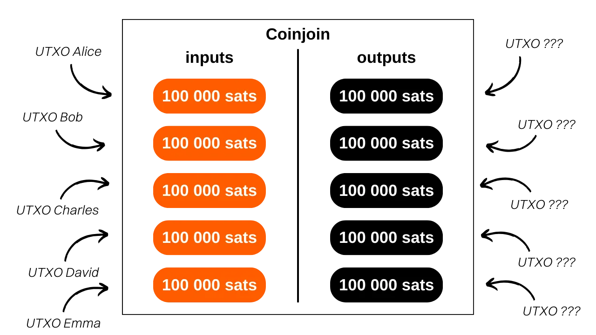
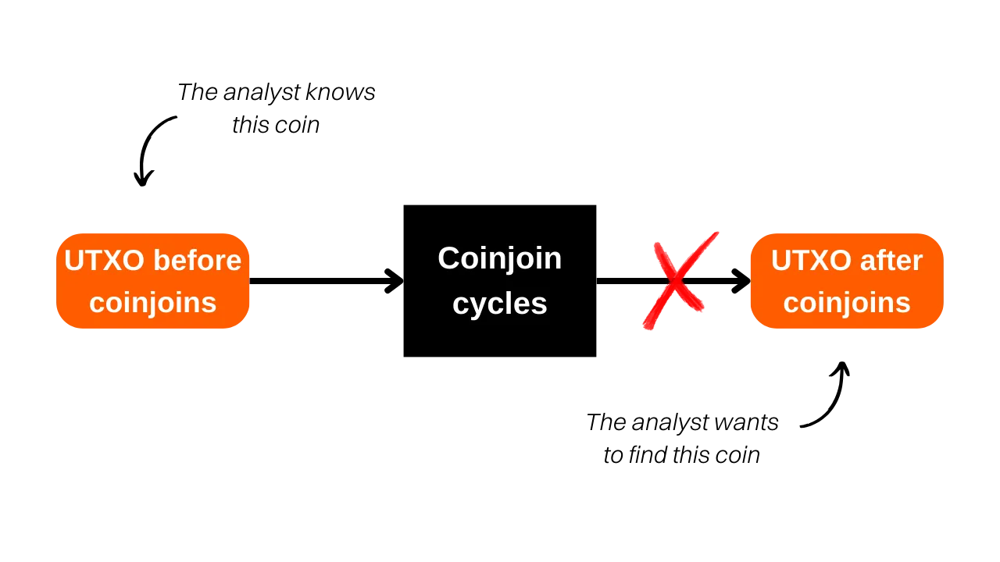
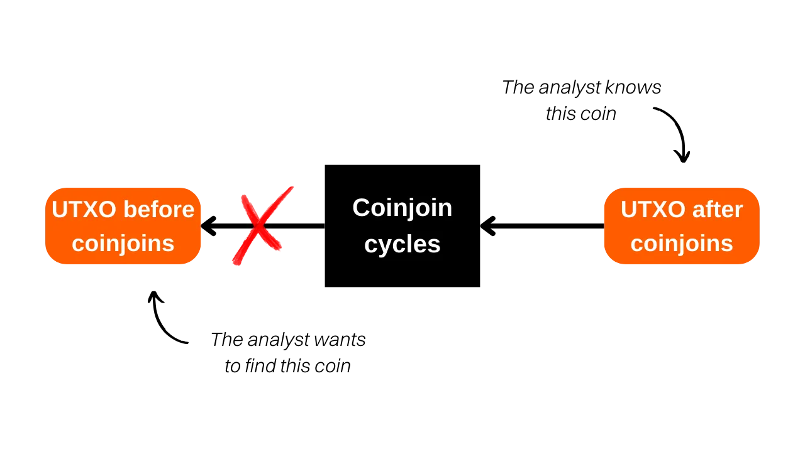
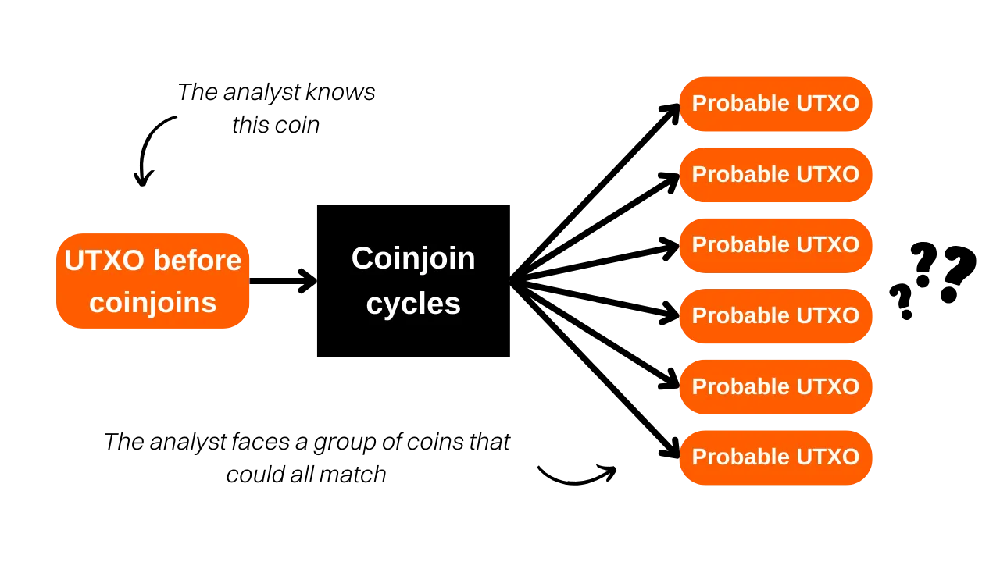
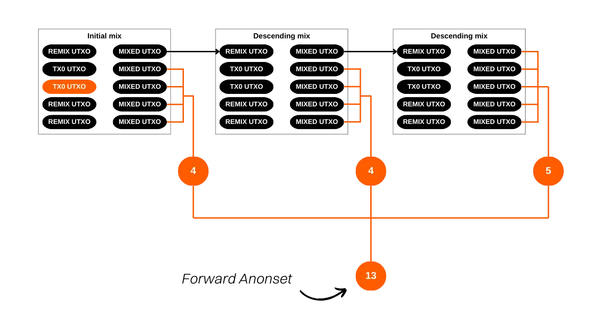
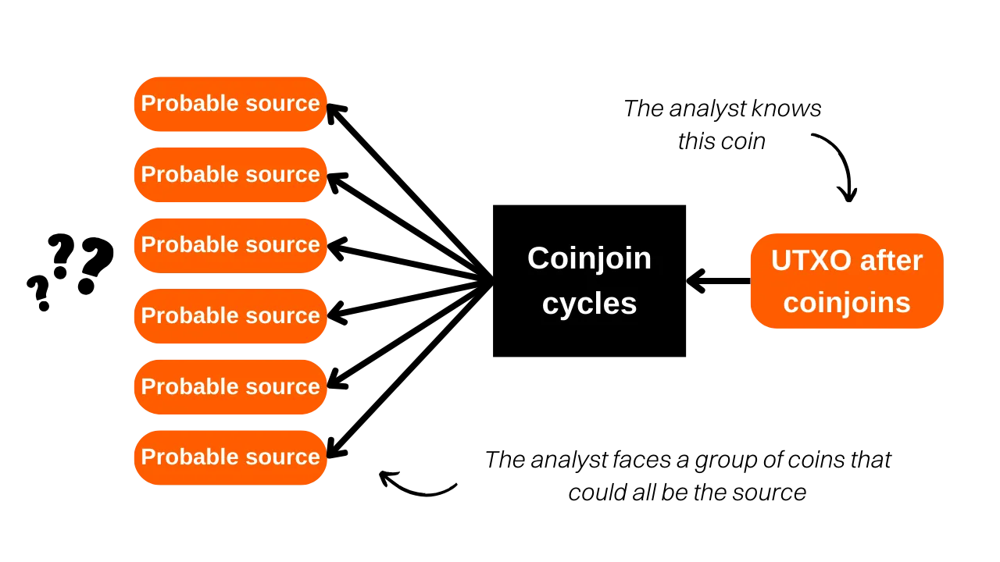
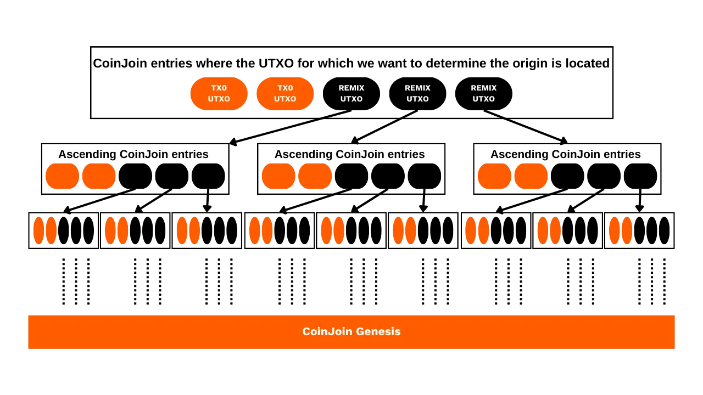
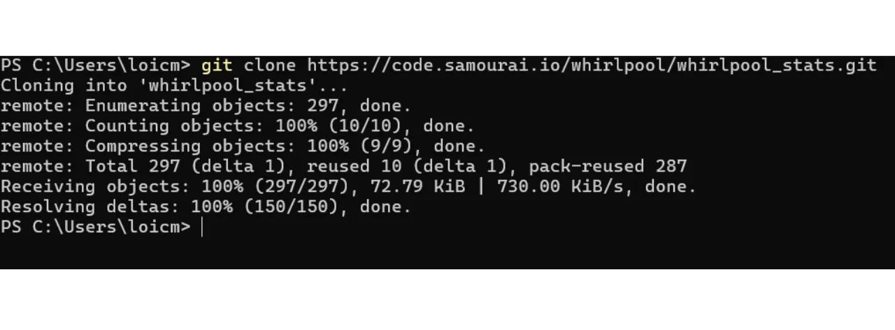

***ONYO:** Kufuatia kukamatwa kwa waanzilishi wa Samourai Wallet na kunaswa kwa seva zao mnamo Aprili 24, Zana ya Takwimu ya Whirlpool haipatikani tena kupakuliwa, kwa kuwa ilipangishwa kwenye Gitlab ya Samourai. Hata kama ulikuwa umepakua zana hii kwenye mashine yako hapo awali, au ilisakinishwa kwenye node yako ya RoninDojo, WST haitafanya kazi kwa wakati huu. Ilitegemea data iliyotolewa na OXT.me kwa uendeshaji wake, na tovuti hii haipatikani tena. Kwa sasa, WST sio muhimu sana kwani itifaki ya Whirlpool haifanyi kazi. Hata hivyo, bado inawezekana kwamba programu hizi zinaweza kurejeshwa katika wiki zijazo. Zaidi ya hayo, sehemu ya kinadharia ya kifungu hiki inabaki kuwa muhimu kwa kuelewa kanuni na malengo ya CoinJoin kwa ujumla (sio tu Whirlpool), na pia kuelewa ufanisi wa mfano wa Whirlpool. Unaweza pia kujifunza jinsi ya kukadiria faragha inayotolewa na mizunguko ya CoinJoin.*


_Tunafuatilia kwa karibu maendeleo ya kesi hii pamoja na maendeleo kuhusu zana zinazohusiana. Uwe na uhakika kwamba tutasasisha mafunzo haya kadiri habari mpya zinavyopatikana._


_Mafunzo haya yametolewa kwa madhumuni ya elimu na habari pekee. Hatuidhinishi au kuhimiza matumizi ya zana hizi kwa madhumuni ya kihalifu. Ni wajibu wa kila mtumiaji kutii sheria katika eneo lake la mamlaka._


---

> *Vunja kiunga ambacho sarafu zako huacha nyuma*

Katika somo hili, tutajifunza dhana ya anonsets, viashiria vinavyotuwezesha kukadiria ubora wa mchakato wa CoinJoin kwenye Whirlpool. Tutashughulikia njia ya hesabu na tafsiri ya viashiria hivi. Kufuatia sehemu ya kinadharia, tutaendelea kufanya mazoezi kwa kujifunza jinsi ya kukokotoa anonsets za miamala mahususi kwa kutumia zana ya Python Whirlpool Stats Tools (WST).


## CoinJoin kwenye Bitcoin ni nini?

**CoinJoin ni mbinu inayovunja ufuatiliaji wa bitcoins kwenye Blockchain**. Inategemea muamala wa ushirikiano na muundo maalum wa jina moja: muamala wa CoinJoin.


Miamala ya CoinJoin huongeza faragha ya watumiaji wa Bitcoin kwa kutatiza uchanganuzi wa msururu kwa waangalizi wa nje. Muundo wao unaruhusu kuunganisha sarafu nyingi kutoka kwa watumiaji tofauti katika muamala mmoja, hivyo basi kuficha njia na kufanya iwe vigumu kubainisha viungo kati ya anwani za kuingiza na kutoa.


Kanuni ya CoinJoin inategemea mbinu ya ushirikiano: watumiaji kadhaa ambao wangependa kuchanganya bitcoins zao huweka kiasi sawa kama pembejeo za muamala sawa. Kiasi hiki kisha kusambazwa upya katika matokeo ya thamani sawa. Mwishoni mwa muamala, inakuwa vigumu kuhusisha pato mahususi na mtumiaji fulani. Hakuna kiungo cha moja kwa moja kilichopo kati ya pembejeo na matokeo, na hivyo kuvunja uhusiano kati ya watumiaji na UTXO yao, pamoja na historia ya kila sarafu.





Mfano wa muamala wa CoinJoin:

[323df21f0b0756f98336437aa3d2fb87e02b59f1946b714a7b09df04d429dec2](https://GW -15.space/tx/323df21f0b0756f98336437aa3d2fb87e02b59f1946b714a7b09df04d429dec2)


Ili kutekeleza CoinJoin huku ukihakikisha kwamba kila mtumiaji anaendelea kudhibiti fedha zake wakati wote, mchakato huanza na ujenzi wa muamala na mratibu, ambaye kisha anaipeleka kwa kila mshiriki. Kila mtumiaji basi hutia saini muamala baada ya kuthibitisha kuwa inamfaa. Saini zote zilizokusanywa hatimaye zimeunganishwa kwenye muamala. Iwapo jaribio la kubadilisha fedha litafanywa na mtumiaji au mratibu, kwa kurekebisha matokeo ya muamala wa CoinJoin, sahihi zitathibitisha kuwa si sahihi, na hivyo kusab...

Kuna utekelezaji kadhaa wa CoinJoin, kama vile Whirlpool, JoinMarket, au Wabisabi, kila moja ikilenga kudhibiti uratibu kati ya washiriki na kuongeza ufanisi wa miamala ya CoinJoin.


Katika somo hili, tutazingatia utekelezaji ninaopenda zaidi: Whirlpool, ambayo inapatikana kwenye Samourai Wallet na Sparrow Wallet. Kwa maoni yangu, ni utekelezaji bora zaidi kwa coinjoins kwenye Bitcoin.
ambayo inapatikana kwenye Samourai Wallet na Sparrow Wallet. Kwa maoni yangu, ni utekelezaji bora zaidi kwa coinjoins kwenye Bitcoin.


## Je! ni matumizi gani ya CoinJoin kwenye Bitcoin?


Umuhimu wa CoinJoin upo katika uwezo wake wa kutokeza ukanushaji unaokubalika, kwa kuzamisha sarafu yako ndani ya kundi la sarafu zisizoweza kutofautishwa. Lengo la hatua hii ni kuvunja viungo vya ufuatiliaji, kutoka zamani hadi sasa na kutoka sasa hadi siku za nyuma.


Kwa maneno mengine, mchambuzi anayejua muamala wako wa awali wakati wa kuingia kwa mizunguko ya CoinJoin hapaswi kuwa na uwezo wa kutambua kwa uhakika UTXO yako wakati wa kuondoka kwa mizunguko ya remix (uchambuzi kutoka kwa kuingia kwa mzunguko hadi kuondoka kwa mzunguko).





Kinyume chake, mchambuzi anayejua UTXO yako wakati wa kuondoka kwa mizunguko ya CoinJoin anapaswa kushindwa kubainisha muamala wa awali wakati wa kuingiza mizunguko (uchambuzi kutoka kwa njia ya kutoka kwa mzunguko hadi kuingia kwa mzunguko).





Ili kutathmini ugumu wa mchambuzi kuunganisha yaliyopita na ya sasa na kinyume chake, ni muhimu kubainisha ukubwa wa vikundi ambamo sarafu yako imefichwa. Hatua hii inatuambia idadi ya uchanganuzi kuwa na uwezekano sawa. Kwa hivyo, ikiwa uchanganuzi sahihi umezama kati ya uchanganuzi mwingine 3 wa uwezekano sawa, kiwango chako cha ufichaji ni cha chini sana. Kwa upande mwingine, ikiwa uchanganuzi sahihi uko ndani ya seti ya uchanganuzi 20,000 zote zinazowezekana kwa usawa, sarafu yako imefichwa ...


Na kwa usahihi, saizi ya vikundi hivi inawakilisha viashiria vinavyoitwa "anonsets".

## Kuelewa anonsets

Anonsets hutumika kama viashirio vya kutathmini kiwango cha faragha cha UTXO fulani. Hasa zaidi, vinapima idadi ya UTXO zisizoweza kutofautishwa ndani ya seti inayojumuisha sarafu iliyosomwa. Mahitaji ya seti ya UTXO yenye homogeneous inamaanisha kuwa anonsets kawaida huhesabiwa kwa mizunguko ya CoinJoin. Utumiaji wa viashiria hivi ni muhimu sana kwa miunganisho ya Whirlpool kwa sababu ya usawa wao.


Anonsets huruhusu, inapofaa, kuhukumu ubora wa coinjoins. Ukubwa mkubwa wa anonset unamaanisha kiwango cha kuongezeka kwa kutokujulikana, kwani inakuwa vigumu kutofautisha UTXO maalum ndani ya kuweka.


Kuna aina mbili za anonsets:


- Seti inayotarajiwa ya kutokujulikana;**
- Mtazamo wa kutokujulikana umewekwa.**

Kiashiria cha kwanza kinaonyesha ukubwa wa kikundi ambamo UTXO iliyojifunza imefichwa mwishoni mwa mzunguko, ukijua UTXO wakati wa kuingia, yaani idadi ya sarafu zisizojulikana zilizopo ndani ya kikundi hiki. Kiashiria hiki hutoa kipimo cha upinzani wa usiri wa sarafu dhidi ya uchambuzi kutoka zamani hadi sasa (kuingia hadi kutoka). Kwa Kiingereza, jina la kiashirio hiki ni "*forward anonset*", au "*vipimo vya kuangalia mbele*".




Kipimo hiki kinakadiria kiwango ambacho UTXO yako inalindwa dhidi ya majaribio ya kuunda upya historia yake kutoka mahali pake pa kuingilia hadi mahali pake pa kutokea katika mchakato wa CoinJoin.


Kwa mfano, ikiwa muamala wako ulishiriki katika mzunguko wake wa kwanza wa CoinJoin na mizunguko mingine miwili ya ukoo ikakamilika, uondoaji unaotarajiwa wa sarafu yako utakuwa `13`:





Kiashiria cha pili kinaonyesha idadi ya vyanzo vinavyowezekana kwa sarafu fulani, ukijua UTXO mwishoni mwa mzunguko. Kiashiria hiki kinapima upinzani wa usiri wa sarafu dhidi ya uchambuzi kutoka sasa hadi zamani (kutoka hadi kuingia), yaani, jinsi ilivyo vigumu kwa mchambuzi kufuatilia asili ya sarafu yako kabla ya mizunguko ya CoinJoin. Kwa Kiingereza, jina la kiashirio hiki ni "*backward anonset*", au "*metrics zinazoangalia nyuma*".





Kwa kujua UTXO yako wakati wa kuondoka kwa mizunguko, urejeshaji wa nyuma huamua idadi ya miamala ya Tx0 inayoweza kujumuisha kuingia kwako kwenye mizunguko ya CoinJoin. Katika mchoro hapa chini, hii inalingana na jumla ya Bubbles zote za machungwa.





## Kukokotoa utatuzi kwa kutumia Zana za Takwimu za Whirlpool (WST)

Ili kukokotoa viashiria hivi kwenye sarafu zako mwenyewe ambazo zimepitia mizunguko ya CoinJoin, unaweza kutumia zana iliyotengenezwa mahususi na Samourai Wallet: Whirlpool Stats Tools.


Ikiwa una RoninDojo, WST imesakinishwa awali kwenye node yako. Kwa hiyo unaweza kuruka hatua za usakinishaji na kufuata moja kwa moja hatua za utumiaji. Kwa wale ambao hawana node ya RoninDojo, hebu tuone jinsi ya kuendelea na ufungaji wa chombo hiki kwenye kompyuta.


Utahitaji: Kivinjari cha Tor (au Tor), Python 3.4.4 au zaidi, git, na bomba. Fungua terminal. Ili kuangalia uwepo na toleo la programu hizi kwenye mfumo wako, ingiza amri zifuatazo:

```plaintext
python --version
git --version
pip --version
```


Ikihitajika, unaweza kuzipakua kutoka kwa tovuti zao husika:


- https://www.python.org/downloads/ (bomba inakuja moja kwa moja na Python tangu toleo la 3.4);
- https://www.torproject.org/download/;
- https://git-scm.com/downloads.


Mara programu hizi zote zikisanikishwa, kutoka kwa terminal, tengeneza hazina ya WST:

```plaintext
git clone https://code.samourai.io/whirlpool/whirlpool_stats.git
```





Nenda kwenye saraka ya WST:

```plaintext
cd whirlpool_stats
```


Sakinisha utegemezi:

```plaintext
pip3 install -r ./requirements.txt
```
