---
name: Blitz Wallet

description: Wallet rahisi zaidi ya kutumia kwa Bitcoin.
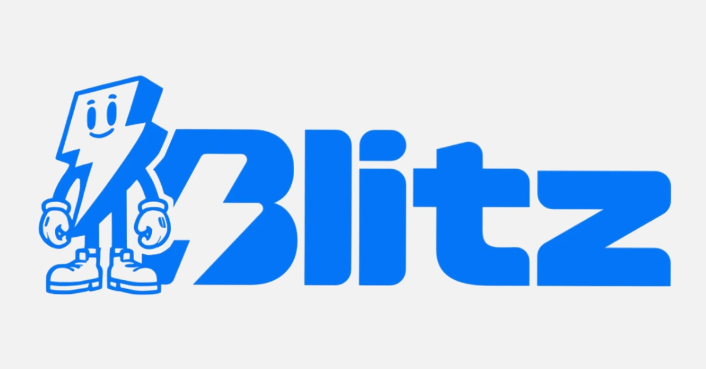

Uzoefu wa mtumiaji ni mojawapo ya element muhimu linapokuja suala la kuanza kutumia wallet. Katika somo hili, tutakuletea wallet ambayo imeweka uzoefu wa mtumiaji kuwa kipaumbele: Blitz Wallet inakupa wallet rahisi na mojawapo ya kamili zaidi ya Bitcoin unayoweza kupata.

## Blitz Wallet ni nini?

Blitz Wallet ni wallet ya Bitcoin ya kujilinda ambayo ni open source, na inaangazia uhuru wako pamoja na matumizi rahisi ya mtumiaji yanayorahisisha uelewa.

[Blitz Wallet](https://blitz-Wallet.com/) ni Wallet ya simu inayopatikana kwenye Android (Play Store) na iOS (App Store).

⚠️**MUHIMU**: Kupakua Bitcoin wallet kutoka kwenye jukwaa rasmi ni muhimu ili kuthibitisha uhalisi wa programu tumizi na, zaidi ya hapo, kuimarisha usalama wa pesa zako.

Katika somo hili, tutakuwa tukijikita kwenye toleo la Android la Blitz Wallet, lakini michakato yote iliyowasilishwa hapa chini ni sahihi vilevile kwa iOS.

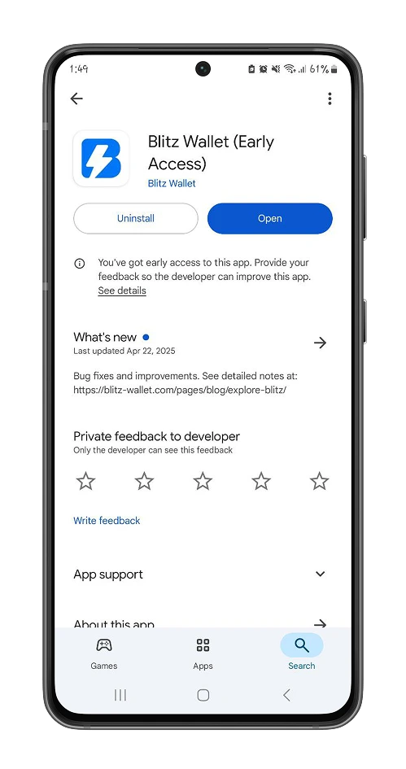

Kwa kuwa Blitz Wallet ni wallet inayojitegemea ya Bitcoin, unaweza kuchagua kuunda wallet mpya au kuleta maneno ya urejeshaji 12/24 kutoka kwa wallet ambayo tayari unayo.

Hapa, tunaanza kwa kuunda wallet mpya. Tazama hapa chini kwa mapendekezo yetu ya kuhifadhi nakala za maneno yako ya urejeshaji.

https://planb.network/tutorials/wallet/backup/backup-mnemonic-22c0ddfa-fb9f-4e3a-96f9-46e2a7954270

❗**MUHIMU**: Maneno haya ya urejeshaji 12/24 ni muhimu kwa ufikiaji wa bitcoins zako. Ukipoteza maneno haya, hutaruhusiwa tena kutumia bitcoins zako.

Sio funguo zako, sio bitcoins zako.

Kisha unda msimbo wa PIN ili kuthibitisha ufikiaji wa Wallet yako.

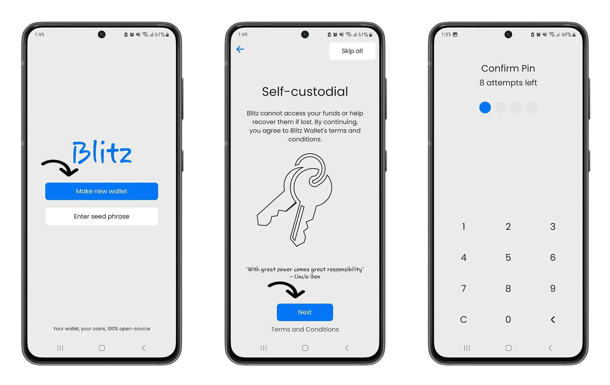

## Anza na Blitz

Kutumia Blitz ni rahisi kuelewa zaidi kuliko wallet nyingine nyingi za Bitcoin.

Katika menyu ya wallet, kuna interface ya kiwango cha chini inayolenga tu vitendo vikuu:

### Pokea bitcoins

Ili kupokea bitcoins kwenye Blitz Wallet yako, bofya aikoni ya "kishale chini", weka kiasi cha satoshi unachotaka kupokea na wallet itaunda invoice ya kushiriki na mtumaji wako.

⚠️ **MAELEZO**: Satoshi (au "aliketi") inawakilisha sehemu ndogo zaidi ya Bitcoin: 1 Bitcoin = 100,000,000 satoshi

Mojawapo ya sifa maalum za Blitz Wallet ni kwamba inasaidia mitandao na chaneli tofauti kutoka kwa mfumo ikolojia wa Bitcoin:

- *Lightning Network**: Mojawapo ya teknolojia za Bitcoin zinazoruhusu miamala ya haraka na ya gharama nafuu.

-**Bitcoin Mainnet** : Msururu mkuu wa itifaki ya Bitcoin, unaofaa kwa miamala ya thamani kubwa.

-**Liquid Network**: Msururu sambamba na Bitcoin Mainnet uliotengenezwa na Blockstream, unaotumia Liquid Bitcoins kutekeleza haraka Confidential Transactions.

https://planb.network/tutorials/wallet/mobile/blockstream-green-liquid-b3e4fb82-902e-4782-ad2b-a61ab05a543a

Kwa chaguo-msingi, miamala yako yote itakuwa kwenye Liquid Network, lakini Blitz hukuruhusu kuchagua mtandao unaotaka kupokea satoshi kwa kubofya kitufe cha **Chagua umbizo**.

### Unda Bitcoin address ukitumia Blitz

Blitz Wallet hukurahisishia kutuma bitcoins kutoka Wallet yake.

Katika menyu ya **Anwani**, unaweza kusajili majina ya watumiaji ya Blitz au URL za Umeme unazotumia kuwasiliana nazo zaidi.

Hii inamaanisha kuwa unaweza kutuma satoshi kwa anwani hizi kwa urahisi, bila kupitia hatua ya kuchanganua au kufuata mwongozo wa anwani ya kupokea.

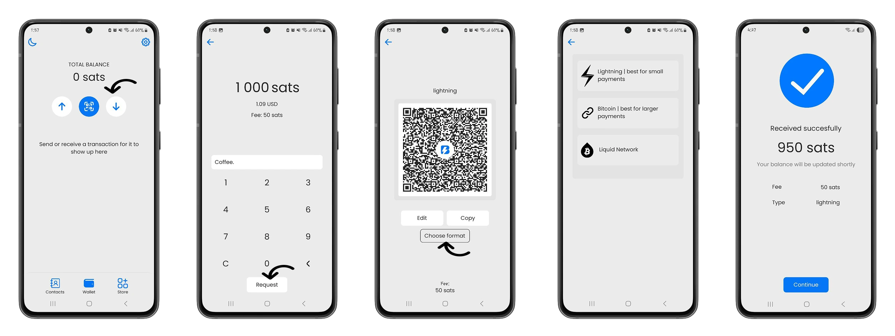

### Tuma bitcoins

Kando na mbinu za kawaida za kutuma bitcoins (kuchanganua msimbo wa QR au kuingiza anwani kwa mikono), kwa kutumia anwani zilizosajiliwa awali katika wallet yako, unaweza kutuma satoshi kwa mpokeaji wako kwa kubofya mara tatu tu.

Katika menyu ya **Wallet**, ​​bofya kitufe cha "Mshale wa Juu", chagua njia ya kutuma bitcoins, kisha ingiza kiasi cha kutumwa na uendelee na uthibitisho.

Kiasi cha chini cha kutuma Bitcoin katika Blitz Wallet kwa sasa ni satoshi 1,000.

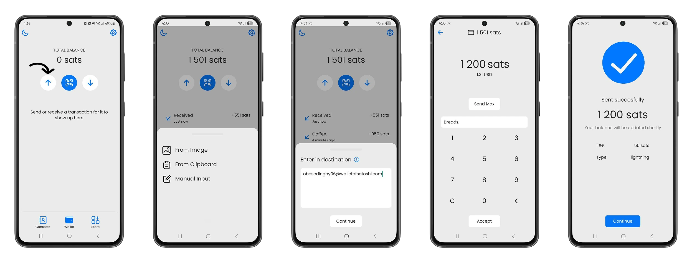

## Sehemu ya Malipo ndani ya Blitz

Kando na shughuli za uhamishaji za Bitcoin, Blitz Wallet inatoa sehemu maalum ambapo unaweza kutumia bitcoins zako kulipia huduma za kidijitali.

- **Fikia huduma za AI**: Tumia miundo ya kijasusi ya bandia kama vile: Claude 3-5 sonnet, gpt-4o, gpt-4o-mini gemini-flash-1.5 na ulipe moja kwa moja kwa bitcoins.

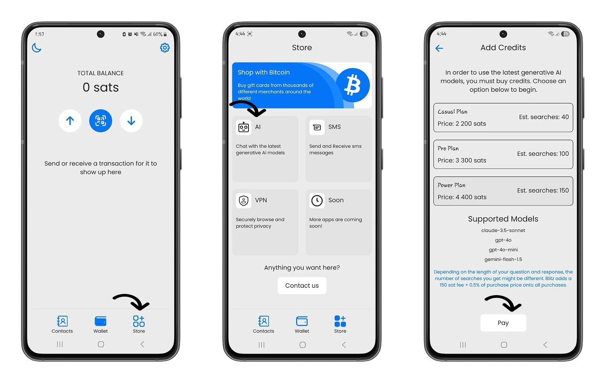

-**Tuma SMS popote duniani**: Katika duka la Blitz, unaweza kufikia huduma ya GSM inayokuruhusu kutuma ujumbe mfupi bila kujitambulisha popote duniani, ukitumia malipo ya moja kwa moja kwa Bitcoin.

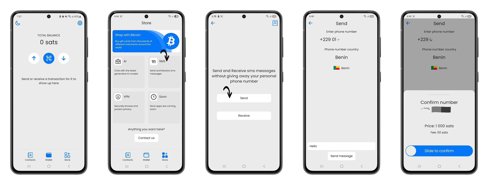

**Tumia usiri kamili**: Lipia usajili wa WireGuard VPN (Mtandao wa Kibinafsi wa Kawaida) katika duka la Wallet Blitz na bitcoins zako.

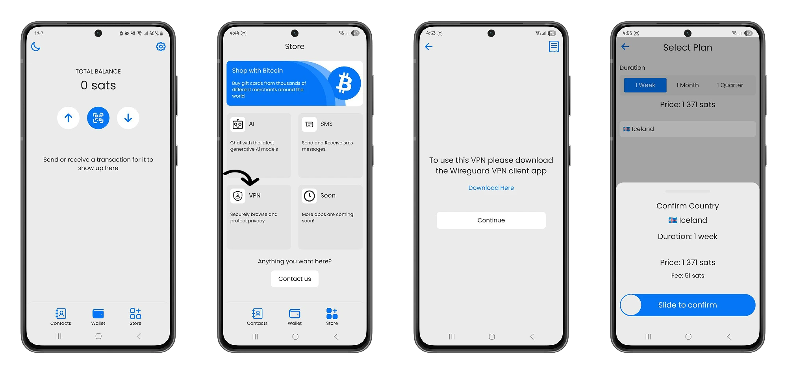

https://planb.network/tutorials/exchange/centralized/bitrefill-8c588412-1bfc-465b-9bca-e647a647fbc1

https://planb.network/tutorials/wallet/mobile/speed-wallet-8715e454-1720-4a7f-8c1d-3da02cf67312

## Wallet Blitz nyuma ya pazia: Kwenda mbele zaidi

Nyuma ya urahisi wa utendakazi wa Blitz Wallet kuna nguvu kubwa na uwezo wa kubinafsisha.

Kama tulivyosema hapo awali, bitcoins zote unazopokea kwa chaguo-msingi huingia kupitia Liquid Network.

Blitz hutumia mabadilishano madogo kwenye Liquid Network kuwasilisha salio lako katika satoshi pale unapokuwa na salio chini ya satoshi 500,000.

Mbinu hii inaendana na dhamira ya kuwezesha matumizi ya awali na kuwasaidia watumiaji wapya kufanya miamala kwenye Lightning Network kwa kiasi kidogo iwe rahisi kadri inavyowezekana.

https://planb.network/tutorials/wallet/mobile/aqua-8e6d7dd3-8c03-45cc-90dd-fe3899a7d125

Unaweza kuona uchanganuzi wa salio lako kwenye menyu **Mipangilio>Maelezo ya Salio**.

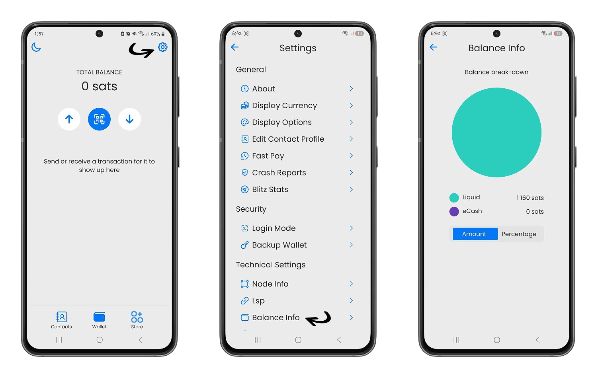

Blitz Wallet, hata hivyo, hukupa urahisi wa kuwezesha hali ya Mwanga, ambayo itakufungulia njia ya malipo kiotomatiki pindi tu utakapofikisha satoshi 500,000.

Ili kuamilisha hali ya lightning ,nenda kwa **Mipangilio**, kisha katika sehemu ya **Mipangilio ya Kiufundi**, bofya kwenye chaguo la **Maelezo ya Nodi**.

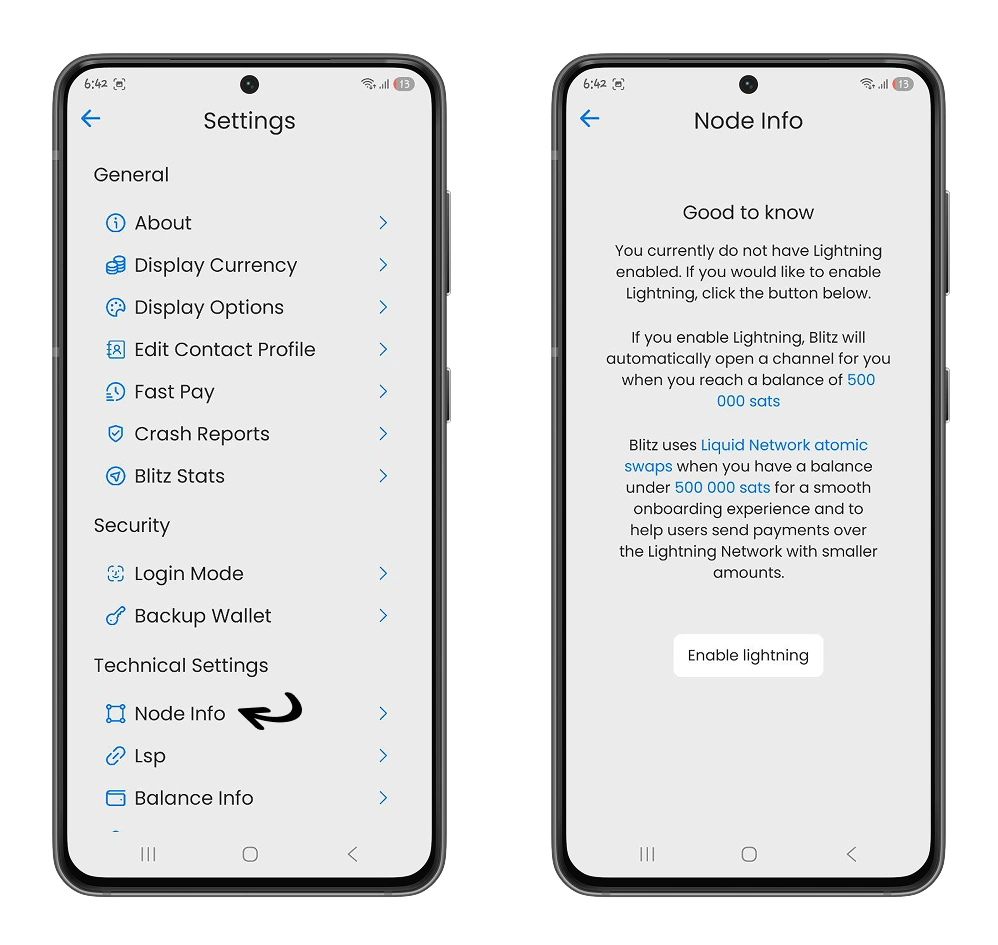

Kwa kuwezesha hali ya lightning, mara tu hali kuu itakapotimizwa (salio la satoshi 500,000 au 0.005 Bitcoin), utaweza kufanya miamala kwenye Lightning Network na hutalazimika tena kutumia Liquid Network ya Blockstream.

- **Kubali Bitcoin kwenye duka lako** :

Ujumuishaji wa malipo ya Bitcoin katika maduka bado uko katika hatua ya majaribio kwenye Blitz Wallet. Tunapendekeza uitumie kwa uangalifu.

Katika menyu ya **Mipangilio>Mahali pa kuuza**, unaweza kuweka kitambulisho cha kipekee kinachohusishwa na duka lako na sarafu ya ndani ambayo ungependa kupokea malipo.

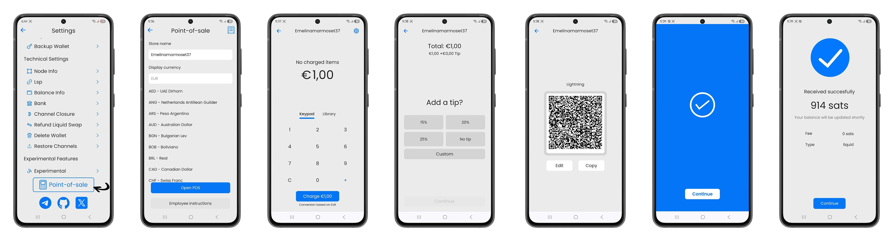

Ikiwa somo hili limekusaidia kuelewa Blitz, tuna uhakika kwamba utafurahia pia mafunzo ya Muun Wallet. Gundua Muun, wallet rahisi iliyo na nguvu kama Bitcoin.

https://planb.network/tutorials/wallet/mobile/muun-111b56b0-4872-4130-ad2e-e58f8363451d
