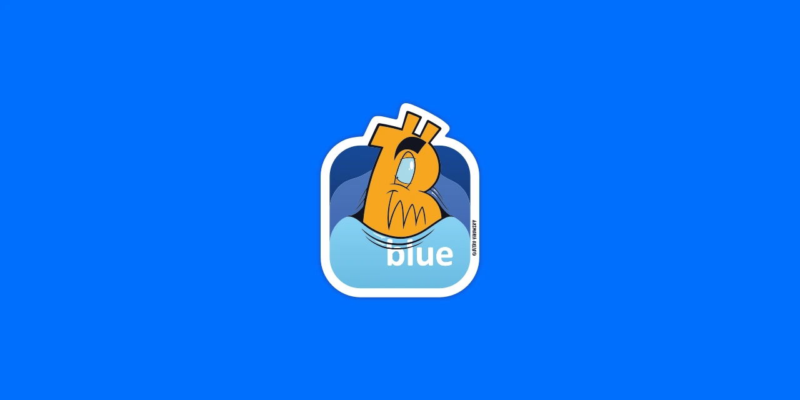
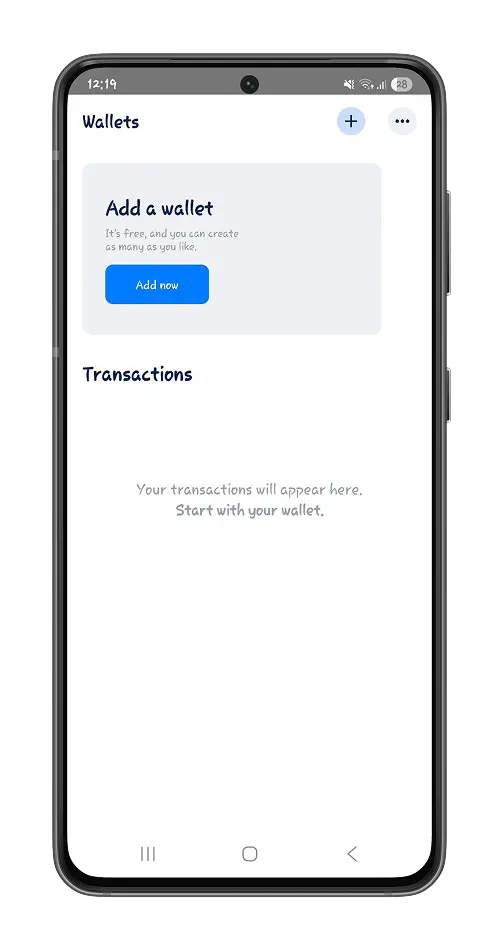
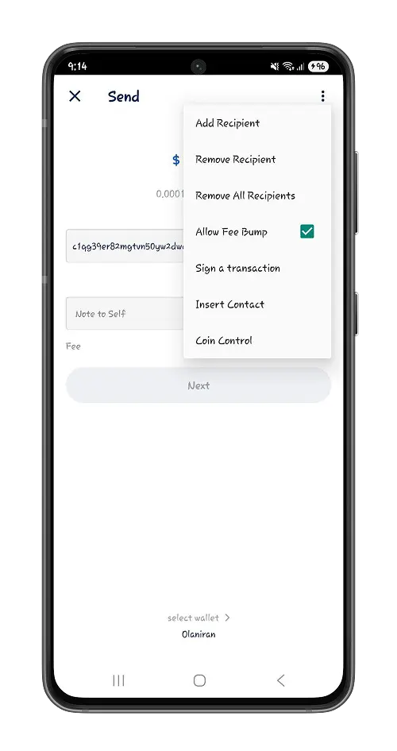
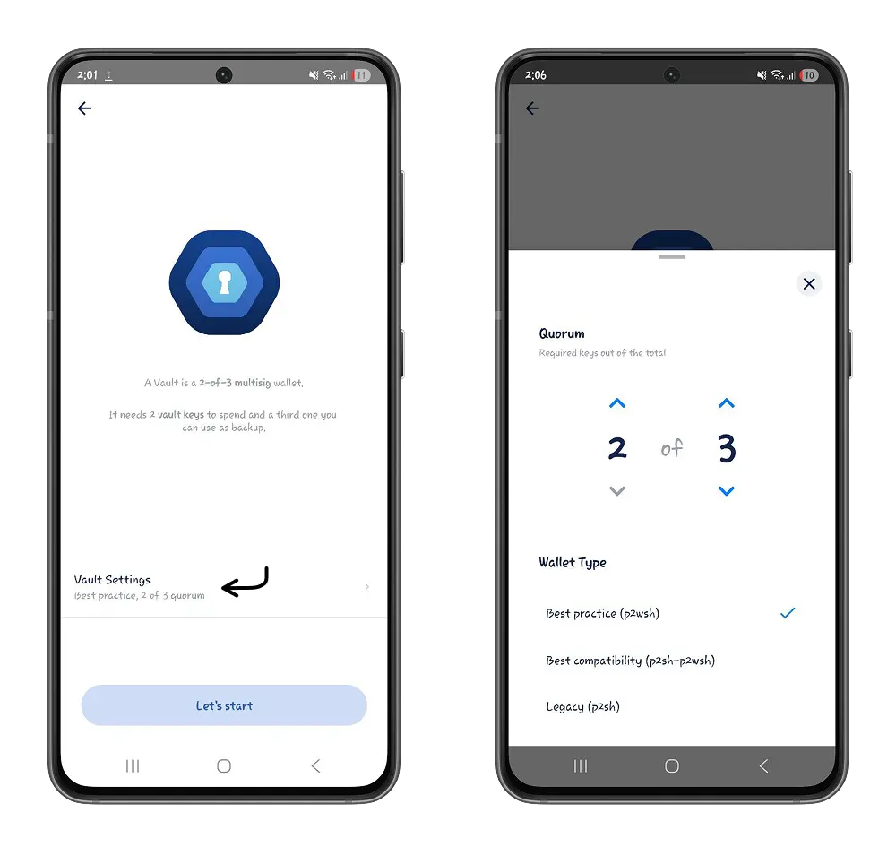
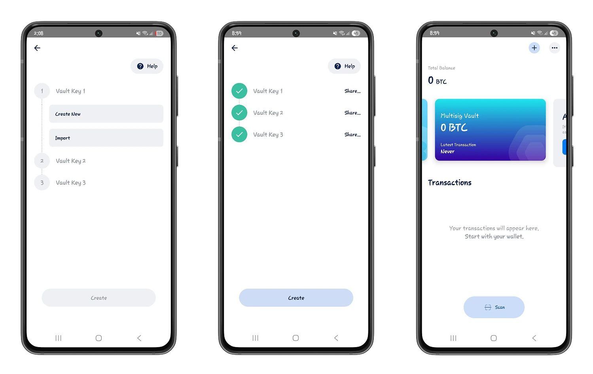
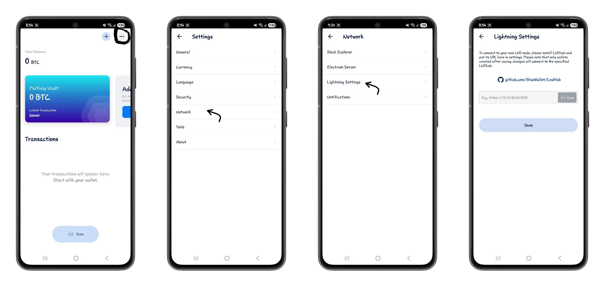

Kuanza kutumia Bitcoin kunaweza kuonekana kama changamoto kubwa kwa watu wenye mashaka kuhusu urahisi wa matumizi yake. Kupata zana sahihi ili kuhakikisha urahisi huu ni jambo la msingi kwa matumizi bora ya Bitcoin kama njia ya exchange, na si tu kama ghala la thamani.

Katika somo hili tutaangalia Blue Wallet, Bitcoin wallet rahisi lakini yenye ufanisi ambayo inakuruhusu kudhibiti bitcoins zako binafsi na pia kuunda vyama vya ushirika vya usimamizi kulingana na [Multisig].

(https://planb.network/resources/glossary/multisig) (usijali, tutarudia tena).

## Kuanza na Blue Wallet

Blue Wallet ni chanzo wazi, cha kujilimbikizia Bitcoin wallet ambacho hukuruhusu kuchukua udhibiti wa bitcoins zako. Inapatikana kama programu ya simu kwenye majukwaa ya Android na iOS. Katika somo hili tutakuwa tukijikita kwenye toleo la Android, hata hivyo, michakato yote itakayotekelezwa ni halali kwa usawa kwenye iOS.

⚠️ Tafadhali hakikisha kuwa umepakua programu ya Blue Wallet Bitcoin wallet kutoka kwenye jukwaa rasmi ili kuhakikisha uhalisi wake na kulinda bitcoins zako dhidi ya uvujaji na udukuzi unaowezekana.

Mara tu ikiwa imewekwa, unaweza kuunda wallet mpya na kuhifadhi maneno 12 ya kurejesha, au kuagiza Bitcoin wallet iliyopo. Jua jinsi ya kufanya nakala bora ya maneno yako muhimu ili usipoteze ufikiaji wa bitcoins zako.

https://planb.network/tutorials/wallet/backup/backup-mnemonic-22c0ddfa-fb9f-4e3a-96f9-46e2a7954270

Ukiwa na Blue Wallet unaweza kuunda jalada tofauti, maalum la Bitcoin. Kwa mfano, unaweza kuwa na wallet moja kwa akiba yako na nyingine kwa ajili ya matumizi yako ya kila siku, yote katika programu sawa.

## Aina za wallet 

Katika wallet ya Blue, utapata aina mbili asilia za Bitcoin.

### wallet ya Bitcoin

Ikiwa umezoea wallet zingine za Bitcoin kama Phoenix au Aqua, hutakosa hata kidogo muonekano na wallet ya Bitcoin ya Blue Wallet.

https://planb.network/tutorials/wallet/mobile/phoenix-0f681345-abff-4bdc-819c-4ae800129cdf

https://planb.network/tutorials/wallet/mobile/aqua-8e6d7dd3-8c03-45cc-90dd-fe3899a7d125

Bitcoin wallet ya Blue inawakilisha kiwango bora cha wallet katika mfumo ikolojia wa Bitcoin. Unaweza kutumia bitcoins mradi tu unamiliki maneno ya kurejesha akaunti, ambayo hutumika kutoa sahihi halali kwenye mtandao ili kuthibitisha kwamba unamiliki bitcoins.

Ili kuunda wallet ya Bitcoin, bofya kitufe cha **Ongeza sasa**, weka jina la wallet yako na uchague aina ya Bitcoin.

Unapobofya onyesho la kukagua Bitcoin wallet, utaweza kuona historia yako ya muamala na kutuma na kupokea bitcoins.

⚠️ Miamala yote katika Bitcoin wallet yako iko kwenye msururu mkuu wa itifaki wa Bitcoin (Mainnet).

- Kupokea bitcoins kwa kutumia Bitcoin wallet ya Blue ni rahisi na angavu. Katika sehemu ya chini ya skrini yako, bofya kitufe cha **Pokea**. Shiriki msimbo wa QR au Bitcoin address yako na mtumaji ili waweze kukutumia bitcoins.

Unaweza pia kusanidi kiasi kilichoainishwa ili kubainisha kiasi cha Bitcoin unachotaka kupokea.

- Kwenye kitufe cha **Tuma**, tuma bitcoins kwa Bitcoin address, weka kiasi kinachohitajika na thibitisha muamala.

Wallet ya Blue hukuruhusu kusanidi mipangilio ya usafirishaji wa Bitcoin kulingana na upendeleo wako.

Kwa hivyo unaweza kuchagua uwiano wa ada ya muamala unaokufaa ikiwa ungependa kuona muamala wako ukithibitishwa haraka katika Mempool na kujumuishwa kwenye block na wachimbaji. Kulingana na uwiano utakaochagua, wachimbaji watatoa kipaumbele kwa muamala wako kwa kiwango kikubwa au kidogo. Pata maelezo zaidi katika mafunzo yetu ya anga ya Mempool.

https://planb.network/tutorials/privacy/analysis/mempool-space-f3e468a1-92f1-43ce-b2e4-c3298fa0e02f

- Ukiwa na Blue Wallet, unaweza kuongeza wapokeaji wengi kwenye usafirishaji mmoja.

Unapoongeza Bitcoin address ya mpokeaji wako wa kwanza, katika chaguo, bofya kwenye **Ongeza Mpokeaji**, ongeza Bitcoin address na kisha weka kiasi cha kutumwa kwa mpokeaji huyu, na kadhalika. Blue Wallet itatuma bitcoins kwa miamala mingi kulingana na kitendo chako kimoja.

Unaweza kuondoa mpokeaji mmoja au wote kwa kubofya kwenye **Ondoa Mpokeaji** na **Ondoa Wapokeaji Wote** mtawalia.

- **Pandisha ada**: Je, umefanya muamala unaochukua muda mrefu kuthibitishwa? Kwa kuwezesha mfumuko wa bei wa ada, unaweza kuongeza ada za ziada kwenye muamala wako unaosubiri ili kuharakisha uthibitishaji wake.

### Multisig Portfolio

Multisig (sahihi nyingi) Wallet inawakilisha Wallet Iliyoundwa kutoka kwa kikundi cha nambari fulani (chini ya 2) ya wallet za Bitcoin. Katika aina hii ya wallet, kulingana na usanidi na njia iliyochaguliwa, matumizi ya bitcoins huwa hatua ya pamoja na ya ushirikiano.

Katika wallet ya Blue, unaweza kuunda wallet zenye saini nyingi kwa ajili ya shirika lako, familia yako, au kampuni yako. Katika sehemu hii yote, tutachunguza kila kipengele cha aina hii maalum ya wallet.

Ongeza wallet mpya na uchague aina **Multisig Vault** ili kuunda wallet ya saini nyingi.

Bainisha usanidi wa m-de-n katika shirika lako lenye saini nyingi kwa kubofya **Mipangilio ya Vault**.

⚠️ Katika usanidi wa m-of-n, **m** inawakilisha idadi ya chini kabisa ya sahihi zinazohitajika ili kuidhinisha muamala na **n** ni jumla ya wallet katika shirika lako.

Hakikisha umefafanua idadi ya chini kabisa ya sahihi (m) kwa wengi wa shirika lako. Kwa mfano, usanidi wa saini 2 kati ya 3 unahitaji wallet mbili katika shirika lako kutia sahihi muamala kabla ya kutekelezwa.

❗Kufafanua usanidi wa m-of-n ambapo n ni sawa na m ni hatari kubwa. Mwanachama anapopoteza ufikiaji wa wallet yake, unapoteza uwezo wa kuidhinisha matumizi ya bitcoins katika wallet.

Hapa kuna mifano ya usanidi bora ili kuhakikisha usalama na ufikiaji wa bitcoins:

- 2-de-3 saini nyingi.

- 5-de-7 saini nyingi.

Endelea kufanya mazoezi bora kwa kuchagua umbizo la P2WSH.

❗ **[P2WSH](https://planb.network/resources/glossary/p2wsh) au Hati ya Pay to Witness Hash** ni njia ya kufunga ambayo hufunga bitcoins (zao) za muamala wako hadi kwenye hash ya hati maalum ambayo Blue Wallet huweka. Faida kuu ya aina hii ya kufunga ni kwamba inapunguza ukubwa wa data ya muamala na inakuwezesha kulipa ada za chini.

Unda au ulete kila mojawapo ya wallet za **n** katika usanidi wako. Katika somo letu, tutakuwa tukitumia usanidi wa 2-of-3 wa saini nyingi. Hakikisha umehifadhi maneno ya uokoaji kwa kila wallet kibinafsi.

- Pokea bitcoins

Kwenye ukurasa wako wa Multisig wallet, utapata historia yako ya muamala na vitufe vya Kupokea na Kutuma.

Kupokea bitcoins katika Wallet ya saini nyingi ni mchakato sawa na unapokuwa katika kiwango cha Bitcoin Wallet.

- Tuma bitcoins** :

Kwa kusimamia wallet ya saini nyingi, matumizi ya bitcoins huwa hatua ya pamoja, iwe na watu wengine au wallet ya pili yako mwenyewe. Sahihi moja ya wallet yako haitoshi tena. Hii inaongeza safu ya ziada ya usalama kwenye bitcoins zako, kwa sababu mtu mwenye nia mbaya hataweza kutumia bitcoins hizo endapo atapata funguo zako za faragha moja tu.

Kama vile wallet ya kawaida ya Bitcoin ya Blue Wallet, unaweza kufafanua wapokeaji wengi katika chaguo la **Ongeza Wapokeaji**.

Unapothibitisha muamala wako, utahitaji saini ya pili ili kuidhinisha matumizi ya bitcoins. Kumbuka, tuko katika usanidi wa saini nyingi wa 2-of-3.

Mtia saini wa pili wa wallet, ikiwa yeye pia ni mtumiaji, anaweza kutia sahihi muamala hata kama hayuko mtandaoni (hakuna Wi-Fi, hakuna data ya mtandaoni) kwa kuchanganua msimbo wa QR wa [muamala ambao umetiwa saini kiasi].(https://planb.network/resources/glossary/psbt) uliyounda hivi punde.

-**Nenda mbali zaidi na wallet ya saini nyingi**:

Kwenye Interface ya Wallet yenye saini nyingi, bofya kitufe cha **Dhibiti vitufe**.

Kwa kusahau mojawapo ya maneno ya kurejesha akaunti ya mojawapo ya wallet zilizotia saini (**Sahau hii seed...**), unaiarifu Blue Wallet kufuta nakala rudufu ya maneno haya kwenye kumbukumbu yake. Kwa hivyo utakuwa umefanya chelezo ya nje.

Kwa kutekeleza kitendo hiki, unaweka tu ufunguo wa Kwa kutekeleza kitendo hiki, unaweka tu ufunguo wa umma unaohusishwa na maneno haya ya kurejesha akaunti.

⚠️ Kuweka funguo za umma pekee (XPUB) hukuruhusu kuongeza kiwango cha ziada cha usalama kwenye usanidi wako wa 2-of-3 wa saini nyingi. Hakika, inaweza kuwa hatari kuweka maneno yote ya kurejesha katika sehemu moja wakati simu yako inashambuliwa. Wavamizi walio na uwezo wa kufikia **VAULT** moja pekee (neno kuu) unalotumia kutia saini miamala yako, hawataweza kuiba bitcoins zako (chini ya saini 2 zinahitajika) kwa sababu funguo za umma haziwezi kutumika kusaini miamala.

## Chaguo zaidi na Blue Wallet

### Kuboresha usalama wa ufikiaji wa kwingineko

Katika Mipangilio, chaguo la **Usalama** hukuwezesha kufafanua matumizi ya alama ya kidole kufanya miamala, kuhamisha au kufuta wallet yako. Hii inathibitisha mtu anayetumia simu yako mahiri.

## Washa Lightning Network

Lightning Network haitumiki tena asili katika programu ya Blue Wallet.

Katika Mipangilio > **Mipangilio ya Lightning**, unaweza kuhusisha wewe mwenyewe wallet yako ya Lightning unapoendesha nodi ya Lightning Network Daemon (LND). Sakinisha LND Hub, kisha uunganishe wallet yako kwa kuingiza kiungo kilichotolewa na hub.

https://planb.network/tutorials/node/lightning-network/umbrel-lnd-b12e0b5b-12ff-45f1-978e-62f4b4a8ba16

https://planb.network/tutorials/node/lightning-network/lightning-network-daemon-linux-59d777e9-72c8-4b32-8c50-e86cdae8f2f9

Sasa umekamilisha ziara ya Blue Wallet, tayari kutumia Bitcoin kwa urahisi na nguvu zake zote. Tunapendekeza kwamba uchukue hatua inayofuata, na ujue jinsi unavyoweza kukubali malipo ya Bitcoin kwenye maduka yako, kutokana na nguvu ya Lightning.

https://planb.network/tutorials/wallet/mobile/breez-46a6867b-c74b-45e7-869c-10a4e0263c06
