Kote ulimwenguni, mipango, jumuiya na uchumi wa mzunguko vinachipuka karibu na Bitcoin ili kutatua matatizo mahususi yanayowakabili watu. Katika somo hili, tutaangazia mojawapo ya mipango hii: Fedi Wallet, ambayo haitoi tu wallet, bali pia mfumo mzima wa ikolojia unaoweza kubadilishwa ili kufaa jumuiya yako.

## Kuanza na Fedi Wallet

kwenye Android (Google Play Store) na iOS (Apple Store), inayoweka pamoja mfumo mzima wa element zinazoweza kubinafsishwa ili kukidhi mahitaji ya jumuiya yako.

⚠️ Ni muhimu kupakua na kusakinisha Fedi Wallet kutoka kwenye jukwaa rasmi ili kuhakikisha kutegemewa na uhalisi wa programu.

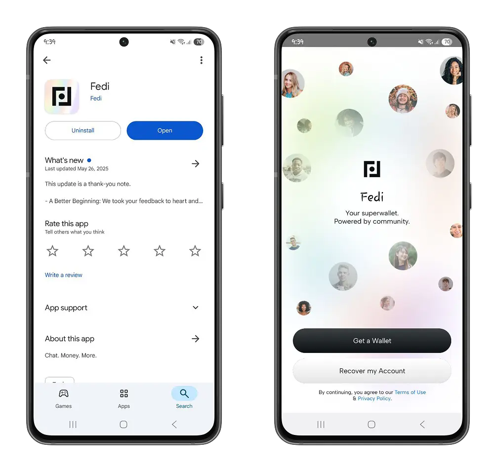

Fedi Wallet ni jalada la Bitcoin linalokuja na Fedi Wallet ni wallet ya Bitcoin inayokuja na mbinu mpya ya kuhifadhi maneno yako muhimu. Kawaida, una chaguzi mbili wakati wa kuchagua wallet ya Bitcoin:

-** Walinzi**: Unaamua kuweka imani yako kwa huluki ya nje, kama vile msanidi wa wallet, ambaye atahifadhi maneno yako ya kurejesha. Huna ufikiaji wala uwezo wa kuhamisha wallet yako ya Bitcoin.

https://planb.network/tutorials/wallet/mobile/wallet-of-satoshi-39149d86-e42b-4e8f-ae9f-7e061e7784f7

https://planb.network/tutorials/wallet/mobile/speed-wallet-8715e454-1720-4a7f-8c1d-3da02cf67312

-**Kujitunza**: Programu hukupa ufikiaji wa maneno ya urejeshi mara tu unapounda wallet yako. Hivyo basi, unaweza kusafirisha bitcoins zako kwa uhuru kwenda kwenye wallet inayokufaa zaidi.

https://planb.network/tutorials/wallet/mobile/blue-wallet-2f4093da-6d03-4f26-8378-b9351d0dbc90

https://planb.network/tutorials/wallet/desktop/sparrow-c674e2ac-d46f-4c82-92a7-7d1b0e262f5d

Badala yake, Fedi Wallet inatoa mbinu ya shirikisho, ambayo hukuruhusu kujiunga na kikundi cha watu unaowaamini ili kudhibiti funguo za wallet yako. Unaweza kujiunga na shirikisho maarufu lililopendekezwa na Fedi, au ujiunge na shirikisho la ndani katika jumuiya yako kwa kuchanganua msimbo wa QR au kubandika msimbo wa mwaliko wa shirikisho hilo.

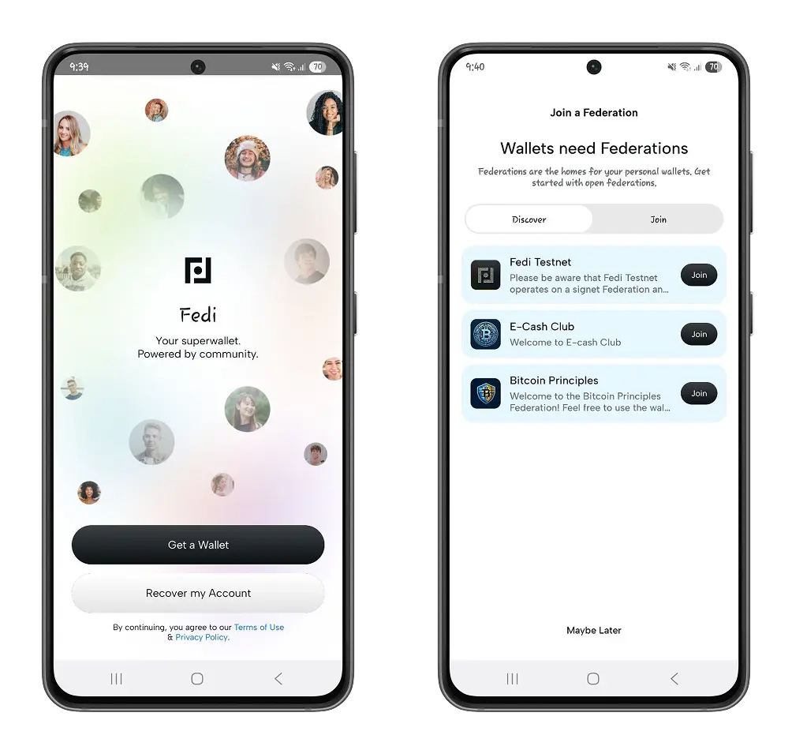

⚠️ Tafadhali hifadhi kiasi cha chini ambacho unaweza kumudu kupoteza, kwa kuwa mashirikisho yanaweza kuwa hayatumiki au kufungwa kwa kucheleweshwa kwa siku 30 kabla ya kufutwa.

Hata hivyo, shirikisho hili halikuzuii kumiliki funguo za faragha za wallet yako.

Mara tu unapounda wallet yako na kujiunga na shirikisho, katika maelezo ya wasifu wako, sehemu ya **Hifadhi ya Kibinafsi**, utapata maneno 12 ya wallet yako.

Pata maelezo zaidi kuhusu mapendekezo yetu ya kuhifadhi nakala za maneno hayo:

https://planb.network/tutorials/wallet/backup/backup-mnemonic-22c0ddfa-fb9f-4e3a-96f9-46e2a7954270

Kwa kila shirikisho unalojiunga, Fedi hutofautisha bitcoins zako kwa kuunda pochi tofauti.

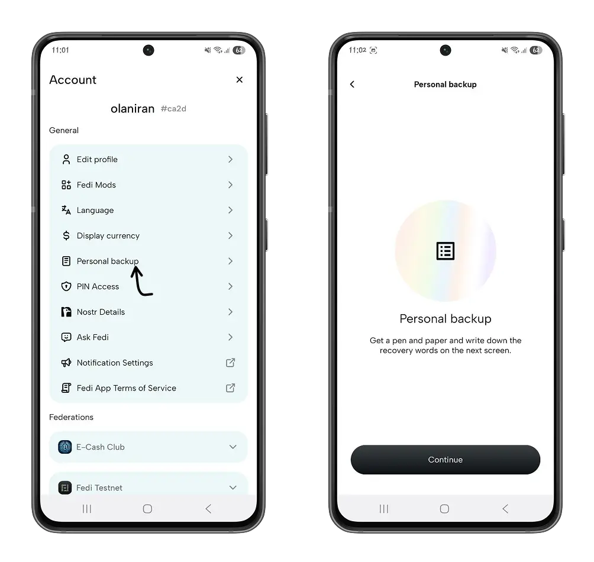

### Uuzaji kwenye Fedi

Kulingana na usanidi wa shirikisho husika, unaweza kuwa na vikwazo kwa usawa na matumizi ya bitcoins zako. Kwa kweli, kila shirikisho kwenye Fedi lina usawa na kizingiti cha matumizi ambacho unaweza kuona kwenye wasifu wako.

Katika menyu ya **Mashirikisho**, tembeza chini hadi kwenye shirikisho husika, kisha gonga **Maelezo ya Shirikisho** ili kujua ni viwango gani vilivyowekwa.

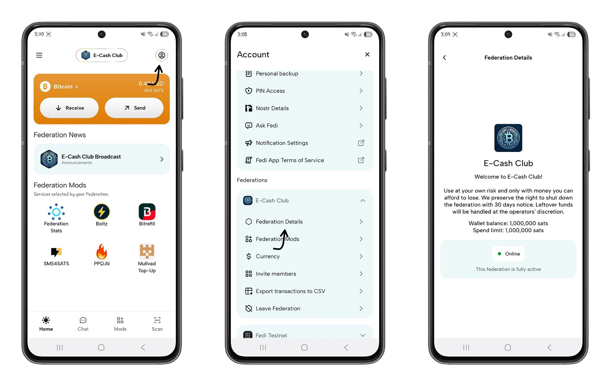

-**Pokea bitcoins kwenye Fedi**: Kwenye ukurasa wa nyumbani, chagua shirikisho unalotaka kutumia kupokea bitcoins, kisha gonga kitufe cha **Pokea** ili kuunda Lightning invoice yenye kiasi cha kupokea.

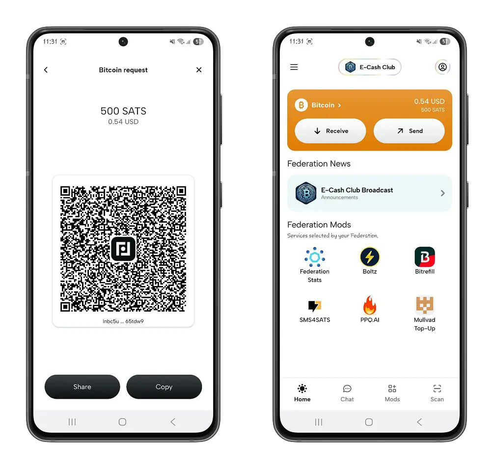

-**Tuma bitcoins**: Kwenye ukurasa wa nyumbani, bofya kitufe cha **Tuma** ili kutuma bitcoins kwa Lightning Address, kulipa Invoice au kufanya malipo ya nje ya mtandao.

Moja ya element maalum za Fedi Wallet ni kwamba inaweza kutumiwa nje ya mtandao. Huhitaji tena Wi-Fi au muunganisho mzuri wa mtandao — unaweza kutumia bitcoins wakati wowote, mahali popote.

Kwa malipo ya nje ya mtandao, unaweza kutumia bitcoins ndani ya shirikisho lako, huku ukiboresha faragha yako pamoja na faragha ya mwingiliano wako wa kifedha.

Bofya kwenye **Tuma nje ya mtandao** na uweke kiasi cha satoshi unachotaka kutuma.

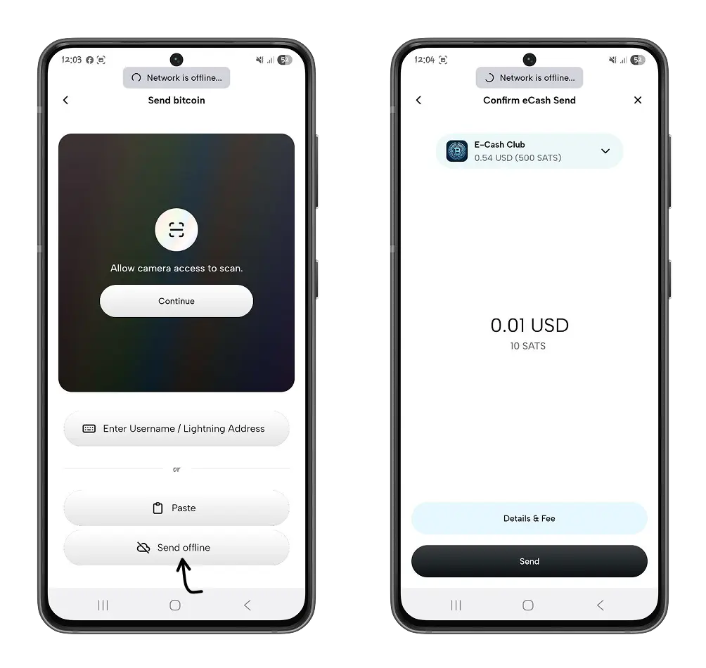

Mpokeaji wako atahitaji kuchanganua msimbo wa QR uliozalishwa ili kudai satoshi.

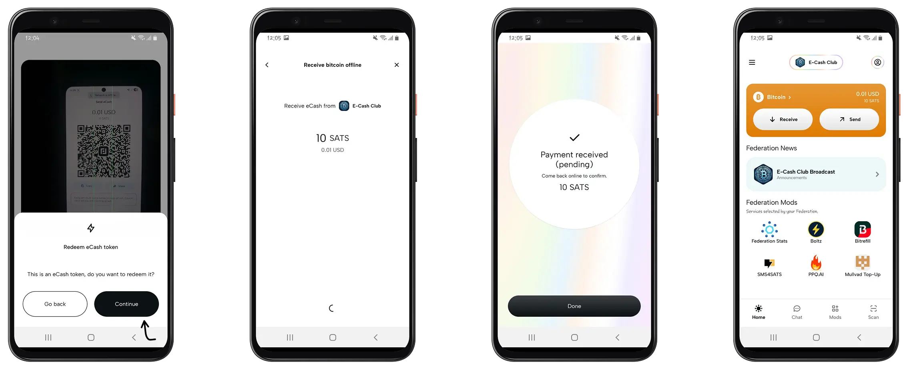

Malipo ya nje ya mtandao hasa hufanywa kwa kutumia [e-cash](https://planb.network/resources/glossary/ecash-david-chaum). Muamala huhifadhiwa kwenye simu yako, na mara tu unapoingia kwenye Mtandao, uthibitisho wa muamala huwa otomatiki. Unaweza pia kuthibitisha malipo mwenyewe kwa kubofya kwenye **Thibitisha muamala**.

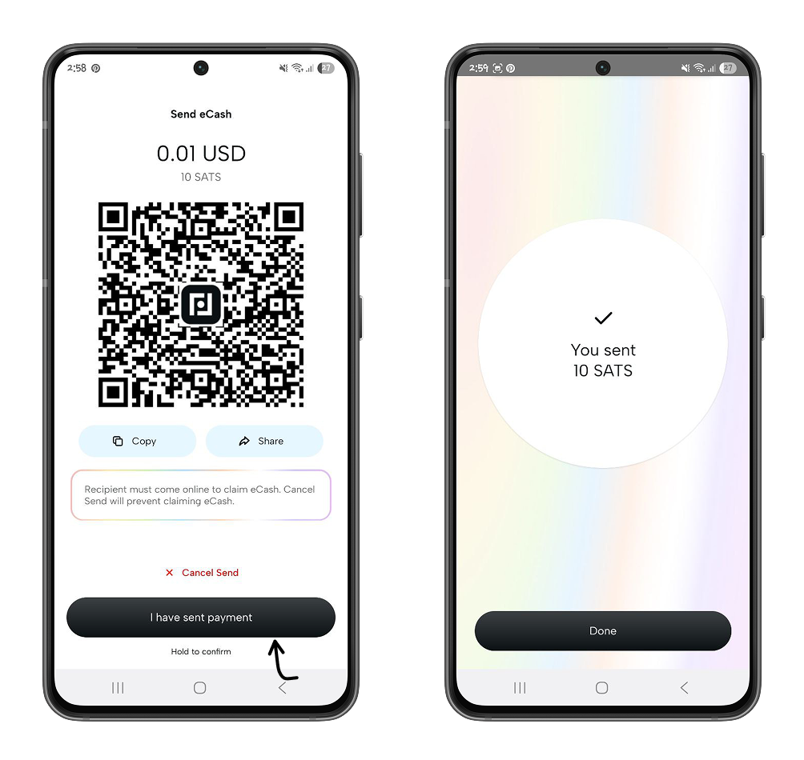

## Exchange kwenye Fedi

Fedi huangazia ujumbe wa papo hapo katika menyu ya **Chat**, inayokuruhusu kupiga gumzo, kulipa, na kushiriki maudhui na watumiaji wengine wa Fedi, ndani na nje ya jumuiya yako.

Ili kuanzisha majadiliano na mtumiaji wa Fedi, weka jina lake la kuingia au changanua msimbo wa QR unaopatikana kwenye wasifu wake.

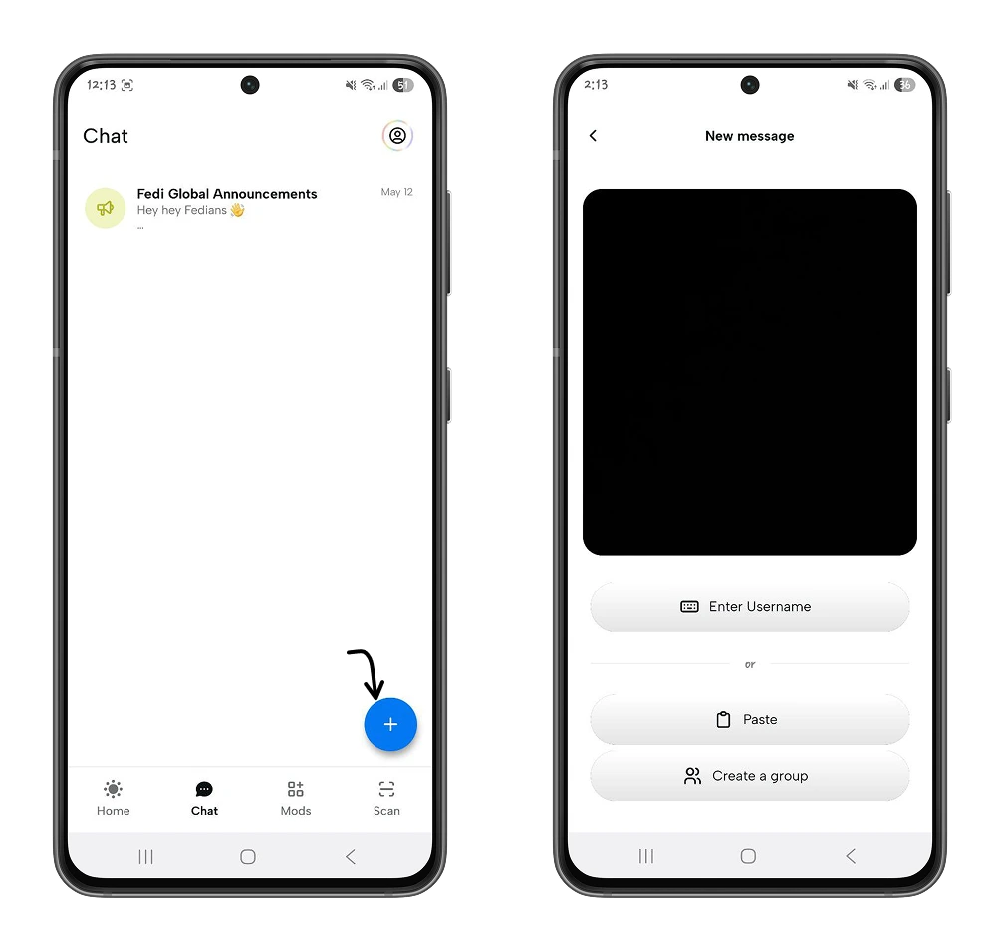

Unaweza kutuma satoshi kwa mtumiaji huyu bila kuacha mazungumzo yako kwa kubofya ikoni ya **Wallet** na kuweka kiasi cha satoshi.

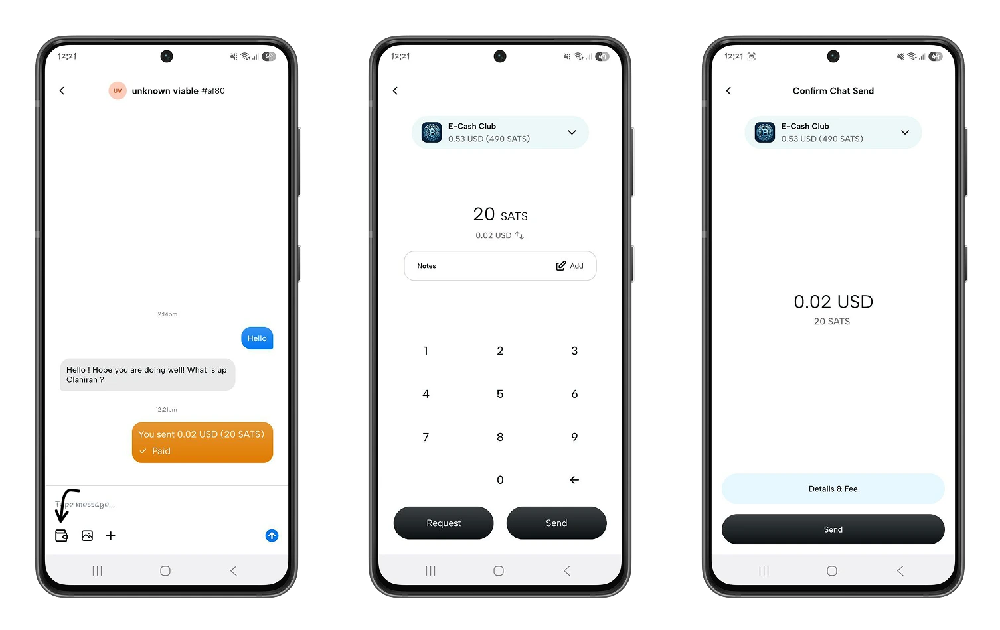

## Moduli

Menyu ya kawaida ya Fedi hukuruhusu kupata programu bora zinazotumiwa na jumuiya yako.

Katika menyu ya **Mods**, utapata programu kama vile;

- Bitrefill

https://planb.network/tutorials/exchange/centralized/bitrefill-8c588412-1bfc-465b-9bca-e647a647fbc1

- Ramani ya BTC: Gundua biashara za ndani zinazokubali bitcoins.

Unaweza pia kuongeza programu zako kwa kugonga aikoni ya **Plus**, kisha uchanganue mwenyewe au uhifadhi URL ya tovuti unayotaka kuongeza.

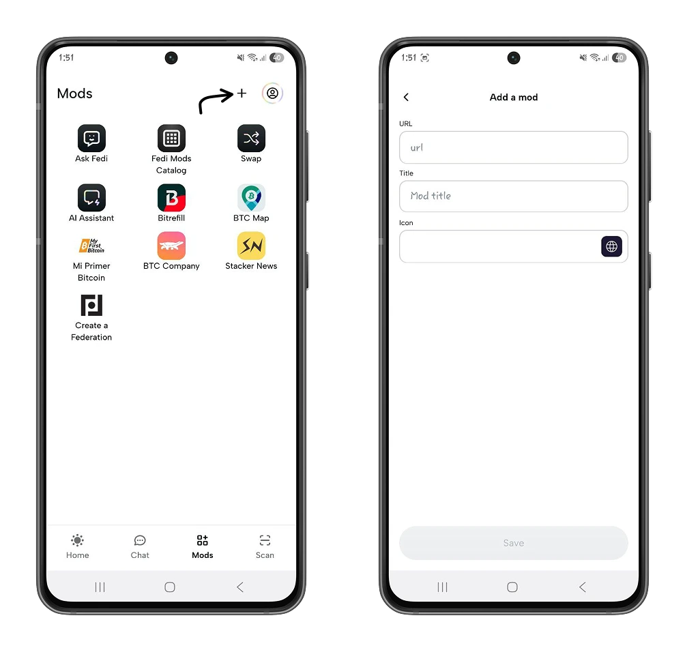

Kwenye ukurasa wa nyumbani, utapata pia moduli maarufu zaidi ndani ya shirikisho lako.

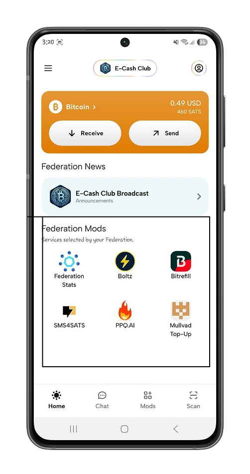

Katika menyu ya **Mods**, unaweza kuomba kuunda shirikisho lako kwa ajili ya jumuiya yako.

Gonga **Unda moduli ya Shirikisho**, kisha anza mchakato wa kuunda shirikisho lako. Kuundwa kwa shirikisho lililoidhinishwa na Fedi kunahusisha kikao cha mafunzo cha ushauri kinachoongozwa na timu za Bitcoin Mentor na Fedi, ili kuwawezesha waanzilishi kujadili malengo ya jumuiya yao na utekelezaji wa mambo maalum ya shirikisho. Lengo kuu la programu hii ni kuchunguza mipango ya shirikisho ili kuhakikisha matumizi bora ya Bitcoin ndani ya jumuiya.

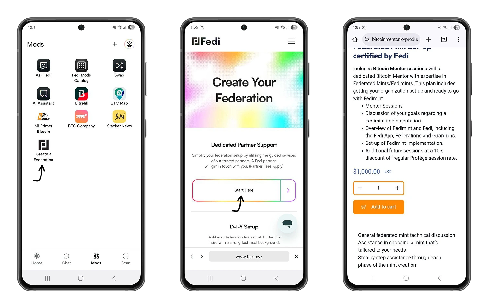

Umechukua ziara ya Fedi Wallet, sasa uko katika nafasi ya kutumia uwezo kamili wa wallet hii katika jumuiya yako. Ikiwa ulifurahia mafunzo haya, tuna uhakika kwamba utafurahia pia mafunzo yetu kuhusu Blink (zamani Bitcoin Beach), mpango wa Bitcoin wa wallet ulioundwa awali kujenga na kuendeleza uchumi wa mzunguko kwa kutumia Bitcoin nchini El Salvador.

https://planb.network/tutorials/wallet/mobile/blink-7ea5f5a4-e728-4ff9-b3f9-cf20aa6fc2
