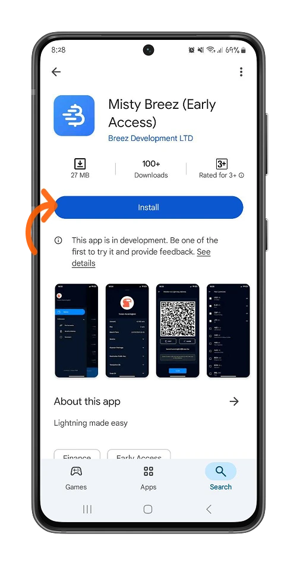
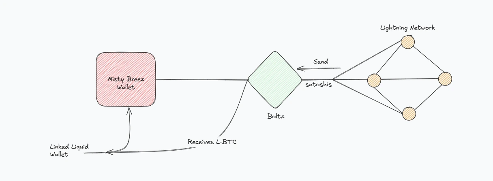
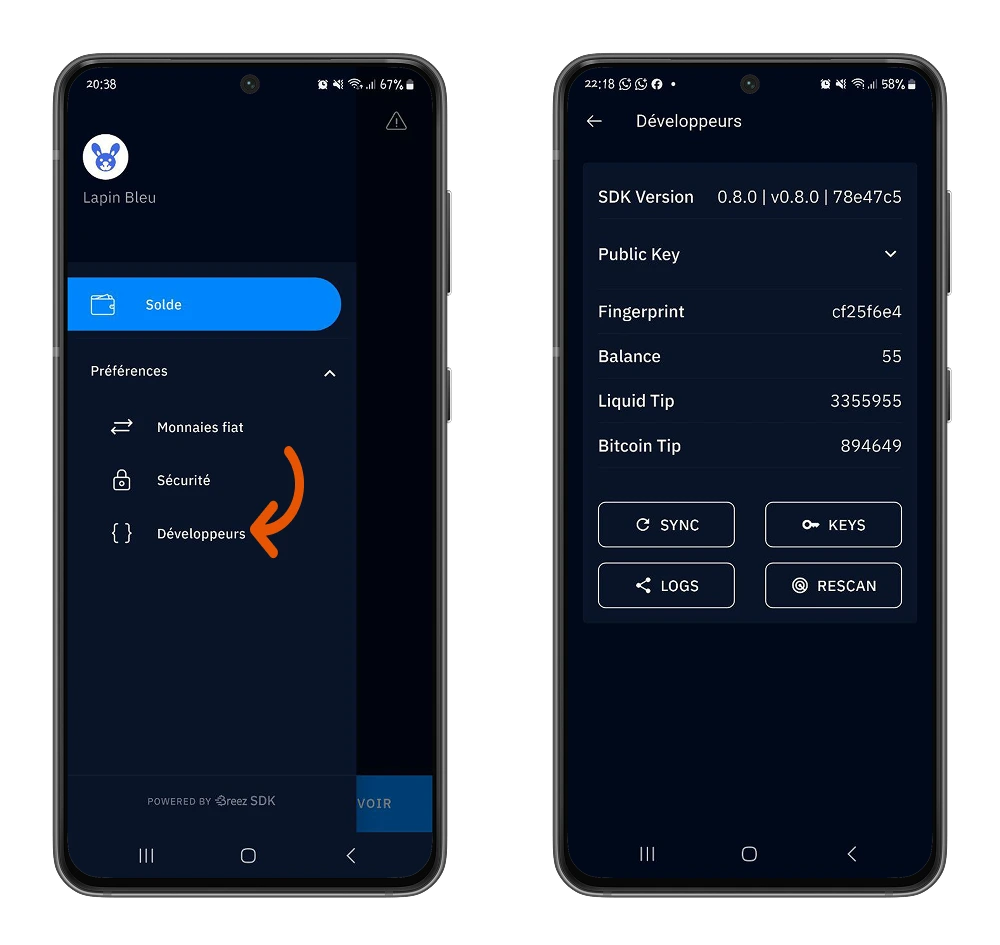

Misty Breez ni Lightning Wallet inayojitegemea iliyotengenezwa na Breez, kulingana na Kifaa chao cha Kukuza Programu na mtandao wa **Liquid** uliotengenezwa na Blockstream.

Inakuja na mbinu mpya kabisa ya kufanya kazi bila nodi ya Lightning: uwezekano wa **GAME CHANGER** katika uhamishaji wa Bitcoin baina ya mitandao.

Katika somo hili, tutaelezea jinsi wallet hii inavyofanya kazi na kukupa muhtasari kamili.

## Je, Misty Breez anafanya kazi gani?

Misty Breez ni utekelezaji wa Lightning bila nodi kama backend. Imetengenezwa kwa misingi ya Breez SDK na Liquid.

Liquid ni Layer sambamba na mtandao wa Bitcoin, ikitoa maboresho makubwa katika gharama, kasi na miamala. Layer hii inaruhusu Misty Breez kuepuka kutumia nodi ya Lightning moja kwa moja na badala yake kutumia huduma za watu wengine za Exchange kama vile **Boltz** ili kuhakikisha ushirikiano kati ya Liquid Network na Lightning Network.  
Usifanye haraka, tutarudi kwenye hili.

Kwa sasa, hebu tuanze safari yetu na Misty Breez Wallet.

## Anza na Misty Breez

Programu ya simu ya Misty Breez inapatikana kwenye mifumo rasmi ya upakuaji kama vile Google Play Store (kwenye Android) na Apple Store (kwenye iOS). Unaweza pia kuelekezwa kwenye programu sahihi kutoka kwa tovuti rasmi ya [Misty Breez].
(https://breez.technology/misty/).

⚠️ Hakikisha hauchanganyi Misty Breez na Breez Wallet.

⚠️ **MUHIMU**: Kwa usalama wa bitcoins zako, ni muhimu kupakua programu kutoka kwa mifumo rasmi ili kuhakikisha uhalisi wake.

Katika somo hili, tutakuwa tukianzia kwenye kifaa cha Android. Hata hivyo, kila moja ya hatua na element maalum zilizoelezewa katika sehemu hii zinatumika pia kwa iOS.

Baada ya kusakinisha, Misty Breez hukupa chaguo la kuunda Wallet mpya au kurejesha Lightning Wallet ya zamani kwa kutumia maneno ya kurejesha uwezo wake.

Katika somo hili, tunachagua kuunda wallet mpya.

⚠️ Misty Breez kwa sasa iko katika awamu ya ukuzaji, kwa hivyo tunakushauri uanze na viwango vinavyokubalika.

### Hifadhi maneno yako ya urejeshi :

Mojawapo ya mambo ya kwanza unapaswa kufanya wakati wa kuunda wallet mpya ni kuweka nakala ya maneno yako 12 ya urejeshaji.

Vifuatavyo ni baadhi ya vidokezo vya jinsi ya kuweka nakala rudufu ya maneno yako:

https://planb.network/tutorials/wallet/backup/backup-mnemonic-22c0ddfa-fb9f-4e3a-96f9-46e2a7954270

Ili kuhifadhi nakala za vifungu vyako, chagua menyu ya **Mapendeleo > Usalama**, kisha **Angalia chaguo lako la Maneno ya Kuhifadhi nakala**.

Kwa usalama ulioongezwa, unaweza pia **kuunda msimbo wa PIN** ili kuthibitisha ufikiaji wa Wallet yako.

Pata sarafu ya eneo lako katika sarafu nyingi zinazokubaliwa na Misty Breez. Sanidi sarafu yako kutoka kwa menyu ya **Mapendeleo > Sarafu za Fiat**, kisha uchague sarafu au sarafu unayohitaji.

### Kufanya miamala yako ya kwanza

Ikiwa tayari unafahamu wallet ya Breez, hutakatishwa tamaa hata kidogo na Interface ya Misty Breez angavu.

Kwenye menyu ya Interface **Salio**, bofya kwenye chaguo la **Pokea** ili kuunda ankara za kupokea bitcoins zako kwenye Wallet yako.

⚠️ Misty Breez itakuomba uwashe arifa za programu kupitia mipangilio ya simu yako ili iweze kukupa Lightning Address yako kikamilifu.

Ukiwa na Misty Breez, unaweza:

- Pokea bitcoins kwenye Lightning Network kutoka **100 satoshi** hadi **25,000,000 satoshi**.
- Pokea bitcoins kwenye mtandao mkuu wa Bitcoin kutoka **25,000 satoshi**.

Hapa ndipo uchawi wa Misty Breez unapoanza.

Tofauti na Breez Wallet, ambayo hukupa nodi ya Lightning na kukuuliza ulipie gharama za kufungua na kufunga njia za malipo mwenyewe, Misty Breez hakuombi ufanye chochote.  
Kama ilivyotajwa hapo awali, Misty Breez haifanyi kazi hata kwa msingi wa nodi ya Lightning.

Hebu tuangalie kwa karibu nyuma ya pazia.

Kwa kweli, unamiliki wallet ya Liquid ambayo inahusishwa na wallet yako ya Misty Breez. Kimantiki, utakuwa unashughulikia L-BTC (Liquid Bitcoin) kwa viwango vilivyowekwa, vinavyohusishwa na huduma za ubadilishaji za satoshi za nyambizi kutoka kwa watu wengine ambazo zitakuwezesha kuingiliana na Lightning Network.

Unapopokea malipo kwenye Misty Breez Wallet yako, mtumaji wako hutuma satoshis ambazo hupitia huduma ya ubadilishaji kama Boltz (ambayo kwa sasa inatumiwa na Misty Breez), ili kubadilisha satoshis hizo kuwa L-BTC zitakazopokelewa kwenye Misty Breez Wallet yako (iliyounganishwa na Liquid Wallet).

Hapa kuna mchoro uliorahisishwa wa mchakato nyuma ya pazia.

Bofya kwenye Interface katika menyu ya **Mizani**, kisha bofya kwenye chaguo la **Tuma** ili kulipa Lightning Invoice.

Ingiza Lightning Invoice, Lightning Address ya mpokeaji, au changanua tu msimbo wa QR kwenye Invoice ili kufanya malipo yako.

Nyuma ya pazia, unawasha Liquid Wallet inayohusishwa na Misty Breez Wallet yako ili kubadilisha kiasi husika cha L-BTC kuwa satoshis kupitia Boltz, kisha satoshis hizo huhamishwa kwa Lightning Wallet ya mpokeaji wako (iliyopo kwenye Lightning Network).

Element hii ya miundombinu ya Misty Breez huwezesha watumiaji kufanya miamala hata wakati Misty Breez iko nje ya mtandao.

Kwa wenye uzoefu zaidi, pia kuna menyu **Mapendeleo > Wasanidi** ambayo inakupa maelezo zaidi kuhusu :

- Toleo la Breez Software Development Kit  
- Ufunguo wa umma wa Misty Breez Wallet yako  
- Mkopaji, kitambulisho cha kipekee kinachotokana na ufunguo msingi wa umma  
- Salio lako la wallet  
- Kidokezo cha Liquid, kwa kutuma kiasi kidogo cha L-BTC  
- Kidokezo cha Bitcoin, kwa kutuma kiasi kidogo cha Bitcoin

Unaweza pia kufanya vitendo fulani, kama vile kusawazisha na Liquid Network, kuhifadhi funguo zako, kushiriki kumbukumbu ya miamala yako, na kuchagua kuchambua tena Liquid Network.

Hongera! Sasa una ufahamu mzuri wa wallet ya Misty Breez na mchango wake kwa miamala za Bitcoin za mtandao. Ikiwa umepata mafunzo haya kuwa muhimu, tafadhali tupe kidole gumba cha Green. Tutafurahi kusikia kutoka kwako.

Ili kwenda mbali zaidi, ninapendekeza pia ugundue mafunzo yetu kwenye Aqua Wallet, ambayo hufanya kazi kwa njia sawa na Misty Breez :

https://planb.network/tutorials/wallet/mobile/aqua-8e6d7dd3-8c03-45cc-90dd-fe3899a7d125
